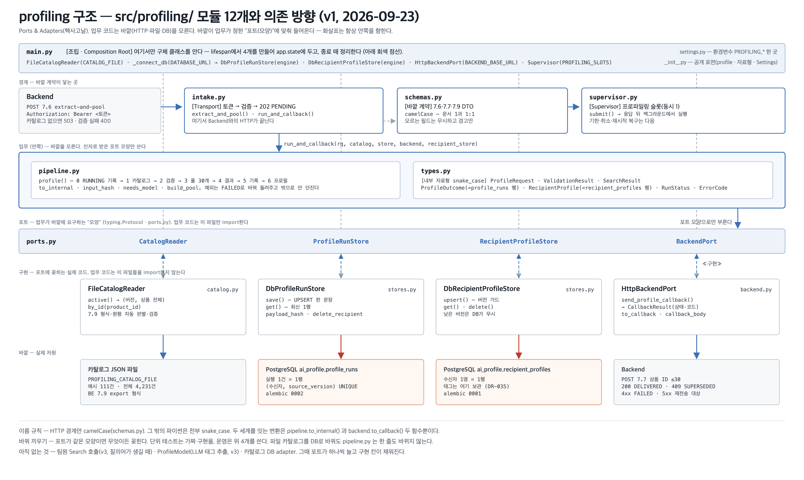

# profiling — 수신자 프로파일링 (AI 백엔드 · Profile / Catalog 파트)

Backend가 수신자의 비선호 카테고리·취향 문장·최근 리뷰를 **7.6**으로 보내면, 즉시 `202`로 접수하고 백그라운드에서 추천 상품 30개를 골라 **7.7 콜백**으로 돌려주는 서비스. 태그는 AI가 보관하고 Backend에는 상품 번호만 보낸다(DR-035). 상품 목록은 Backend의 **7.9 export**로 받는다.

| 상태 (2026-09-23) | |
|---|---|
| 동작 범위 | **v1** — 비선호 카테고리만 반영해 7.6 → 202 → 7.7까지 끝까지 동작. 취향·리뷰를 읽는 모델·검증기 단계는 v3 |
| 저장소 | **PostgreSQL 하나뿐** — `ai_profile.profile_runs`(실행 기록) · `ai_profile.recipient_profiles`(수신자 프로필). 메모리 구현은 09-23에 제거했고 DB 없이 띄우는 모드는 없다. 카탈로그는 아직 파일. 전환 설명: [docs/DB_전환_설명.md](docs/DB_전환_설명.md) |
| 테스트 | 단위 94개(외부 의존 없음) + 통합 34개(진짜 PostgreSQL, 꺼져 있으면 skip) — `uv run pytest -q` → 126 passed, 2 skipped |
| 담당 | Profile · Catalog · DB adapter · Embedding adapter. Chat·Search·Runtime·Model adapter는 팀원. 합칠 때 라우터·adapter만 옮긴다 |

---

## 1. 구조

**Ports & Adapters(헥사고날).** 업무 코드는 바깥(HTTP·파일·DB)을 모르고, 바깥이 업무의 "포트(모양)"에 맞춰 들어온다. 의존 방향은 항상 안쪽.



> 그림 원본: `docs/assets/build_structure.py` → `structure.svg` (PNG는 Chrome 헤드리스). 모듈이 늘거나 포트가 바뀌면 스크립트를 고치고 다시 만든다.

`src/profiling/` 모듈 12개의 역할은 위 그림에 있다. 나머지 폴더는 이렇다.

| 폴더 · 파일 | 내용 |
|---|---|
| `tools/fake_backend/` | 가짜 Backend: 7.7 수신(실패 주입) · 7.9 제공 · 시험 콘솔(`/console`, AI DB 확인·검증 탭 포함) |
| `tools/catalog/fetch_export.py` | 7.9 가져오기 · 계약 점검(`CONTRACT_7_9_SCHEMA`) · 상품 ID 대조(파일 · `ai_search.products`) · 저장 |
| `tools/catalog/load_catalog.py` | Backend 전달 패키지 → `ai_catalog` 적재 · 회신 반영(`--id-map` · `--metrics`) |
| `tools/catalog/import_be_ids.py` | Backend 회신 xlsx 2종 → id-map · metrics jsonl (이름으로 매칭, 1:1 보장). 결과는 `tools/catalog/returned/날짜/` |
| `tools/catalog/make_sample.py` | 예시 카탈로그 재생성 |
| `tests/fixtures/catalog_sample.json` | 예시 카탈로그 111건 · 56카테고리 (7.9 형식) |
| `tests/unit/` | 가짜 구현 · `httpx.MockTransport` — DB·네트워크 없이 돈다 |
| `tests/integration/` | 진짜 PostgreSQL — 마이그레이션 결과 · upsert · 상태 규칙 · 앱 e2e. DB 꺼져 있으면 skip |
| `alembic/versions/` | `0001` recipient_profiles(수신자 프로필) · `0002` profile_runs(실행 기록) · `0003` ai_catalog(상품·카테고리·적재 버전) |
| `docker-compose.yml` | 로컬 DB (pgvector/pg16 · `ai_chat` · `ai_user` · 5432) |
| `docs/코드_안내서.md` | 파일·함수별 역할 (처음 보는 사람용) · 시퀀스 |
| `docs/시퀀스_전체.md` | **구현된 프로파일링 전체 시퀀스** — 기동 · 성공 전체 · 접수 거절 · 분석 실패(침묵) · 콜백 4갈래 · 슬롯 (그림 6장) |
| `docs/DB_ERD.md` | **AI가 소유한 표 구조(ERD)** — `ai_profile` 2표 · `ai_catalog` 3표 · 키·인덱스·제약 · FK인 것과 아닌 것 · 바깥 ID 대응 (그림 2장) |
| `docs/DB_전환_설명.md` | 메모리 → PostgreSQL 전환: 무엇이 왜 어떻게 바뀌었나 (그림) |
| `docs/BE_연동_필드표.md` | BE 전달본 색인 — v1(7.6 세 필드 · 7.7 · `profileStatus` 생애주기 · 시퀀스 5장) · v2(7.9 export) · v3(취향·리뷰) |
| `docs/파이프라인_지도/` | 날짜별 갱신 기록 — 그림 스냅샷 · 단계별 함수 · 바뀐 것 · **다음 해야 할 일(인수인계)**. 규칙은 그 폴더 README |
| `docs/환경_설정.md` | uv · Python 3.12 · 의존성 규칙 |
| `docs/assets/` | `structure.png`(위 구조) · `pipeline-map.png` · `db-transition.png` · `v1-flow.png` · `class-diagram.png` · `be-seq/v1\|v2\|v3/`(BE 연동 시퀀스 9장) · `seq/`(전체 시퀀스 6장) · `erd/`(DB 표 구조 2장). 각각 `build_*.py`가 만든다 |
| `이름_대조표.md` | 같은 뜻 · 다른 이름 정리 (camelCase ↔ snake_case) |


### 이름 규칙
- **HTTP 경계만 camelCase** (`schemas.py`, fake_backend) — 문서 1과 1:1.
- **Python 내부는 snake_case** (`types.py`·`pipeline.py`·`stores.py` 등 나머지 전부, 함수·변수 포함).
- 두 세계의 변환은 **두 함수뿐**: `pipeline.to_internal()`(7.6 → 내부) · `backend.to_callback()`(내부 → 7.7). 업무 코드에서 camelCase가 보이면 규칙 위반.
- 7.6 DTO 변수는 `body`, 내부 요청은 `rq`, 결과는 `outcome`. 세부는 [이름_대조표.md](이름_대조표.md).

### 요청 한 건의 흐름 (v1)


(단계마다 부르는 함수와 포트·어댑터·바깥의 연결. 시퀀스 형태는 [v1-flow.png](docs/assets/v1-flow.png))

1. `POST 7.6` → Pydantic 검증(위반 400 `INVALID_REQUEST`) → 서비스 토큰(401) → 활성 카탈로그 없으면 503 → **202 `PENDING`** (HTTP 끝)
2. 백그라운드 `run_and_callback`: `to_internal` → `profile()` — `store.save(RUNNING, input_hash)` → `catalog.active()` 한 번(같은 버전 유지) → 비선호 이름만 담은 `ValidationResult` → `build_pool`(재고 없음(`unavailable`)만 제외 · 비선호 카테고리 제외 · 조회수 내림차순 · 30개) → `ProfileOutcome(RESULT_READY)` → `store.save`(콜백 본문을 DB에 먼저 커밋) → `recipient_store.upsert(from_outcome)`
3. `RESULT_READY`면 `backend.send_profile_callback` → `POST 7.7` → 응답을 `RunStatus`로: `200→DELIVERED`, `409→SUPERSEDED`, `4xx→FAILED`, `5xx·네트워크→RESULT_READY`(재시도 대상) → `store.save(그 상태, callback_attempts+1)`. `FAILED` 결과는 콜백 없음(AI는 침묵, Backend가 판정). DB에 무엇이 언제 남는지: [docs/DB_전환_설명.md](docs/DB_전환_설명.md)

### 지금 정해진 규칙과 미결
| 규칙 | 값 | 출처 |
|---|---|---|
| 리뷰 상한 10 · rating 1~5 · 글 null 가능 · 콜백 ID ≤30 · 태그 미전송 | 스키마에서 강제 | 문서 1 v3.2.7 |
| 풀 정렬 (v1) | **조회수(`viewCount`) 내림차순**, 동점은 productId 오름차순. 임의성 없음 | 결정 a (09-22 Backend 합의: 초기엔 임의 조회수를 넣어 보냄). 필드명은 Backend 확정 전 임시 |
| 모델 호출 조건 | 취향 문장 또는 리뷰가 있을 때 (`needs_model`) | 결정 c — v1은 경고 후 v1 경로 |
| 비선호 상한 5 | `settings.MAX_DISLIKED`만 있고 **스키마에 미적용** | 결정 b — 문서 1에도 상한 없음, 팀 확인 필요 |
| 7.7 계약 | 태그 없음(v3.2.7 작업본) | 위키 v3.2.6은 태그 필수 — 미결 |
| 필드 계약 불일치 | HTTP 코드는 계약대로(400 INVALID_REQUEST 등). 원인은 **내부 코드** `ErrorCode`로: `CONTRACT_7_6_UNKNOWN_FIELD`(7.6 모르는 필드 → 무시+경고) · `CONTRACT_7_7_REJECTED`(7.7 4xx → `profile_runs.error`) · `CONTRACT_7_9_SCHEMA`(7.9 필수 누락·타입 → CLI가 저장 거부). 7.6·7.9 DTO는 모르는 필드를 거부하지 않음, 조회수는 `viewCount`/`views` 둘 다 수용 | 09-22 결정 |

---

## 2. 환경

| 항목 | 값 | 비고 |
|---|---|---|
| Python | **3.12** (`.python-version`) | `StrEnum`·타입 문법 · torch/sentence-transformers 안정 |
| 패키지 | **uv** — `pyproject.toml` + `uv.lock`(커밋) · `.venv`(커밋 안 함) | 폴더별 가상환경 만들지 않음 |
| 의존성 | fastapi · uvicorn[standard] · pydantic · pydantic-settings · httpx · sqlalchemy · alembic · psycopg[binary] | dev: pytest · ruff |
| 설정 | 환경변수 `PROFILING_*` 또는 `profiling/.env` (`.env.example` 복사) | 코드는 `settings.X`로만 접근 — 이름 바꿀 때 `settings.py` 한 곳 |
| DB | Docker `pgvector/pg16` (`docker-compose.yml`) · `PROFILING_DATABASE_URL` · Alembic `0001`~`0003` | 저장소는 PostgreSQL 하나뿐 — 연결 실패면 앱이 뜨지 않는다 (DB 없이 띄우는 모드는 없음) |
| 카탈로그 | 기본 `tests/fixtures/catalog_sample.json`(111건) · 전체 4,231건은 `.env`에서 경로 지정 | 팀원 카탈로그 DB 전까지 파일 |

```bash
cd profiling
uv sync                                     # .venv + 의존성 (uv.lock 기준)
cp .env.example .env                        # 필요 시 값 수정
docker compose up -d                        # 로컬 PostgreSQL (Docker Desktop 켜져 있어야 함)
uv run alembic upgrade head                 # 테이블 생성 (0001~0003)
uv run pytest -q                            # 74 passed, 2 skipped (DB 꺼져 있으면 통합 18개 skip)
uv run ruff check src tests tools alembic   # lint
```

**팀원 골격과의 차이 (합칠 때 바꿀 것)** — 팀원 레포 골격은 루트 `app/` 레이아웃 · pip/requirements · Python 3.11 · env 이름 `DATABASE_URL`·`INTERNAL_SERVICE_TOKEN`·`MAIN_BACKEND_URL`. 지금은 각자 로컬로 개발하고, 합칠 때 `profiling/src/profiling/*` → `app/profiling/*` 이동 + `settings.py` env 이름 통일 + 루트 단일 `pyproject`로 전환한다(환경 PR 초안은 브랜치 `chore/uv-environment`). 근거·규칙은 [docs/환경_설정.md](docs/환경_설정.md).

---

## 3. 실행과 수동 시험

DB + 두 프로세스. **실행 위치는 `profiling/`** (예시 카탈로그 상대경로 기준).

```bash
docker compose up -d && uv run alembic upgrade head     # DB (한 번 켜 두면 됨)
# 터미널 1 — 가짜 Backend + 시험 콘솔 (:8081)
uv run uvicorn tools.fake_backend.app:app --port 8081
# 터미널 2 — AI 앱 (:8000)  — 시작 로그에 "DB 연결 … migration=0002"
uv run uvicorn profiling.main:app --port 8000 --reload
```

앱은 DB 없이 뜨지 않는다 — `docker compose up -d && uv run alembic upgrade head`를 먼저 한다.

브라우저 `http://localhost:8081/` → 콘솔.

| 탭 | 하는 일 |
|---|---|
| 7.6 보내기 | 입력 버전(v1/v2/v3) · 비선호 토글(≤5) · 리뷰·취향(v3) · 무작위 생성 · **JSON 직접 편집**(틀린 본문으로 400 보기) → AI 응답·소요 시간 |
| 7.7 받은 것 | AI가 보낸 콜백 목록(2초 갱신). 태그가 없고 ID ≤30인지 확인 |
| **DB** | AI DB 두 테이블(`profile_runs`·`recipient_profiles`)을 fake가 직접 읽어 보여줌(2초 갱신) · **검증 목록** — 마지막으로 보낸 7.6이 DB에 제대로 남았는지 10항목 ✓/✗(행 존재 · 상태=모드 기대값 · 콜백 시도 수 · input_hash · 저장 본문=7.7 수신 목록 · 프로필 버전·비선호 일치) · 수신자별 행 삭제 |
| 7.9 · 상태 | export 내용 · **실패 주입 모드**(`ok/409/400/500/timeout`) · AI `/health` (`store.connected`·`migration` 포함) |

토큰: fake `AI_SERVICE_TOKEN`(기본 `dev-token`)과 AI `PROFILING_SERVICE_TOKEN`이 같아야 한다. AI 쪽이 비어 있으면 검사를 건너뛴다(로컬 전용).

curl로 직접:
```bash
curl -s -X POST localhost:8000/api/internal/v1/ai/profile/extract-and-pool \
  -H 'Authorization: Bearer dev-token' -H 'Content-Type: application/json' \
  -d '{"recipientUserId":9073,"sourceVersion":3,"dislikedCategories":[{"categoryId":802,"categoryName":"출산·육아용품"}],"giftPreference":null,"reviews":[]}'
curl -s localhost:8081/received | python3 -m json.tool | head -30
```

실제 Backend 상품으로 바꾸기 (7.9 가져오기 + ID 대조):
```bash
uv run python -m tools.catalog.fetch_export --base-url http://localhost:8081 --token dev-token --out data/catalog_export.json --compare-db
```
계약 점검(필드 이름·타입·모르는 필드) → 지금 카탈로그·`ai_search.products`와 ID 대조 → 저장. 종료 코드 0 일치 · 1 계약 위반(저장 안 함) · 2 차이 있음 · 3 연결 실패. 저장 뒤 `.env`의 `PROFILING_CATALOG_FILE`을 그 경로로.

DB에 남은 것 확인:
```bash
docker compose exec ai-db psql -U ai_user -d ai_chat -c "select recipient_user_id, source_version, status, attempt, callback_attempts from ai_profile.profile_runs order by updated_at desc limit 5" -c "select recipient_user_id, source_version, disliked_categories from ai_profile.recipient_profiles"
```

---

## 4. 테스트

원칙: **업무 코드는 가짜 구현으로, 구현은 가짜 바깥으로, 계약은 스키마로.** 단위(`tests/unit`, 94개)는 외부 의존 없이 돈다 — 앱을 띄우는(=DB에 붙는) 시험은 전부 통합으로 옮겼다. 통합(`tests/integration`, 34개)은 진짜 PostgreSQL이고 DB가 꺼져 있으면 skip.

| 파일 | 대상 | 방법 | 개수 |
|---|---|---|---|
| `test_schemas.py` | 7.6·7.7·7.9 DTO 경계 | Pydantic `ValidationError` — 11개 리뷰·rating 0/6·모르는 필드·조회수 별칭·재고 3값 변환·태그 포함 콜백 거부 | 12 |
| `test_pipeline.py` | `to_internal`·`needs_model`·`input_hash`·`build_pool`·`profile()` | `FakeCatalog`·`FakeStore`·`FakeRecipientStore`(ports 모양). 비선호 제외·재고 `unavailable`만 제외(`unknown` 유지)·조회수 정렬·상한·FAILED 경로·저장 실패·RUNNING→RESULT_READY 순서·프로필 upsert | 18 |
| `test_catalog.py` | `FileCatalogReader` | tmp JSON 두 형식 · 중복/오류 제외 · 재고 3값(상태 없으면 `unknown`) · `isinstance(…, Protocol)` 모양 검사 | 3 |
| `test_backend.py` | `to_callback`·`HttpBackendPort` | `httpx.MockTransport` — 상태 코드 6종 → `CallbackResult(status, code)`, 헤더·경로·본문, 네트워크 오류 | 12 |
| `test_fetch_export.py` | `tools/catalog/fetch_export` | 계약 점검(모르는 필드·별칭·필수 누락) · ID 대조 · 저장 정규화 · 종료 코드 | 7 |
| `test_catalog_fixture.py` | 예시 카탈로그(파일만) | 111건·56카테고리·null 1·재고 없음 2 | 1 |
| `test_load_catalog.py` | `tools/catalog/load_catalog` 읽기·검사 | 패키지 파일만(DB 없음) — 누락 파일·부모 없는 소분류·중복 ID·선언 수 불일치 | 5 |
| `test_intake_dedupe.py` | 접수 단계 중복 판정 | `decide()` 표(11) + 라우터 분기(7) — RUNNING이면 제출 없음 · 결과 있으면 재전송만 · 본문 다르면 재분석 | 18 |
| `test_import_be_ids.py` | Backend 회신 매칭 | 키로 확정 · 진짜 중복은 결정적 1:1 · 남는 번호는 재사용 안 함 · 이름 없으면 보고 | 10 |
| `test_recipient_profile.py` | `from_outcome`·`should_replace`·`cap_tags` | 행 변환·버전 규칙·상한 (v3 함수 2개는 skip) | 6 |
| `test_supervisor.py` | Supervisor | 슬롯 1이면 동시에 하나만 실행 | 1 |
| `integration/test_db_catalog.py` | 마이그레이션 0003 + 적재 SQL | 표·CHECK·활성 버전 1개 · 재적재 멱등 · Backend ID/재고 보존 · `--id-map` 회신 반영 | 7 |
| `integration/test_db_catalog_reader.py` | `DbCatalogReader` | 활성 버전 읽기·필드 매핑 · 같은 버전이면 재질의 없음 · Backend 번호 우선/임시 번호 · 번호 충돌 거부 · 활성 없음 | 5 |
| `integration/test_db_recipient_profiles.py` | 마이그레이션 결과 | 열 순서·PK 시퀀스 없음·유니크·CHECK·upsert 버전 규칙 | 5 |
| `integration/test_db_stores.py` | `DbProfileRunStore`·`DbRecipientProfileStore`·**앱 전체** | RUNNING→RESULT_READY→DELIVERED·재실행 attempt·최신 버전·버전 가드·삭제·error{code,reason} · `pipeline.profile()` → 두 테이블 · 7.6 → DB에 DELIVERED | 8 |
| `integration/test_e2e_app.py` | **끝에서 끝** | `TestClient(app)` — lifespan(진짜 DB) → 7.6 202 → Supervisor 슬롯 → 가짜 BackendPort가 7.7 받음 → `profile_runs` DELIVERED·`recipient_profiles` upsert. 400은 백그라운드로 안 감. 모르는 필드 경고. `/health`. **배포 모양(`CATALOG_SOURCE=db`)으로 기동** | 4 |
| `integration/test_fetch_export_db.py` | `--compare-db` | 팀원 DDL로 `ai_search.products` 만들어 TEXT id·누락·이름 차이 보고 | 2 |
| `test_backend.py::test_callback_path_matches_fake_backend` | 계약 문자열 | AI 송신 경로 == fake 수신 경로 | (포함) |

가짜를 만드는 규칙: `ports.py`의 메서드 이름·시그니처만 맞추면 된다(`@runtime_checkable`이라 `isinstance`로 확인 가능).

---

## 5. 다음 순서와 건드리는 곳

인수인계용 전체 목록은 [docs/파이프라인_지도/2026-09-23.md §5](docs/파이프라인_지도/2026-09-23.md)에 있다 (무엇 · 왜 · 어디 · 끝났다고 보는 기준 · 크기). 여기는 요약이다.

| # | 일 | 바뀌는 곳 | 안 바뀌는 곳 |
|---|---|---|---|
| 1 | **Backend 미팅 결과 반영** — 7.7 태그 유무 · 7.9 조회수 필드명 · 제외 vs 감점 · 비선호 상한 5 | `schemas.py` · `pipeline.build_pool` · `tools/fake_backend` | 포트·저장소 |
| 2 | ~~Backend ID 회신 받기~~ **완료(09-25)** — xlsx 2종으로 받아 상품 4,231/4,231 · 카테고리 67/67 · 재고 · 조회수까지 반영했다. 7.7로 나가는 번호가 이제 Backend 번호다 | — | 코드 전부 |
| 3 | ~~상품 카탈로그 DB~~ **완료(09-23)** — `0003` + `load_catalog.py`로 4,231건·67분류 적재, `DbCatalogReader`로 읽기까지. `PROFILING_CATALOG_SOURCE=db`가 배포 경로다. Backend 번호가 없는 동안은 임시 번호로 돌고 `/health`가 `provisional_ids`로 표시한다(2번이 끝나면 사라짐) | — | `pipeline.py`·`ports.py` |
| 4 | ~~접수 단계 중복 판정~~ **완료(09-25)** — Backend가 같은 `sourceVersion`으로 최대 2회 재전송하기로 해서 필수가 됐다. `decide()`가 analyze/resend/skip으로 가른다 | — | 어댑터·ports |
| 5 | 7.7 재시도(5xx 최대 3회) · 재시작 복구(RUNNING→FAILED 정리) | `backend.send_profile_callback` 안 · `main.lifespan` | 포트 시그니처 |
| 6 | 배포 — `Dockerfile` · compose에 `ai-app` · 시작 시 `alembic upgrade head` | `docker-compose.yml` · `Dockerfile` | |
| 7 | **v3** 모델·검증기 (실험 `2_validate.py` 이식, `ProfileModel` 구현) + **팀원 Search 호출** | `pipeline.profile` 2)단계 · `model.py` · `ports.py`에 `SearchPort`·`ProfileModel` 추가 | 접수·저장·콜백 |
| 7′ | **v3 마이그레이션** — `recipient_profiles`에 `profile_run_id`(FK→`profile_runs`, `ON DELETE SET NULL`) · `axes` · `recommended_product_ids` · `catalog_version_id` · `prompt_version` · `validator_version` 추가 (담당파트 설계서 §1.7 나머지). v1에는 불필요 — `(recipient_user_id, source_version)`으로 두 테이블 조인 가능 | `alembic/versions/000N_*.py` (`add_column`) · `types.RecipientProfile` 필드 · 통합 테스트 | 기존 마이그레이션 |
| 8 | 팀원 앱과 합치기 | `main.py` · `settings.py` env 이름 · import 경로 | 업무 코드 |

**팀원 Search는 v3부터 부른다.** v1은 질의어가 없어 검색기가 카테고리 라운드로빈으로 돌려주고, 팀원 카탈로그에는 조회수 필드가 없어 09-22에 합의한 정렬 규칙을 지킬 수 없다. 프로파일링의 카탈로그 공급처는 Backend(7.9 또는 전달 파일)이고, 두 쪽이 맞춰야 하는 것은 테이블이 아니라 **상품 ID 체계**다.

합의가 남은 것(팀원·BE와): 7.7 태그 유무 · 7.9 조회수 필드명 · 비선호 제외 vs 감점 · 비선호 상한 5의 7.6 반영 · 디바운스 주기.