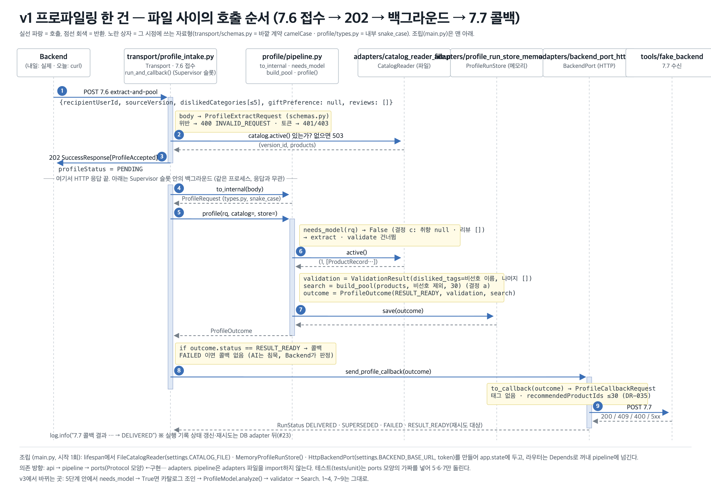

# profiling — 수신자 프로파일링 (AI 백엔드 · Profile / Catalog 파트)

Backend가 수신자의 비선호 카테고리·취향 문장·최근 리뷰를 **7.6**으로 보내면, 즉시 `202`로 접수하고 백그라운드에서 추천 상품 30개를 골라 **7.7 콜백**으로 돌려주는 서비스. 태그는 AI가 보관하고 Backend에는 상품 번호만 보낸다(DR-035). 상품 목록은 Backend의 **7.9 export**로 받는다.

| 상태 (2026-09-22) | |
|---|---|
| 동작 범위 | **v1** — 비선호 카테고리만 반영해 7.6 → 202 → 7.7까지 끝까지 동작. 취향·리뷰를 읽는 모델·검증기 단계는 v3 |
| 저장소 | 파일 카탈로그 + 메모리 저장 (DB adapter로 교체 예정) |
| 테스트 | 단위·e2e 43개, 외부 의존 없음 (`uv run pytest`) |
| 담당 | Profile · Catalog · DB adapter · Embedding adapter. Chat·Search·Runtime·Model adapter는 팀원. 합칠 때 라우터·adapter만 옮긴다 |

---

## 1. 구조

**Ports & Adapters(헥사고날).** 업무 코드는 바깥(HTTP·파일·DB)을 모르고, 바깥이 업무의 "포트(모양)"에 맞춰 들어온다. 의존 방향은 항상 안쪽.

```
   Backend ──HTTP 7.6──▶ [Transport profile_intake] ──▶ [Supervisor 슬롯] ──▶ ┌─────────── 업무 (안쪽) ───────────┐
                                                                            │  profile/pipeline.py   절차        │
   파일  ◀── [FileCatalogReader]     ◀── CatalogReader ──────────────────────┤  profile/types.py      내부 자료형  │
   메모리 ◀── [MemoryProfileRunStore] ◀── ProfileRunStore ────────────────────┤  profile/ports.py      요구하는 모양 │
   Backend ◀─ [HttpBackendPort] 7.7   ◀── BackendPort ───────────────────────┤                                     │
                                                                            └─────────────────────────────────────┘
   조립: main.py 한 곳에서만 구체 adapter를 만들어 app.state에 둔다.  계약: transport/schemas.py (camelCase, 문서 1 그대로)
   이름은 3단계 도표와 같다: Transport · Profile · ProfileRunStore · BackendPort · CatalogReader · Supervisor · ProfileModel
```

```
profiling/
├─ src/profiling/
│  ├─ main.py                 조립(Composition Root) · 오류 봉투(422→400, 401/503, 500) · GET /health
│  ├─ transport/schemas.py         7.6·7.7·7.9 DTO — 바깥 계약. camelCase · extra=forbid · 범위 검증
│  ├─ transport/profile_intake.py  POST /api/internal/v1/ai/profile/extract-and-pool — 토큰 → 503 확인 → 202 → Supervisor → 7.7
│  ├─ runtime/supervisor.py        Supervisor — 프로파일링 슬롯(동시 1). 기한·취소는 다음
│  ├─ profile/types.py        내부 자료형(snake_case): ProfileRequest · ValidationResult · SearchResult · ProfileOutcome · RunStatus
│  ├─ profile/ports.py        Protocol: CatalogReader · ProfileRunStore · BackendPort · (v3) ProfileModel · Embedder · NoActiveCatalog
│  ├─ profile/pipeline.py     to_internal → needs_model → build_pool → profile()  (예외는 FAILED로, 밖으로 안 던짐)
│  ├─ adapters/catalog_reader_file.py   FileCatalogReader — 7.9 export 형식·동료 공유본 원형 자동 판별, 검증·중복 제거
│  ├─ adapters/profile_run_store_memory.py   MemoryProfileRunStore — dict + Lock
│  ├─ adapters/backend_port_http.py        HttpBackendPort — 7.7 POST → RunStatus(DELIVERED·SUPERSEDED·FAILED·RESULT_READY)
│  └─ config/settings.py      Settings(BaseSettings, PROFILING_*) · get_settings()
├─ tools/
│  ├─ fake_backend/           가짜 Backend: 7.7 수신(실패 주입) · 7.9 제공 · 시험 콘솔(/console)
│  └─ catalog/make_sample.py  예시 카탈로그 재생성
├─ tests/
│  ├─ fixtures/catalog_sample.json   예시 카탈로그 111건 · 56카테고리 (7.9 형식)
│  ├─ unit/                   가짜 adapter · httpx.MockTransport · TestClient e2e (DB·네트워크 없음)
│  └─ integration/            진짜 PostgreSQL — 마이그레이션 결과·upsert·상태 규칙. DB 꺼져 있으면 skip
├─ docs/
│  ├─ 코드_안내서.md            파일·함수별 역할 (처음 보는 사람용) · 시퀀스
│  ├─ 환경_설정.md              uv·Python 3.12·의존성 규칙
│  └─ assets/                  v1-flow.png(시퀀스) · class-diagram.png(클래스)
├─ 이름_대조표.md               같은 뜻·다른 이름 정리 (camelCase ↔ snake_case)
├─ docker-compose.yml         로컬 DB (pgvector/pg16, ai_chat · ai_user · 5432)
└─ alembic/versions/          0001 recipient_profiles(수신자 프로필) · 0002 profile_runs(실행 기록) — 어댑터는 아직 메모리
```

### 이름 규칙
- **HTTP 경계만 camelCase** (`transport/schemas.py`, fake_backend) — 문서 1과 1:1.
- **Python 내부는 snake_case** (`profile/*`, `adapters/*`, 함수·변수 전부).
- 두 세계의 변환은 **두 함수뿐**: `pipeline.to_internal()`(7.6 → 내부) · `backend.to_callback()`(내부 → 7.7). 업무 코드에서 camelCase가 보이면 규칙 위반.
- 7.6 DTO 변수는 `body`, 내부 요청은 `rq`, 결과는 `outcome`. 세부는 [이름_대조표.md](이름_대조표.md).

### 요청 한 건의 흐름 (v1)



1. `POST 7.6` → Pydantic 검증(위반 400 `INVALID_REQUEST`) → 서비스 토큰(401) → 활성 카탈로그 없으면 503 → **202 `PENDING`** (HTTP 끝)
2. 백그라운드 `run_and_callback`: `to_internal` → `profile()` — `catalog.active()` 한 번(같은 버전 유지) → 비선호 이름만 담은 `ValidationResult` → `build_pool`(판매중 · 비선호 카테고리 제외 · 조회수 내림차순 · 30개) → `ProfileOutcome(RESULT_READY)` → `store.save`
3. `RESULT_READY`면 `backend.send_profile_callback` → `POST 7.7` → 응답을 `RunStatus`로: `200→DELIVERED`, `409→SUPERSEDED`, `4xx→FAILED`, `5xx·네트워크→RESULT_READY`(재시도 대상). `FAILED` 결과는 콜백 없음(AI는 침묵, Backend가 판정).

### 지금 정해진 규칙과 미결
| 규칙 | 값 | 출처 |
|---|---|---|
| 리뷰 상한 10 · rating 1~5 · 글 null 가능 · 콜백 ID ≤30 · 태그 미전송 | 스키마에서 강제 | 문서 1 v3.2.7 |
| 풀 정렬 (v1) | **조회수(`viewCount`) 내림차순**, 동점은 productId 오름차순. 임의성 없음 | 결정 a (09-22 Backend 합의: 초기엔 임의 조회수를 넣어 보냄). 필드명은 Backend 확정 전 임시 |
| 모델 호출 조건 | 취향 문장 또는 리뷰가 있을 때 (`needs_model`) | 결정 c — v1은 경고 후 v1 경로 |
| 비선호 상한 5 | `settings.MAX_DISLIKED`만 있고 **스키마에 미적용** | 결정 b — 문서 1에도 상한 없음, 팀 확인 필요 |
| 7.7 계약 | 태그 없음(v3.2.7 작업본) | 위키 v3.2.6은 태그 필수 — 미결 |

---

## 2. 환경

| 항목 | 값 | 비고 |
|---|---|---|
| Python | **3.12** (`.python-version`) | `StrEnum`·타입 문법 · torch/sentence-transformers 안정 |
| 패키지 | **uv** — `pyproject.toml` + `uv.lock`(커밋) · `.venv`(커밋 안 함) | 폴더별 가상환경 만들지 않음 |
| 의존성 | fastapi · uvicorn[standard] · pydantic · pydantic-settings · httpx | dev: pytest · ruff |
| 설정 | 환경변수 `PROFILING_*` 또는 `profiling/.env` (`.env.example` 복사) | 코드는 `settings.X`로만 접근 — 이름 바꿀 때 `settings.py` 한 곳 |
| 카탈로그 | 기본 `tests/fixtures/catalog_sample.json`(111건) · 전체 4,231건은 `.env`에서 경로 지정 | DB adapter 전까지 |

```bash
cd profiling
uv sync                                     # .venv + 의존성 (uv.lock 기준)
cp .env.example .env                        # 필요 시 값 수정
uv run pytest -q                            # 43 passed
uv run ruff check src tests tools           # lint
```

**팀원 골격과의 차이 (합칠 때 바꿀 것)** — 팀원 레포 골격은 루트 `app/` 레이아웃 · pip/requirements · Python 3.11 · env 이름 `DATABASE_URL`·`INTERNAL_SERVICE_TOKEN`·`MAIN_BACKEND_URL`. 지금은 각자 로컬로 개발하고, 합칠 때 `profiling/src/profiling/*` → `app/{profile,catalog,adapters,config}` 이동 + `settings.py` env 이름 통일 + 루트 단일 `pyproject`로 전환한다(환경 PR 초안은 브랜치 `chore/uv-environment`). 근거·규칙은 [docs/환경_설정.md](docs/환경_설정.md).

---

## 3. 실행과 수동 시험

두 프로세스. **실행 위치는 `profiling/`** (예시 카탈로그 상대경로 기준).

```bash
# 터미널 1 — 가짜 Backend + 시험 콘솔 (:8081)
uv run uvicorn tools.fake_backend.app:app --port 8081
# 터미널 2 — AI 앱 (:8000)
uv run uvicorn profiling.main:app --port 8000 --reload
```

브라우저 `http://localhost:8081/` → 콘솔.

| 탭 | 하는 일 |
|---|---|
| 7.6 보내기 | 입력 버전(v1/v2/v3) · 비선호 토글(≤5) · 리뷰·취향(v3) · 무작위 생성 · **JSON 직접 편집**(틀린 본문으로 400 보기) → AI 응답·소요 시간 |
| 7.7 받은 것 | AI가 보낸 콜백 목록(2초 갱신). 태그가 없고 ID ≤30인지 확인 |
| 7.9 · 상태 | export 내용 · **실패 주입 모드**(`ok/409/400/500/timeout`) · AI `/health` |

토큰: fake `AI_SERVICE_TOKEN`(기본 `dev-token`)과 AI `PROFILING_SERVICE_TOKEN`이 같아야 한다. AI 쪽이 비어 있으면 검사를 건너뛴다(로컬 전용).

curl로 직접:
```bash
curl -s -X POST localhost:8000/api/internal/v1/ai/profile/extract-and-pool \
  -H 'Authorization: Bearer dev-token' -H 'Content-Type: application/json' \
  -d '{"recipientUserId":9073,"sourceVersion":3,"dislikedCategories":[{"categoryId":802,"categoryName":"출산·육아용품"}],"giftPreference":null,"reviews":[]}'
curl -s localhost:8081/received | python3 -m json.tool | head -30
```

---

## 4. 테스트

원칙: **업무 코드는 가짜 adapter로, adapter는 가짜 바깥으로, 계약은 스키마로.** 지금은 전부 외부 의존 없이 돈다(DB·네트워크·모델 없음). 통합 테스트(진짜 pgvector)는 DB adapter와 함께 들어온다.

| 파일 | 대상 | 방법 | 개수 |
|---|---|---|---|
| `test_schemas.py` | 7.6·7.7 DTO 경계 | Pydantic `ValidationError` — 11개 리뷰·rating 0/6·extra 필드·태그 포함 콜백 거부 | 5 |
| `test_pipeline.py` | `to_internal`·`needs_model`·`build_pool`·`profile()` | `FakeCatalog`·`FakeStore`(ports 모양). 비선호 제외·조회수 정렬·상한·FAILED 경로·저장 실패 | 12 |
| `test_adapters_file_memory.py` | `FileCatalogReader`·`MemoryProfileRunStore` | tmp JSON 두 형식 · 중복/오류 제외 · `isinstance(…, Protocol)` 모양 검사 | 4 |
| `test_backend_port_http.py` | `to_callback`·`HttpBackendPort` | `httpx.MockTransport` — 상태 코드 6종 → `RunStatus`, 헤더·경로·본문, 네트워크 오류 | 12 |
| `test_catalog_fixture.py` | 예시 카탈로그 | 111건·56카테고리·null 1·판매불가 2, `/health` | 2 |
| `test_e2e_transport.py` | **끝에서 끝** | `TestClient(app)` — lifespan → 7.6 202 → Supervisor 슬롯 → 가짜 BackendPort가 7.7 받음. 400은 백그라운드로 안 감 | 1 |
| `test_supervisor.py` | Supervisor | 슬롯 1이면 동시에 하나만 실행 | 1 |
| `test_backend_port_http.py::test_callback_path_matches_fake_backend` | 계약 문자열 | AI 송신 경로 == fake 수신 경로 | (포함) |

가짜를 만드는 규칙: `ports.py`의 메서드 이름·시그니처만 맞추면 된다(`@runtime_checkable`이라 `isinstance`로 확인 가능). **DB adapter가 오면 같은 테스트의 단언을 그대로 통과해야 한다** — 픽스처만 파일/메모리 → DB로 바꾼다.

---

## 5. 다음 순서와 건드리는 곳

| # | 일 | 바뀌는 곳 | 안 바뀌는 곳 |
|---|---|---|---|
| 1 | DB adapter — pgvector/pg16 컨테이너 · Alembic · `catalog_versions`·`products`·`profile_runs`·`recipient_profiles` | `adapters/db.py` 신설 · `main.lifespan` 세 줄 · 통합 테스트 | pipeline · api · ports · 단위 테스트 단언 |
| 2 | 7.7 재시도(5xx 최대 3회)·409→SUPERSEDED·실행 기록 상태 갱신 | `HttpBackendPort.send_profile_callback` 안 · Transport가 `store.save(status)` | 포트 시그니처(이미 `RunStatus`) |
| 3 | Catalog 빌드 CLI — 7.9 수신·검증·버전 저장·활성 포인터 | `catalog/` · fake 7.9는 이미 있음 | |
| 4 | 팀원 Search 연동 | `pipeline.build_pool` 호출 한 줄 | 나머지 |
| 5 | v3 모델·검증기 (실험 `2_validate.py` 이식, `ProfileModel` 구현) | `pipeline.profile` 2)단계 · `adapters/model_*.py` | 접수·저장·콜백 |
| 6 | 팀원 앱과 합치기 | `main.py` · `settings.py` env 이름 · import 경로 | 업무 코드 |

인터페이스 합의 항목(팀원과): Search 인자와 어휘, Catalog 담당(3단계 문서 vs 팀원 README), 비선호 상한 5의 7.6 반영, 7.7 태그 유무.
