# BE ↔ AI 연동 필드표 v1 — 7.6 · 7.7 과 `profileStatus` (2026-09-22 AI 구현 기준)

AI 프로파일링 서비스가 **지금 실제로 보내고 받는 필드**와 **`profileStatus`가 언제 어떻게 바뀌는지**를 상황별로 적은 표. 계약 원문은 모델 API 설계서(작업본 v3.2.7)이고, 위키(v3.2.6)와 다른 곳은 ⚠로 표시했다. **v1 범위만** 적었다: 입력은 비선호 카테고리뿐이고, 상품 목록은 BE가 넘겨주는 파일을 AI가 수동 적재한다. 다음 판: [v2](BE_연동_필드표_v2.md)(7.9 상품 export API) · [v3](BE_연동_필드표_v3.md)(취향·리뷰 입력). 색인: [BE_연동_필드표.md](BE_연동_필드표.md).

| 절 | 내용 |
|---|---|
| 1 | 7.6 — 요청·202·오류 필드 |
| 2 | 7.7 — 요청·200·오류 필드와 AI 처리 |
| 3 | **`profileStatus` 생애주기** — 값·저장 열·전이표·사건별 규칙·재시도·경합 |
| 4 | **시퀀스 다이어그램** — 성공 1 · 실패 4 |
| 5 | BE에 확인·요청 |
| 6 | 부록 — AI 오류 코드 |

## 0. 공통

| 항목 | 값 |
|---|---|
| 인증 | 두 API 모두 `Authorization: Bearer <serviceToken>`. AI는 **토큰 하나**를 7.6 검사와 7.7 송신에 같이 쓴다 (`PROFILING_SERVICE_TOKEN`). BE와 같은 값이어야 함 |
| 성공 봉투 | `{"message": "...", "data": {...}}` |
| 오류 봉투 | `{"message": "...", "error": {"code": "...", "traceId": null}}` — `traceId`는 현재 `null`(문자열이 필요하면 uuid를 넣을 수 있음) |
| HTTP 코드 | 계약대로. **필드가 안 맞을 때 원인 구분은 AI 내부 코드**(§6)로 남기고 HTTP 코드는 바꾸지 않는다 |
| 모르는 필드 | AI가 **받는** 본문(7.6)에 계약에 없는 필드가 있어도 거부하지 않는다(무시 + 경고 로그). BE가 필드를 추가해도 연동이 깨지지 않음 |
| 상품 목록 (v1) | BE가 넘겨준 상품 목록 파일(`productId` = BE `products.id`, `categoryId` = `categories.id`, `views` 포함)을 AI가 적재해 "활성 카탈로그"로 쓴다. 이게 없으면 7.6은 503 |

---

## 1. 7.6 수신자 프로파일링 웹훅 — BE → AI

`POST {AI}/api/internal/v1/ai/profile/extract-and-pool` · `Content-Type: application/json`

### 요청 필드 (BE가 보냄)

| 필드 | 타입 | 필수 | null | 제약 | v1 값 | 비고 |
|---|---|---|---|---|---|---|
| `recipientUserId` | integer | ✔ | ✕ | > 0 | 수신자 users.id | |
| `sourceVersion` | integer | ✔ | ✕ | ≥ 0 | **BE가 7.6을 보내기 직전에 +1 하고 저장한 번호** (§3.5) | 7.7에 그대로 돌아옴 → BE는 이 값이 마지막으로 보낸 번호와 같은지로 **최신 여부**를 안다 |
| `dislikedCategories` | array | ✔ | ✕ | 없으면 `[]` (키 생략 불가) | 비선호 카테고리 목록 | BE 화면 규칙상 최대 5. AI는 상한을 두지 않음 |
| `dislikedCategories[].categoryId` | integer | ✔ | ✕ | > 0 | categories.id | AI 상품 목록의 `categoryId`와 **같은 체계**여야 제외가 됨 |
| `dislikedCategories[].categoryName` | string | ✔ | ✕ | | categories.name | ID가 안 맞아도 이름으로 한 번 더 거른다 |

v1 본문은 이 **세 필드가 전부**다. (⚠ 계약 원문에는 `giftPreference`·`reviews` 키가 더 있으나 v3 입력이라 v1에서는 보내지 않는다. AI는 없으면 `null`·`[]`로 처리하고, 보내도 받는다.)

```json
{"recipientUserId": 9871, "sourceVersion": 3,
 "dislikedCategories": [{"categoryId": 12, "categoryName": "캠핑용품"}]}
```

### 응답 — 정상 `202 Accepted`

| 필드 | 값 |
|---|---|
| `message` | `"프로파일 분석이 시작되었습니다."` |
| `data.recipientUserId` | 요청 값 그대로 |
| `data.sourceVersion` | 요청 값 그대로 (AI는 바꾸지 않음) |
| `data.profileStatus` | 항상 `"PENDING"` |

```json
{"message": "프로파일 분석이 시작되었습니다.", "data": {"recipientUserId": 9871, "sourceVersion": 3, "profileStatus": "PENDING"}}
```

202 뒤 처리는 백그라운드. 결과는 **7.7 콜백으로만** 온다. 실패해도 AI는 7.6·7.7로 `FAILED`를 보내지 않는다 — BE가 `PENDING` 지속 시간으로 판정. **202를 받았을 때 BE가 `profileStatus`를 어떻게 바꿔야 하는지는 §3.4 ②(조건부 PENDING)**.

### 응답 — 오류 (AI가 돌려주는 것)

| HTTP | `error.code` | 언제 | `message` 예시 (실제 값) | BE 처리 |
|---|---|---|---|---|
| 400 | `INVALID_REQUEST` | 본문이 JSON이 아님 | `요청 본문이 JSON이 아닙니다.` | 재시도 없음 |
| 400 | `INVALID_REQUEST` | 필수 키 누락 | `요청 형식이 올바르지 않습니다: dislikedCategories — Field required` | 재시도 없음. **어느 필드인지 message에 경로** |
| 400 | `INVALID_REQUEST` | 타입 오류 | `요청 형식이 올바르지 않습니다: recipientUserId — Input should be a valid integer, unable to parse string as an integer` | 〃 |
| 400 | `INVALID_REQUEST` | 범위 | `… recipientUserId — Input should be greater than 0` | 〃 |
| 400 | `INVALID_REQUEST` | 하위 필드 누락 | `… dislikedCategories.0.categoryName — Field required` | 〃 |
| 401 | `UNAUTHORIZED` | `Authorization` 없음 / `Bearer ` 아님 | `서비스 토큰이 없습니다.` | 토큰 설정 확인 |
| 401 | `UNAUTHORIZED` | 토큰 값 다름 | `서비스 토큰이 올바르지 않습니다.` | 〃 |
| 503 | `SERVICE_UNAVAILABLE` | AI에 활성 카탈로그(상품 목록 적재본)가 없음 | `활성 카탈로그가 없습니다.` | 즉시 재시도 없음 → `Retry-After` 뒤 1회, 아니면 다음 주기 (§3.6). 상태 불변 |
| 500 | `INTERNAL_SERVER_ERROR` | AI 내부 오류 | `서버 오류가 발생했습니다.` | 1회 재시도 → 다음 주기 (§3.6). 상태 불변 |

오류가 **아닌** 것: 계약에 없는 필드(예: `dislikedCategories[].weight`, 최상위 `extra`) → **202** 정상 접수, AI 로그에 `CONTRACT_7_6_UNKNOWN_FIELD unknown={...}` 경고만.

---

## 2. 7.7 추천 결과 콜백 — AI → BE

`POST {BE}/api/internal/v1/recipients/{recipientUserId}/profile` · `Content-Type: application/json` · `Authorization: Bearer <serviceToken>`

7.6 처리 후 **성공한 경우에만** 1회 보낸다. 같은 (수신자, sourceVersion)에 대해 같은 본문을 다시 보낼 수 있다(재전송) — BE는 같은 결과를 다시 받아도 200이어야 한다.

### 요청 필드 (AI가 보냄)

| 필드 | 타입 | 값 | 비고 |
|---|---|---|---|
| Path `recipientUserId` | integer | 7.6의 값 | |
| `recipientUserId` | integer | Path와 같은 값 | 다르면 BE가 400 `RECIPIENT_ID_MISMATCH` |
| `sourceVersion` | integer | 7.6에서 받은 값 그대로 | BE의 순서 역전 판정 키 |
| `profileStatus` | string | 항상 `"COMPLETED"` | |
| `recommendedProductIds` | integer[] | **최대 30개**, 배열 순서 = 추천 순위 | 값은 **BE `products.id`** (AI 상품 목록의 `productId`). 비선호 카테고리 제외 후 조회수(`views`)순 |
| ~~`preferredTags`~~ · ~~`dislikedTags`~~ | — | **보내지 않음** | ⚠ 위키(v3.2.6)는 필수. 작업본 v3.2.7(DR-035: 태그는 AI 보관)은 없음. **BE가 위키대로 필수 검증하면 400** → 없어도 받도록 하거나, 정하면 AI가 `[]`로 동봉 |

```json
{"recipientUserId": 9871, "sourceVersion": 3, "profileStatus": "COMPLETED",
 "recommendedProductIds": [101, 205, 318, 77, 4312, 990, 12, 55, 2048, 731, 16, 908, 33, 1200, 87, 41, 610, 2, 375, 88, 913, 60, 4421, 19, 502, 7, 1301, 66, 840, 250]}
```

### 응답 — AI가 기대하는 정상 `200 OK`

| 필드 | 값 |
|---|---|
| `message` | 자유 (예: `"수신자 프로필이 성공적으로 저장되었습니다."`) |
| `data.recipientUserId` · `data.sourceVersion` | 요청 값 그대로 |
| `data.profileStatus` | `"COMPLETED"` |

AI는 **HTTP 상태 코드로만** 분기한다. 본문은 로그용이라 형식이 달라도 동작에는 영향 없다.

### 응답 — 오류 (BE가 돌려주는 것)와 AI의 처리

| HTTP | `error.code` (제안) | 언제 | AI 처리 | AI 실행 기록 (`profile_runs`) |
|---|---|---|---|---|
| 400 | `RECIPIENT_ID_MISMATCH` | Path ≠ 본문 `recipientUserId` | 재시도 없음 | `status=FAILED`, `error.code=CONTRACT_7_7_REJECTED`, `reason="400 RECIPIENT_ID_MISMATCH"` |
| 400 | `INVALID_REQUEST` | 필수 필드 누락·타입·ID 31개 이상 | 재시도 없음 | 〃 (`reason="400 INVALID_REQUEST"`) |
| 401 / 403 | `UNAUTHORIZED` / `FORBIDDEN` | 토큰 | 재시도 없음 | 〃 (`reason="401 UNAUTHORIZED"`) |
| 409 | `STALE_SOURCE_VERSION` | 순서 역전 — BE에 더 새 `sourceVersion` 결과가 이미 있음 | **폐기**, 재시도 없음 | `status=SUPERSEDED`, `error.code=CALLBACK_STALE` |
| 500 / 503 | `INTERNAL_SERVER_ERROR` / `SERVICE_UNAVAILABLE` | BE 오류 | 지금은 1회. 결과를 보관해 두고 **재전송 대상**으로 남김 (자동 재시도 3회는 다음 작업) | `status=RESULT_READY`, `error.code=CALLBACK_UNREACHABLE`, `reason="503 SERVICE_UNAVAILABLE"` |
| 연결 실패·타임아웃(5초) | — | BE 안 뜸, 네트워크 | 〃 | `status=RESULT_READY`, `error.code=CALLBACK_UNREACHABLE`, `reason="ConnectTimeout: …"` |

BE에 부탁: **400과 409는 위 조건대로 구분**해 달라. 409를 400으로 주면 AI는 "계약 불일치"로 기록해 원인을 찾기 어렵다.

---

## 3. `profileStatus` 생애주기 — BE가 저장·판정, AI는 값을 보내기만

### 3.1 값 네 개

| 값 | 뜻 | 누가 · 언제 세팅 | 화면(상품 목록)에서 |
|---|---|---|---|
| `NONE` | 분석할 자료가 없는 콜드스타트 (이때 `sourceVersion = 0`) | **BE** — 수신자 생성 시 기본값 | 개인화 없음 → `POPULAR` 등 대체 정렬 |
| `PENDING` | 7.6이 접수됐고 결과(7.7)를 기다리는 중 | **AI**가 7.6 응답(202)으로 보내고 **BE가 조건부로 저장**(§3.4 ②) | 이전 결과가 있으면 그것을 계속 보여줌 |
| `COMPLETED` | 7.7 결과(30개)가 저장됨 | **AI**가 7.7로 보내고 BE가 버전 판정 후 저장 | 30개를 `AI_RECOMMENDED`로 우선 노출 |
| `FAILED` | PENDING이 너무 오래 지속 | **BE만** 판정(§3.4). AI는 FAILED를 보내지 않는다 | 이전 결과가 있으면 그것, 없으면 대체 정렬 |

### 3.2 BE가 수신자마다 가지고 있어야 하는 값 (현재 Table-Specification에 없음 — 제안)

| 열 (제안) | 뜻 | 바뀌는 때 |
|---|---|---|
| `profile_status` | 위 네 값 | §3.3 전이표 |
| `source_version` | **마지막으로 보낸 7.6의 번호** | 7.6을 **보내기 직전에 +1 하고 저장**(요청보다 먼저 커밋). ⚠ 계약 원문은 "수정할 때마다 +1"이지만 보낼 때 +1로 결정 — §3.5 |
| `analyzed_source_version` | **저장된 7.7 결과의 번호** | 7.7 저장 때 = 본문의 `sourceVersion`. **`analyzed == source_version` 이면 결과가 최신** |
| `recommended_product_ids` | 7.7의 30개 | 7.7 저장 때 |
| `last_changed_at` | 마지막 변경 시각 (디바운스 기준, 비어 있으면 "대기 중인 수정 없음") | 변경 때 기록 · 7.6 202 때 **조건부로** 비움 |
| `window_started_at` | 최초 미반영 변경 시각 (6시간 상한 기준) | 첫 변경 때 기록 · 7.6 202 때 비움 |
| `pending_since` | PENDING이 된 시각 (타임아웃 판정) | 7.6 202 때 |
| `retry_count` | 같은 번호로 재전송한 횟수 (최대 2) — BE 제안 `TINYINT UNSIGNED NOT NULL DEFAULT 0` (09-25) | 재전송 때 +1 · **새 번호 요청이나 7.7 저장 성공 때 0** |

### 3.3 전이표

| 지금 상태 → 사건 | 7.6 → **202** | 7.6 → **400 / 401** | 7.6 → **503 / 500 / 응답 없음** | 7.7 **200** 저장 | 7.7 **409** (순서 역전) | PENDING **타임아웃** | 사용자가 비선호 수정 |
|---|---|---|---|---|---|---|---|
| `NONE` | → **PENDING** | 그대로 + 알림 | 그대로, `last_changed_at` 유지 → 재시도 | → **COMPLETED** | (없음) | — | `last_changed_at` 기록 (번호는 안 올림) |
| `PENDING` | 그대로 PENDING (새 번호로 재요청) | 그대로 + 알림 | 그대로 → 재시도 | 30개 저장. 번호 = 마지막 보낸 번호면 → **COMPLETED**, 더 낮으면(새 요청 진행 중) **PENDING 유지** | 거부, 그대로 | → **FAILED** | 기록. **상태는 PENDING 유지** |
| `COMPLETED` | → **PENDING** (옛 30개는 계속 보여줌) | 그대로 + 알림 | 그대로(옛 30개 유지) → 재시도 | → COMPLETED (30개 교체) | 거부, 그대로 | — | 기록 |
| `FAILED` | → **PENDING** | 그대로 + 알림 | 그대로 → 재시도 | → COMPLETED (늦게 온 결과도 저장) | 거부 | — | 기록 |

상태가 바뀌는 곳은 **세 군데뿐**: 202 → PENDING, 7.7 200 → COMPLETED, 타임아웃 → FAILED. **오류 응답은 상태를 바꾸지 않는다.**

PENDING이 10분을 넘기면 FAILED로 가기 전에 **같은 번호로 최대 2회 재전송**한다(⑤). 재전송은 상태를 바꾸지 않는다 — PENDING 그대로다.

### 3.4 사건별 규칙 (자세히)

**① 7.6 을 보낼 때** — `last_changed_at`이 있고 (지금 − `last_changed_at` ≥ 1h **또는** 지금 − `window_started_at` ≥ 6h)이면:
```
source_version += 1 ; 저장(커밋)                          # 요청보다 먼저 — 번호는 "보낸 순번"
sent_at = now() ; 보내기 직전의 last_changed_at 값을 기억
POST 7.6 (sourceVersion = source_version)
```
503·응답 없음으로 **7.6이 접수되지 못했을 때**는 다시 +1 한다(번호는 시도 순번이라 비어도 상관없음. 같은 번호를 재사용하려면 "202 전까지 보류" 상태가 하나 더 필요해 오히려 복잡).

⚠ **202는 받았는데 결과(7.7)가 안 오는 경우는 다르다** — 그때는 **같은 번호로** 재전송한다(⑤). 접수는 됐으므로 번호를 올리면 AI 쪽에 같은 요청이 두 벌 생긴다.

**② 202 를 받았을 때 (→ PENDING, 조건부)**
```
if analyzed_source_version < source_version:            # 아직 이 번호의 결과가 없을 때만 (빠른 콜백 대비)
    profile_status = PENDING
    pending_since = now()
if last_changed_at == 보내기 직전에 읽은 값:              # 그 사이 수정이 없었을 때만 비움
    last_changed_at = NULL; window_started_at = NULL
```
첫 조건이 없으면 **7.7이 202보다 먼저 처리되는 경우**(v1은 콜백까지 50ms — §4 그림 5) COMPLETED를 PENDING으로 덮어쓰고 10분 뒤 FAILED로 오판한다. 둘째 조건이 없으면 분석 중에 들어온 수정이 대기열에서 사라진다(계약 §7.6 "갱신 잠금").

**③ 7.7 을 받았을 때 (→ COMPLETED, 최신일 때만)**
```
if body.recipientUserId != path.recipientUserId: 400 RECIPIENT_ID_MISMATCH
if body.sourceVersion < analyzed_source_version:   409 STALE_SOURCE_VERSION   # 낡은 결과가 최신을 덮는 것만 거부
else:                                                                          # 같으면 재전송 — 그대로 다시 저장, 200
    recommended_product_ids = body.recommendedProductIds
    analyzed_source_version = body.sourceVersion
    if body.sourceVersion == source_version:        # 마지막으로 보낸 번호의 결과 = 최신
        profile_status = COMPLETED; pending_since = NULL
    # 더 낮은 번호면 새 요청이 진행 중 — 30개는 갱신하되 PENDING 유지 (그 결과가 오면 COMPLETED)
    200
```
**최신 여부는 번호 비교 하나로 안다**: `analyzed_source_version == source_version`. 분석 중 사용자가 수정해 다음 번호가 이미 나갔더라도 이번 결과는 **저장한다**(저장본보다는 새로우므로 화면은 바로 이걸 쓴다) — 상태만 PENDING으로 두어 "더 새 결과가 오는 중"임을 나타낸다.

**④ PENDING 타임아웃 (→ FAILED, BE 판정)**
```
if profile_status == PENDING and now() − pending_since ≥ 10분 and last_changed_at is NULL:
    profile_status = FAILED
```
`last_changed_at`이 있으면(대기 중인 수정이 있으면) FAILED로 바꾸지 않는다 — 어차피 다음 7.6이 나가므로, 정상 대기 구간을 실패로 표시하지 않기 위해. 10분은 제안값 — v1 처리는 초 단위라 넉넉하다(나중에 모델이 붙으면 처리 기한보다 길게 다시 정한다).

**⑤ PENDING이 오래 갈 때 자동 재전송 (09-25 합의)** — AI는 실패해도 아무것도 보내지 않으므로, 재전송이 없으면 사용자가 취향을 다시 고칠 때까지 그 수신자는 계속 실패 상태로 남는다. 그래서 BE가 이렇게 한다.

```
if profile_status == PENDING and now() − pending_since ≥ 10분 and retry_count < 2:
    retry_count += 1                       # 다중 인스턴스면 조건부 원자 갱신 (… WHERE retry_count < 2)
    POST 7.6 (sourceVersion = source_version)      # ← 같은 번호. 본문도 최초와 같아야 한다
retry_count = 0    # 새 번호로 요청할 때 · 7.7 결과를 저장했을 때
```

**같은 번호로 보내는 이유**(AI 쪽 사정) — AI의 실행 기록은 `(수신자, sourceVersion)` 한 행이라 같은 번호면 그 행에 모이고, **이미 결과가 있으면 재분석 없이 저장해 둔 콜백 본문을 그대로 다시 보낸다**. 새 번호로 보내면 매번 전체 재분석이라 그 사이 카탈로그가 바뀌면 같은 요청인데 추천 30개가 달라진다.

**AI가 같은 번호를 받으면**(접수 단계에서 판정 — `intake.decide()`):

| AI 쪽 상태 | 하는 일 |
|---|---|
| 분석 중(`RUNNING`) | 아무것도 하지 않음 — 분석이 두 벌 돌지 않게. 원래 실행이 끝나면 콜백이 간다 |
| 결과 있음(`RESULT_READY`·`DELIVERED`·`SUPERSEDED`) | **재분석 없이 7.7 재전송** (최초와 같은 30개) |
| 실패(`FAILED`)·죽은 `RUNNING`(5분 초과) | 다시 분석 |
| 같은 번호인데 **본문이 다름** | 다시 분석 — 옛 결과 재전송은 틀린 답이 된다. 그래서 재전송 본문은 최초와 같아야 한다 |

어느 경우든 응답은 `202 PENDING`이다.

**⑥ 사용자가 비선호를 바꿀 때** — `last_changed_at = now()`, `window_started_at`이 비어 있으면 `now()`. **번호는 올리지 않고 `profile_status`도 건드리지 않는다**(PENDING이면 PENDING 유지, COMPLETED면 옛 30개 계속 노출). 몇 번을 고치든 다음 7.6 한 번이 그 시점의 최신 상태를 실어 간다.

### 3.5 `sourceVersion` 규칙 (한 줄씩)

- **7.6을 보내기 직전에 +1 하고 저장한다** — 수정할 때마다가 아니다. 사용자가 몇 번을 고치든 다음 7.6 한 번이 한 번호를 쓴다. (⚠ 계약 원문 "변경마다 +1"과 다름 — 09-22 결정. AI 쪽은 번호를 비교만 하므로 영향 없음.)
- 번호는 **보낸 순번**이다. 재시도도 +1 — 비는 번호가 있어도 상관없다.
- AI는 **절대 바꾸지 않고 그대로 돌려준다**(202·7.7 모두).
- 7.7의 판정 두 가지: `body.sourceVersion < analyzed` → 409(폐기) · `body.sourceVersion == source_version` → **최신, COMPLETED** · 그 사이 → 저장하되 PENDING 유지.
- **"지금 결과가 최신인가" = `analyzed_source_version == source_version`.** `last_changed_at`은 디바운스(다음 7.6을 언제 보낼지)에만 쓴다.
- 같은 (수신자, 번호)로 7.6이 다시 오는 일은 정상 흐름에서는 없다(재시도도 새 번호). 만약 오면 AI는 같은 실행 기록 행에 `attempt+1`로 다시 돌리고 같은 결과를 보낸다.

### 3.6 오류·재시도 정책과 상태

| BE가 본 것 | BE 동작 | `profile_status` | `last_changed_at` |
|---|---|---|---|
| 연결 실패·타임아웃 (응답 없음) | 즉시 재시도 최대 2회 (1s → 3s, 지터) → 실패면 다음 주기 | 그대로 | 유지 (→ 다음 주기에 자동 재시도) |
| **503** `SERVICE_UNAVAILABLE` | 즉시 재시도 안 함. `Retry-After`(초) 뒤 1회 → 실패면 다음 주기 | 그대로 | 유지 |
| **500** | 1회 재시도 → 실패면 다음 주기 | 그대로 | 유지 |
| **400 / 401** | 재시도 없음, 알림 | 그대로 | 유지 (요청을 고친 뒤 다시 나가게) |
| **202** | — | → PENDING (조건부) | 조건부 비움 |

"다음 주기"는 **실패 재시도 간격(제안 5~10분)** 이지 1시간 디바운스가 아니다 — 디바운스는 "사용자가 계속 고치는 동안 기다리는" 시간이고 목적이 다르다. 6시간 상한은 그대로.

### 3.7 경합 세 가지

| 경합 | 무슨 일 | 막는 방법 |
|---|---|---|
| **빠른 콜백** | v1은 202 뒤 50ms 안에 7.7이 온다. BE가 202 처리(PENDING 저장)를 끝내기 전에 7.7이 COMPLETED를 저장 → 그다음 PENDING이 덮어씀 → 10분 뒤 FAILED 오판 | §3.4 ② 조건부 PENDING (`analyzed_source_version < 보낸 버전`일 때만) |
| **분석 중 수정** | v5 분석 중 사용자가 수정. 7.7(v5)이 오면 저장하지만 그 수정은 반영 안 됨 | §3.4 ② `last_changed_at` 조건부 비움 → 수정이 대기열에 남아 다음 번호(v6)로 7.6. v6이 이미 나갔으면 7.7(v5)은 저장만 하고 PENDING 유지(§3.4 ③) |
| **늦은 옛 콜백** | v6 저장 뒤 v5 콜백(재전송)이 도착 | §3.4 ③ 409 → AI가 폐기 |

---

## 4. 시퀀스 다이어그램

PNG는 `docs/assets/be-seq/v1/`(`build_be_sequences.py`가 이 문서의 mermaid 블록을 그대로 그림). GitHub에서는 아래 mermaid가 바로 렌더된다.

### 4.1 성공 — 상품 목록 적재 → 7.6 → 7.7 → 화면

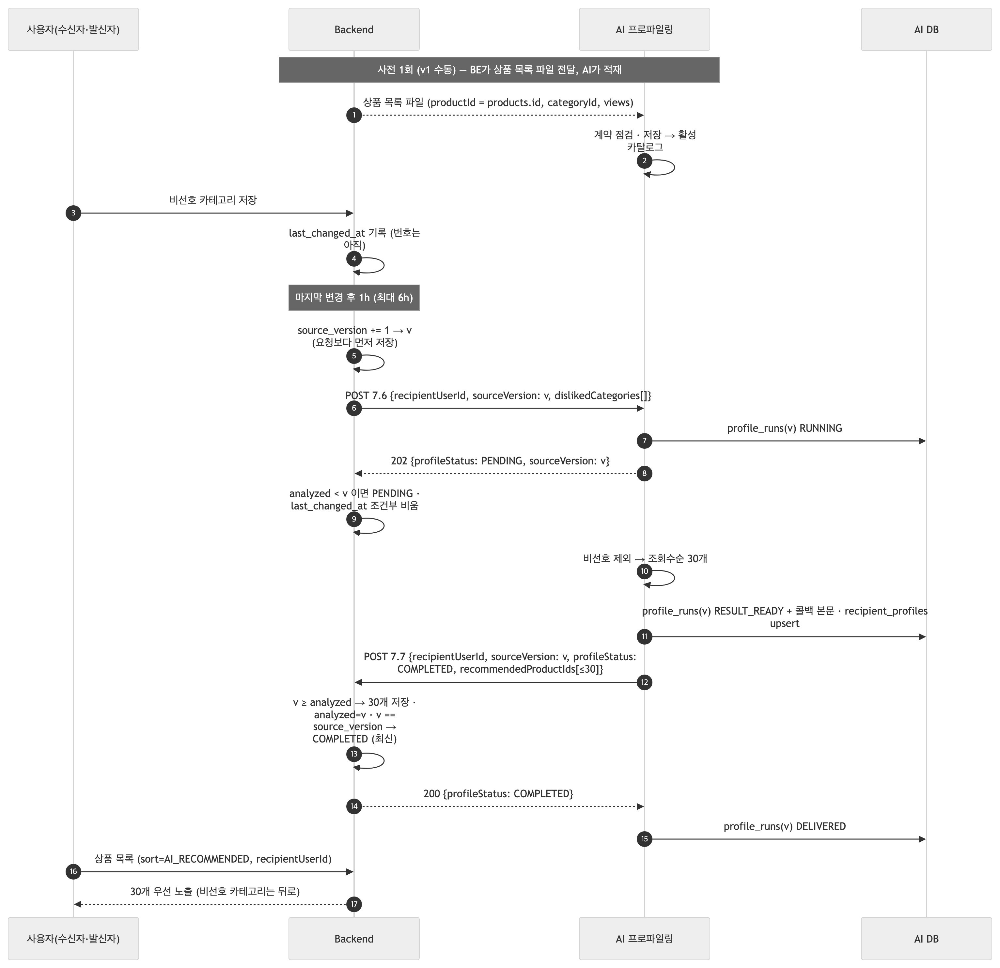

<!-- fig: 01-success -->
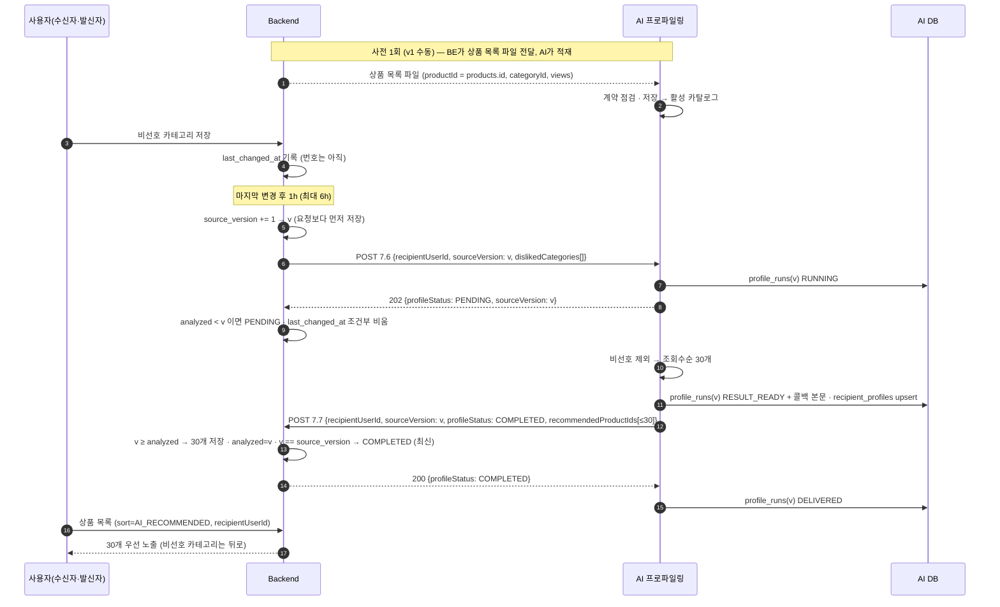

### 4.2 실패 — 7.6 이 503 (AI에 활성 카탈로그 없음)

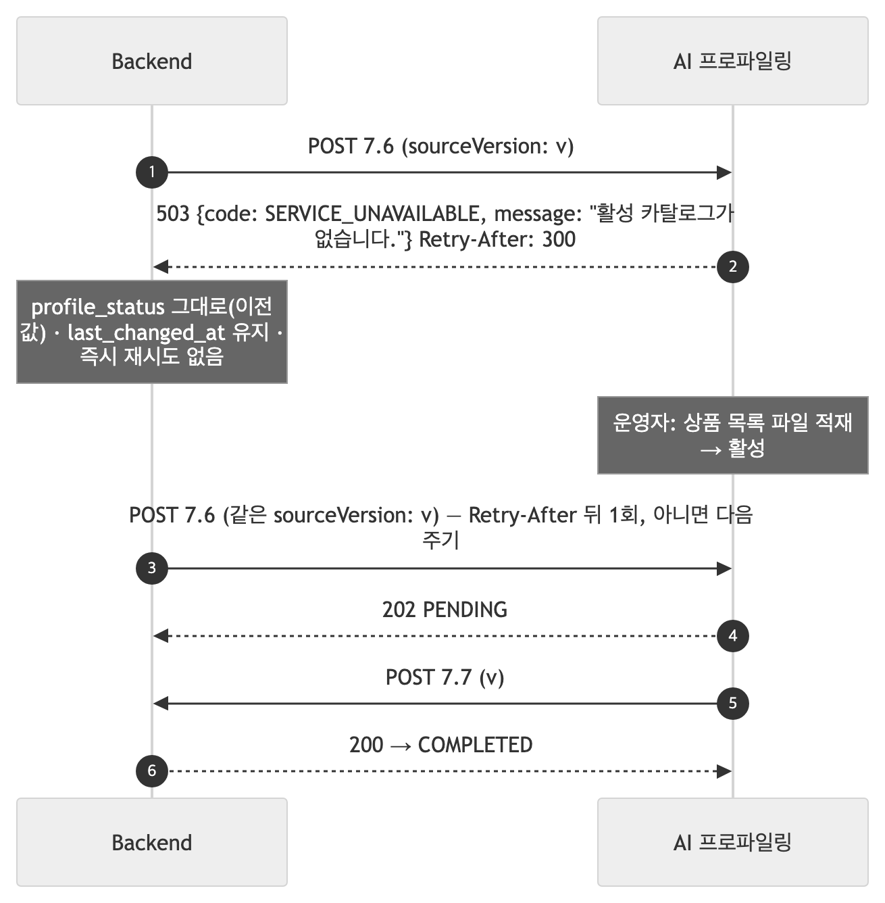

<!-- fig: 02-503-no-catalog -->
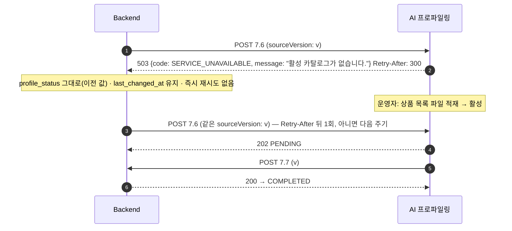

### 4.3 실패 — 순서 역전 → 7.7 이 409

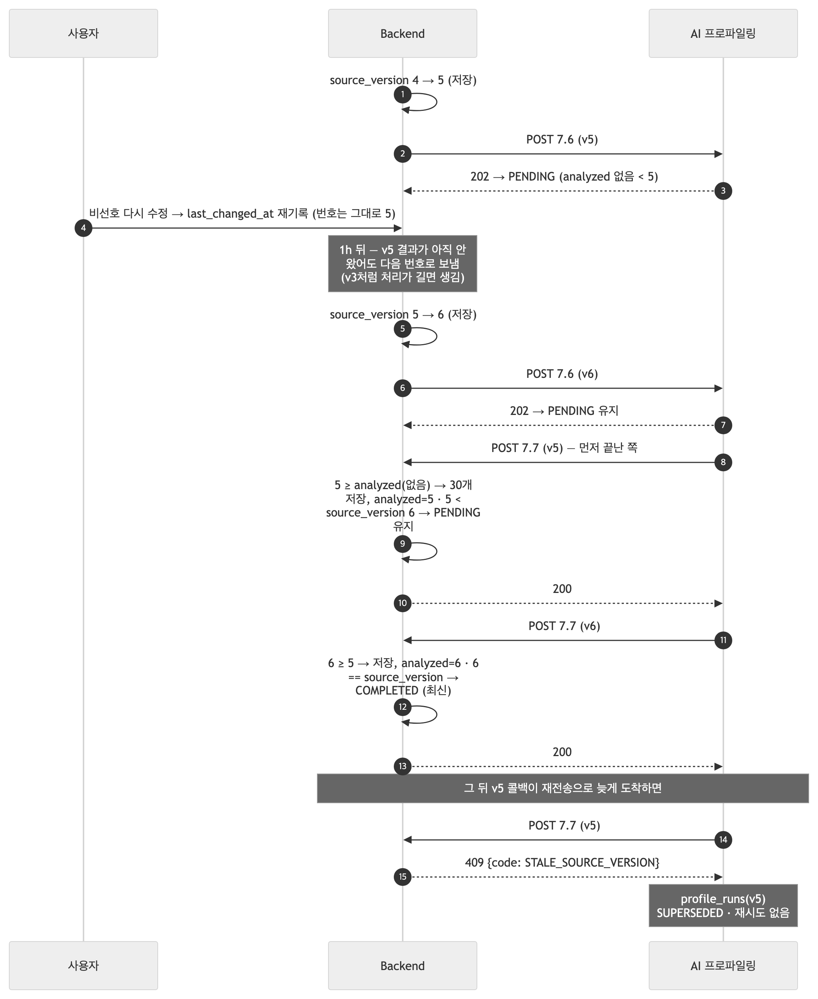

<!-- fig: 03-409-stale -->
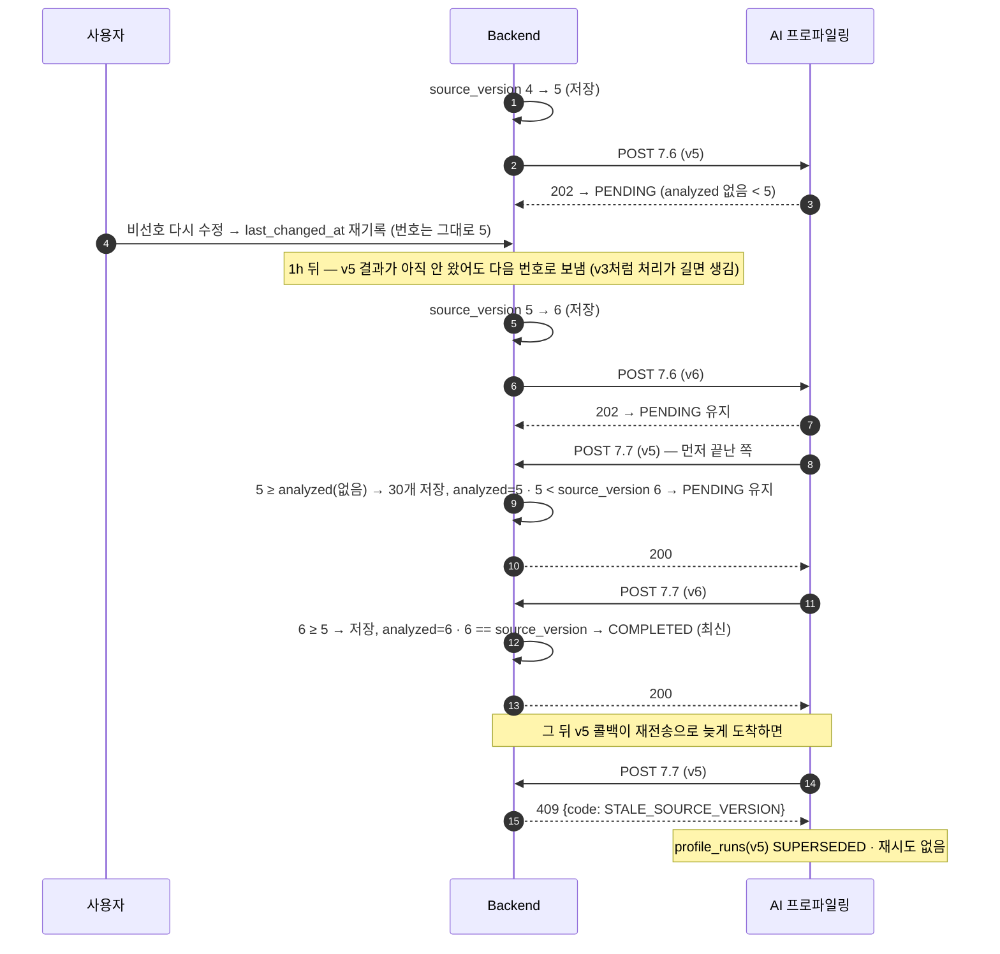

### 4.4 실패 — AI 처리 실패(침묵) → PENDING 타임아웃 → FAILED → 자동 재전송

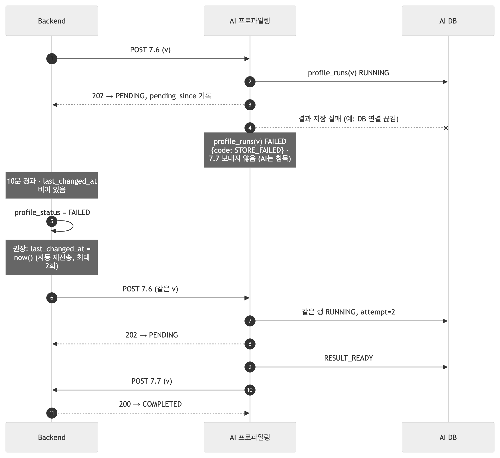

<!-- fig: 04-silent-fail-timeout -->
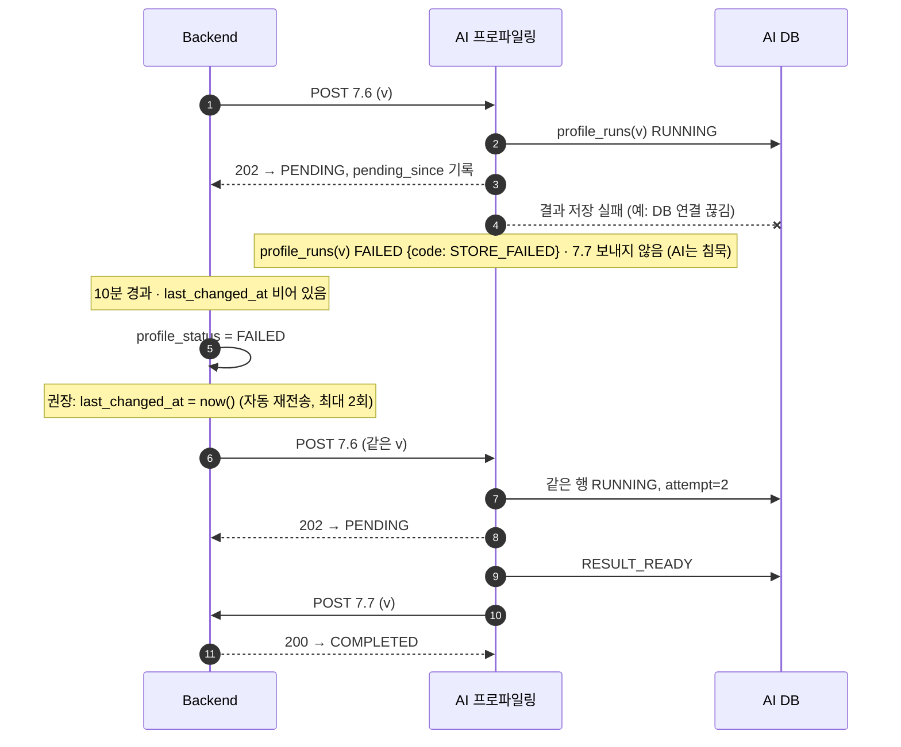

### 4.5 실패 — 빠른 콜백 경합 (v1에서 실제로 일어남)

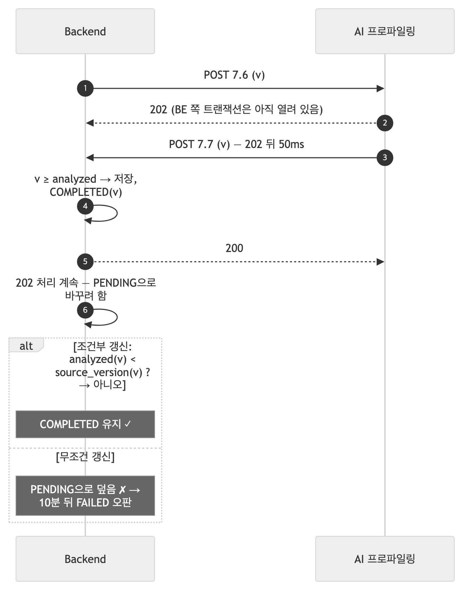

<!-- fig: 05-fast-callback-race -->
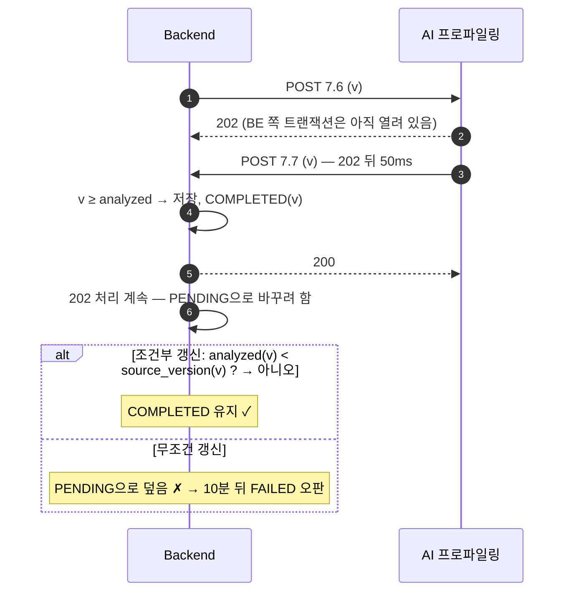

### 4.6 재전송 — 10분 PENDING → 같은 번호 7.6 → AI는 재분석 없이 재전송 (09-25)

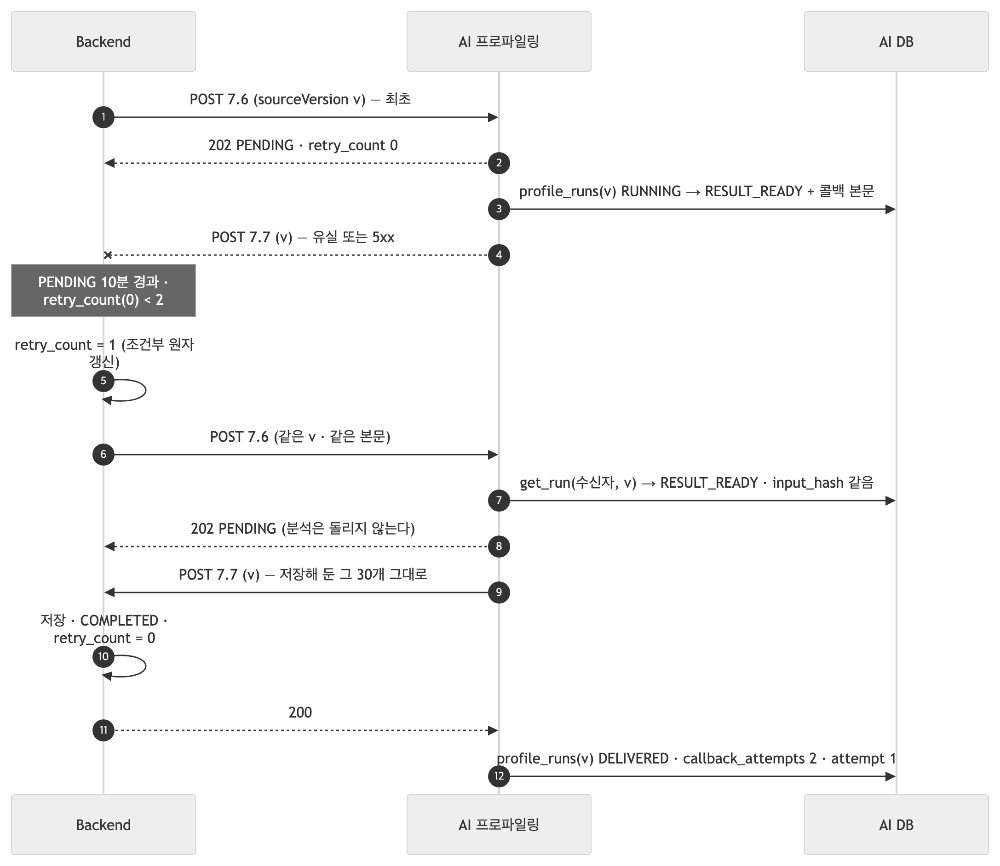

<!-- fig: 06-retry-resend -->
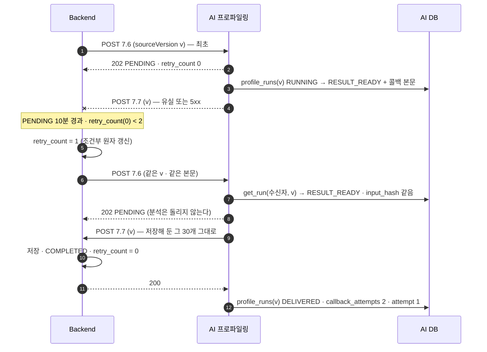

분석이 아직 돌고 있으면(`RUNNING`) AI는 **아무것도 하지 않고** 202만 준다 — 원래 실행이 끝나면 콜백이 간다. 실패했거나(`FAILED`) 죽은 `RUNNING`(5분 초과)이면 다시 분석한다.

---

## 5. BE에 확인·요청하는 것

### 5.1 재전송 정책 (09-25 BE 제안에 대한 회신)

**확인해 준 것** — `retry_count`는 BE `profiles` 테이블의 열이고 **AI 표에는 영향이 없다.** AI는 이미 `profile_runs.attempt`(분석 재실행)와 `callback_attempts`(7.7 시도)로 센다. 같은 `sourceVersion` 재전송에 동의하며, AI는 이미 결과가 있으면 재분석 없이 **최초와 같은 본문**을 재전송한다(§3.4 ⑤).

| # | 확인 요청 | 왜 |
|---|---|---|
| 1 | 재전송 직전 `last_changed_at`이 비어 있지 않으면(대기 중인 수정이 있으면) 재전송 대신 **다음 7.6(새 번호)**으로 가는가? | 낡은 입력으로 재시도하지 않기 위해. 타임아웃 규칙(§3.4 ④)과 같은 조건 |
| 2 | **재전송 본문은 최초와 같아야 한다** | 같은 번호인데 비선호 목록이 다르면 AI가 `input_hash`로 감지해 재분석한다. 입력이 바뀐 것이면 새 번호로 보내야 한다 |
| 3 | 2회를 다 쓴 뒤 상태는? `FAILED` 유지 + 사용자가 다시 고칠 때만 새 7.6인가 | AI는 그 뒤에도 아무것도 보내지 않는다(침묵) |
| 4 | 다중 인스턴스면 증가를 **조건부 원자 갱신**으로: `UPDATE … SET retry_count = retry_count + 1 WHERE recipient_user_id = ? AND retry_count < 2` | 스케줄러 두 대가 같은 타임아웃을 보면 2회가 한꺼번에 나갈 수 있다 |
| 5 | (선택) 10분 → 3분 | v1 처리는 밀리초 단위라 복구가 빨라진다. 모델이 붙는 v3에서 다시 정하면 된다 |

### 5.2 먼저 와야 연동이 완성되는 것

| # | 요청 | 지금 상태 |
|---|---|---|
| 1 | **Backend 상품·카테고리 ID 회신** (`product-id-map.jsonl` · `category-id-map.jsonl`) | AI `ai_catalog`에 4,231건이 있으나 `backend_product_id`는 0/4,231. 회신 전에는 7.7로 보내는 번호가 Backend에 없는 번호다 |
| 2 | **7.9 export에 재고·조회수 포함** — 재고를 모르는 상품은 `available`을 빼거나 `null`로 | AI는 3값(`available`·`unavailable`·`unknown`)으로 저장하고 `unknown`을 추정하지 않는다. 지금 적재분은 전건 `unknown` |
| 3 | 7.7 태그 포함 여부 · 7.9 조회수 필드명 · 비선호 제외 vs 감점 | 09-22 이후 미결 |

