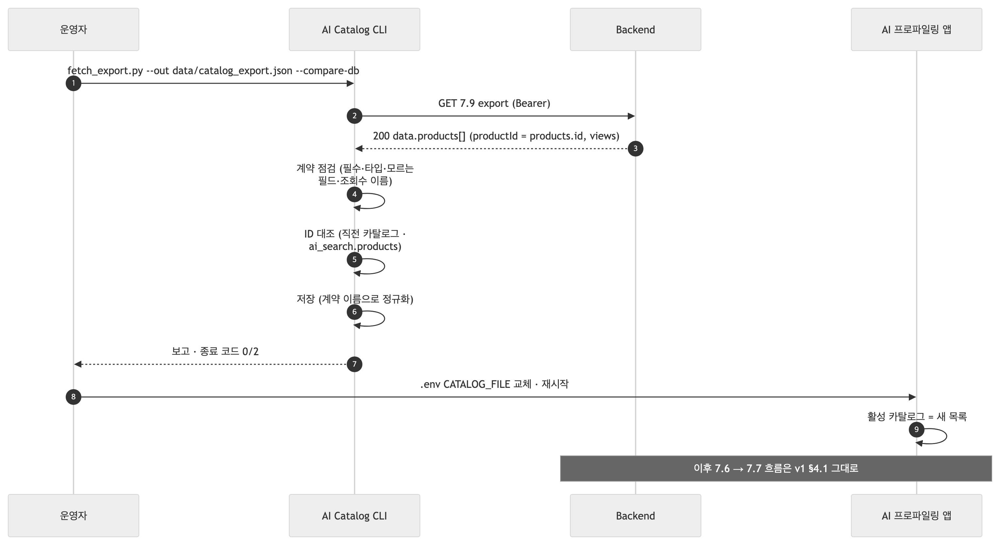
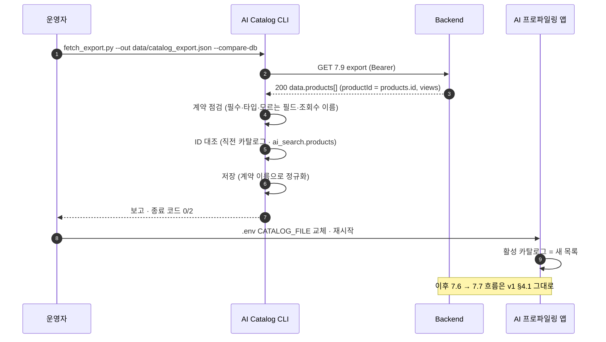
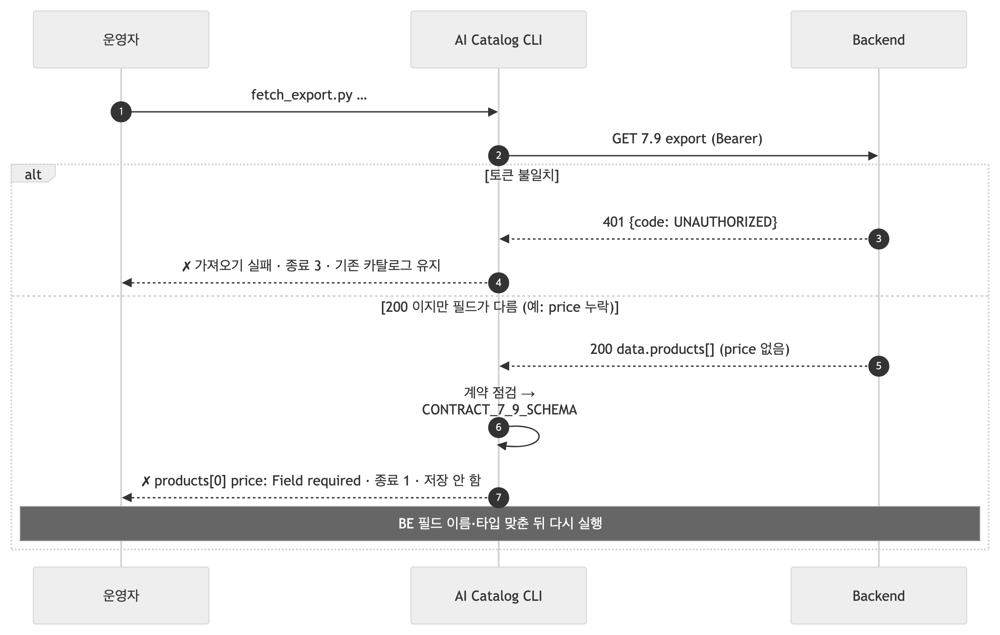
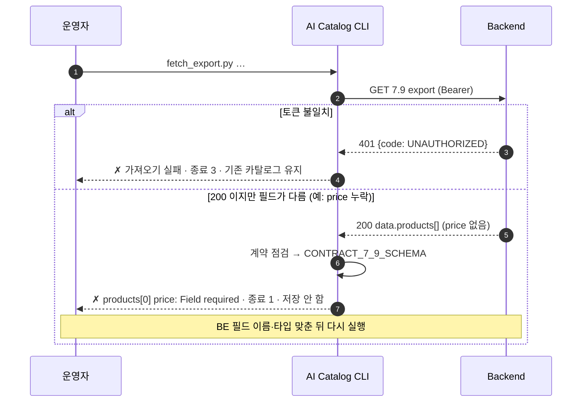

# BE ↔ AI 연동 필드표 v2 — 7.9 상품 전체 export (2026-09-22 AI 구현 기준)

v1([BE_연동_필드표_v1.md](BE_연동_필드표_v1.md))에서 **바뀌는 것은 상품 목록을 받는 방법 하나**다. v1은 BE가 넘겨준 파일을 AI가 수동 적재했고, v2는 BE의 export API(7.9)를 AI가 호출해 가져온다. **7.6·7.7·`profileStatus` 규칙은 v1과 같다.** 색인: [BE_연동_필드표.md](BE_연동_필드표.md).

| 절 | 내용 |
|---|---|
| 1 | v1 → v2에서 바뀌는 것 |
| 2 | 7.9 — 요청·200·오류 필드 |
| 3 | AI 쪽 처리와 오류(`CONTRACT_7_9_SCHEMA`) |
| 4 | 시퀀스 — 7.9 적재 성공 · 실패 |
| 5 | BE에 확인·요청 |

## 1. v1 → v2 에서 바뀌는 것

| 항목 | v1 | v2 |
|---|---|---|
| 상품 목록 출처 | BE가 파일로 전달, AI 수동 적재 | **BE 7.9 API**를 AI CLI가 호출해 저장 (`tools/catalog/fetch_export.py`) |
| 호출 주체·시점 | — | AI (운영자 수동 실행). 주기는 AI가 정하고 채팅·7.6마다 호출하지 않음 |
| 갱신 판정 | 파일 교체 | `updatedAt`·ID 대조로 변경분 확인 (CLI 보고) |
| 7.6 / 7.7 | | **동일** |
| `profileStatus` 생애주기 | | **동일** (v1 §3) |
| 7.6이 503인 경우 | 파일 미적재 | 7.9 미적재·적재 실패 — 대응은 v1 §3.6과 같음(`Retry-After`, 다음 주기) |

## 2. 7.9 상품 전체 export — AI → BE

`GET {BE}/internal/v1/ai/products/export` · `Authorization: Bearer <serviceToken>` · `Accept: application/json`

요청에 Query·Body 없음. 이 목록의 `productId`가 7.7로 돌아가므로 **BE `products.id`와 같아야** 한다.

### 응답 필드 (BE가 보냄) — `200 OK`

| 필드 | 타입 | 필수 | null | 원본 | AI 사용 |
|---|---|---|---|---|---|
| `message` | string | ✔ | ✕ | | 로그 |
| `data.generatedAt` | ISO 8601 UTC | ✔ | ✕ | 생성 시각 | 저장 시각 기록 |
| `data.products[]` | array | ✔ | ✕ | 삭제되지 않고 카테고리 유효한 전체 상품, `productId` 오름차순 | |
| `productId` | integer > 0 | ✔ | ✕ | `products.id` | **7.7 추천 ID의 원천** |
| `name` | string | ✔ | ✕ | `products.name` | 콘솔 표시 |
| `brand` | string | ✔ | ✕ | `products.brand` | |
| `description` | string \| null | ✔ (키) | ✔ | `products.description` | v3 모델 입력 |
| `categoryId` | integer > 0 | ✔ | ✕ | `products.category_id` | **7.6 `dislikedCategories[].categoryId`와 대조해 제외** |
| `categoryName` | string | ✔ | ✕ | `categories.name` | 이름 대조(보조) |
| `price` | integer ≥ 0 | ✔ | ✕ | `products.price` | 표시 |
| `available` | boolean | ✔ | ✕ | `quantity > 0` | AI는 3값(`available`·`unavailable`·`unknown`)으로 받아 저장한다 — `true→available`, `false→unavailable`, **필드가 없거나 null이면 `unknown`**. **추천 풀에서는 `unavailable`만 제외**하고 `unknown`은 남긴다(09-23 합의: 실제 재고는 BE가 안다) |
| `updatedAt` | ISO 8601 UTC | ✔ | ✕ | 상품·카테고리 `updated_at` 중 늦은 값 | 변경 판정 |
| `viewCount` **또는 `views`** | integer ≥ 0 | — | ✕ | `products.views` | **정렬 기준(내림차순)**. ⚠ 위키 7.9에 없음 — 추가 필요. 없으면 0(정렬 무의미) |
| 그 밖의 필드(`sales`, `quantity`, `imageUrl` …) | | | | | 무시 (CLI가 "계약에 없는 필드"로 이름·건수만 보고) |

```json
{"message": "상품 목록을 조회했습니다.",
 "data": {"generatedAt": "2026-09-04T09:00:00Z",
          "products": [{"productId": 1203, "name": "데일리 텀블러", "brand": "브랜드명", "description": "가볍게 들고 다니기 좋은 텀블러",
                        "categoryId": 12, "categoryName": "리빙", "price": 79000, "available": true,
                        "updatedAt": "2026-09-04T08:30:00Z", "views": 120}]}}
```

빈 목록은 `200` + `products: []`. 품절(재고 0)도 `available: false`로 **포함**한다.

재고를 모르는 상품은 `available`을 **보내지 않거나 `null`** 로 보내면 AI가 `unknown`으로 저장한다 — AI는 `unknown`을 `true`/`false`로 추정하지 않는다(검색기와 같은 규칙). 지금 AI가 적재한 카탈로그 패키지에는 재고 정보가 없어 4,231건이 전부 `unknown`이다.

### 응답 — 오류 (BE가 돌려주는 것)

| HTTP | `error.code` | 언제 | AI 처리 |
|---|---|---|---|
| 401 | `UNAUTHORIZED` | 토큰 없음·불일치 | CLI 종료 코드 3, 저장 안 함, 기존 카탈로그 유지 |
| 5xx | — | BE 오류 | 〃 |
| 연결 실패·타임아웃(60초) | — | | 〃 |

## 3. AI 쪽 처리와 오류

`fetch_export.py`: 호출 → **계약 점검** → **ID 대조**(직전 카탈로그·`ai_search.products`) → 저장 → `.env`의 카탈로그 경로 변경 → AI 앱 재시작(활성 카탈로그 교체).

### `CONTRACT_7_9_SCHEMA` — 200인데 필드가 계약과 다를 때

CLI가 **어느 상품의 어느 필드가 어떻게** 다른지 출력하고 **저장하지 않는다**(기존 카탈로그 유지). 종료 코드 1.

| 상황 | CLI 출력 예 |
|---|---|
| 필수 필드 누락 | `필수인데 빠진 필드: price×4231` · `✗ products[0] price: Field required` |
| 타입 오류 | `✗ products[12] categoryId: Input should be a valid integer` |
| 봉투 모양 다름 | `✗ CONTRACT_7_9_SCHEMA: data.products 배열이 없음` |
| 조회수 이름 | `조회수 필드: views` (수용) / `조회수 필드: 없음(전부 0으로 처리)` |
| 계약에 없는 필드 | `계약에 없는 필드(무시함): imageUrl×4231, sales×4231` — **오류 아님** |

### ID 대조 결과 (종료 코드 2 — 저장은 함)

| 출력 | 뜻 |
|---|---|
| `Backend에만: …` | AI가 아직 모르는 상품 — 저장하면 해결 |
| `AI에만: …` | **7.7로 이 ID를 보내면 BE 화면에 안 뜸** — 이전 목록의 잔재 |
| `변경 13006 categoryId: 802 → 9999` | 카테고리 이동 — 비선호 제외 결과가 달라짐 |
| `숫자가 아닌 product_id N건` | `ai_search.products`가 수집처 ID를 쓰고 있음 — BE id로 재적재 필요 |

## 4. 시퀀스

### 4.1 7.9 적재 성공 → (7.6·7.7은 v1과 동일)



<!-- fig: 01-export-success -->


### 4.2 7.9 실패 — 계약 불일치 / 401



<!-- fig: 02-export-fail -->


## 5. BE에 확인·요청하는 것 (v2 연결 전)

| # | 항목 | 왜 |
|---|---|---|
| 1 | 7.9 엔드포인트 `GET /internal/v1/ai/products/export` + Bearer | v1 §5의 토큰과 같은 값 |
| 2 | 응답에 **`views`**(또는 `viewCount`) 포함 | 정렬 기준. 위키 7.9에는 없음 |
| 3 | `available = quantity > 0`, 삭제 상품 제외, `productId` 오름차순 | 계약 그대로 |
| 4 | 전체 4,231건을 한 응답으로 (페이지 없음) | 계약. 커지면 그때 페이지 협의 |
| 5 | `categoryId`가 7.6의 `dislikedCategories[].categoryId`와 같은 `categories.id` | 비선호 제외의 전제 |

관련: [v1](BE_연동_필드표_v1.md) · [v3](BE_연동_필드표_v3.md) · `tools/catalog/fetch_export.py`
