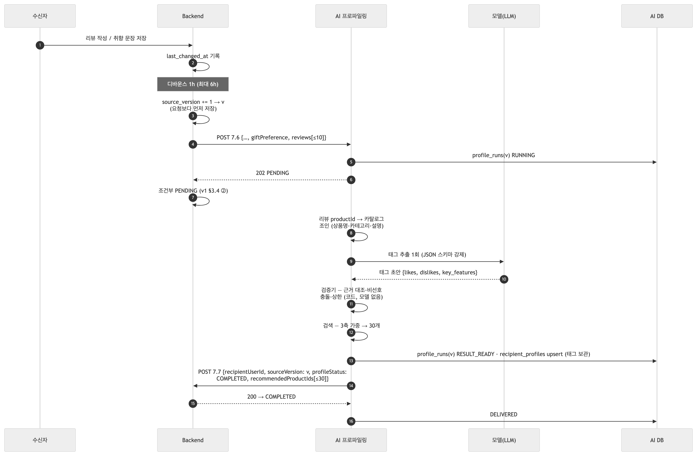
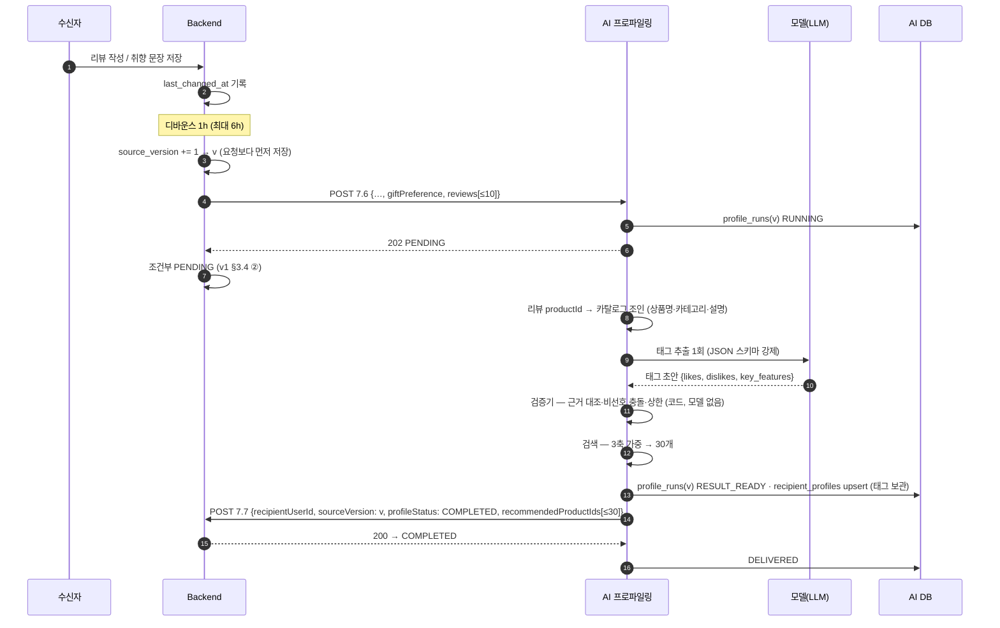
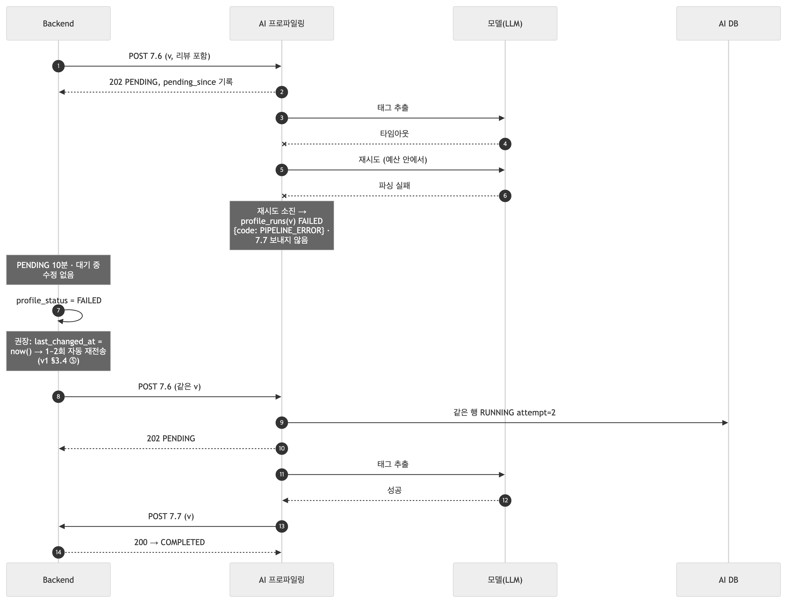
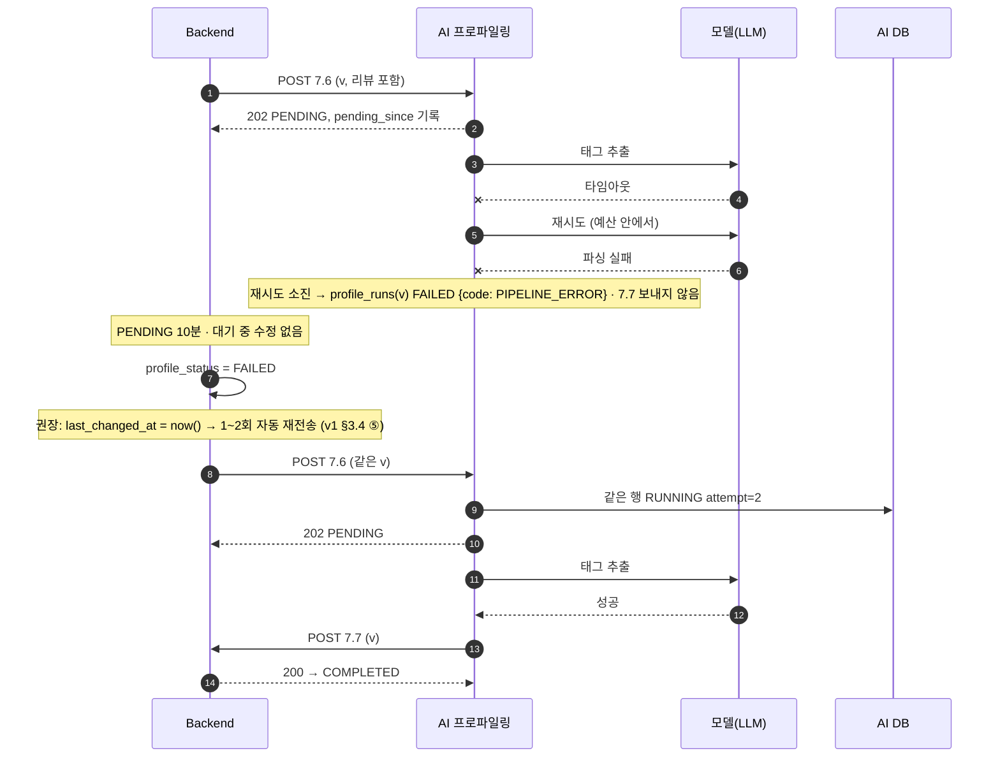

# BE ↔ AI 연동 필드표 v3 — 취향·리뷰 입력 (2026-09-22, 설계 기준 · AI 모델 단계 미구현)

v1([v1](BE_연동_필드표_v1.md))·v2([v2](BE_연동_필드표_v2.md)) 위에 **7.6 입력 두 가지(취향 문장·리뷰)** 가 더해진다. AI는 이 자료로 태그를 뽑아 30개를 고르고, 태그는 AI가 보관한다(Backend에는 여전히 상품 ID만). **7.7·7.9는 그대로**, `profileStatus` 규칙도 같되 처리 시간이 길어져 타임아웃 값을 다시 정한다. 색인: [BE_연동_필드표.md](BE_연동_필드표.md).

> 상태: 7.6 스키마는 이미 이 필드를 받는다(보내면 저장·검증). 모델·검증기·검색 단계는 미구현이라 지금 보내면 v1 경로(비선호만)로 처리되고 경고 로그가 남는다.

| 절 | 내용 |
|---|---|
| 1 | v1/v2 → v3에서 바뀌는 것 |
| 2 | 7.6 — 추가 필드·오류 |
| 3 | 7.7 — 변경 없음 (태그 미전송 확인) |
| 4 | `profileStatus` — 타임아웃·경합 재검토 |
| 5 | 시퀀스 — 성공 · 모델 실패 |
| 6 | BE에 확인·요청 |

## 1. v1/v2 → v3 에서 바뀌는 것

| 항목 | v1/v2 | v3 |
|---|---|---|
| 7.6 입력 | 비선호 카테고리 | + **`giftPreference`**(취향 문장) + **`reviews`**(최근 리뷰 ≤10) |
| 7.6 호출 시점 | 비선호 변경 뒤 디바운스 | **취향 문장·리뷰 변경도** `last_changed_at` 기록·디바운스 대상 (번호는 v1과 같이 보내기 직전 +1) |
| AI 처리 | 비선호 제외 → 조회수순 30 | 카탈로그 조인 → **모델**(태그 추출) → **검증기** → **검색**(3축 가중) → 30 |
| 처리 시간 | 초 미만 | **수십 초** (모델 1회 + 검색). 전체 기한 240초 제안 |
| 7.7 본문 | 상품 ID 30개 | **동일** — 태그는 AI `recipient_profiles`에 보관 |
| PENDING 타임아웃 | 10분 제안 | 처리 기한보다 길게 — **10분 유지 가능**(240초 < 10분), 재시도 포함 시 재검토 |

## 2. 7.6 — 추가 필드

`POST {AI}/api/internal/v1/ai/profile/extract-and-pool` (v1과 같은 경로·인증)

| 필드 | 타입 | 필수 | null | 제약 | 비고 |
|---|---|---|---|---|---|
| `recipientUserId` · `sourceVersion` · `dislikedCategories` | | | | | v1과 동일 |
| `giftPreference` | string \| null | ✔ (키) | ✔ | BE 화면 규칙 ≤ 500 코드포인트. **없으면 `null`** | 수신자가 쓴 취향 문장 원문 그대로 |
| `reviews` | array | ✔ | ✕ | **최대 10개**, 작성일 **최신순**. 없으면 `[]` | 페이로드·모델 입력 상한 |
| `reviews[].productId` | integer | ✔ | ✕ | > 0 | AI가 카탈로그에서 상품명·카테고리·설명을 조인. 카탈로그에 없으면 별점·글만 사용 |
| `reviews[].rating` | integer | ✔ | ✕ | 1 ~ 5 | 필수 |
| `reviews[].reviewText` | string \| null | ✔ (키) | ✔ | BE 화면 규칙 ≤ 300자 | ⚠ 위키는 필수·null 불가. AI는 **null 허용**(별점만 있는 리뷰) |

```json
{"recipientUserId": 9871, "sourceVersion": 7,
 "dislikedCategories": [{"categoryId": 12, "categoryName": "캠핑용품"}],
 "giftPreference": "실용적인 생활용품을 좋아하고 화려한 디자인보다 미니멀한 스타일을 선호합니다.",
 "reviews": [{"productId": 1001, "rating": 5, "reviewText": "매우 만족합니다."},
             {"productId": 2048, "rating": 2, "reviewText": null}]}
```

### 202 응답 — v1과 동일 (`profileStatus: PENDING`, 값 그대로)

### 오류 — v1 표에 다음이 추가된다

| HTTP | `error.code` | 언제 | `message` (실제 값) |
|---|---|---|---|
| 400 | `INVALID_REQUEST` | 리뷰 11개 이상 | `요청 형식이 올바르지 않습니다: reviews — List should have at most 10 items after validation, not 11` |
| 400 | `INVALID_REQUEST` | 별점 범위 | `… reviews.0.rating — Input should be less than or equal to 5` |
| 400 | `INVALID_REQUEST` | 리뷰 항목 필드 누락 | `… reviews.0.productId — Field required` |

계약에 없는 필드(예: `reviews[].createdAt`)는 v1과 같이 **202 + 경고 로그**.

## 3. 7.7 — 변경 없음

본문은 v1과 같다: `recipientUserId`·`sourceVersion`·`profileStatus: COMPLETED`·`recommendedProductIds[≤30]`. **`preferredTags`·`dislikedTags`는 v3에서도 보내지 않는다** — 태그는 AI 테이블(`ai_profile.recipient_profiles`)에 보관하고 AI 채팅이 거기서 읽는다(DR-035). ⚠ 위키(v3.2.6)는 태그 필수이므로 BE 검증이 위키를 따르면 400 — v1 때 정한 방식(없어도 200 / `[]` 동봉)을 그대로 유지.

## 4. `profileStatus` — v1 규칙 그대로, 두 가지만 재검토

| 항목 | v1 | v3에서 |
|---|---|---|
| PENDING 타임아웃(§3.4 ④) | 10분 | 모델 재시도까지 합친 **전체 처리 기한(240초 제안)보다 길어야** 함. 10분이면 여유. 기한을 늘리면 같이 늘림 |
| 빠른 콜백 경합(§3.7) | 50ms — 반드시 조건부 PENDING | 처리 수십 초라 드물지만 **조건부 갱신은 그대로** (모델 실패 시 v1 경로로 빠지면 다시 빠름) |
| 분석 중 수정 | 그대로 | 처리가 길어 **더 자주** 생김 — `last_changed_at` 조건부 비움이 중요 |
| FAILED 자동 재전송(§3.4 ⑤) | 권장 1~2회 | 모델 실패(타임아웃·파싱)는 재시도로 풀리는 경우가 많아 **더 권장** |

## 5. 시퀀스

### 5.1 성공 — 취향·리뷰 → 모델 → 검증 → 검색 → 7.7



<!-- fig: 01-success-model -->


### 5.2 실패 — 모델 타임아웃 → 재시도 소진 → 침묵 → BE 타임아웃



<!-- fig: 02-model-fail -->


## 6. BE에 확인·요청하는 것 (v3 연결 전)

| # | 항목 | 왜 |
|---|---|---|
| 1 | 7.6에 **`giftPreference`·`reviews`** 싣기 — 리뷰는 작성일 최신순 10개, `reviewText`는 null 허용 | 모델 입력 |
| 2 | **리뷰 작성·수정·취향 문장 저장도 `last_changed_at` 기록(디바운스)** 대상 | 안 그러면 리뷰가 분석에 반영되지 않음 |
| 3 | 리뷰의 `productId`가 7.9 카탈로그의 `productId`와 같은 체계 | 카탈로그 조인 |
| 4 | PENDING 타임아웃 값 재확인 (처리 기한 240초 + 여유) | v1 10분이면 그대로 |
| 5 | 7.7 태그 없음 유지 | DR-035 |

관련: [v1](BE_연동_필드표_v1.md)(공통 규칙·`profileStatus` 생애주기) · [v2](BE_연동_필드표_v2.md)(7.9) · 설계 근거 `KTB4_12team/AI/latest/01_모델_API_설계/담당파트_상세설계서_7.6_7.9.md`
