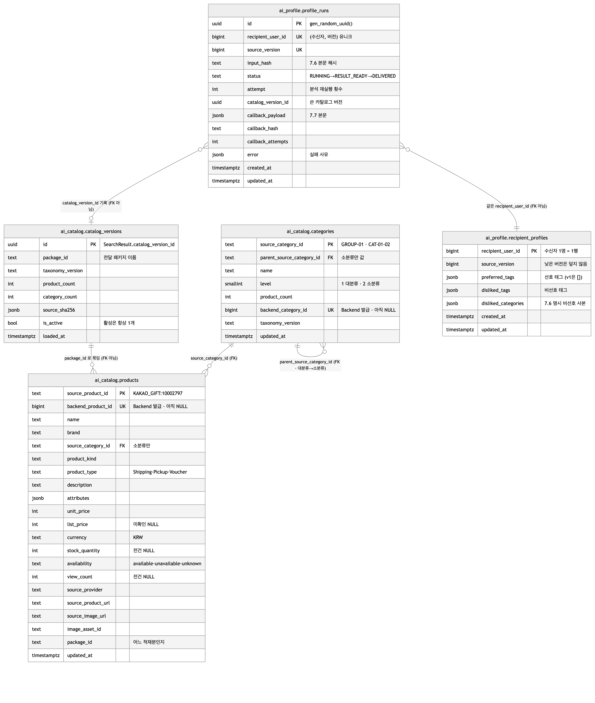
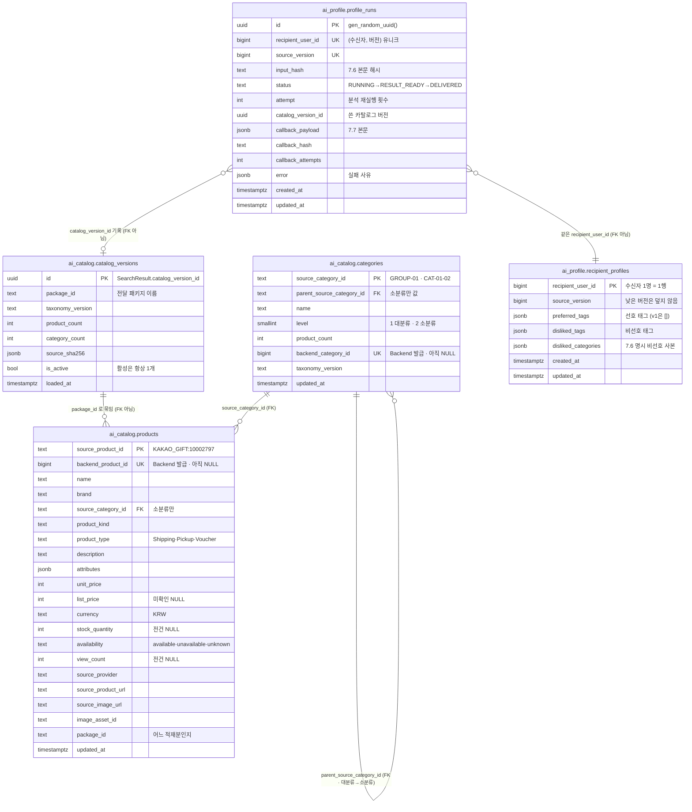
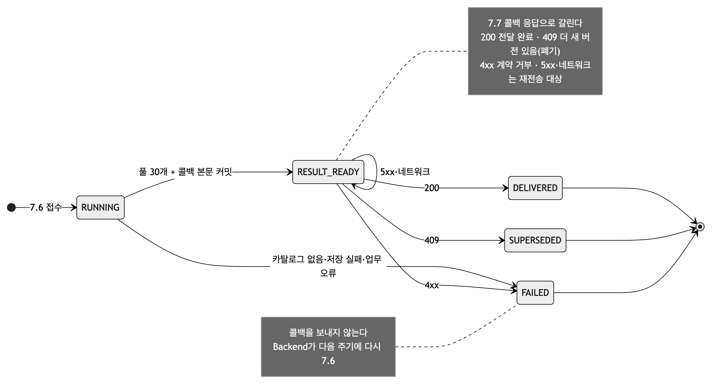
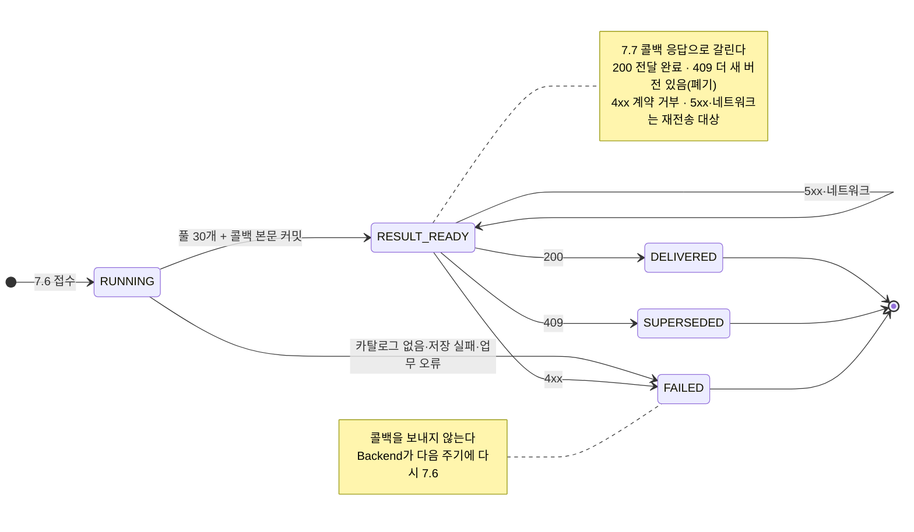

# AI DB 표 구조 (ERD) — 2026-09-25

AI가 **소유한** 표가 무엇이고 서로 어떻게 이어지는지. 정본은 `alembic/versions/`의 마이그레이션 세 개이고, 이 문서는 그것을 그림과 표로 옮긴 것이다. 코드가 이 표를 어떻게 쓰는지는 [DB_전환_설명.md](DB_전환_설명.md)와 [시퀀스_전체.md](시퀀스_전체.md)에 있다.

| | |
|---|---|
| DB | PostgreSQL 16 + pgvector (`pgvector/pgvector:pg16`) · 데이터베이스 `ai_chat` · 계정 `ai_user` |
| 스키마 | `ai_profile`(프로파일링 2표) · `ai_catalog`(카탈로그 3표) · `ai_search`(팀원 검색기 1표, §7) |
| 마이그레이션 | `0001` recipient_profiles · `0002` profile_runs · `0003` ai_catalog 3표 — `uv run alembic upgrade head` |
| 행 수 | 2026-09-23 확인: 상품 4,231 · 카테고리 67(대분류 10·소분류 57) · 활성 카탈로그 버전 1. `ai_profile` 두 표는 로컬 시험 행뿐 |
| 절 | 1 한눈에 · 2 `ai_profile` · 3 `ai_catalog` · 4 관계(FK와 FK 아닌 것) · 5 키·인덱스·제약 · 6 바깥 ID 대응 · 7 팀원 표 · 8 아직 없는 것 |

그림은 `docs/assets/erd/`. 이 문서의 mermaid를 고치면 `python3 assets/build_be_sequences.py`를 다시 돌린다 — 그림과 본문이 한 소스다.

---

## 1. 한눈에

<!-- fig: 01-전체 -->

**읽는 요령.** 실선(FK)은 두 개뿐이다 — `products → categories`, `categories → categories`. 나머지 연결은 **DB가 강제하지 않는 약속**이고, 왜 그런지는 §4에 있다.

---

## 2. `ai_profile` — 프로파일링이 쓰는 두 표

스키마를 만들 때 `CREATE EXTENSION vector`도 같이 켠다(0001). v1은 벡터를 쓰지 않지만 v2·v3 임베딩 표가 들어올 자리다.

### 2.1 `recipient_profiles` — 수신자 1명 = 1행 (태그 보관)

7.7 콜백으로 Backend에 보내는 것은 **상품 ID 30개뿐**이고, 태그는 AI가 이 표에 갖는다(09-16 합의 DR-035). Chat이 나중에 이 행을 읽는다.

| 열 | 타입 | NULL | 기본값 | 뜻 |
|---|---|---|---|---|
| `recipient_user_id` | bigint **PK** | — | 없음(시퀀스 없음) | 수신자 사용자 ID. **Backend 정본 번호를 그대로** 쓴다 |
| `source_version` | bigint | NOT NULL | | 이 행을 만든 7.6 `sourceVersion`. 낮은 버전이 늦게 와도 덮지 않는다 |
| `preferred_tags` | jsonb | NOT NULL | `'[]'` | 선호 태그 `string[]` (≤12). v1은 항상 `[]` |
| `disliked_tags` | jsonb | NOT NULL | `'[]'` | 비선호 태그 `string[]` (≤8). v1은 7.6이 준 카테고리 **이름** |
| `disliked_categories` | jsonb | NOT NULL | `'[]'` | 7.6 명시 비선호 `[{category_id, category_name}]` — 분석 시점 사본 |
| `created_at` / `updated_at` | timestamptz | NOT NULL | `now()` | |

- **갱신 규칙이 SQL에 있다.** `INSERT … ON CONFLICT (recipient_user_id) DO UPDATE … WHERE recipient_profiles.source_version <= excluded.source_version` — 순서가 뒤집혀 들어와도 DB가 막는다(`stores.py`).
- 인덱스: `preferred_tags`·`disliked_tags`에 **GIN** 두 개(태그로 수신자를 찾을 일에 대비).

### 2.2 `profile_runs` — 실행 1건 = 1행 (감사·재전송)

**작업 큐가 아니다.** 앱이 이 표를 polling 하지 않는다. "무엇을 언제 어떤 카탈로그로 분석해서 무엇을 보냈나"를 남기는 기록이다.

| 열 | 타입 | NULL | 기본값 | 뜻 |
|---|---|---|---|---|
| `id` | uuid **PK** | — | `gen_random_uuid()` | 실행 ID |
| `recipient_user_id` | bigint | NOT NULL | | 수신자 |
| `source_version` | bigint | NOT NULL | | 7.6 `sourceVersion` |
| `input_hash` | text | NOT NULL | | 정규화한 7.6 본문의 sha256 — 같은 키에 다른 입력이 오면 값이 달라진다 |
| `status` | text | NOT NULL | | `RUNNING` · `RESULT_READY` · `DELIVERED` · `SUPERSEDED` · `FAILED` (CHECK) |
| `attempt` | integer | NOT NULL | `1` | 분석 시도 횟수. `RUNNING`으로 다시 들어올 때만 +1 |
| `catalog_version_id` | uuid | NULL | | 이 실행이 쓴 카탈로그 버전. **FK 없음**(§4) |
| `callback_payload` | jsonb | NULL | | 7.7에 보낼 본문. 재전송은 이 값을 그대로 |
| `callback_hash` | text | NULL | | 위 본문의 sha256 — 재전송이 같은 결과인지 확인 |
| `callback_attempts` | integer | NOT NULL | `0` | 콜백 시도 횟수 |
| `error` | jsonb | NULL | | `{code, reason}`. 실패가 아니면 NULL |
| `created_at` / `updated_at` | timestamptz | NOT NULL | `now()` | |

**DB가 지키는 순서 규칙이 하나 있다.** `ck_profile_runs_result_has_payload` — 상태가 `RESULT_READY`·`DELIVERED`·`SUPERSEDED`면 `callback_payload`와 `callback_hash`가 **반드시 있어야 한다**. "보낼 내용 없이 보냈다고 기록된 행"을 만들 수 없다.

<!-- fig: 02-실행-상태 -->

---

## 3. `ai_catalog` — 상품 카탈로그 세 표 (0003)

Backend 전달 패키지(`product-catalog-20260922-v1`)를 `tools/catalog/load_catalog.py`로 적재한다. 적재 1회 = `catalog_versions` 1행.

### 3.1 `catalog_versions` — 적재 1회 = 1행

| 열 | 타입 | NULL | 뜻 |
|---|---|---|---|
| `id` | uuid **PK** | — | 이 값이 그대로 `profile_runs.catalog_version_id`와 `SearchResult.catalog_version_id`가 된다 |
| `package_id` | text | NOT NULL | 전달 패키지 이름. **상품을 이 이름으로 묶는다**(§4) |
| `taxonomy_version` | text | NOT NULL | 분류 버전 (`2026-09-15.final57`) |
| `product_count` / `category_count` | integer | NOT NULL | 패키지가 선언한 수 — 적재 후 실제 수와 대조 |
| `source_sha256` | jsonb | NULL | 패키지 원본 파일 해시 — 같은 패키지인지 대조용 |
| `is_active` | boolean | NOT NULL | **활성은 항상 최대 1개**(부분 유니크 인덱스) |
| `loaded_at` | timestamptz | NOT NULL | |

### 3.2 `categories` — 2단 (대분류 10 · 소분류 57)

| 열 | 타입 | NULL | 뜻 |
|---|---|---|---|
| `source_category_id` | text **PK** | — | `GROUP-01`(대분류) · `CAT-01-02`(소분류) |
| `parent_source_category_id` | text **FK→자기 자신** | NULL | 소분류만 값이 있다 |
| `name` | text | NOT NULL | |
| `level` | smallint | NOT NULL | `1` 대분류 · `2` 소분류 (CHECK) |
| `product_count` | integer | NOT NULL | 패키지가 선언한 수 |
| `backend_category_id` | bigint **UNIQUE** | NULL | Backend `categories.id`. **아직 전건 NULL** |
| `taxonomy_version` | text | NOT NULL | |

두 CHECK가 계층을 강제한다 — `level IN (1,2)`, 그리고 `(level = 1) = (parent IS NULL)`(대분류는 부모가 없고 소분류는 반드시 있다).

### 3.3 `products` — 4,231건

| 열 | 타입 | NULL | 뜻 |
|---|---|---|---|
| `source_product_id` | text **PK** | — | `KAKAO_GIFT:10002797`. 지금 우리가 가진 유일한 키 |
| `backend_product_id` | bigint **UNIQUE** | NULL | Backend `products.id`. **아직 전건 NULL** — 7.7로 내보낼 번호가 이것 |
| `name` · `brand` · `product_kind` · `description` | text | NOT NULL | |
| `source_category_id` | text **FK→categories** | NOT NULL | 소분류만 온다 |
| `product_type` | text | NOT NULL | `Shipping`(3,824) · `Voucher`(405) · `Pickup`(2) (CHECK) |
| `attributes` | jsonb | NOT NULL `'{}'` | 문자열 키/값. 1,446건은 빈 객체 |
| `unit_price` | integer | NOT NULL | `>= 0` (CHECK) |
| `list_price` | integer | NULL | 정가. 충돌·미확인 4건은 NULL — 할인율을 만들지 않는다 |
| `currency` | text | NOT NULL `'KRW'` | |
| `stock_quantity` | integer | NULL | 미확인. 패키지는 **전건 NULL** |
| `availability` | text | NOT NULL `'unknown'` | `available`·`unavailable`·`unknown` (CHECK). 패키지 적재분은 전건 `unknown` |
| `view_count` | integer | NULL | 패키지에 없음 → **전건 NULL**. v1 풀 정렬 키 |
| `source_provider` · `source_product_url` · `source_image_url` | text | NOT NULL | |
| `image_asset_id` | text | NULL | 변환 이미지 3종 키 |
| `package_id` | text | NOT NULL | 어느 적재분인지 |

**재적재해도 덮지 않는 열이 셋 있다** — `backend_product_id` · `availability` · `view_count`. 각각 Backend 회신(`--id-map`)과 7.9 export가 채우는 자리이므로, 패키지를 다시 넣어도 UPSERT가 건드리지 않는다.

---

## 4. 관계 — FK인 것과 FK가 아닌 것

**진짜 FK는 둘뿐이다.**

| FK | 뜻 |
|---|---|
| `products.source_category_id → categories.source_category_id` | 없는 카테고리의 상품을 넣을 수 없다 |
| `categories.parent_source_category_id → categories.source_category_id` | 없는 대분류 밑에 소분류를 달 수 없다 |

**나머지는 DB가 강제하지 않는 약속이다.** 이유가 각각 다르다.

| 연결 | 왜 FK가 아닌가 |
|---|---|
| `profile_runs.catalog_version_id → catalog_versions.id` | `0002`가 `0003`보다 먼저 생겼고, 당시 카탈로그는 파일이었다(고정 UUID). 지금은 값이 실제로 `ai_catalog.catalog_versions.id`지만 **감사 목적이라 FK를 걸지 않는다** — 옛 카탈로그 버전을 지워도 실행 기록은 남아야 한다 |
| `products.package_id → catalog_versions.package_id` | 상품은 "적재분"에 속하지 버전 행에 속하지 않는다. `DbCatalogReader`가 활성 버전의 `package_id`로 상품을 고른다 |
| `profile_runs.recipient_user_id → recipient_profiles.recipient_user_id` | 둘 다 **Backend의 사용자 번호**를 그대로 쓴다. 실행은 남았는데 프로필이 아직 없을 수 있어(FAILED) 부모–자식 관계가 아니다 |
| `*.backend_*_id → Backend` | 다른 DB다. 대조는 `tools/catalog/fetch_export.py --compare-db` |

> **문서와 다른 곳 하나.** `0002`의 `catalog_version_id` 열 주석이 아직 `ai_search.catalog_versions.id`라고 되어 있다. 실제 들어가는 값은 `ai_catalog.catalog_versions.id`(또는 파일 카탈로그의 고정 UUID)다. 동작에는 영향이 없지만 주석은 고쳐야 한다.

---

## 5. 키 · 인덱스 · 제약 한눈에

| 표 | PK | 유니크 | 그 밖의 인덱스 | CHECK |
|---|---|---|---|---|
| `recipient_profiles` | `recipient_user_id` | — | GIN `preferred_tags` · GIN `disliked_tags` | — |
| `profile_runs` | `id` | `unique_profile_source (recipient_user_id, source_version)` | — | `status` 5값 · `attempt >= 1` · `callback_attempts >= 0` · **결과 상태면 payload·hash 필수** |
| `catalog_versions` | `id` | `one_active_catalog_version (is_active) WHERE is_active` — **활성 1개** | — | — |
| `categories` | `source_category_id` | `backend_category_id` | `ix_categories_parent` | `level IN (1,2)` · `(level=1) = (parent IS NULL)` |
| `products` | `source_product_id` | `backend_product_id` | `ix_products_category` · `ix_products_view_count (view_count DESC, source_product_id)` | `unit_price >= 0` · `list_price` NULL이거나 ≥0 · `product_type` 3값 · `availability` 3값 · `backend_product_id > 0` |

---

## 6. 바깥과의 ID 대응

| 우리 열 | 바깥 | 지금 상태 |
|---|---|---|
| `recipient_profiles.recipient_user_id` · `profile_runs.recipient_user_id` | Backend `users.id` | 그대로 쓴다 — 변환 없음 |
| `products.backend_product_id` | Backend `products.id` (DB 적재 시 자동 발급) | **0 / 4,231.** 회신이 오면 `load_catalog --id-map`으로 채운다 |
| `categories.backend_category_id` | Backend `categories.id` | **0 / 67.** 7.6 `dislikedCategories[].categoryId`가 이 값 |
| `products.source_product_id` | 수집처(`KAKAO_GIFT:…`) · 팀원 `ai_search.products.product_id` | 같은 체계 |
| `catalog_versions.id` | — (AI 내부) | 7.7에는 나가지 않는다. 감사용 |

Backend 번호가 없는 동안 `DbCatalogReader`는 수집처 ID의 숫자부를 **임시 번호**로 쓰고 `/health`에 `provisional_ids: true`를 띄운다. 그 번호로 7.7을 보내면 Backend에 없는 번호가 된다 — 배포는 되지만 추천이 맞으려면 회신이 먼저다.

---

## 7. 팀원 검색기 표 (참고 — 소관이 다름)

| 표 | 열 | 메모 |
|---|---|---|
| `ai_search.products` | `product_id TEXT PK` · `name` · `brand` · `category_id TEXT` · `price_krw INTEGER CHECK > 0` · `description` | `workbench/dylan/schema.sql` |

두 가지를 구분해야 한다. **(1)** 이 표는 우리 `ai_catalog.products`와 **별개**다 — 같은 수집처 ID를 쓰지만 열이 6개뿐이고 재고·조회수·이미지가 없다. **(2)** 현재 검색 구현은 **이 표를 읽지 않는다** — 파일 스냅샷을 쓴다(팀원 `INTEGRATION.md`). DB를 검색 스냅샷에 반영하는 경로는 아직 없는 작업이다.

---

## 8. 아직 없는 것

| 무엇 | 언제 | 어디 |
|---|---|---|
| `recipient_profiles`에 `profile_run_id`(FK) · `axes` · `recommended_product_ids` · `catalog_version_id` · `prompt_version` · `validator_version` | v3 — 설계서 §1.7의 나머지 열 | 새 마이그레이션 `0004` |
| 임베딩 표 (pgvector) | v2·v3 | `vector` 확장은 `0001`에서 이미 켜 두었다 |
| `backend_*_id` 채우기 | Backend 회신 즉시 | `load_catalog --id-map` (코드는 이미 있다) |
| `availability`·`view_count` 채우기 | Backend 7.9 export | `tools/catalog/fetch_export.py` |

마이그레이션 번호는 `0003`까지 썼다. **v3 마이그레이션은 `0004`다** — `0003`은 카탈로그가 쓰고 있다.
