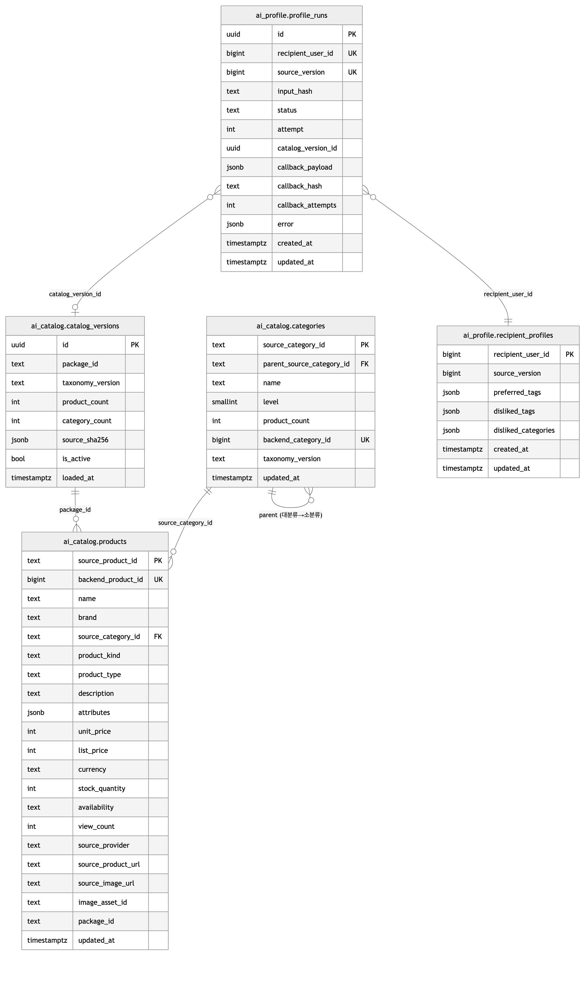
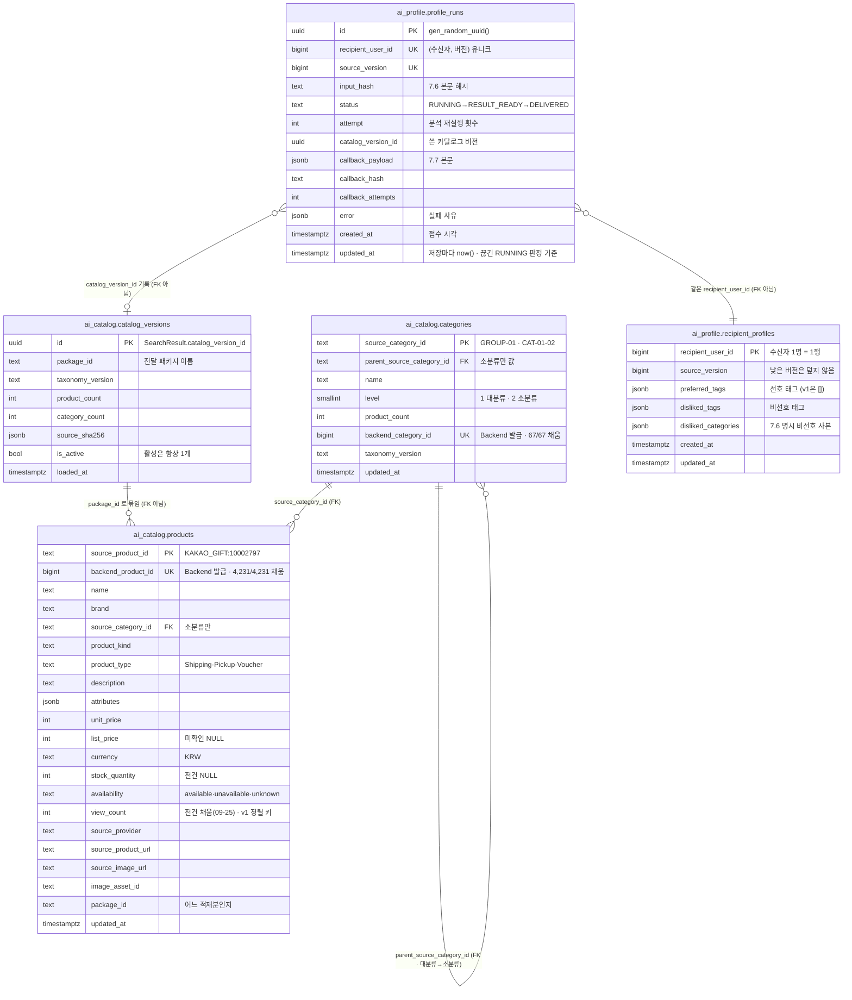
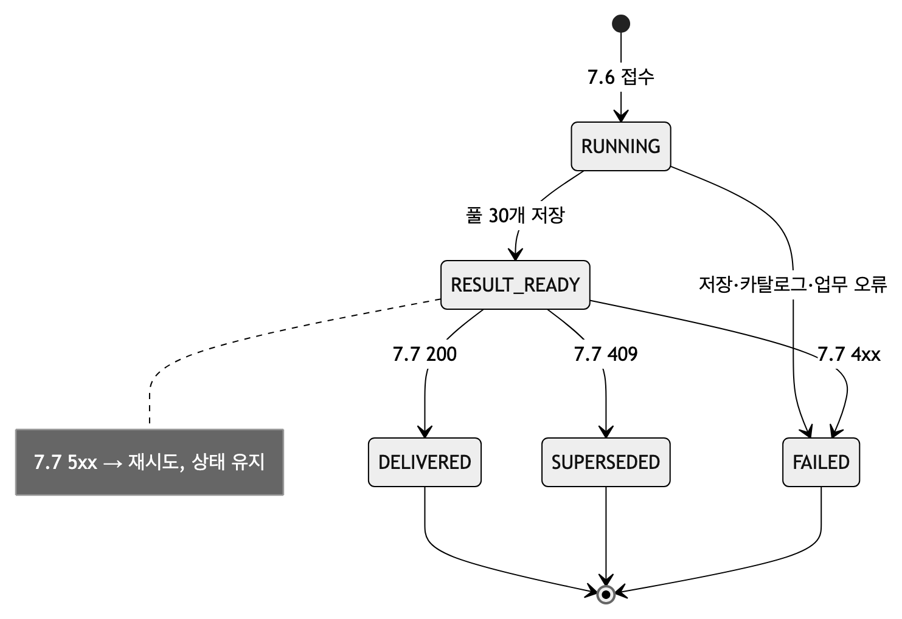
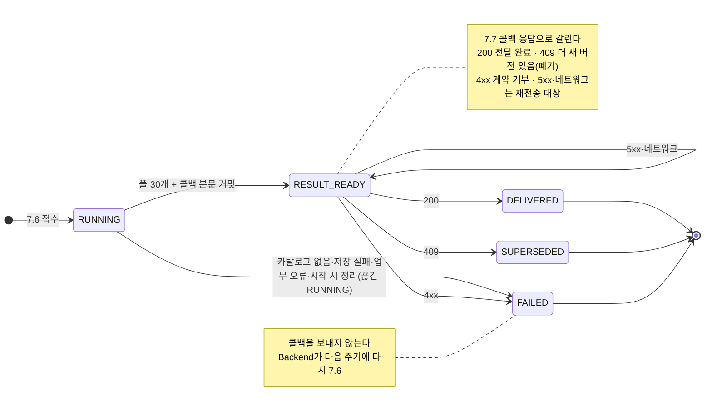
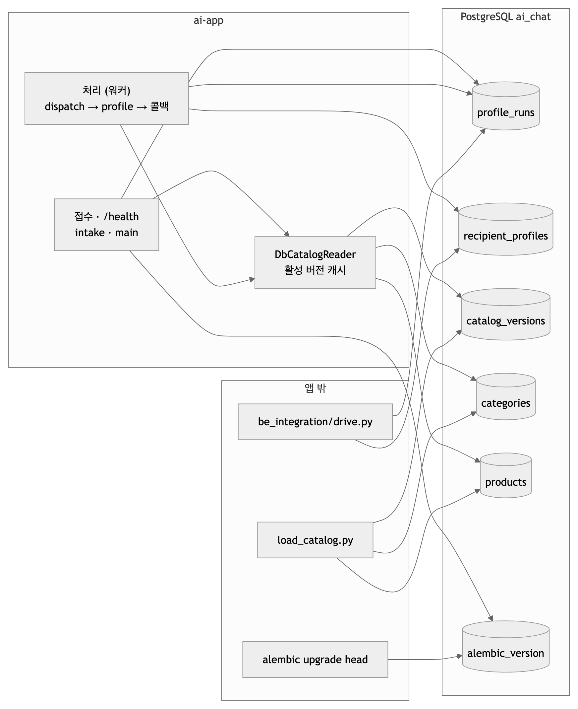
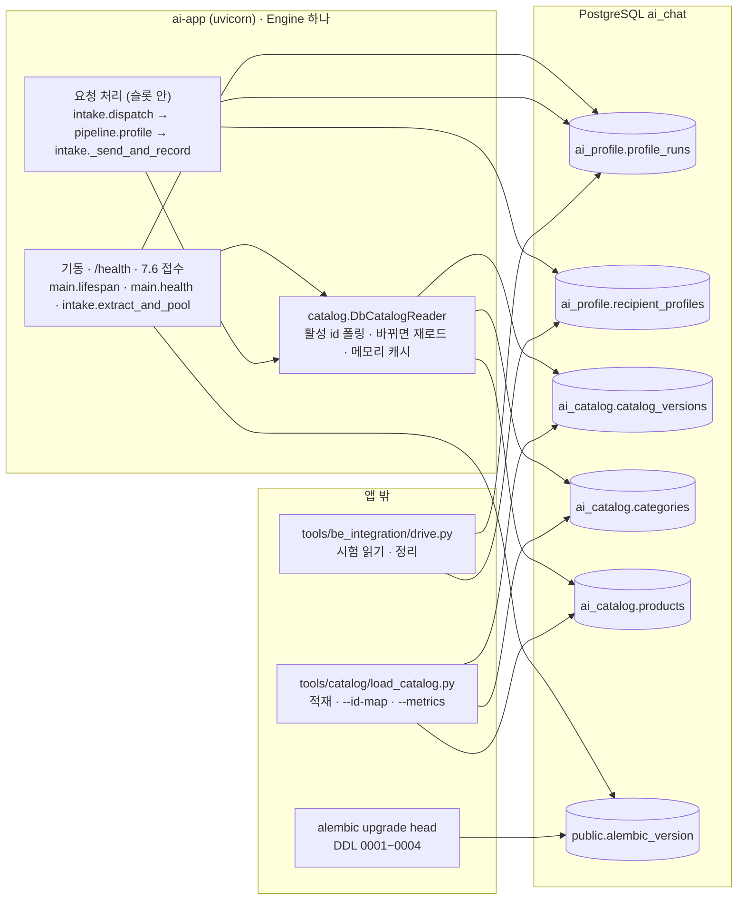

# AI DB 표 구조 (ERD) — 2026-09-28

AI 프로파일링이 **소유한 표**가 무엇이고, **왜 생겼고**, **어떤 코드가 언제 읽고 쓰는지**를 처음 보는 사람 기준으로 적은 문서다. 정본은 `alembic/versions/`의 마이그레이션 네 개이고, 여기 나오는 열 이름·제약은 그것과 같다. 코드가 요청 한 건을 처리하며 DB에 무엇을 남기는지는 [DB_전환_설명.md §3](DB_전환_설명.md)에, HTTP까지 포함한 전체 순서는 [시퀀스_전체.md](시퀀스_전체.md)에 있다.

**읽는 순서** — §0(3분 요약) → §1(그림) → §2·§3(표마다 왜 생겼나·역할·코드) → §4(코드 ↔ 표 한 장) → §5~§7(관계·제약·바깥 ID) → §8(자주 헷갈리는 것). 급하면 §0과 §8만 읽어도 된다.

| | |
|---|---|
| DB | PostgreSQL 16 + pgvector (`pgvector/pgvector:pg16`) · 데이터베이스 `ai_chat` · 계정 `ai_user` · 로컬은 compose 컨테이너 `profiling-ai-db`(5432) · 시각은 UTC |
| 스키마 | `ai_profile`(프로파일링 2표) · `ai_catalog`(카탈로그 3표) · `public.alembic_version`(마이그레이션 장부 1행) |
| 마이그레이션 | `0001` recipient_profiles · `0002` profile_runs · `0003` ai_catalog 3표 · `0004` profile_runs 열 주석 정정(동작 변경 없음) — `uv run alembic upgrade head` |
| 행 수 | 2026-09-25 확인: 상품 4,231(Backend 번호·재고·조회수 전건 채움) · 카테고리 67(대분류 10·소분류 57) · 활성 카탈로그 버전 1. `ai_profile` 두 표는 비어 있다(09-27 옛 파일-카탈로그 시험 행 14건 삭제, [문서_목록 §4 ⑤](문서_목록.md)) |
| 절 | 0 3분 요약 · 1 한눈에 · 2 `ai_profile` · 3 `ai_catalog` · 4 코드 ↔ 표 · 5 관계(FK와 FK 아닌 것) · 6 키·인덱스·제약 · 7 바깥 ID 대응 · 8 자주 헷갈리는 것 · 9 팀원 검색기 · 10 아직 없는 것 |

그림은 `docs/assets/erd/`. 이 문서의 mermaid를 고치면 `python3 docs/assets/build_be_sequences.py`를 다시 돌린다 — 그림과 본문이 한 소스다.

---

## 0. 3분 요약 — 표가 왜 다섯 개인가

이 서비스가 하는 일은 하나다. **Backend가 수신자의 비선호 카테고리를 보내면(7.6), 카탈로그에서 상품 30개를 골라 돌려준다(7.7).** 이 일을 하려면 세 가지를 기억해야 한다.

1. **어떤 상품이 있나** — 카탈로그. Backend가 준 상품 4,231건과 카테고리 67개. → `ai_catalog` 3표
2. **어떤 요청을 어디까지 처리했나** — 실행 기록. 같은 요청이 두 번 오면 다시 분석하지 말아야 하고, 콜백을 못 보냈으면 나중에 같은 내용을 다시 보내야 한다. → `ai_profile.profile_runs`
3. **이 수신자에 대해 무엇을 알아냈나** — 수신자 프로필. 태그와 비선호 사본. Backend에는 상품 번호만 보내고 태그는 AI가 갖는다. → `ai_profile.recipient_profiles`

여기에 alembic이 자동으로 만드는 장부 `public.alembic_version`(지금 어느 마이그레이션까지 적용됐나, 1행)이 더해져 다섯이다.

| 표 | 한 줄 역할 | 왜 생겼나 | 쓰는 코드 | 읽는 코드 |
|---|---|---|---|---|
| `ai_profile.recipient_profiles` | 수신자 1명 = 1행. 태그와 비선호 사본 | 09-16 합의(DR-035): 태그는 7.7로 보내지 않고 AI가 보관, Chat이 나중에 읽는다. 저장소가 없어서 `0001`(09-22) | `pipeline.profile()` 6단계 → `stores.DbRecipientProfileStore.upsert()` | 앱 경로에서는 아직 안 읽는다(v3 Chat·검색 힌트 자리). 시험·드라이버가 `get()` |
| `ai_profile.profile_runs` | 요청 (수신자, 버전) 1건 = 1행. 상태·콜백 본문·오류 | 메모리 저장으로는 재시작 후 재전송·중복 판정이 안 됐다([DB_전환_설명 §2](DB_전환_설명.md)) → `0002`(09-22) | `pipeline.profile()`(RUNNING → RESULT_READY / FAILED) · `intake._send_and_record()`(콜백 결과) · `stores.recover_stale_runs()`(기동) | `intake.dispatch()` → `get_run()`(중복 판정) · `/health` → `undelivered_count()` |
| `ai_catalog.catalog_versions` | 적재 1회 = 1행. 활성은 항상 1개 | 배포 컨테이너에는 카탈로그 파일이 없고, 교체 순간 "버전과 상품"이 한 벌이어야 해서 `0003`(09-23) | `tools/catalog/load_catalog.py` | `catalog.DbCatalogReader.active()`(호출마다 활성 버전 id 폴링) |
| `ai_catalog.categories` | 대분류 10 · 소분류 57 · Backend 번호 | 같은 `0003`. Backend 번호 자리(09-25 회신으로 채움). 09-27 "비선호는 대분류" 결정으로 부모 조인이 필요해졌다 | `load_catalog.py`(적재 · `--id-map`) | `DbCatalogReader._load()` → `ProductRecord.categoryId/parentCategoryId` |
| `ai_catalog.products` | 상품 4,231 · Backend 번호 · 재고 · 조회수 | 같은 `0003` | `load_catalog.py`(적재 · `--id-map` · `--metrics`) | `DbCatalogReader._load()` → `pipeline.build_pool()` |
| `public.alembic_version` | 적용된 마이그레이션 번호 | alembic이 만든다 | `alembic upgrade head`(compose `ai-migrate`) | `main._connect_db()`(기동 때 없으면 앱이 안 뜸) · `/health` `store.migration` |

**누가 연결하나.** 앱 `ai-app`(SQLAlchemy Engine 하나, 커넥션 풀 기본 5+10) · 마이그레이션 `ai-migrate`(alembic, 기동 전 1회) · 도구(`load_catalog.py` · `import_be_ids.py` · `fetch_export.py` · `be_integration/drive.py`, 각자 Engine을 새로 만든다) · pytest 통합 시험(같은 DB에 직접). 전부 같은 `PROFILING_DATABASE_URL` 하나를 쓴다. **Backend의 MySQL에는 AI 코드가 연결하지 않는다** — 시험 드라이버만 `docker exec mysql`로 읽는다.

**요청 한 건이 DB를 만지는 순서** (자세한 그림은 [DB_전환_설명 §3](DB_전환_설명.md))

```
7.6 접수(HTTP)   catalog.active()        활성 카탈로그 버전 id 1질의(마지막 폴링 뒤 1초 안이면 질의 없이 캐시) — 없으면 503
슬롯 안          store.run_lock()         (수신자, 버전) advisory lock — 표가 아니라 세션 잠금, AUTOCOMMIT 커넥션(BEGIN/COMMIT 없음). 아래 문장들은 전부 이 커넥션에서 각각 왕복 하나
                 store.get_run()          profile_runs 한 행 읽기 → decide(): analyze / resend / skip
                 store.save(RUNNING)      profile_runs upsert (attempt +1)
                 catalog.active()         버전 id 폴링(접수 폴링 뒤 1초 안이면 생략), 바뀌었으면 상품 전체 다시 읽기
                 store.save(RESULT_READY) profile_runs에 콜백 본문·해시 커밋 — 콜백보다 먼저
                 recipient_store.upsert() recipient_profiles 1행 (낮은 버전이면 DB가 무시)
7.7 콜백(HTTP)   store.save(최종 상태)    DELIVERED / SUPERSEDED / FAILED / RESULT_READY + callback_attempts
                 잠금 해제
```

---

## 1. 한눈에



<!-- fig: 01-전체 -->

```mermaid
erDiagram
  "ai_catalog.catalog_versions" ||--o{ "ai_catalog.products" : "package_id 로 묶임 (FK 아님)"
  "ai_catalog.categories" ||--o{ "ai_catalog.products" : "source_category_id (FK)"
  "ai_catalog.categories" ||--o{ "ai_catalog.categories" : "parent_source_category_id (FK · 대분류→소분류)"
  "ai_profile.profile_runs" }o--|| "ai_profile.recipient_profiles" : "같은 recipient_user_id (FK 아님)"
  "ai_profile.profile_runs" }o--o| "ai_catalog.catalog_versions" : "catalog_version_id 기록 (FK 아님)"

  "ai_profile.recipient_profiles" {
    bigint recipient_user_id PK "수신자 1명 = 1행"
    bigint source_version "낮은 버전은 덮지 않음"
    jsonb preferred_tags "선호 태그 (v1은 [])"
    jsonb disliked_tags "비선호 태그"
    jsonb disliked_categories "7.6 명시 비선호 사본"
    timestamptz created_at
    timestamptz updated_at
  }
  "ai_profile.profile_runs" {
    uuid id PK "gen_random_uuid()"
    bigint recipient_user_id UK "(수신자, 버전) 유니크"
    bigint source_version UK
    text input_hash "7.6 본문 해시"
    text status "RUNNING→RESULT_READY→DELIVERED"
    int attempt "분석 재실행 횟수"
    uuid catalog_version_id "쓴 카탈로그 버전"
    jsonb callback_payload "7.7 본문"
    text callback_hash
    int callback_attempts
    jsonb error "실패 사유"
    timestamptz created_at "접수 시각"
    timestamptz updated_at "저장마다 now() · 끊긴 RUNNING 판정 기준"
  }
  "ai_catalog.catalog_versions" {
    uuid id PK "SearchResult.catalog_version_id"
    text package_id "전달 패키지 이름"
    text taxonomy_version
    int product_count
    int category_count
    jsonb source_sha256
    bool is_active "활성은 항상 1개"
    timestamptz loaded_at
  }
  "ai_catalog.categories" {
    text source_category_id PK "GROUP-01 · CAT-01-02"
    text parent_source_category_id FK "소분류만 값"
    text name
    smallint level "1 대분류 · 2 소분류"
    int product_count
    bigint backend_category_id UK "Backend 발급 · 67/67 채움"
    text taxonomy_version
    timestamptz updated_at
  }
  "ai_catalog.products" {
    text source_product_id PK "KAKAO_GIFT:10002797"
    bigint backend_product_id UK "Backend 발급 · 4,231/4,231 채움"
    text name
    text brand
    text source_category_id FK "소분류만"
    text product_kind
    text product_type "Shipping·Pickup·Voucher"
    text description
    jsonb attributes
    int unit_price
    int list_price "미확인 NULL"
    text currency "KRW"
    int stock_quantity "전건 NULL"
    text availability "available·unavailable·unknown"
    int view_count "전건 채움(09-25) · v1 정렬 키"
    text source_provider
    text source_product_url
    text source_image_url
    text image_asset_id
    text package_id "어느 적재분인지"
    timestamptz updated_at
  }
```

**읽는 요령.** 실선(FK)은 두 개뿐이다 — `products → categories`, `categories → categories`. 나머지 연결은 **DB가 강제하지 않는 약속**이고, 왜 그런지는 §5에 있다. 표 이름 앞의 `ai_profile.`·`ai_catalog.`는 스키마(폴더 같은 것)다 — 한 DB 안에서 "프로파일링 것"과 "카탈로그 것"을 나눠 두었다.

---

## 2. `ai_profile` — 프로파일링이 쓰는 두 표

스키마를 만들 때 `CREATE EXTENSION vector`도 같이 켠다(0001). v1은 벡터를 쓰지 않지만 v2·v3 임베딩 표가 들어올 자리다.

두 표는 **역할이 다르다.** `profile_runs`는 "요청 한 건을 어디까지 처리했나"(요청마다 한 행, 시간 순 기록)이고, `recipient_profiles`는 "이 사람에 대해 지금 아는 것"(사람마다 한 행, 최신이 덮음)이다. 같은 수신자에게 요청이 세 번 오면 실행 기록은 세 행, 프로필은 한 행이다.

### 2.1 `recipient_profiles` — 수신자 1명 = 1행 (태그 보관)

**왜 생겼나.** 7.7 콜백으로 Backend에 보내는 것은 **상품 ID 30개뿐**이다(09-16 합의 DR-035). 분석에서 나오는 태그는 Backend가 받지 않기로 했고, 대신 AI가 갖고 있다가 Chat(v3)이 읽는다. 그 저장소가 이 표다(`0001`, 09-22). v1은 모델을 돌리지 않아 태그 열에 들어가는 것이 적지만, 표 모양은 v3까지 쓰도록 미리 잡았다.

**역할.** 수신자 한 사람의 **최신** 프로필. 요청이 여러 번 와도 한 행이고, 더 새 버전만 덮는다.

| 열 | 타입 | NULL | 기본값 | 뜻 |
|---|---|---|---|---|
| `recipient_user_id` | bigint **PK** | — | 없음(시퀀스 없음) | 수신자 사용자 ID. **Backend 정본 번호를 그대로** 쓴다 — 우리가 번호를 만들지 않는다 |
| `source_version` | bigint | NOT NULL | | 이 행을 만든 7.6 `sourceVersion`. Backend가 비선호를 바꿀 때마다 올리는 번호. 낮은 버전이 늦게 와도 덮지 않는다 |
| `preferred_tags` | jsonb | NOT NULL | `'[]'` | 선호 태그 `string[]` (≤12). v1은 항상 `[]` |
| `disliked_tags` | jsonb | NOT NULL | `'[]'` | 비선호 태그 `string[]` (≤8). v1은 7.6이 준 카테고리 **이름** |
| `disliked_categories` | jsonb | NOT NULL | `'[]'` | 7.6 명시 비선호 `[{category_id, category_name}]` — 분석 시점 사본. 키는 snake_case |
| `created_at` / `updated_at` | timestamptz | NOT NULL | `now()` | DB가 채운다 |

- **갱신 규칙이 SQL에 있다.** `INSERT … ON CONFLICT (recipient_user_id) DO UPDATE … WHERE recipient_profiles.source_version <= excluded.source_version` — 순서가 뒤집혀 들어와도 DB가 막는다(`stores.py`). 막히면 `rowcount 0`이고 경고 로그만 남는다(예외 아님).
- 인덱스: `preferred_tags`·`disliked_tags`에 **GIN** 두 개(태그로 수신자를 찾을 일에 대비. 지금 쓰는 질의는 없다).

**코드가 이 표를 어떻게 쓰나**

| 언제 | 함수 | SQL | 무엇이 바뀌나 |
|---|---|---|---|
| 분석이 끝나 콜백 본문을 커밋한 직후 | `pipeline.profile()` 6단계 → `types.from_outcome()` → `stores.DbRecipientProfileStore.upsert()` | `INSERT … ON CONFLICT … WHERE 기존 버전 <= 새 버전` | 행이 없으면 만들고, 있으면 버전이 같거나 높을 때만 덮는다 |
| 위 저장이 실패하면 | `pipeline.profile()` | — | 실행 기록을 `FAILED(STORE_FAILED)`로 되돌리고 콜백을 보내지 않는다 — "콜백은 나갔는데 프로필이 없는 상태"를 만들지 않기 위해 |
| 읽기 | `DbRecipientProfileStore.get()` | `SELECT … WHERE recipient_user_id = :rid` | **앱의 요청 경로에서는 아직 부르지 않는다.** 통합 시험과 `tools/be_integration/drive.py`가 확인용으로 읽는다. v3의 Chat·검색 힌트가 이 자리에 온다 |
| 지우기 | `DbRecipientProfileStore.delete()` | `DELETE` | 시험 정리·사용자 삭제 요청용. `drive.py`가 끝에 부른다 |

v1에서 실제로 들어가는 값 — `preferred_tags = []`, `disliked_tags = 7.6이 준 카테고리 이름들`, `disliked_categories = 7.6 본문의 비선호 목록 그대로`. 셋 다 `types.from_outcome()`이 채운다.

**직접 보기**

```sql
select recipient_user_id, source_version, disliked_tags, disliked_categories, updated_at
  from ai_profile.recipient_profiles order by updated_at desc;
```

**시험**: `tests/integration/test_db_recipient_profiles.py`(스키마 · 버전 가드) · `test_db_stores.py::test_profile_store_upsert_get_delete_and_version_guard` · `test_db_stores.py::test_pipeline_writes_both_tables`

### 2.2 `profile_runs` — 실행 1건 = 1행 (감사·재전송)

**왜 생겼나.** 09-22 이전에는 실행 기록을 메모리에 들고 있었다. 그러면 세 가지가 안 됐다([DB_전환_설명 §2](DB_전환_설명.md)) — ① 프로세스가 재시작되면 콜백을 못 보낸 결과가 사라져 분석을 다시 해야 한다 ② 같은 (수신자, 버전)이 두 번 오면 "이미 돌고 있다"를 알 수 없다 ③ Chat이 읽을 태그를 둘 곳이 없다. 그래서 `0002`(09-22)로 이 표를 만들었고, 09-23에 메모리 구현을 지웠다. `0004`(09-27)는 열 주석 두 개만 고쳤다.

**역할.** "무엇을 언제 어떤 카탈로그로 분석해서 무엇을 보냈나"의 기록. **작업 큐가 아니다** — 앱이 이 표를 폴링하지 않는다. 처리는 접수 순간 백그라운드로 시작되고, 이 표는 그 진행을 남길 뿐이다. 이 기록을 되읽는 곳은 둘이다: 중복 접수 판정(§2.2.2)과 재전송(저장해 둔 콜백 본문을 그대로 다시 보냄).

| 열 | 타입 | NULL | 기본값 | 뜻 |
|---|---|---|---|---|
| `id` | uuid **PK** | — | `gen_random_uuid()` | 실행 ID. 앱은 이 값을 쓰지 않는다 — 논리 키는 아래 두 열 |
| `recipient_user_id` | bigint | NOT NULL | | 수신자 (Backend 번호) |
| `source_version` | bigint | NOT NULL | | 7.6 `sourceVersion`. (수신자, 버전)이 유니크 |
| `input_hash` | text | NOT NULL | | 정규화한 7.6 본문의 sha256 — 같은 키에 다른 입력이 오면 값이 달라진다 |
| `status` | text | NOT NULL | | `RUNNING` · `RESULT_READY` · `DELIVERED` · `SUPERSEDED` · `FAILED` (CHECK) |
| `attempt` | integer | NOT NULL | `1` | 분석 시도 횟수. `RUNNING`으로 다시 들어올 때만 +1 |
| `catalog_version_id` | uuid | NULL | | 이 실행이 쓴 카탈로그 버전. **FK 없음**(§5) |
| `callback_payload` | jsonb | NULL | | 7.7에 보낼 본문. 재전송은 이 값을 그대로 |
| `callback_hash` | text | NULL | | 위 본문의 sha256 — 재전송이 같은 결과인지 확인 |
| `callback_attempts` | integer | NOT NULL | `0` | 7.7 시도 횟수(즉시 재시도 포함) |
| `error` | jsonb | NULL | | `{code, reason}`. 실패·미전달이 아니면 NULL. `code` 목록은 [필드표 v1 §6](BE_연동_필드표_v1.md) |
| `created_at` | timestamptz | NOT NULL | `now()` | 접수 시각 |
| `updated_at` | timestamptz | NOT NULL | `now()` | **저장할 때마다 `now()`**. 두 곳이 이 값을 기준으로 삼는다 — (1) 중복 판정: `RUNNING` 행이 `RUNNING_STALE_S`(300초)보다 오래됐으면 끊긴 실행으로 보고 새로 분석 (2) 기동 시 `recover_stale_runs`: 같은 기준으로 `FAILED`로 내림 |

**DB가 지키는 순서 규칙이 하나 있다.** `ck_profile_runs_result_has_payload` — 상태가 `RESULT_READY`·`DELIVERED`·`SUPERSEDED`면 `callback_payload`와 `callback_hash`가 **반드시 있어야 한다**. "보낼 내용 없이 보냈다고 기록된 행"을 만들 수 없다.



<!-- fig: 02-실행-상태 -->

```mermaid
stateDiagram-v2
  direction LR
  [*] --> RUNNING : 7.6 접수
  RUNNING --> RESULT_READY : 풀 30개 + 콜백 본문 커밋
  RUNNING --> FAILED : 카탈로그 없음·저장 실패·업무 오류·시작 시 정리(끊긴 RUNNING)
  RESULT_READY --> DELIVERED : 200
  RESULT_READY --> SUPERSEDED : 409
  RESULT_READY --> FAILED : 4xx
  RESULT_READY --> RESULT_READY : 5xx·네트워크
  note right of RESULT_READY
    7.7 콜백 응답으로 갈린다
    200 전달 완료 · 409 더 새 버전 있음(폐기)
    4xx 계약 거부 · 5xx·네트워크는 재전송 대상
  end note
  note left of FAILED
    콜백을 보내지 않는다
    Backend가 다음 주기에 다시 7.6
  end note
  DELIVERED --> [*]
  SUPERSEDED --> [*]
  FAILED --> [*]
```

#### 2.2.1 상태가 바뀌는 자리 — 어느 코드가 어느 열을 쓰나

| 언제 | 함수 | 상태 | 바뀌는 열 |
|---|---|---|---|
| 분석 시작 | `pipeline.profile()` 0단계 → `stores.DbProfileRunStore.save()` | `RUNNING` | 행이 없으면 INSERT. 있으면(같은 번호 재분석) `attempt + 1`, `input_hash` 갱신 |
| 활성 카탈로그 없음 · 처리 중 예외 · 저장 실패 | `pipeline._fail()` → `save()` | `FAILED` | `error = {code, reason}` — `NO_ACTIVE_CATALOG` · `PIPELINE_ERROR` · `STORE_FAILED` |
| 풀 30개 확정 | `profile()` 5단계 → `save()` | `RESULT_READY` | `callback_payload`(7.7 본문) · `callback_hash` · `catalog_version_id`. **콜백을 보내기 전에 커밋** — 보내고 나서 프로세스가 죽어도 무엇을 보냈는지 남는다 |
| 7.7 응답 | `intake._send_and_record()` → `save()` | 200 → `DELIVERED` · 409 → `SUPERSEDED` · 4xx → `FAILED` · 5xx·연결 실패 → `RESULT_READY` 유지 | `callback_attempts += 시도 수`(5xx는 0.5초·2초 뒤 최대 3회를 같은 슬롯에서 시도한 뒤 한 번 저장). 미전달·거부면 `error`에 `CALLBACK_*` 코드 |
| 재전송 | `intake.resend_callback()` → `_send_and_record()` | 위와 같음 | `stores._to_outcome()`이 `callback_payload`에서 상품 30개를 되살려 **같은 본문**으로 보낸다. 재분석 없음 |
| 앱 기동 | `main.lifespan` → `recover_stale_runs(RUNNING_STALE_S)` | `RUNNING` → `FAILED` | `updated_at`이 300초보다 오래된 RUNNING만. 다른 인스턴스가 지금 돌리는 행은 건드리지 않는다 |
| `/health` | `main._store_health()` → `undelivered_count()` | 읽기만 | `status = 'RESULT_READY'` 행 수. 0이 정상, 늘어나면 7.7 경로(Backend 5xx·네트워크)에 문제 |

`save()`는 언제나 같은 upsert 한 문장이다(`stores._RUN_UPSERT`). 잠금을 쥔 스레드에서는 잠금 커넥션(AUTOCOMMIT)에서 그 한 문장이 곧 왕복 하나이고, 잠금 밖에서는 풀에서 꺼내 트랜잭션 하나로 돈다(읽기는 AUTOCOMMIT). 결과 저장과 프로필 upsert는 문장 단위 원자성뿐이며, upsert 실패 시 실행 기록을 FAILED로 되돌리는 보상이 그 역할을 한다(09-28). 열마다 규칙이 있다 — `attempt`는 RUNNING으로 들어올 때만 +1, `catalog_version_id`·`callback_payload`·`callback_hash`는 새 값이 NULL이면 기존 값을 지킨다(`coalesce`), `callback_attempts`는 큰 쪽을 남긴다(`greatest`), `updated_at`은 항상 `now()`.

#### 2.2.2 중복 접수 판정 — 이 표를 읽어서 정한다

Backend는 콜백을 못 받으면 같은 `sourceVersion`으로 최대 2회 다시 보낸다. 그때 `intake.dispatch()`가 잠금 안에서 `get_run()`으로 그 (수신자, 버전) 행을 읽고, `decide()`가 셋 중 하나를 고른다.

| 읽은 행 | 결정 | 이유 |
|---|---|---|
| 없음 | analyze | 첫 접수 |
| `input_hash`가 다름 | analyze | 같은 번호인데 본문이 달라졌다 — 옛 결과를 보내면 틀린 답 |
| `RUNNING`, `updated_at`이 300초 이내 | skip | 지금 돌고 있다 |
| `RUNNING`, 300초 넘음 | analyze | 죽은 실행으로 보고 다시 |
| `FAILED` | analyze | 다시 시도 |
| `RESULT_READY` · `DELIVERED` · `SUPERSEDED` | resend | 저장된 본문을 그대로 재전송 |

잠금(`stores.run_lock`)은 표가 아니라 PostgreSQL **세션 advisory lock**이다. (수신자, 버전)을 해시한 64비트 키로 `pg_try_advisory_lock`을 걸고, 판정부터 콜백까지를 한 잠금 안에서 한다. 표에 남는 것은 없고, 잠금이 걸린 커넥션 하나가 끝까지 유지된다. 그 커넥션은 AUTOCOMMIT이라 트랜잭션을 열지 않는다 — `idle in transaction`도, BEGIN/COMMIT 왕복도 없다(09-28).

**직접 보기**

```sql
select recipient_user_id, source_version, status, attempt, callback_attempts,
       error->>'code' as error_code, callback_payload->'recommendedProductIds' as ids, updated_at
  from ai_profile.profile_runs order by updated_at desc limit 20;
```

**시험**: `tests/integration/test_db_stores.py`(생애주기 · attempt 증가 · run_lock 배타·해제·트랜잭션 닫힘 · recover_stale_runs · undelivered_count · 0004 주석) · `test_db_recipient_profiles.py::test_profile_runs_*` · `test_e2e_app.py`(진짜 HTTP로 500 → 200 재시도 뒤 `DELIVERED` · `callback_attempts = 2`)

---

## 3. `ai_catalog` — 상품 카탈로그 세 표 (0003)

**왜 생겼나.** 처음(09-22)에는 카탈로그가 JSON 파일이었다(`FileCatalogReader`). 파일로는 두 가지가 안 됐다 — ① 배포 컨테이너 안에는 카탈로그 파일이 없다(배포 선결 조건) ② Backend가 나중에 주는 번호(상품·카테고리 ID)·재고·조회수를 **붙여 둘 자리**가 없다. 그래서 `0003`(09-23)으로 세 표를 만들고 `tools/catalog/load_catalog.py`로 적재했다. 09-24에 `DbCatalogReader`가 생겨 앱이 DB에서 읽고(`PROFILING_CATALOG_SOURCE=db`), 09-25에 Backend 회신(xlsx 2종)으로 번호·재고·조회수를 전건 채웠다. 09-27 "비선호는 대분류" 결정으로 읽을 때 부모 카테고리까지 같이 조인한다.

**역할.** 7.7로 내보낼 상품 30개를 고르는 **재료**. 앱은 이 표를 **읽기만** 한다. 쓰는 것은 도구뿐이다.

**데이터가 들어오는 길**

```
Backend 전달 패키지(product-catalog-20260922-v1, JSON)
   → load_catalog.py                  categories · products · catalog_versions 적재, 활성 교체 (트랜잭션 하나)
Backend 회신 xlsx 2종 (09-25)
   → import_be_ids.py                 이름·가격으로 이어 jsonl 3개 (DB에 쓰지 않음, tools/catalog/returned/2026-09-25/)
   → load_catalog.py --id-map         backend_product_id · backend_category_id 채움
   → load_catalog.py --metrics        availability · view_count 채움
앱 기동·요청마다
   → DbCatalogReader.active()         활성 버전 id 폴링(1초 TTL, 그 안은 캐시) → 바뀌었으면 _load()가 상품 전체를 한 문장으로 읽어 메모리에 캐시
   → pipeline.build_pool()            비선호(대분류·소분류) 제외 · unavailable 제외 · 조회수순 30개
```

### 3.1 `catalog_versions` — 적재 1회 = 1행

| 열 | 타입 | NULL | 뜻 |
|---|---|---|---|
| `id` | uuid **PK** | — | 이 값이 그대로 `profile_runs.catalog_version_id`와 `SearchResult.catalog_version_id`가 된다 — "그때 어떤 카탈로그로 골랐나"의 기록 |
| `package_id` | text | NOT NULL | 전달 패키지 이름. **상품을 이 이름으로 묶는다**(§5) |
| `taxonomy_version` | text | NOT NULL | 분류 버전 (`2026-09-15.final57`) |
| `product_count` / `category_count` | integer | NOT NULL | 패키지가 선언한 수 — 적재 후 실제 수와 대조 |
| `source_sha256` | jsonb | NULL | 패키지 원본 파일 해시 — 같은 패키지인지 대조용 |
| `is_active` | boolean | NOT NULL | **활성은 항상 최대 1개**(부분 유니크 인덱스). 앱은 활성 행만 본다 |
| `loaded_at` | timestamptz | NOT NULL | |

- **활성 교체는 트랜잭션 하나다.** `load_catalog.load()`가 새 버전 행·카테고리·상품을 넣고, 같은 트랜잭션에서 `is_active`를 옛 행 false → 새 행 true로 바꾼다. 중간 상태가 보이지 않는다.
- **앱은 재시작 없이 따라온다.** `DbCatalogReader.active()`가 마지막 폴링 뒤 `CATALOG_POLL_TTL_S`(기본 1초)가 지났으면 `select id, package_id … where is_active`(작은 질의 1개)로 활성 id를 묻고, 지난번과 다르면 그때만 상품 전체를 다시 읽는다. TTL 안이면 묻지도 않고 메모리 캐시를 준다 — 새 적재나 활성 해제가 보이기까지 최대 1초(09-28).

### 3.2 `categories` — 2단 (대분류 10 · 소분류 57)

| 열 | 타입 | NULL | 뜻 |
|---|---|---|---|
| `source_category_id` | text **PK** | — | `GROUP-01`(대분류) · `CAT-01-02`(소분류). 수집처 문자열 ID |
| `parent_source_category_id` | text **FK→자기 자신** | NULL | 소분류만 값이 있다 — 이 열로 "이 소분류의 대분류"를 찾는다 |
| `name` | text | NOT NULL | |
| `level` | smallint | NOT NULL | `1` 대분류 · `2` 소분류 (CHECK) |
| `product_count` | integer | NOT NULL | 패키지가 선언한 수 |
| `backend_category_id` | bigint **UNIQUE** | NULL | Backend `categories.id`. **67/67 채움 (09-25 회신)** — 7.6 `dislikedCategories[].categoryId`가 이 값. Backend는 대분류(1~10)만 보낸다 |
| `taxonomy_version` | text | NOT NULL | |
| `updated_at` | timestamptz | NOT NULL `now()` | 적재·회신(`--id-map`)으로 행이 바뀐 시각 |

두 CHECK가 계층을 강제한다 — `level IN (1,2)`, 그리고 `(level = 1) = (parent IS NULL)`(대분류는 부모가 없고 소분류는 반드시 있다).

**비선호 제외가 이 표를 어떻게 쓰나.** 7.6은 비선호를 **대분류** 번호·이름으로 보낸다(09-27 결정). `DbCatalogReader._load()`가 상품마다 소분류(`c`)와 그 부모 대분류(`cp`)를 함께 읽어 `ProductRecord.categoryId/categoryName`(소분류)과 `parentCategoryId/parentCategoryName`(대분류)에 싣고, `pipeline.build_pool()`은 넷 중 하나라도 비선호와 맞으면 그 상품을 뺀다. 그래서 대분류 하나를 고르면 그 아래 소분류 상품 전체가 빠진다.

### 3.3 `products` — 4,231건

| 열 | 타입 | NULL | 뜻 |
|---|---|---|---|
| `source_product_id` | text **PK** | — | `KAKAO_GIFT:10002797`. 수집처 자연키 — 지금 우리가 가진 유일한 키 |
| `backend_product_id` | bigint **UNIQUE** | NULL | Backend `products.id`. **4,231/4,231 채움 (09-25 회신)** — 7.7로 내보내는 번호가 이것 |
| `name` · `brand` · `product_kind` · `description` | text | NOT NULL | |
| `source_category_id` | text **FK→categories** | NOT NULL | 소분류만 온다 |
| `product_type` | text | NOT NULL | `Shipping`(3,824) · `Voucher`(405) · `Pickup`(2) (CHECK) |
| `attributes` | jsonb | NOT NULL `'{}'` | 문자열 키/값. 1,446건은 빈 객체 |
| `unit_price` | integer | NOT NULL | `>= 0` (CHECK) |
| `list_price` | integer | NULL | 정가. 충돌·미확인 4건은 NULL — 할인율을 만들지 않는다 |
| `currency` | text | NOT NULL `'KRW'` | |
| `stock_quantity` | integer | NULL | 미확인. 패키지는 전건 NULL이고 회신도 수량을 따로 주지 않았다(재고는 `availability`로만 들어왔다) |
| `availability` | text | NOT NULL `'unknown'` | `available`·`unavailable`·`unknown` (CHECK). 09-25 회신으로 **전건 `available`**(BE 재고가 일률 100이었다 — 실값인지 확인 요청 중) |
| `view_count` | integer | NULL | 09-25 회신으로 **전건 채움** (102 ~ 49,989). v1 풀 정렬 키 |
| `source_provider` · `source_product_url` · `source_image_url` | text | NOT NULL | |
| `image_asset_id` | text | NULL | 변환 이미지 3종 키 |
| `package_id` | text | NOT NULL | 어느 적재분인지 — 활성 버전과 이 열로 묶인다 |
| `updated_at` | timestamptz | NOT NULL `now()` | 적재·회신(`--id-map`·`--metrics`)으로 행이 바뀐 시각. `DbCatalogReader`가 `ProductRecord.updatedAt`으로 내보낸다 |

**재적재해도 덮지 않는 열이 셋 있다** — `backend_product_id` · `availability` · `view_count`. 각각 Backend 회신(`--id-map` · `--metrics`)이 채우는 자리이므로, 패키지를 다시 넣어도 UPSERT가 건드리지 않는다(`test_load_keeps_backend_id_and_availability`).

**앱이 실제로 쓰는 열은 몇 개 안 된다.** `_load()`가 읽는 것은 `backend_product_id`(7.7로 나가는 번호) · `name` · `brand` · `description` · 소분류·대분류의 번호와 이름 · `unit_price` · `availability`(`unavailable`만 제외) · `view_count`(정렬) · `updated_at`. 나머지 열은 v3·export를 위한 보관이다.

**코드가 이 세 표를 어떻게 쓰나**

| 언제 | 코드 | SQL | 표 |
|---|---|---|---|
| 카탈로그 적재 | `tools/catalog/load_catalog.py load()` | 버전 INSERT → 카테고리 UPSERT(대분류 먼저, FK 때문) → 상품 UPSERT → `is_active` 교체. 트랜잭션 하나 | 셋 다 |
| Backend 번호 반영 | `load_catalog.py --id-map` (`apply_id_map`) | `UPDATE … SET backend_*_id = :bid WHERE source_*_id = :sid` | `categories` · `products` |
| 재고·조회수 반영 | `load_catalog.py --metrics` (`apply_metrics`) | `UPDATE products SET availability, view_count …` | `products` |
| 앱 기동 · `/health` · 7.6 접수 · 분석 1단계 | `catalog.DbCatalogReader.active()` → `_active_version()` | `SELECT id, package_id FROM catalog_versions WHERE is_active` (마지막 폴링 뒤 1초 안이면 생략) | `catalog_versions` |
| 활성 버전이 바뀌었을 때만 | `DbCatalogReader._load()` | 버전 + 상품 + 소분류 + 대분류를 **한 문장**으로 조인(`_ACTIVE_PRODUCTS`) | 셋 다 |
| 상품 30개 고르기 | `pipeline.build_pool()` | — (메모리 캐시) | — |
| 회신 대조 | `tools/catalog/fetch_export.py --compare-db` | `SELECT`(옛 팀원 표 `ai_search.products`, §9) | — |

**직접 보기**

```sql
select id, package_id, taxonomy_version, product_count, is_active, loaded_at from ai_catalog.catalog_versions;
select level, count(*), count(backend_category_id) as with_backend_id from ai_catalog.categories group by level;
select availability, count(*), count(backend_product_id) as with_backend_id, count(view_count) as with_views
  from ai_catalog.products group by availability;
```

**시험**: `tests/integration/test_db_catalog.py`(제약 · 활성 1개 · 적재 멱등 · 회신 열 보존 · `--id-map`·`--metrics`) · `test_db_catalog_reader.py`(활성 버전 읽기 · 같은 버전은 재독 안 함 · 임시 번호 → Backend 번호 · 중복 번호 거부 · 버전과 상품이 한 문장 · 부모 카테고리) · `tests/unit/test_load_catalog.py`(패키지 검증)

---

## 4. 코드 ↔ 표 한 장

**행렬로 보기** — 행은 코드(부르는 순서), 열은 표, 칸은 무엇을 하는지. 빈 칸은 안 건드린다는 뜻이다.

| 코드 | `profile_runs` | `recipient_profiles` | `catalog_versions` | `categories` | `products` | `alembic_version` |
|---|---|---|---|---|---|---|
| `main.lifespan` (기동) | UPDATE 300초 넘은 RUNNING → FAILED | | 활성 id SELECT + 전체 로드 | 로드 | 로드 | SELECT — 없으면 기동 실패 |
| `main.health` (`/health`) | COUNT RESULT_READY | | 활성 id SELECT(1초 TTL) | | | SELECT |
| `intake.extract_and_pool` (7.6 접수) | | | 활성 id SELECT(1초 TTL) — 없으면 503 | | | |
| `intake.dispatch` (슬롯 안) | advisory lock(AUTOCOMMIT) · SELECT 한 행 → decide | | | | | |
| `pipeline.profile` (분석) | UPSERT RUNNING → RESULT_READY / FAILED | UPSERT — 낮은 버전 무시 | 활성 id SELECT(1초 TTL) — 바뀌었으면 재로드 | (재로드) | (재로드) | |
| `intake._send_and_record` (7.7 뒤) | UPSERT 최종 상태 · `callback_attempts` | | | | | |
| `tools/catalog/load_catalog.py` | | | INSERT · `is_active` 교체 | UPSERT · UPDATE(`--id-map`) | UPSERT · UPDATE(`--id-map` · `--metrics`) | |
| `tools/be_integration/drive.py` (시험) | SELECT · DELETE | DELETE | | | | |
| `alembic upgrade head` (`ai-migrate`) | DDL | DDL | DDL | DDL | DDL | INSERT / UPDATE |
| pytest 통합 시험 | 읽기·쓰기·삭제 | 읽기·쓰기·삭제 | `is_active` 잠깐 토글(503 시험) | 읽기 | 읽기 | 읽기 |

굵은 규칙 셋 — **앱은 `ai_catalog`를 읽기만 한다**(쓰는 것은 `load_catalog.py`뿐), **`ai_profile`은 앱만 쓴다**(도구는 시험 정리뿐), **DDL은 alembic만 한다**. 전부 SQLAlchemy Engine 하나(`main._connect_db`)를 거치고, 카탈로그는 `DbCatalogReader`가 메모리에 캐시해 요청마다 표를 읽지 않는다(활성 id 폴링도 1초에 한 번).



<!-- fig: 03-코드-상호작용 -->

```mermaid
flowchart LR
  subgraph app["ai-app (uvicorn) · Engine 하나"]
    direction TB
    A1["기동 · /health · 7.6 접수<br/>main.lifespan · main.health · intake.extract_and_pool"]
    A2["요청 처리 (슬롯 안)<br/>intake.dispatch → pipeline.profile → intake._send_and_record"]
    C["catalog.DbCatalogReader<br/>활성 id 폴링 · 바뀌면 재로드 · 메모리 캐시"]
  end
  subgraph tools["앱 밖"]
    direction TB
    T1["tools/catalog/load_catalog.py<br/>적재 · --id-map · --metrics"]
    T3["alembic upgrade head<br/>DDL 0001~0004"]
    T2["tools/be_integration/drive.py<br/>시험 읽기 · 정리"]
  end
  subgraph db["PostgreSQL ai_chat"]
    direction TB
    R[("ai_profile.profile_runs")]
    P[("ai_profile.recipient_profiles")]
    V[("ai_catalog.catalog_versions")]
    K[("ai_catalog.categories")]
    D[("ai_catalog.products")]
    M[("public.alembic_version")]
  end
  A1 --> C
  A1 --> R
  A1 --> M
  A2 --> C
  A2 --> R
  A2 --> P
  C --> V
  C --> K
  C --> D
  T1 --> V
  T1 --> K
  T1 --> D
  T2 --> R
  T2 --> P
  T3 --> M
```

선의 뜻은 위 행렬표에 있다(그림에는 일부러 적지 않았다). `alembic`은 여섯 표 전부에 DDL을 하지만 선은 장부(`alembic_version`)에만 그었다.

---

## 5. 관계 — FK인 것과 FK가 아닌 것

FK(외래 키)는 "이 열의 값은 저 표에 반드시 있어야 한다"를 DB가 강제하는 것이다. 우리 표에서 **진짜 FK는 둘뿐이다.**

| FK | 뜻 |
|---|---|
| `products.source_category_id → categories.source_category_id` | 없는 카테고리의 상품을 넣을 수 없다 |
| `categories.parent_source_category_id → categories.source_category_id` | 없는 대분류 밑에 소분류를 달 수 없다 |

**나머지는 DB가 강제하지 않는 약속이다.** 이유가 각각 다르다.

| 연결 | 왜 FK가 아닌가 |
|---|---|
| `profile_runs.catalog_version_id → catalog_versions.id` | `0002`가 `0003`보다 먼저 생겼고, 당시 카탈로그는 파일이었다(고정 UUID). 지금은 값이 실제로 `ai_catalog.catalog_versions.id`지만 **감사 목적이라 FK를 걸지 않는다** — 옛 카탈로그 버전을 지워도 실행 기록은 남아야 한다 |
| `products.package_id → catalog_versions.package_id` | 상품은 "적재분"에 속하지 버전 행에 속하지 않는다. `DbCatalogReader`는 이 열로 **활성 버전과 상품을 한 문장에서 조인**해 읽는다(따로 읽으면 교체 순간 버전과 상품이 어긋난다) |
| `profile_runs.recipient_user_id → recipient_profiles.recipient_user_id` | 둘 다 **Backend의 사용자 번호**를 그대로 쓴다. 실행은 남았는데 프로필이 아직 없을 수 있어(FAILED) 부모–자식 관계가 아니다 |
| `*.backend_*_id → Backend` | 다른 DB(Backend MySQL)다. DB끼리 FK를 걸 수 없다. 대조는 회신 파일·`tools/catalog/fetch_export.py`로 |

> `0002`의 `catalog_version_id` 열 주석은 `ai_search.catalog_versions.id`라고 되어 있었다 — `0004`가 `ai_catalog.catalog_versions.id`로 고쳤다(동작 변경 없음).

---

## 6. 키 · 인덱스 · 제약 한눈에

| 표 | PK | 유니크 | 그 밖의 인덱스 | CHECK |
|---|---|---|---|---|
| `recipient_profiles` | `recipient_user_id` | — | GIN `preferred_tags` · GIN `disliked_tags` | — |
| `profile_runs` | `id` | `unique_profile_source (recipient_user_id, source_version)` | — | `status` 5값 · `attempt >= 1` · `callback_attempts >= 0` · **결과 상태면 payload·hash 필수** |
| `catalog_versions` | `id` | `one_active_catalog_version (is_active) WHERE is_active` — **활성 1개** | — | — |
| `categories` | `source_category_id` | `backend_category_id` | `ix_categories_parent` | `level IN (1,2)` · `(level=1) = (parent IS NULL)` |
| `products` | `source_product_id` | `backend_product_id` | `ix_products_category` · `ix_products_view_count (view_count DESC, source_product_id)` | `unit_price >= 0` · `list_price` NULL이거나 ≥0 · `product_type` 3값 · `availability` 3값 · `backend_product_id > 0` |

제약이 하는 일은 **"코드가 실수해도 DB가 막는다"** 이다. 예를 들어 같은 (수신자, 버전)을 두 번 INSERT하면 `unique_profile_source`에 걸리고(그래서 `save()`는 upsert다), 한 Backend 번호를 두 상품에 붙이면 `uq_products_backend_id`에 걸린다(그래서 `import_be_ids.py`가 미리 실패시킨다).

---

## 7. 바깥과의 ID 대응

| 우리 열 | 바깥 | 지금 상태 |
|---|---|---|
| `recipient_profiles.recipient_user_id` · `profile_runs.recipient_user_id` | Backend `users.id` | 그대로 쓴다 — 변환 없음 |
| `products.backend_product_id` | Backend `products.id` (DB 적재 시 자동 발급) | **4,231 / 4,231 (09-25 회신 반영)** — 7.7로 이 번호를 보낸다 |
| `categories.backend_category_id` | Backend `categories.id` | **67 / 67 (09-25 회신 반영)** — 7.6 `dislikedCategories[].categoryId`가 이 값(대분류 1~10) |
| `products.source_product_id` | 수집처(`KAKAO_GIFT:…`) · 팀원 검색기의 상품 ID | 같은 체계 |
| `catalog_versions.id` | — (AI 내부) | 7.7에는 나가지 않는다. 감사용 |

번호가 비어 있는 동안에는 `DbCatalogReader`가 수집처 ID의 숫자부를 **임시 번호**로 쓰고 `/health`에 `provisional_ids: true`를 띄운다. 09-25 회신을 반영한 뒤로는 전건 채워져 그 표시가 나오지 않는다.

---

## 8. 자주 헷갈리는 것

**`profile_runs`는 작업 큐인가?** 아니다. 앱이 이 표를 폴링해서 일을 꺼내지 않는다. 7.6이 오면 그 자리에서 백그라운드 처리가 시작되고, 이 표는 진행을 기록할 뿐이다. 되읽는 곳은 중복 판정과 재전송 둘이다(§2.2).

**수신자 번호와 상품 번호는 왜 우리가 만들지 않나?** 둘 다 Backend가 정본이다. 7.6이 보내는 `recipientUserId`·`categoryId`, 7.7로 돌려주는 `recommendedProductIds`는 전부 Backend 번호라야 Backend가 알아듣는다. 그래서 `recipient_user_id`는 시퀀스가 없고, `products.backend_product_id`가 없는 상품은 7.7로 나갈 수 없다.

**`sourceVersion`은 누가 올리나?** Backend다. 비선호가 바뀔 때마다 Backend가 번호를 올려 7.6을 보낸다. 우리는 받은 번호를 그대로 기록한다. 같은 번호가 다시 오면 재전송(재분석 없음), 새 번호가 오면 새 실행 행이다.

**왜 콜백 본문을 DB에 저장하나?** 콜백을 못 보냈을 때 **같은 본문**을 다시 보내기 위해서다. 다시 분석하면 카탈로그가 바뀌어 다른 30개가 나올 수 있다. 그래서 콜백을 보내기 전에 본문을 먼저 커밋하고, DB CHECK가 "본문 없는 결과 상태"를 막는다.

**왜 FK가 거의 없나?** §5. 감사 기록은 참조 대상이 지워져도 남아야 하고, 상품은 버전 행이 아니라 적재분에 속하며, 수신자 번호는 남의 번호다.

**`updated_at`이 왜 중요한가?** RUNNING 행이 300초(`RUNNING_STALE_S`) 넘게 그대로면 "프로세스가 죽어 남은 행"으로 본다. 중복 판정은 그 행을 무시하고 다시 분석하고, 기동 시 정리는 FAILED로 내린다. 이 값은 Backend의 PENDING 타임아웃(10분)보다 짧아야 Backend 재전송이 의미를 갖는다.

**카탈로그를 새로 넣으면 앱을 재시작해야 하나?** 아니다. `DbCatalogReader`가 부를 때마다 활성 버전 id를 묻고, 바뀌었을 때만 다시 읽는다. `load_catalog.py`가 활성을 교체하면 다음 요청부터 새 카탈로그다.

**`availability = unknown`은 품절인가?** 아니다. "재고 정보가 없다"이다. v1 풀은 `unavailable`만 뺀다. 실제 재고는 Backend가 조회 때 최종 판단한다.

**통합 시험이 DB를 건드리나?** 그렇다. 같은 `PROFILING_DATABASE_URL`에 직접 쓰고 지운다. 503 시험은 활성 카탈로그를 잠깐 `is_active = false`로 바꿨다 되돌린다. DB에 연결이 안 되면 skip이다. 개발 데이터와 나누고 싶으면 시험 때 `PROFILING_DATABASE_URL`을 다른 DB로 준다.

**표를 바꾸고 싶으면?** `alembic/versions/`에 새 리비전을 만든다(다음 번호는 `0005`). 열 주석 하나도 마이그레이션으로 한다(`0004`가 그 예). 마이그레이션은 되돌릴 수 있게 작은 단위로 쓴다.

**시각은 왜 UTC인가?** 컨테이너가 `TZ=UTC`이고 모든 시각 열은 DB의 `now()`가 채운다. RUNNING 정리·중복 판정의 시간 비교가 전부 DB 시각 기준이라, 앱 서버 시각이 틀려도 영향이 없다.

**지금 상태를 어디서 보나?** `curl :8000/health` — `catalog.active`·`catalog.version`·`catalog.products`(활성 카탈로그), `store.connected`·`store.migration`(지금 `0004`)·`store.undelivered`(RESULT_READY 행 수). 표를 직접 보려면 각 절의 "직접 보기" SQL.

---

## 9. 팀원 검색기 표 (참고 — 소관이 다름)

**우리 DB에는 `ai_search` 스키마가 없다.** 이름이 남은 이유는 둘이다 — 팀원의 옛 워크벤치(`workbench/dylan/schema.sql`)가 같은 DB 이름 `ai_chat`에 아래 표를 만들도록 되어 있었고, 우리 초기 코드가 그 이름을 참조했다. 지금 팀원 검색 서비스(`product-search/`)는 **DB를 쓰지 않는다**(파일 스냅샷 + 세대 디렉터리).

| 표 | 열 | 메모 |
|---|---|---|
| `ai_search.products` | `product_id TEXT PK` · `name` · `brand` · `category_id TEXT` · `price_krw INTEGER CHECK > 0` · `description` | 옛 워크벤치. 우리 `ai_catalog.products`와 **별개** — 열이 6개뿐이고 재고·조회수·이미지가 없다 |

우리 코드에 남은 참조는 셋뿐이고 정리 예정이다 — `types.py`의 `SearchResult.catalog_version_id` 주석, `tools/catalog/fetch_export.py --compare-db`, 그 시험(`tests/integration/test_fetch_export_db.py`, 자기 스키마를 만들고 끝에 지운다). 동결 설계서의 `ai_search` pgvector 표(v3 검색 함수용)는 "검색을 함수로 할지 서비스로 할지" 팀 결정 뒤에 다룬다.

---

## 10. 아직 없는 것

| 무엇 | 언제 | 어디 |
|---|---|---|
| `recipient_profiles`에 `profile_run_id`(FK) · `axes` · `recommended_product_ids` · `catalog_version_id` · `prompt_version` · `validator_version` | v3 — 설계서 §1.7의 나머지 열. `RecipientProfile` 객체에는 이미 있고 `upsert()`가 그때 함께 쓴다 | 새 마이그레이션 `0005` |
| 임베딩 표 (pgvector) | v2·v3 | `vector` 확장은 `0001`에서 이미 켜 두었다 |
| `backend_*_id`·`availability`·`view_count` **다시** 채우기 | 다음 Backend 회신 때 | 09-25 회신은 반영 끝(xlsx → `--id-map`·`--metrics`). 7.9 export 자동 경로 `tools/catalog/fetch_export.py`는 아직 안 씀 |
| `recipient_profiles`를 앱이 읽는 경로 | v3 Chat · 검색 힌트 | 지금은 쓰기만 한다(§2.1) |

마이그레이션 번호는 `0004`까지 썼다. **다음은 `0005`다** — `0003`은 카탈로그, `0004`는 열 주석 정정이 쓰고 있다.
