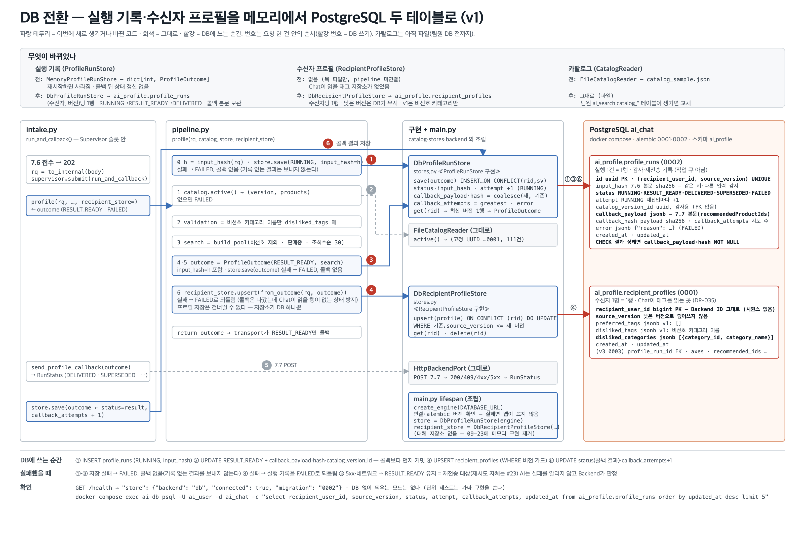

# DB 전환 설명 — 실행 기록·수신자 프로필을 메모리에서 PostgreSQL로 (v1, 2026-09-22)



> 그림 원본: `assets/build_db_transition.py` → `db-transition.svg` (PNG는 Chrome 헤드리스). 코드가 바뀌면 스크립트를 고치고 다시 만든다.
>
> **2026-09-23 갱신** — 이 문서가 설명하는 "전환"이 끝나, 메모리 구현(`MemoryProfileRunStore`·`MemoryRecipientProfileStore`)과 `PROFILING_STORE` 설정을 **지웠다**. 저장소는 PostgreSQL 하나뿐이고 DB 없이 앱을 띄우는 모드는 없다. 아래에서 "메모리"는 전환 이전(09-21)의 모습을 가리키는 설명이다.

## 1. 한 줄 요약

7.6 요청 한 건이 남기는 기록이 **프로세스 메모리(dict)** 에서 **PostgreSQL 두 테이블**로 옮겨졌다. 업무 코드(`pipeline.py`)의 순서는 그대로이고, "저장한다"는 자리에 꽂히는 구현(adapter)이 바뀌었으며, 저장하는 시점이 두 번(접수 때·콜백 뒤) 늘었다.

| | 전 | 후 |
|---|---|---|
| 실행 기록 (`ProfileRunStore`) | `MemoryProfileRunStore` — `dict[int, ProfileOutcome]`. 재시작하면 사라짐. 콜백 뒤 상태 갱신 없음 | `DbProfileRunStore` → `ai_profile.profile_runs`. (수신자, 버전)당 1행. RUNNING → RESULT_READY → DELIVERED/SUPERSEDED/FAILED. 콜백 본문 보관 |
| 수신자 프로필 (`RecipientProfileStore`) | 없음 (목 파일만, pipeline 미연결) | `DbRecipientProfileStore` → `ai_profile.recipient_profiles`. 수신자당 1행. 낮은 버전은 DB가 무시 |
| 카탈로그 (`CatalogReader`) | `FileCatalogReader` (파일) | **그대로** — 팀원의 `ai_search.catalog_*` 테이블이 생기면 교체 |

## 2. 왜 바꿨나

설계(3단계 구현 상세 §10.2·§16.1·§16.4, 담당파트 설계서 §1.7)가 두 테이블을 요구한다. 메모리로는 다음 세 가지가 안 된다.

1. **재시작 후 재전송** — 콜백을 못 보낸 RESULT_READY 결과가 사라져 모델을 다시 돌려야 한다. 설계는 "같은 payload를 재전송, 새 분석으로 대체하지 않는다".
2. **중복 접수 판정** — 같은 (수신자, 버전)이 두 번 오면 "RUNNING이면 새 분석 없음"을 알 방법이 없다.
3. **Chat이 읽을 태그** — 태그는 Backend로 보내지 않고 AI가 보관한다(DR-035). 그 저장소가 없었다.

## 3. 요청 한 건이 DB에 남기는 것 (그림의 번호)

| # | 어디서 | 무엇을 | SQL |
|---|---|---|---|
| ① | `pipeline.profile()` 시작 | 실행 기록 **RUNNING** + `input_hash` | `INSERT profile_runs … ON CONFLICT (rid, sv) DO UPDATE` (재실행이면 `attempt+1`) |
| ② | `pipeline.profile()` | 카탈로그 읽기 | (파일 — DB 아님) |
| ③ | `pipeline.profile()` 결과 | **RESULT_READY** + `callback_payload`(7.7 본문) + `callback_hash` + `catalog_version_id` | 같은 UPSERT. **콜백보다 먼저 커밋** (§16.4) |
| ④ | `pipeline.profile()` 결과 직후 | 수신자 프로필 upsert — v1은 `source_version` + `disliked_categories` (`from_outcome()`) | `INSERT recipient_profiles … ON CONFLICT (rid) DO UPDATE … WHERE 기존.source_version <= 새.source_version` |
| ⑤ | `run_and_callback()` | 7.7 POST | (HTTP — DB 아님) |
| ⑥ | `run_and_callback()` 콜백 뒤 | **DELIVERED / SUPERSEDED / FAILED / RESULT_READY** + `callback_attempts+1` | 같은 UPSERT. payload는 `coalesce`로 유지 |

그래서 정상 흐름이 끝나면 `profile_runs`에 1행(status=DELIVERED, attempt=1, callback_attempts=1, payload 있음), `recipient_profiles`에 1행(그 수신자의 최신 버전)이 남는다.

### 실패했을 때

| 상황 | 결과 |
|---|---|
| ① 저장 실패 (DB 없음) | FAILED 반환, **아무 행도 없음**, 콜백 없음 — 기록 없는 결과를 Backend에 보내지 않는다 |
| ③ 저장 실패 | FAILED, 콜백 없음 |
| ④ 저장 실패 | 실행 기록을 FAILED로 되돌림, 콜백 없음 — 콜백은 나갔는데 Chat이 읽을 행이 없는 상태를 만들지 않기 위해 |
| ⑤ 콜백 5xx·네트워크 | 행은 RESULT_READY로 남음 = "결과 있음·미전달" → 재전송 대상 (재시도 자체는 #23) |
| ⑤ 콜백 409 | SUPERSEDED (Backend가 더 새 버전을 가짐, 폐기) |
| ⑤ 콜백 4xx | FAILED (재시도 없음) |

AI는 어떤 경우에도 실패를 7.6·7.7로 알리지 않는다(Backend가 PENDING 지속 시간으로 판정).

## 4. 파일별로 무엇이 바뀌었나

### 새로 생김

| 파일 | 역할 |
|---|---|
| `stores.py` | `DbProfileRunStore(engine)` — `ports.ProfileRunStore` 구현. `save()`는 상태에 관계없이 UPSERT 한 문장, `get()`은 그 수신자의 최신 버전 1행 → `ProfileOutcome`. `payload_hash()`, `delete_recipient()`(시험·삭제 요청용) |
| `stores.py` | `DbRecipientProfileStore(engine)` — `ports.RecipientProfileStore` 구현. `upsert()`(버전 가드, 무시되면 warning 로그) · `get()` · `delete()` |
| `tests/integration/test_db_stores.py` | 두 어댑터 + `pipeline.profile()` → 두 테이블 + 앱 전체(7.6 → DB에 DELIVERED). 8개 |
| `tests/integration/test_e2e_app.py` | 앱을 띄워 7.6 → 202 → 7.7 → 두 테이블까지. 3개 (09-23에 `tests/unit`에서 옮김 — 앱 lifespan이 DB에 붙으므로) |
| `tests/unit/*` | 가짜 구현으로 돈다 — DB도 네트워크도 쓰지 않는다 |
| `docs/assets/build_db_transition.py` | 이 문서의 그림 |

### 바뀜

| 파일 | 변경 | 이유 |
|---|---|---|
| `types.py` `ProfileOutcome` | `input_hash: str \| None`, `callback_attempts: int = 0` 추가 | `profile_runs` 행과 1:1이 되도록. 상태가 바뀔 때마다 `model_copy(update=…)`로 같은 객체를 다시 `save()` |
| `pipeline.py` | `input_hash(rq)` 신설 · 시작 시 `store.save(RUNNING)` · 끝에 `recipient_store.upsert(from_outcome(rq, outcome))` · `profile(…, recipient_store=None)` 인자 | 그림 ①·④ |
| `types.py` | `from_outcome` · `should_replace` · `cap_tags` 채움. 필드 `explicit_disliked_category_ids: list[int]` → `disliked_categories: list[DislikedCategory]` | ④에 필요. 필드는 테이블 열(`disliked_categories`, id+이름)과 같은 이름·모양으로 |
| `intake.py` | `get_recipient_store` 의존성 · `run_and_callback(…, recipient_store)` · 콜백 뒤 `store.save(status=result, callback_attempts+1)` | 그림 ⑥ (이전 코드의 "DB adapter가 생기면"이라던 자리) |
| `backend.py` | `to_callback()`을 `callback_body()`(본문만) + 상태 검사로 분리 | DB adapter가 저장할 payload와 전송할 payload가 **같은 함수**에서 나오게 — 재전송이 "같은 payload"가 되는 근거 |
| `settings.py` | ~~`STORE: "db" \| "memory"`~~ | 09-22에 넣었다가 **09-23에 제거** — 저장소가 PostgreSQL 하나가 되면서 고를 것이 없어졌다 |
| `main.py` | `_connect_db()`: engine 생성 · `select 1` · `alembic_version` 확인, 실패면 **RuntimeError로 앱이 뜨지 않음** · `app.state.recipient_store` · `/health`에 `store` 항목 | 조용히 메모리로 내려가면 "콜백은 나가는데 기록이 없는" 상태가 되므로 실패를 드러낸다 |
| `alembic/versions/0001` 주석 · 통합 테스트 | `disliked_categories` JSON 키를 `{category_id, category_name}`(snake_case)로 | 아래 §6 |
| `README.md` · `이름_대조표.md` · `.env.example` | 반영 | |

### 그대로

`ports.py`(포트 모양 그대로 — 그래서 구현만 갈아끼워졌다), `schemas.py`, `catalog.py`, `supervisor.py`, `tools/fake_backend`.

## 5. 실행과 확인

```bash
docker compose up -d && uv run alembic upgrade head
```

```bash
uv run uvicorn profiling.main:app --port 8000 --reload
```

시작 로그에 `DB 연결 localhost:5432/ai_chat migration=0002`가 보여야 한다. DB가 꺼져 있으면 `RuntimeError: DB 연결 실패 … → docker compose up -d && uv run alembic upgrade head`로 멈춘다 — 대신 쓸 저장소는 없다.

상태:

```bash
curl -s localhost:8000/health
```

`"store": {"backend": "db", "connected": true, "migration": "0002"}`.

콘솔(`localhost:8081/console`)에서 7.6을 보낸 뒤:

```bash
docker compose exec ai-db psql -U ai_user -d ai_chat -c "select recipient_user_id, source_version, status, attempt, callback_attempts, updated_at from ai_profile.profile_runs order by updated_at desc limit 5" -c "select recipient_user_id, source_version, disliked_categories, updated_at from ai_profile.recipient_profiles order by updated_at desc limit 5"
```

같은 수신자로 sourceVersion을 올려 다시 보내면 `profile_runs`에 행이 하나 **추가**되고(버전마다 1행), `recipient_profiles`는 그 수신자의 행이 **갱신**된다(수신자당 1행). 콘솔에서 sourceVersion을 낮춰 보내면 `profile_runs`에는 그 버전 행이 생기지만 `recipient_profiles`는 바뀌지 않는다(로그에 "기존 행보다 낮아 무시").

테스트:

```bash
uv run pytest -q
```

DB가 켜져 있으면 64 passed / 3 skipped(v3 stub), 꺼져 있으면 통합 13개가 skip되고 단위 51개만 돈다.

## 6. 결정한 것과 남은 것

**결정**

- **JSONB 안의 키는 snake_case** (`{"category_id": …, "category_name": …}`). DB는 파이썬 쪽 저장소라 HTTP 경계(camelCase)가 아니고, 내부 모델을 `model_dump()`로 그대로 넣어 변환 함수를 하나 더 만들지 않는다. 마이그레이션 0001 주석의 `{categoryId, categoryName}`은 이 규칙으로 고쳤다.
- `catalog_version_id`는 **UUID**(팀원 `catalog_versions.id`와 같은 타입). 파일 카탈로그는 고정값 `00000000-0000-0000-0000-000000000001`.
- `profile_runs.status`는 **text + CHECK**(PG enum 아님) — 상태 목록이 §10.5 합의로 바뀔 수 있어서.
- 실행 기록과 수신자 프로필은 **트랜잭션이 따로**다(어댑터가 둘). 설계는 "RESULT_READY 커밋 트랜잭션에서 upsert"라고 하지만, v1에서는 ④ 실패 시 실행 기록을 FAILED로 되돌리는 것으로 같은 효과를 낸다. 한 트랜잭션으로 묶는 것은 어댑터를 합칠 때(v3) 다시 본다.
- DB 연결 실패는 **앱 시작 실패**. 대체 저장소가 없으므로 조용히 내려갈 곳도 없다(09-23에 메모리 구현을 지웠다).

**남은 것 (v1 범위)**

- 접수 단계 중복 판정 — `store.get()`으로 "RUNNING이면 새 분석 없음 · 결과 있으면 재전송만"(§10.2). 지금은 같은 (수신자, 버전)이 다시 오면 다시 돌린다(`attempt+1`). (#23)
- 콜백 재시도(5xx 최대 3회)와 재시작 복구(RUNNING → FAILED 정리). (#23)

**v3로 미룬 것**

- 마이그레이션 0003 — `recipient_profiles`에 `profile_run_id` FK · `axes` · `recommended_product_ids` · `catalog_version_id` · `prompt/validator_version`. `DbRecipientProfileStore.upsert()`는 그때 그 열들을 함께 쓴다(객체에는 이미 들어 있음).
- `merge_explicit_dislikes` · `to_search_hint`.
