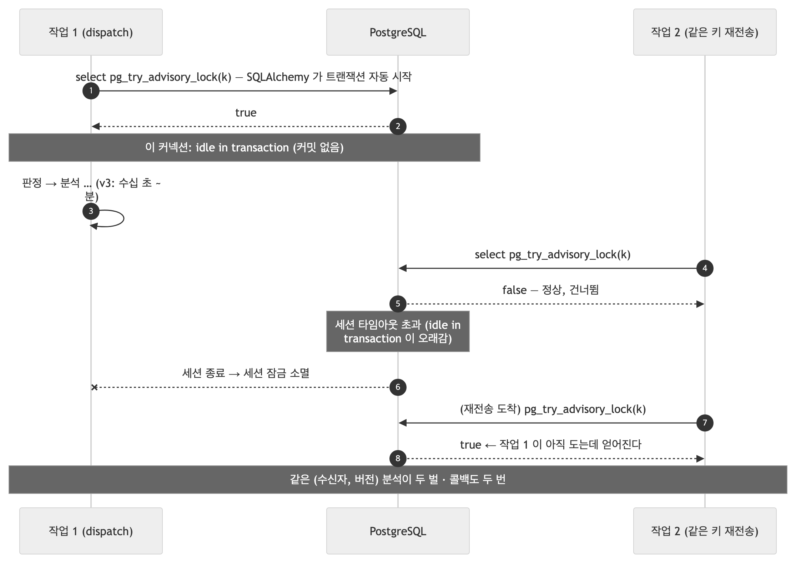
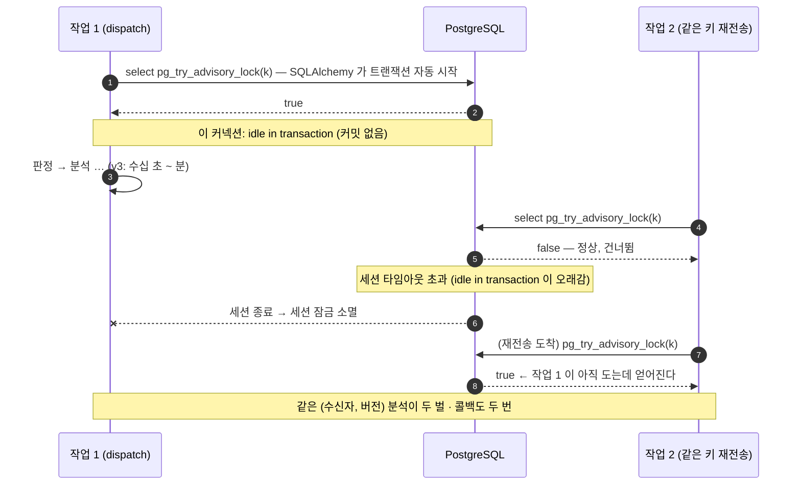
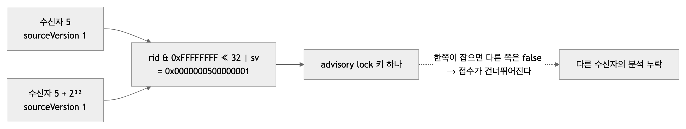
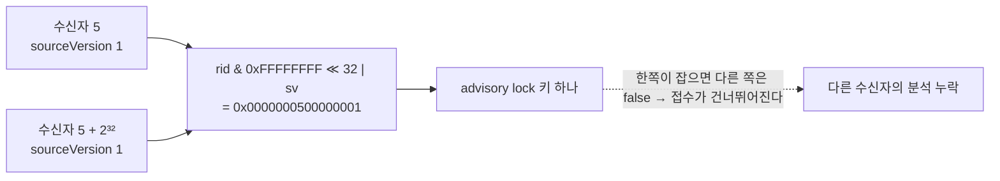
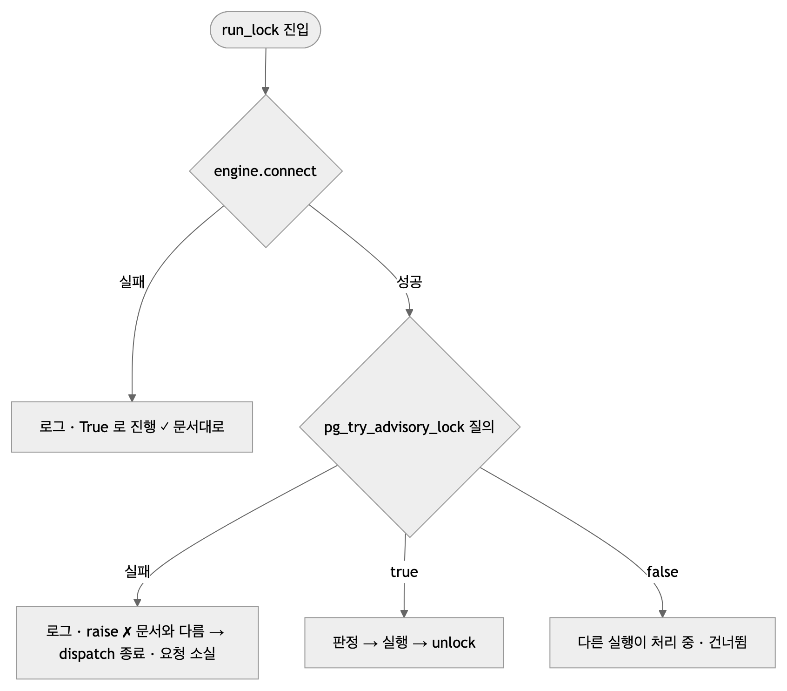
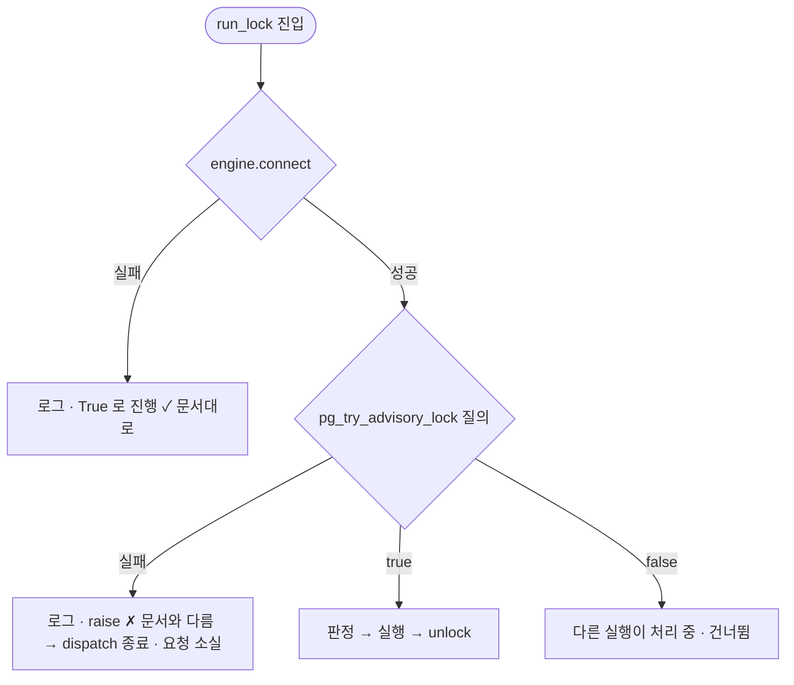

# 이슈 2026-09-27 16:33 — `run_lock`(advisory lock) 주변 결함 3건

| | |
|---|---|
| 발견 시점 | 2026-09-27 16:33 — 모델 교체 후 전체 코드 재검토 중 |
| 발견 방법 | `stores.run_lock` 을 실제 DB 에서 돌리며 `pg_stat_activity` 와 키 함수를 직접 측정 |
| 대상 코드 | `src/profiling/stores.py` (`run_lock` · `_lock_key`) · 커밋 `25c1883` 에서 들어옴 |
| 상태 | **해결 · 커밋 `d50b1b8`** (2026-09-27) — A 커밋 한 줄 · B sha256 키 · C 실패 시 진행 + 해제 실패 커넥션 폐기. 시험 5개 추가(155 passed) |
| 심각도 | A 🔴 (v3에서 사고) · B 🟡 (잠재) · C 🟡 (문서-동작 불일치) |

세 문제는 같은 함수에서 같은 시각에 발견됐다. 아래 각 절은 **그대로 이슈 하나로 옮길 수 있게** 같은 머리말(문제 이름·정의·원인·연관 기능·그림·예상 해결책)로 썼다.

---

## A. 잠금 커넥션이 작업 내내 트랜잭션을 열어둔다

### 문제 이름
`run_lock` 이 `idle in transaction` 상태로 작업 전체를 감싼다

### 문제 정의
`DbProfileRunStore.run_lock()` 은 advisory lock 을 얻은 커넥션을 `yield` 동안 들고 있는다. 그런데 SQLAlchemy 2.0 은 `conn.execute()` 첫 호출에 트랜잭션을 **자동으로 열고(autobegin)** 닫지 않으므로, 잠금 획득 질의 한 번이 트랜잭션을 열고 그 상태로 판정·분석·콜백이 끝날 때까지 남는다. `pg_stat_activity` 로 확인한 실제 상태:

```
state: idle in transaction | query: select pg_try_advisory_lock($1)
```

### 문제 원인
- 잠금이 **세션 단위**(`pg_try_advisory_lock`)라 트랜잭션이 필요 없는데, 자동으로 열린 트랜잭션을 **끝내 주지 않았다.** 한 줄(`conn.commit()`)이 빠진 것이다.
- v1 은 한 작업이 밀리초라 눈에 띄지 않았다. 통합 시험도 짧은 작업만 돌려 잡히지 않았다.

### 연관된 기능
- **접수 단계 중복 판정** (`intake.dispatch`) — 이 잠금이 "같은 (수신자, 버전) 동시 접수 시 분석이 두 벌 도는 것"을 막는 유일한 장치다.
- **v3 (모델 단계)** — 분석이 수십 초~분으로 길어지는 순간 문제가 실체가 된다:
  - 열린 트랜잭션이 스냅샷을 잡아 **VACUUM 이 죽은 행을 못 치운다** (`profile_runs` 가 UPSERT 위주라 영향이 크다).
  - 관리형 PostgreSQL 에 흔한 `idle_in_transaction_session_timeout` 이 켜져 있으면 **세션이 끊기고 잠금이 사라진다** → 그 순간 같은 키의 두 번째 접수가 잠금을 얻어 **분석이 두 벌** 돈다. 즉 이 잠금이 막으려던 바로 그 사고가 난다.

### 문제 그림



<!-- fig: A-idle-in-transaction -->


### 예상 해결책
1. 잠금을 얻은 **직후 `conn.commit()`** 한 줄. 세션 잠금은 커밋 뒤에도 유지된다 — 커넥션 두 개로 실측했다(A 가 commit 한 뒤 B 의 try → `false`, A 가 unlock 한 뒤 → `true`).
2. 시험: 잠금을 들고 있는 동안 `pg_stat_activity.state` 가 `idle`(≠ `idle in transaction`)인지 확인하는 통합 시험 1개.
3. 문서: `stores.py` 독스트링과 BE 전달본 §6 의 "판정부터 콜백까지가 한 잠금 안" 문장을 그대로 두되, 그 근거(세션 잠금 + 트랜잭션 없음)를 한 줄 덧붙인다.

---

## B. 잠금 키가 수신자 ID 를 32비트로 자른다

### 문제 이름
`_lock_key` 가 서로 다른 수신자에게 같은 키를 줄 수 있다

### 문제 정의
`_lock_key(rid, sv) = (rid & 0xFFFFFFFF) << 32 | (sv & 0xFFFFFFFF)`. `rid` 가 2³² 이상이면 아랫 32비트만 남는다. 실측:

```
_lock_key(5, 1) == _lock_key(5 + 2**32, 1)   → True
```

수신자 5 와 수신자 4,294,967,301 이 **서로의 접수를 막는다.**

### 문제 원인
64비트 키 하나에 두 값을 32비트씩 나눠 담으면서 "수신자 ID 는 32비트 안"이라는 가정을 **조용히** 넣었다. `recipient_user_id` 는 DB 에서 `BIGINT` 라 가정이 스키마와 맞지 않는다.

### 연관된 기능
- 접수 단계 중복 판정 (`intake.dispatch` → `store.run_lock`).
- 지금 값(1~수천)에서는 **절대 나지 않는다.** 그러나 나면 원인을 찾기 매우 어렵다 — "어떤 수신자의 요청이 이유 없이 건너뛰어진다"로만 보인다.

### 문제 그림



<!-- fig: B-lock-key-truncation -->


### 예상 해결책
1. `(rid, sv)` 를 **해시**해 64비트로 접는다 — 예: `sha256(f"{rid}:{sv}")` 앞 8바이트를 부호 있는 정수로. 절단 가정 자체를 없앤다.
2. 시험: `_lock_key(5, 1) != _lock_key(5 + 2**32, 1)` 단위 시험 1개.

---

## C. `run_lock` 의 문서와 동작이 어긋난다

### 문제 이름
"잠금을 못 걸면 진행한다"는 약속이 절반만 지켜진다

### 문제 정의
독스트링: *"DB 오류로 잠금을 시도조차 못 하면 **True 로 진행한다**"*. 실제 코드는 두 갈래다.

| 실패 지점 | 동작 |
|---|---|
| `engine.connect()` 실패 | 로그 + **True 로 진행** (문서대로) |
| `select pg_try_advisory_lock` 실패 | 로그 + **`raise`** (문서와 다름) |

### 문제 원인
커넥션 획득과 잠금 질의를 서로 다른 `try` 로 감싸면서 두 번째 갈래의 정책을 정하지 않았다. 독스트링은 첫 갈래만 보고 썼다.

### 연관된 기능
- 접수 단계 중복 판정. 잠금 질의가 실패하면 `dispatch` 가 예외로 끝나 **그 요청은 조용히 사라진다**(202 는 이미 돌려줬다). Backend 재전송으로 복구는 되지만, 문서를 믿은 사람은 "진행했을 것"이라 판단한다.
- 어느 쪽이든 방어 가능하다 — 문제는 **둘 중 하나로 정해 문서와 코드를 맞추는 것**이다.

### 문제 그림



<!-- fig: C-doc-vs-behaviour -->


### 예상 해결책
두 정책 중 하나를 고른다. **권장은 ①.**

1. **잠금 질의 실패도 True 로 진행** — 잠금은 "중복을 줄이는 장치"이지 "접수를 막는 장치"가 아니라는 원래 취지와 맞다. 최악이 분석 한 번 더이고, 그 상황(DB 가 잠금 질의만 못 하는)에서는 어차피 뒤이은 저장도 실패해 FAILED 로 기록된다.
2. 아니면 독스트링을 "잠금 질의 실패는 예외로 끝난다"로 고친다.

시험: 잠금 질의만 실패하는 가짜 엔진으로 `run_lock` 이 True 를 내는지 1개.

---

## 셋을 한 번에 고칠 때 순서

A(commit 한 줄) → B(해시) → C(정책 통일) 순으로, 각각 시험 1개씩. 합쳐서 20분 안쪽. 고치면 이 문서 머리표의 **상태를 "해결 · 커밋 …"으로** 바꾼다.
