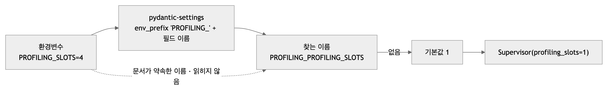
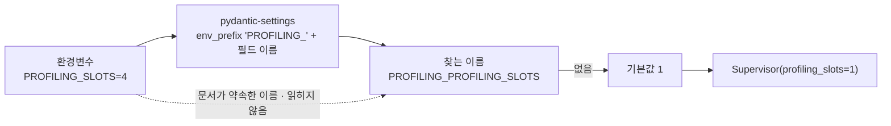

# 이슈 2026-09-28 14:24 — 슬롯 수 환경변수 이름이 문서와 다르다 (`PROFILING_PROFILING_SLOTS`)

| | |
|---|---|
| 발견 시점 | 2026-09-28 14:24 — 부하 시험 하네스 설계 중 환경 조사 |
| 발견 방법 | 슬롯 4로 띄우려고 `PROFILING_SLOTS=4`를 주고 `Settings()`와 `/health`의 `supervisor.slots`를 확인 → 1 |
| 대상 코드 | `src/profiling/settings.py:66` (`PROFILING_SLOTS` 필드) · 09-22 초기 구현부터(현 경로는 `d2c3f41` 평탄화 이후) |
| 상태 | **열림** |
| 심각도 | 🟡 — 지금은 기본값 1이라 동작 차이가 없지만, 배포 env에 `PROFILING_SLOTS=N`을 넣어도 조용히 1로 돈다 |

## 문제 이름

설정 필드 `PROFILING_SLOTS`에 접두사 `PROFILING_`이 한 번 더 붙어, 문서에 적힌 환경변수 이름 `PROFILING_SLOTS`가 읽히지 않는다

## 문제 정의

`Settings`는 `env_prefix="PROFILING_"`로 "필드 이름 앞에 접두사를 붙인 환경변수"를 읽는다(`POOL_SIZE` → `PROFILING_POOL_SIZE`). 슬롯 수 필드만 이름이 `PROFILING_SLOTS`라서 실제로 읽는 환경변수는 `PROFILING_PROFILING_SLOTS`다. 문서(`docs/시퀀스_전체.md` 66·268행 · `이름_대조표.md` 156행 · `docs/코드_안내서.md` 55행 · `docs/assets/build_pipeline_map.py` 54행 · `build_structure.py` 53행)는 전부 `PROFILING_SLOTS`라고 적었다.

실측 (2026-09-28, `profiling/`에서, `.env` 없음):

```
$ PROFILING_SLOTS=7 .venv/bin/python -c "from profiling.settings import Settings; print(Settings(_env_file=None).PROFILING_SLOTS)"
1
$ PROFILING_PROFILING_SLOTS=7 .venv/bin/python -c "from profiling.settings import Settings; print(Settings(_env_file=None).PROFILING_SLOTS)"
7
```

## 문제 원인

필드 이름을 "프로파일링 슬롯"이라는 뜻으로 `PROFILING_SLOTS`라고 지으면서, 이 클래스의 규칙(필드 이름 = 접두사를 뗀 이름)을 이 필드에만 적용하지 않았다. pydantic-settings는 예외 없이 `env_prefix + 필드 이름`으로 찾는다. 다른 필드는 전부 접두사가 없는 이름이라 드러나지 않았고, 슬롯 수를 환경변수로 바꿔 띄운 적이 없어(로컬·시험 전부 기본 1) 잡히지 않았다.

## 연관된 기능

- **Supervisor 동시 실행 수** — `main.lifespan`이 `settings.PROFILING_SLOTS`로 `Supervisor(profiling_slots=…)`를 만든다. 환경변수가 안 읽히면 어떤 값을 줘도 1이다.
- **배포·부하 시험** — compose나 스테이징 env에 문서대로 `PROFILING_SLOTS=4`를 넣으면 오류 없이 슬롯 1로 뜬다. `/health`의 `supervisor.slots`로만 알 수 있다. 슬롯 1 vs 4를 비교하는 부하 시험이 이 값을 처음 쓰는 자리라 여기서 드러났다.
- `.env.example`에는 이 변수가 없었다.

## 문제 그림



<!-- fig: env-name -->


## 예상 해결책

1. `settings.py` — 필드는 그대로 두고 `validation_alias=AliasChoices("PROFILING_SLOTS", "PROFILING_PROFILING_SLOTS")`를 붙인다. 별칭은 접두사를 타지 않으므로 문서 이름이 그대로 먹고, 옛 이름도 계속 받는다. 코드가 쓰는 속성 이름(`settings.PROFILING_SLOTS`)은 바뀌지 않는다.
2. 시험 `tests/unit/test_settings_slots_env.py` — 문서 이름·옛 이름·기본값·다른 필드 무영향 4개(`_env_file=None`으로 `.env` 배제).
3. `.env.example`에 `PROFILING_SLOTS=1` 추가. 문서 6곳은 이제 맞으므로 그대로 둔다.
