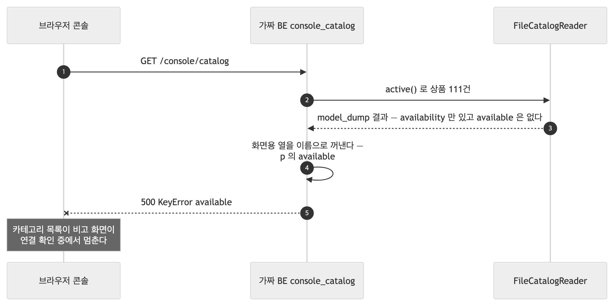
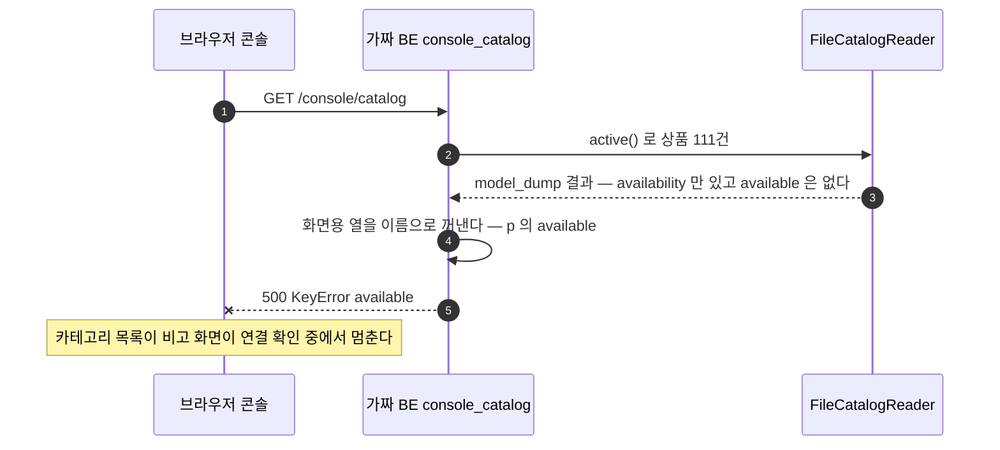
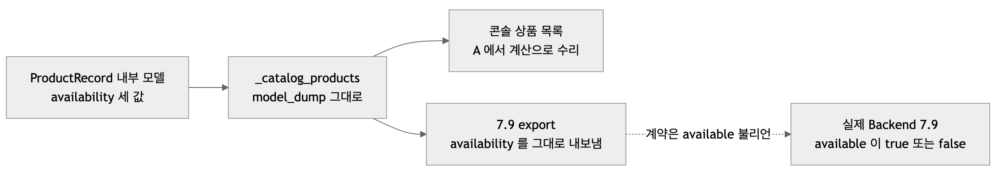
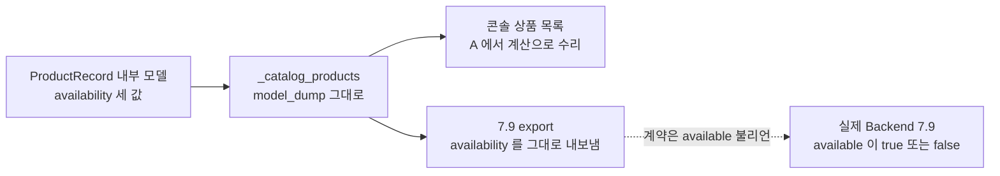

# 이슈 2026-09-30 13:25 — 가짜 Backend 의 재고 필드 두 건 (콘솔 상품 목록 500 · 7.9 응답 모양)

| | |
|---|---|
| 발견 시점 | 2026-09-30 13:25 — 가짜 Backend(:8081)와 AI(:8000)를 띄워 시험 콘솔을 열었을 때 |
| 발견 방법 | 화면이 "연결 확인 중…"에서 멈추고 비선호 카테고리 목록이 비었다. 브라우저 콘솔의 500 과 서버 로그 `KeyError: 'available'` 을 따라감. 이어 `curl` 로 7.9 응답의 필드를 확인 |
| 대상 코드 | `tools/fake_backend/app.py` (`_catalog_products` · `console_catalog` · 7.9 `export_products`) · 재고를 3값으로 바꾼 `4970014`(2026-09-23) 이후 |
| 상태 | A **해결 · 미커밋**(2026-09-30 작업 트리) · B **열림** |
| 심각도 | A 🟡 (시험 도구라 서비스 영향은 없으나 콘솔 수동 시험이 막힘) · B 🟡 (지금은 AI 가 두 모양을 다 받아 드러나지 않음) |

두 문제는 같은 함수 `_catalog_products` 에서 나왔다. 이 함수가 내부 모델(`ProductRecord`)을 그대로 `dump` 해서, 09-23 에 재고가 불리언 `available` 에서 3값 `availability` 로 바뀐 뒤 **화면용 모양**과 **7.9 계약 모양** 둘 다 어긋났다. 아래 각 절은 이슈 하나로 옮길 수 있게 같은 머리말로 썼다.

---

## A. 콘솔 상품 목록 API 가 `available` 을 못 찾고 500 을 낸다

### 문제 이름
가짜 Backend 콘솔의 `GET /console/catalog` 가 옛 필드 `available` 을 읽다 KeyError 로 500 을 낸다

### 문제 정의
콘솔이 열릴 때 부르는 첫 API 가 500 이라 화면이 카테고리 토글과 리뷰 상품 검색 없이 멈춘다. 실측(2026-09-30, `profiling/`):

```
$ curl -s -o /dev/null -w "%{http_code}\n" localhost:8081/console/catalog
500
  File ".../tools/fake_backend/app.py", line 229, in console_catalog
    "products": [{k: p[k] for k in ("productId", ..., "available", "viewCount")} for p in products]}
KeyError: 'available'
```

브라우저에는 `Unexpected token 'I', "Internal S"... is not valid JSON` 이 남는다(500 본문을 JSON 으로 읽으려다 실패).

### 문제 원인
- `_catalog_products()` 는 `FileCatalogReader` 로 읽은 `ProductRecord` 를 `model_dump(mode="json")` 한다. 09-23 `4970014` 에서 내부 재고가 `available`(불리언)에서 `availability`(available·unavailable·unknown)로 바뀌어 dump 에는 후자만 있다.
- `console_catalog` 는 화면에 보낼 열을 **이름으로 골라 오는데** 옛 이름을 남겨 두었다.
- 이 API 를 부르는 시험이 없었다. 09-25 시나리오 시험은 `/console/be/change` API 로 돌렸고, 단위 시험은 lifecycle 만 본다.

### 연관된 기능
- 콘솔 7.6 보내기 탭의 **비선호 카테고리 토글**과 **리뷰 상품 검색** — 목록이 없어 쓸 수 없다.
- 콘솔 7.9 탭의 상품 표(판매 열).
- AI 서비스는 무관하다(시험 도구). 콘솔을 열 때마다 바로 드러난다.

### 문제 그림



<!-- fig: A-console-catalog-500 -->


### 예상 해결책
1. `console_catalog` 가 `available` 을 **계산해서** 내려준다: `availability != "unavailable"`. AI 규칙(`unavailable` 만 제외, `unknown` 은 가능)과 같다. 화면(`console.html`)은 그대로 둔다.
2. 시험: `tests/unit/test_catalog_fixture.py` 의 기존 시험 끝에 콘솔 목록을 만들어 `available` 이 불리언이고 판매 불가가 2건인지 확인한다. 고치기 전 코드에서는 같은 `KeyError` 로 실패함을 확인했다. 시험 수는 그대로 204.
3. 문서: 손볼 곳 없음(README §3 의 콘솔 설명은 맞다).

---

## B. 가짜 Backend 의 7.9 응답이 계약과 다른 재고 필드를 내보낸다

### 문제 이름
가짜 Backend 의 7.9 `export` 가 계약의 `available`(불리언) 대신 내부 필드 `availability`(3값)를 내보낸다

### 문제 정의
필드표 v2 는 7.9 상품에 `available`(boolean, 필수, null 불가)을 적고, 재고를 모르면 필드를 보내지 않거나 null 로 보낸다고 한다. 가짜 Backend 의 응답은 다르다. 실측:

```
$ curl -s -H "Authorization: Bearer dev-token" localhost:8081/internal/v1/ai/products/export | (첫 상품의 재고 관련 키)
{'productId': 13006, 'availability': 'available', 'viewCount': 7566}
```

실제 Backend 는 `available: true/false` 만 보낸다. 가짜가 다른 모양을 내보내니, 가짜로 7.9 가져오기를 시험해도 실제 Backend 와 붙는 날의 모양은 확인되지 않는다.

### 문제 원인
- A 와 같은 뿌리다. `export_products` 도 `_catalog_products()` 의 dump 를 그대로 `ProductExportData` 에 넣는다. 내부 모델이 바뀔 때 **가짜의 출력 모양을 계약에 맞추는 단계**가 없었다.
- AI 의 `ProductRecord` 가 두 이름(`availability`·`available`)을 다 받으므로 어긋남이 시험에 걸리지 않았다. `fetch_export` 의 계약 점검도 `availability` 를 알려진 필드로 본다.

### 연관된 기능
- `tools/catalog/fetch_export.py` 의 7.9 가져오기·계약 점검(`CONTRACT_7_9_SCHEMA`) 시험.
- 지금은 AI 가 둘 다 받아 동작에 영향이 없다. **실제 Backend 7.9 와 붙는 날** 모양 차이가 처음 드러난다.

### 문제 그림



<!-- fig: B-export-shape -->


### 예상 해결책
1. `_catalog_products` 가 7.9 계약 모양으로 변환한다: `available` 은 `available`→true, `unavailable`→false, `unknown`→필드 생략. 이때 A 의 임시 계산은 걷어내고 콘솔은 `available` 을 그대로 쓴다(단, `unknown` 을 화면에서 판매 가능으로 볼지 정한다).
2. 시험: 7.9 응답 상품에 `available` 불리언이 있고 `availability` 키는 없는지, 재고를 모르는 상품은 키가 없는지.
3. 문서: 필드표 v2 에 "가짜 Backend 응답은 계약 모양" 한 줄은 넣지 않아도 된다.
