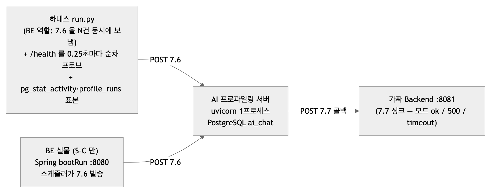
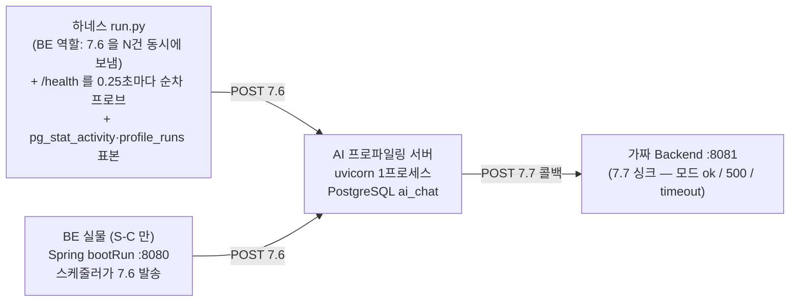
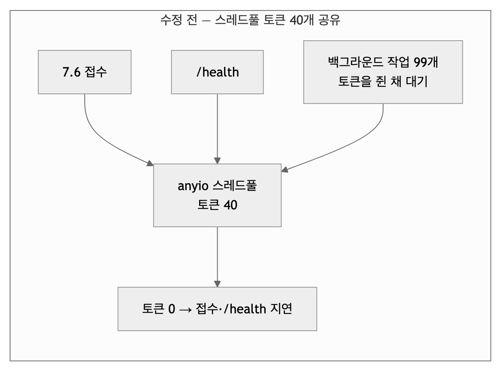
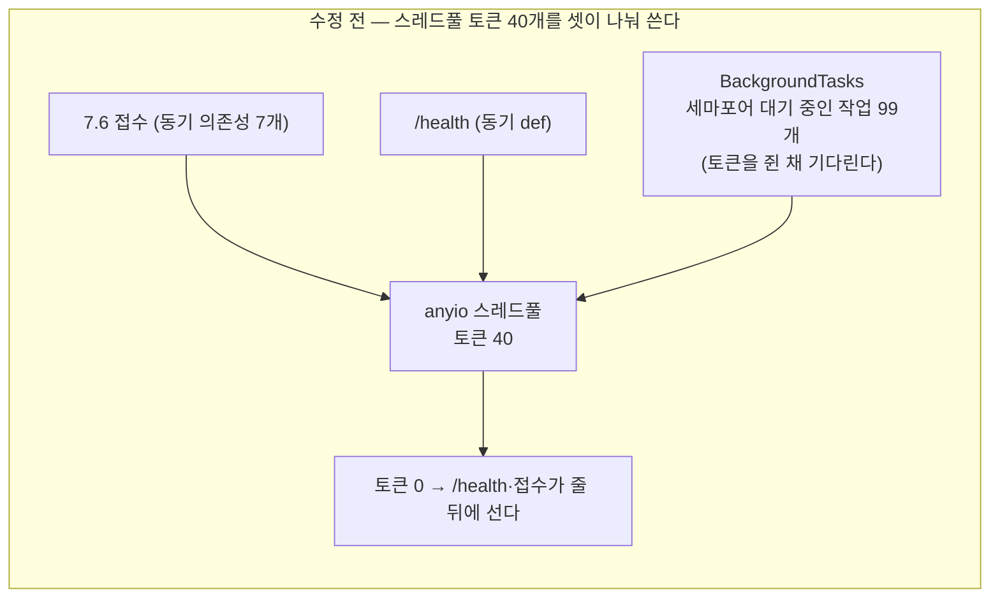
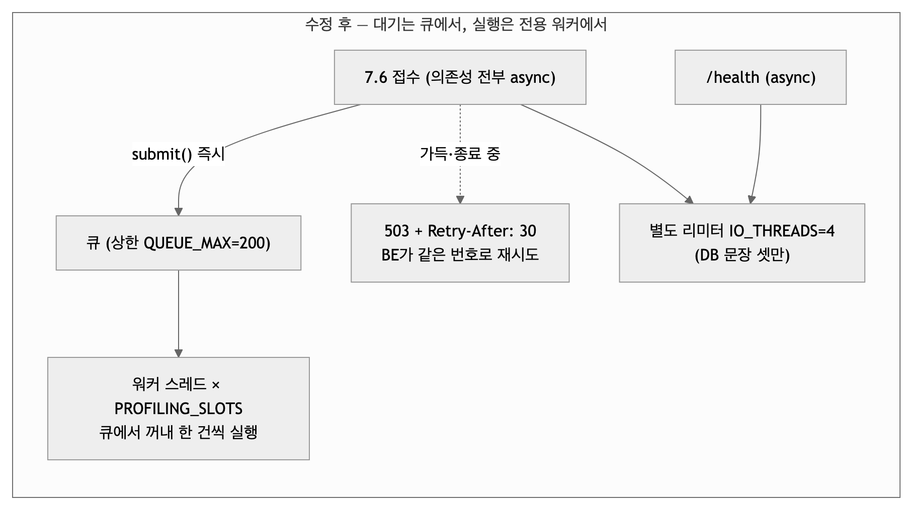
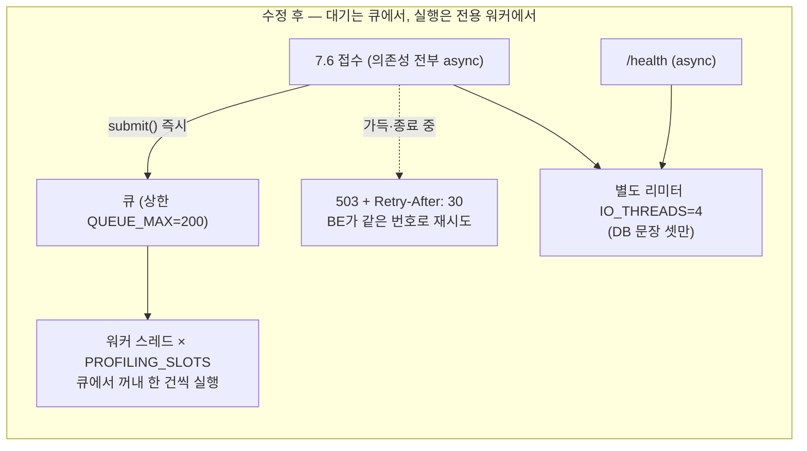
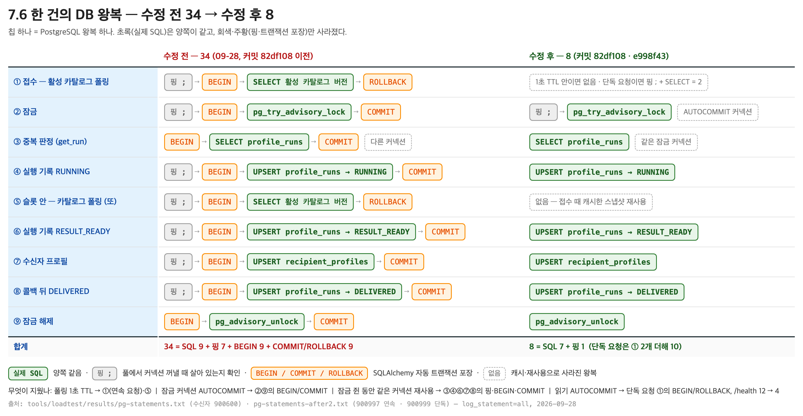

# 부하 시험 재측정 보고 — 2026-09-29 (Supervisor·DB 왕복 개선 전후, 팀 공유용)

| | |
|---|---|
| 무엇을 | 09-28에 발견한 결함(콜백이 느리면 `/health`·접수가 굶음)을 고친 뒤, **같은 시나리오 전부를 다시 재서** 어디를 어떻게 바꿨고 왜 그렇게 달라졌는지 남긴다 |
| 누구를 위해 | BE·FE·PM 팀원. AI 코드를 열어 보지 않아도 읽히게 썼다. 코드 위치는 링크로만 |
| 기준 코드 | AI `integration/v1-profiling-search` 커밋 `6f71546`(Supervisor) + 하네스 `--no-keepalive`(09-29). **수정 전**은 09-28 기준선 커밋 `d52d6b2` |
| 환경 | Mac M2 Pro(10코어) 한 대에서 하네스·AI 서버·Docker PostgreSQL·가짜 Backend를 같이 돌림. S-C만 BE 실물(Spring, 로컬 MySQL) |
| 결론 | **굶음은 사라졌다.** 느린 콜백에서 `/health` 실패 0(전 15회 타임아웃), 굶는 동안 들어온 요청 6.5ms(전 34.5초). 300건이 한꺼번에 오면 큐 상한 200에서 503으로 되돌린다(설계). 처리량·슬롯 시간은 DB 왕복 26회 절감으로 개선. 슬롯이 느릴 때 "전부 끝나는 시간"은 설계상 그대로 |
| 관련 문서 | [09-28 기준선·왕복·after](부하_시험_결과_2026-09-28.md) · [하네스 사용법](../tools/loadtest/README.md) · [파이프라인 지도 09-28](파이프라인_지도/2026-09-28.md) · [BE 연동 필드표 v1](BE_연동_필드표_v1.md) |

## 0. 한 장 요약

바꾼 것은 셋이다. ① **Supervisor**를 "스레드풀 안에서 세마포어를 기다리는 구조"에서 **워커 스레드 + 상한 있는 큐**로. ② 7.6 한 건의 **DB 왕복을 34번에서 8번**으로. ③ 슬롯 수 환경변수 이름 결함 수정. 셋 다 BE와의 계약(7.6 202/400/401/503, 7.7)은 유지하고, 503에 "접수 대기열 가득(`Retry-After: 30`)"이라는 두 번째 뜻이 생겼다.

| 무엇을 봤나 | 수정 전 (09-28) | 수정 후 (09-29) | 왜 |
|---|---|---|---|
| 콜백 500(슬롯 2.5초) · 100건 · 슬롯 1 — `/health` | **15회 타임아웃**, 154초 무응답 | **실패 0**, 최대 95ms | 대기가 스레드풀 토큰을 안 쓴다 (§3.1) |
| 같은 조건 · 슬롯 4 · 굶는 동안 들어온 7.6 한 건 | **34.5초** 뒤 202 | **6.5ms** 뒤 202 | 접수 경로가 async, 큐에 넣고 바로 답 (§3.1) |
| 콜백 timeout(슬롯 17.5초) · 120초 관찰 — `/health` | 13회 중 12회 타임아웃 | 485회 중 실패 0 | 같음 |
| 300건 한꺼번에 · 슬롯 1 | 전부 202 (접수 0.5~4초) | 217건 202 + **83건 503**(큐 200 가득) | 상한 있는 큐 — BE가 30초 뒤 같은 번호로 재시도 (§3.1·§4.3) |
| 100건 · 슬롯 1 · 콜백 정상 — 슬롯 시간 · 처리량 | 7.8ms · 84/s | 5.5ms · 125/s (어제 같은 코드로 3.5ms · 185/s) | DB 왕복 34 → 8 (§3.2). 오늘 절대값은 재부팅 직후 배경 부하로 낮음 (§4.0) |
| 100건 · 슬롯 4 | 140/s · 커넥션 8 | 200/s · 커넥션 5 | 실행당 커넥션 2 → 1 (§3.2) |
| BE 실물 200건 · 접수→종료 p50 | 17.5ms | **6.8ms** | 왕복 절감. BE는 틱당 100건 직렬이라 큐는 0 (§4.7) |
| 종료(SIGTERM) 도중 큐 56건 | 측정 없음 | 2.6초에 종료, "큐에 남은 56건을 버린다" 로그 | BE 재전송이 복구 (§4.8) |

시험 중 **하네스 자체의 한계**도 찾았다. httpx 풀이 keep-alive 연결 100개쯤을 쥐면 초당 50~80건에서 막혀, 09-28 "300건 접수 p50 1.0초"는 서버가 아니라 클라이언트 값이었다(§2.4). 옵션(`--no-keepalive`)을 추가해 다시 쟀고 09-28 문서에 정정을 달았다.

## 1. 배경 — 왜 부하 시험을 했고, 무엇을 물었나

Backend(BE)는 프로파일링 요청(7.6)을 **스케줄러가 배치 100건씩, 직렬로** 보낸다(BE PR2 `#175`). AI 쪽 09-27 파이프라인 지도 §5에는 "Supervisor 동시성이 BE 배치 100/분을 감당하는지"가 **추정**으로만 적혀 있었다. 그래서 09-28에 부하 시험 하네스(`tools/loadtest/`)를 만들어 세 가지를 물었다.

1. 100건이 한꺼번에 오면 **접수(202)** 가 막히지 않는가?
2. 분석이나 콜백이 느릴 때 **`/health`** 가 죽지 않는가? (죽으면 배포 환경의 헬스체크가 컨테이너를 재시작한다)
3. 한 프로세스가 초당 몇 건을 **끝까지**(202 → 분석 → 7.7 콜백 → 기록) 처리하는가?

답은 "정상일 때는 문제 없지만, 콜백이 느려지는 순간 `/health`와 접수가 수십~수백 초 굶는다"였다. 이 문서는 그 결함을 어디서 어떻게 고쳤고, 고친 뒤 같은 시험에서 무엇이 어떻게 달라졌는지를 남긴다.

## 2. 시험 방법 — 팀원이 알아야 할 만큼만

### 2.1 무엇이 무엇을 흉내 내나



<!-- fig: 01-하네스 -->


- **하네스**가 BE 역할로 7.6을 보낸다. 실제 BE는 배치 100건을 직렬로 보내지만, 시험은 일부러 **동시 100·300건**을 한꺼번에 보내 여유를 본다.
- **가짜 Backend**는 7.7 콜백을 받아 주는 싱크다. 모드를 바꿔 콜백 실패를 흉내 낸다: `500`이면 AI가 즉시 3회 재시도(0.5초·2초 뒤)해 한 건에 **약 2.5초**, `timeout`이면 시도마다 5초를 기다려 **약 17.5초**가 슬롯을 잡는다. 실제로는 BE 장애·네트워크 지연이 이 자리다.
- **S-C**만 BE 실물(로컬 MySQL + `bootRun`)이 보낸다. BE에는 아직 7.7 수신(PR3)이 없어 콜백은 가짜 싱크로 보낸다.

### 2.2 시나리오

| 이름 | 조건 | 왜 이 시나리오인가 |
|---|---|---|
| S-A1 | 100건 동시 · 슬롯 1 · 콜백 정상 | BE 배치 한 번. 기준선 |
| S-A2 | 100건 동시 · **슬롯 4** · 콜백 정상 | 슬롯을 늘리면 얼마나 빨라지고 DB 커넥션이 얼마나 느나 |
| S-Ap | **300건** · 슬롯 1 / 4 · 콜백 정상 | 배치 세 번이 겹친 최악. 큐 상한(200)에 닿는지 |
| S-B1 | 100건 · 슬롯 1 / 4 · **콜백 500**(슬롯 2.5초) | 콜백이 느릴 때 접수·`/health`가 굶는가 — 09-28 결함의 재현 조건 |
| S-B3 | S-B1(슬롯 4) 도중 6초 뒤 **7.6 한 건 더** | 굶는 동안 들어온 새 요청이 BE 타임아웃(10초) 안에 202를 받나 |
| S-B2 | 100건 · 슬롯 1 · **콜백 timeout**(슬롯 17.5초) · 120초 관찰 | 가장 느린 슬롯. `/health` 생존과 큐 체류 |
| Q50 | 큐 상한 50 · 100건 · 콜백 500 | 큐가 가득 찰 때 503 + `Retry-After`가 나오는지 |
| S-C | **BE 실물** 200명 · 슬롯 1 | 실제 발송 패턴(틱당 100, 직렬)에서의 지연 |
| 종료 | 콜백 500 도중 SIGTERM | 배포 재시작 때 큐·실행 중 작업이 어떻게 되나 |

### 2.3 지표 읽는 법

| 지표 | 뜻 | 어디서 재나 |
|---|---|---|
| 202 p50/p95 · 10초 초과 | 7.6을 보내고 202를 받기까지. BE의 read timeout이 10초라 이를 넘으면 BE는 실패로 보고 다시 보낸다 | 하네스 시계 |
| `/health` 실패 · 최대 | 0.25초마다 순차 프로브. 10초 안에 답이 없으면 실패. 순차라 "멈춘 시간"이 그대로 표본이 된다 | 하네스 시계 |
| 슬롯 시간 | 한 건이 슬롯을 쥔 시간 = 분석 + 콜백 + 기록. 큐 대기는 포함되지 않는다 | DB `updated_at − created_at` |
| 큐 최대(`queued`) · 거절(`rejected`) | Supervisor 큐에 기다리는 건수의 최대, 503으로 돌려보낸 건수 (09-28 이후 `/health`가 보여준다) | `/health supervisor` |
| 전부 종료 · 처리량 | 마지막 건이 끝날 때까지 · 초당 끝낸 건수 | DB |
| 커넥션 최대 | AI가 PostgreSQL에 연 접속 수(하네스 제외). 풀이 열어 둔 유휴 접속도 센다 | `pg_stat_activity` |

### 2.4 하네스 자체의 한계 — 09-29에 찾은 것

300건 시나리오에서 202 p50이 0.7초로 나와 서버를 의심했는데, 같은 동시성(100)으로 **아무 일도 안 하는 `/openapi.json`을 때려도 초당 83건**이었다. 원인은 서버가 아니라 하네스의 HTTP 클라이언트(httpx/httpcore 1.0.9) 풀이다 — keep-alive 연결을 100개쯤 쥐면 요청 배정이 느려진다.

| 클라이언트 · 조건 (300건, 동시 100) | 초당 | 202/200 p50 |
|---|---|---|
| 하네스 httpx, keep-alive (기본) — `/openapi.json` | 83 | 544ms |
| 하네스 httpx, keep-alive — 7.6 | 74 | 530ms |
| 하네스 httpx, **`Connection: close`** — 7.6 | **905** | 89ms |
| 하네스 httpx, keep-alive, 동시 20 — 7.6 | 317 | 42ms |
| 원시 소켓 keep-alive 100연결 × 3 — `/openapi.json` | **7,987** | 9ms |
| ApacheBench 동시 100 — `/openapi.json` | 6,584 | 12ms |

그래서 `--no-keepalive`(요청마다 새 연결) 옵션을 하네스에 넣었다. 이 문서의 300건 결과는 그 옵션으로 잰 값이고, 09-28의 "300건 p50 1.0초·p95 3.7초"는 클라이언트 지연이 섞인 값이다(그 문서 §4·§5에 정정을 달았다). 100건 시나리오는 keep-alive 값도 같이 적었다 — 09-28과 같은 조건이라 비교가 되고, 차이는 클라이언트 몫이다.

## 3. 바꾼 것 셋 — 증상 → 원인 → 어디를 어떻게 → 왜 고쳐지나

### 3.1 Supervisor: 슬롯 대기가 스레드풀을 잡던 것을 워커 스레드 + 상한 큐로

**증상(09-28 기준선).** 콜백이 500을 돌려줘 슬롯이 2.5초씩 걸리자, 슬롯 1에서 `/health`가 **t=0.4초부터 154초까지 응답하지 않았고**(프로브 15개 연속 10초 타임아웃), 그 사이 들어온 7.6 한 건은 202까지 **34.5초**가 걸렸다(BE 10초 타임아웃 초과 → BE는 실패로 보고 재전송). 슬롯 4에서도 31초 굶었다.

**원인.** FastAPI에는 "동기 `def` 함수를 돌리는 스레드풀"이 하나 있고 토큰이 **40개**다(anyio). 옛 Supervisor는 접수 뒤 `BackgroundTasks`로 작업을 넘겼는데, 그 작업은 스레드풀 토큰을 **쥔 채** 세마포어(슬롯)가 비기를 기다렸다. 대기 작업이 40개를 넘는 순간 토큰이 바닥나고, 같은 스레드풀을 거치는 `/health`(동기 `def`)와 7.6의 동기 의존성 7개(`get_catalog` 등)가 그 줄 **뒤에** 섰다. 굶는 시간이 "(대기 − 40) × 슬롯 시간 ÷ 슬롯 수"로 정확히 맞아떨어진 이유다(60 × 2.5 ÷ 1 = 150초).



<!-- fig: 02-굶음-전 -->




<!-- fig: 03-굶음-후 -->


**어디를 어떻게.**

| 파일 · 위치 | 바꾼 것 |
|---|---|
| [supervisor.py](../src/profiling/supervisor.py) 전체 | `Supervisor(profiling_slots, queue_max)`: `start()`가 워커 스레드를 슬롯 수만큼 띄우고, `submit(fn, …) → bool`은 `queue.put_nowait`로 **즉시** 넣는다(가득·종료 중이면 False). `_worker()`는 큐에서 꺼내 실행하고 예외는 건마다 격리한다. `stop(timeout_s)`는 신규 접수를 막고 큐에 남은 것을 버린 뒤(건수 로그) 실행 중인 것만 기다린다. `stats()`에 `queued`·`queue_max`·`completed`·`rejected`·`failed`가 늘었다 |
| [intake.py:59–84](../src/profiling/intake.py) | 의존성 7개(`get_catalog`·`get_store`·`get_recipient_store`·`get_backend`·`get_supervisor`·`get_io_limiter`·`settings_dep`)와 `require_service_token`을 `async def`로 — 동기 `def` 의존성은 스레드풀 토큰을 탄다 |
| [intake.py:283–325](../src/profiling/intake.py) `extract_and_pool` | `BackgroundTasks` 제거. 카탈로그 확인은 `anyio.to_thread.run_sync(catalog.active, limiter=io_limiter)`(기본 스레드풀·이벤트 루프 둘 다 안 잡는다). `supervisor.submit(dispatch, …)`가 False면 **503 `SERVICE_UNAVAILABLE` + `Retry-After: 30`**(`접수 대기열이 가득 찼습니다.`) |
| [main.py:81–90](../src/profiling/main.py) | lifespan: `io_limiter = anyio.CapacityLimiter(IO_THREADS)` · `Supervisor(...).start()` · 종료 순서 `supervisor.stop(SHUTDOWN_DRAIN_S)` → `backend.close()` → `engine.dispose()` |
| [main.py:185–206](../src/profiling/main.py) `health` | `async def`로, DB 문장 셋은 같은 `io_limiter` 스레드에서 — 실행 대기가 쌓여도 답한다. `_error_response`는 건별 `Retry-After`를 받는다 |
| [settings.py:93–108](../src/profiling/settings.py) · `.env.example` | `QUEUE_MAX=200` · `QUEUE_FULL_RETRY_AFTER_S=30` · `IO_THREADS=4` · `SHUTDOWN_DRAIN_S=5.0` |
| 계약 [BE 연동 필드표 v1 §3.6·§6.1](BE_연동_필드표_v1.md) | 503이 두 가지 뜻이 됐다: 활성 카탈로그 없음(`Retry-After: 300`) · **접수 대기열 가득(`Retry-After: 30`)**. 둘 다 BE는 같은 번호로 재시도(BE 계획 5-1) |

**왜 고쳐지나.** 기다리는 자리가 큐(메모리)로 옮겨져 스레드풀 토큰을 하나도 쓰지 않는다. 접수와 `/health`는 async라 토큰이 필요 없고, 꼭 스레드가 필요한 짧은 DB 문장은 별도 리미터(4)로 돌아 실행 대기와 줄을 공유하지 않는다. 큐에 상한을 둔 것은 위키 구현 상세의 규칙(무제한 대기 금지 · 접수는 즉시 수용량을 예약하고 넘치면 503)이고, 200은 BE 배치 100의 두 배로 잡은 **시작값**이다(스테이징 실측으로 조정).

**바뀌지 않은 것.** 슬롯 수(기본 1)와 슬롯 시간은 그대로다. 즉 콜백이 느리면 **전부 끝나는 시간은 전과 같고**, 달라지는 것은 "그동안 다른 요청과 `/health`가 굶느냐"뿐이다. 기한(240초)·취소는 아직 없다.

### 3.2 DB 왕복 34 → 8: 문장마다 붙던 핑·BEGIN·COMMIT을 걷어냄

**증상.** 7.6 한 건의 SQL은 9문장인데 PostgreSQL 로그(`log_statement=all`)에는 **34번** 왕복이 찍혔다. 문장마다 풀에서 커넥션을 꺼낼 때의 핑(`;`), SQLAlchemy가 자동으로 여는 `BEGIN`, 끝의 `COMMIT`/`ROLLBACK`이 붙고, 카탈로그 활성 버전 폴링이 접수와 슬롯에서 매번 돌았다.

**어디를 어떻게.**

| 파일 · 위치 | 바꾼 것 | 줄어든 왕복 |
|---|---|---|
| [catalog.py:243–258](../src/profiling/catalog.py) `DbCatalogReader.active` | 활성 버전 폴링에 **1초 TTL**(`CATALOG_POLL_TTL_S`). TTL 안이면 스냅샷 튜플을 그대로 돌려주고, 폴링 실패는 캐시하지 않는다 | 폴링 8 → 0~2 |
| [stores.py:211](../src/profiling/stores.py) `run_lock` | advisory lock 커넥션을 **AUTOCOMMIT**으로 — 트랜잭션을 열지 않으니 BEGIN/COMMIT이 없고 `idle in transaction`이 0 | 4 |
| [stores.py:42–75](../src/profiling/stores.py) `_lock_local` · `_one` | 잠금을 쥔 스레드의 저장소 호출(`get_run`·`save`·`upsert`)은 풀에서 꺼내지 않고 **잠금 커넥션에서 문장 하나 = 왕복 하나**(thread-local) | 핑·BEGIN·COMMIT 15 |
| [stores.py:51](../src/profiling/stores.py) `_autocommit` · [main.py](../src/profiling/main.py) `_store_health` | 잠금 밖의 읽기(`/health` 두 문장, 카탈로그 로드, 기동의 `alembic_version`)는 AUTOCOMMIT | `/health` 12 → 4 |

| 단계 | 한 건 왕복 | 구성 |
|---|---|---|
| 수정 전 | **34** | 핑 7 + BEGIN 9 + SQL 9 + COMMIT/ROLLBACK 9 |
| 1차 (폴링 TTL · 잠금 AUTOCOMMIT, `82df108`) | 27 / 23 | 단독 / 1초 안 연속 |
| **2차** (잠금 커넥션 재사용 · 읽기 AUTOCOMMIT, `e998f43`) | **10 / 8** | 폴링 2 · 잠금 핑 1 · LOCK 1 · 문장 5 · UNLOCK 1 (연속이면 폴링 2 제외) |



**그림 읽는 법.** 칩 하나가 왕복 하나이고, 행은 7.6 한 건이 지나는 9단계다. 초록(실제 SQL)은 수정 전후가 **같다** — 문장은 하나도 안 바꿨다. 사라진 것은 회색(풀에서 커넥션을 꺼낼 때의 핑 `;`)과 주황(SQLAlchemy 가 자동으로 여는 BEGIN 과 그 짝 COMMIT/ROLLBACK)뿐이다. 점선 두 칸(①·⑤)은 카탈로그 폴링이 1초 TTL 캐시로 없어진 자리이고, 단독 요청이면 ①에 핑과 SELECT 둘이 돌아와 10이 된다. 원문 로그는 `tools/loadtest/results/pg-statements.txt`(전) · `pg-statements-after2.txt`(후), 그림 소스는 `assets/loadtest/04-왕복-전후.html`(`assets/build_roundtrips.py` 로 다시 그린다).

**왜 빨라지나.** 로컬은 왕복 하나가 0.1~0.2ms라 절대값은 작지만 26번이 사라지니 슬롯 시간이 줄고(같은 날 비교 7.8 → 4.0ms), 슬롯 1의 처리량은 그 역수라 두 배가 된다. RDS처럼 왕복이 0.5~1ms인 곳에서는 26 × 그 값만큼 그대로 준다. 원자성은 전과 같이 문장 단위이고, upsert 실패 시 FAILED 보상도 그대로다. 측정 상세는 [09-28 §10·§11](부하_시험_결과_2026-09-28.md).

### 3.3 슬롯 수 환경변수 이름 결함

**증상.** 문서대로 `PROFILING_SLOTS=4`를 줘도 슬롯이 1로 떴다. `PROFILING_PROFILING_SLOTS`라야 먹었다.

**원인·수정.** 필드 이름(`PROFILING_SLOTS`)에 접두사가 이미 들어 있어 pydantic `env_prefix`가 한 번 더 붙었다. [settings.py:73–78](../src/profiling/settings.py)에 `validation_alias=AliasChoices("PROFILING_SLOTS", "PROFILING_PROFILING_SLOTS")`를 둬 문서 이름을 읽고 옛 이름도 받는다(커밋 `da0ccd7`, [이슈](issues/2026-09-28_1424_slots-env-name/README.md)). 하네스의 `--expect-slots`가 `/health`의 `supervisor.slots`를 대조해 이런 결함을 시작 전에 잡는다.

## 4. 시나리오별 결과 — 수정 전(09-28) vs 수정 후(09-29), 그리고 왜

### 4.0 표를 읽기 전에

- **절대값은 날마다 다르다.** 같은 코드(`6f71546`)로 09-28 저녁엔 슬롯 3.5ms·185/s, 09-29 아침엔 5.5ms·125/s가 나왔다. 오늘은 재부팅 36분 뒤라 Spotlight 색인(`mds_stores`)·미디어 분석이 CPU를 쓰고 있었다(load average 4~9). 그래서 **수정 전/후 비교는 "관계"(굶는가, 거절하는가, 커넥션이 몇 개인가)와 같은 날 안의 상대값**으로 읽는다.
- 표의 "ka"는 하네스 keep-alive(09-28과 같은 조건), "nk"는 `--no-keepalive`(서버만 잰 값, §2.4). 큐 최대·거절은 09-28 이후에만 있다.
- 전체 표 한 장은 부록 §7.2에 있다.

### 4.1 S-A1 — 100건 동시 · 슬롯 1 · 콜백 정상

| 실행 | 202 p50 / p95 ms | `/health` 최대 ms | 슬롯 ms | 전부 종료 s | 처리량 /s | 큐 최대 | 커넥션 |
|---|---|---|---|---|---|---|---|
| 수정 전 ①②③ | 244~253 / 359~381 | 479~574 | 7.5~7.8 | 1.4 | 81~87 | – | 3 |
| 09-28 after (같은 코드, 저녁) | 102 / 186 | 75 | 3.5 | 0.6 | 185 | 58 | 2 |
| 09-29 ka ①~⑤ | 119~201 / 214~299 | 84~117 | 5.1~5.7 | 0.9~1.0 | 120~125 | 70~78 | 5 |
| 09-29 nk ①~④ | 76~103 / 79~116 | 85~119 | 5.1~5.6 | 0.8~0.9 | 122~135 | 67~70 | 2~5 |

**왜.** 202 지연이 절반이 된 것은 접수 경로가 async가 되어 스레드풀 줄에 서지 않기 때문이고(§3.1), nk에서 p95가 p50에 붙는 것(76/79)은 100건이 0.1초 안에 전부 접수되어 서로 비슷하기 때문이다. 슬롯 시간·처리량은 DB 왕복 절감(§3.2). 커넥션이 5로 보이는 실행은 버스트 첫 순간 접수 100건이 동시에 카탈로그 폴링을 하며 리미터 스레드 4개가 각각 커넥션을 꺼낸 것(4 + 잠금 1)이고 풀이 그 뒤 유휴로 들고 있다 — 09-28 저녁엔 `/health` 프로브가 TTL을 갱신해 준 타이밍이라 2였다. 상한 15 안이며 문제는 아니다. `/health` 최대 0.5초 → 0.1초는 `/health`가 async가 된 효과다.

### 4.2 S-A2 — 100건 동시 · 슬롯 4

| 실행 | 202 p50 / p95 ms | `/health` 최대 ms | 슬롯 ms | 전부 종료 s | 처리량 /s | 커넥션 |
|---|---|---|---|---|---|---|
| 수정 전 ①②③ | 248~260 / 384~433 | 233~319 | 17.1~18.8 | 0.9~1.0 | 138~140 | 8 |
| 09-29 ka ①②③ | 116~155 / 228~268 | 79~115 | 12.4~12.8 | 0.6 | 198~207 | 5~6 |
| 09-29 nk | 117 / 168 | 80 | 12.8 | 0.6 | 206 | 5 |

**왜.** 슬롯 4는 슬롯 1의 1.6배(오늘 125 → 200/s)이지 4배가 아니다 — 슬롯 시간이 5.5 → 12.6ms로 늘어나는데, 이는 파이썬 GIL과 DB를 네 워커가 나눠 쓰기 때문이고 수정 전(7.8 → 17ms)과 같은 비율이다. 커넥션이 8 → 5로 준 것은 잠금 커넥션 재사용으로 실행당 커넥션이 2 → 1이 되어서다(4 워커 + `/health`·폴링 1~2). 풀 상한 15 기준으로 슬롯 7 이상도 이제 들어간다(전에는 7부터 부족).

### 4.3 S-Ap — 300건 · 큐 상한에 닿는다

| 실행 | 7.6 응답 | 202 p50 / p95 ms | 도착 | 큐 최대 / 거절 | 처리량 /s |
|---|---|---|---|---|---|
| 수정 전 슬롯 1 (ka) | 202 300 | 1,012 / 3,658 | 4.6초에 걸쳐 | – | 68 |
| 수정 전 슬롯 4 (ka) | 202 300 | 722 / 3,898 | 4.9초 | – | 65 |
| 09-29 슬롯 1 ka, 동시 100 | 202 300 | 742 / 3,281 | 첫 1초 108건, 이후 초당 ~50 (클라이언트 한계) | 57 / 0 | 72 |
| 09-29 슬롯 1 ka, 동시 300 | 202 206 · **503 94** | 548 / 1,323 | 1초 안 300건 | – / 94 | 125 |
| **09-29 슬롯 1 nk** | 202 217 · **503 83** | **99 / 113** | **0.32초 안 300건** | 198 / 83 | 125 |
| **09-29 슬롯 4 nk** | 202 248 · **503 52** | 136 / 168 | 0.47초 안 300건 | 200 / 52 | 194 |

**왜.** 서버는 300건을 0.3~0.5초에 전부 받는다(초당 900건). 그런데 워커는 초당 125건(슬롯 1)·194건(슬롯 4)밖에 못 비우므로 큐가 200에 닿고, 넘치는 83건·52건은 **기다리지 않고 503 + `Retry-After: 30`**으로 돌아간다. 이것은 결함이 아니라 §3.1의 설계다 — 접수는 "상한 있는 수용량에 들어갔다"는 뜻이어야 하고, BE는 30초 뒤 같은 번호로 다시 보낸다(BE 계획 5-1). 실제 BE는 틱당 100건을 직렬로 보내므로(§4.7, 큐 최대 0) 이 경계에 닿지 않는다. 시험에서 0건을 원하면 `PROFILING_QUEUE_MAX`를 400으로 올리거나 슬롯 4로 돌린다. 수정 전 300건이 "전부 202"였던 것은 큐에 상한이 없어서였고, 그때의 202 지연 1~4초는 하네스 keep-alive 한계(§2.4)가 섞인 값이다. 거절은 서버 로그에 건마다 경고 두 줄로 남는다(`Supervisor 거절: 대기열 가득(200)` · `7.6 거절 recipient=… — 접수 대기열이 가득 찼습니다`).

### 4.4 S-B1 · S-B3 — 콜백 500(슬롯 2.5초): 굶음이 사라졌다

| 실행 | 202 p50 / p95 ms | 10초 초과 | `/health` 실패 / 최대 ms | 전부 종료 s | 큐 최대 | 커넥션 |
|---|---|---|---|---|---|---|
| 수정 전 슬롯 1 | 206 / 307 | 0 | **15 / 10,012** (t=0.4~154초 무응답) | 255.9 | – | 3 |
| 왕복 2차 뒤(Supervisor 전) 슬롯 1 | 102 / 25,593 | **6** | 15 / 10,016 | 255.3 | – | 2 |
| 09-28 after 슬롯 1 | 70 / 138 | 0 | 0 / 57 | 253.9 | 99 | 2 |
| **09-29 슬롯 1** | 117 / 220 | 0 | **0 / 95** (프로브 987개) | 253.8 | 99 | 5 |
| 수정 전 슬롯 4 | 220 / 332 | 0 | **4 / 10,008** (t=0.4~31초) | 64.4 | – | 9 |
| **09-29 슬롯 4** | 144 / 232 | 0 | **0 / 122** | 63.9 | 96 | 5 |

| S-B3 — 굶는 동안(6초 뒤) 들어온 7.6 한 건 | 202까지 | 그때 `/health` |
|---|---|---|
| 수정 전 (슬롯 4) | **34.5초** (BE 10초 타임아웃 초과) | 응답 없음 |
| **09-29 (슬롯 4)** | **6.5ms** | 55ms, `running 4 · queued 88` 표시 |

**왜.** §3.1 그대로다. 100건이 큐에 들어가 워커 하나(또는 넷)가 2.5초에 한 건씩 비우는 동안, 스레드풀 토큰은 아무도 쥐고 있지 않으므로 `/health`와 새 접수는 즉시 답한다. **전부 끝나는 시간(254초·64초)은 그대로**다 — 슬롯 수와 슬롯 시간을 바꾸지 않았기 때문이고, 그것은 이번 수정의 목표가 아니었다. "왕복 2차 뒤" 행이 보여주듯, Supervisor를 고치기 전에는 접수를 빠르게 만들수록 오히려 늦게 온 요청이 10초를 넘겼다(6건) — 응답이 나가는 대로 백그라운드 작업이 토큰을 잡아 뒤에 온 요청의 의존성이 그 줄 뒤에 섰기 때문이다. 큐 최대 99·96은 "100건 중 실행 중인 것을 뺀 나머지"이며 이제 `/health`에서 실측된다(전에는 근사값뿐).

### 4.5 S-B2 — 콜백 timeout(슬롯 17.5초) · 120초 관찰

| 실행 | `/health` 실패 / 최대 ms | 120초 동안 종료 | 큐 최대 | 관찰 뒤 |
|---|---|---|---|---|
| 수정 전 | **12 / 10,010** (13개 중 12개 타임아웃) | 8건 | – | 가짜 BE가 ok로 돌아오자 91건이 수 초 만에 빠짐 |
| **09-29** | **0 / 116** (485개) | 8건 | 99 | ok로 돌아오자 남은 92건이 **4초** 안에 빠짐 |

**왜.** 슬롯이 17.5초여도 큐에서 기다릴 뿐 토큰을 쓰지 않는다. 종료 건수(8)가 같은 것은 처리량을 바꾸지 않았기 때문이다. 큐에 있던 92건은 잃지 않고, 콜백이 회복되는 순간 한 건 6ms로 빠진다 — 실제 BE 장애가 회복될 때의 모습이다. 다만 장애가 길면 BE가 PENDING 타임아웃 뒤 같은 번호를 다시 보내 큐 자리를 하나 더 먹고, 워커에 닿았을 때 결과가 있으면 재전송(콜백 3회 시도)을 또 한다. 큐가 차면 503으로 30초 밀어낸다. 큐 대기 시간에 상한(기한 240초·취소)을 두는 것이 다음 항목이다.

### 4.6 Q50 — 큐 상한 50 · 100건 · 콜백 500

| 실행 | 7.6 응답 | `Retry-After` | 큐 최대 / 거절 | 전부 종료 |
|---|---|---|---|---|
| 09-28 (도중 SIGTERM) | 202 51 · 503 49 | 30 | 50 / 49 | 중단 |
| **09-29 (끝까지)** | 202 51 · 503 49 | 30 | 50 / 49 | 51건이 129초(51 × 2.5초) |

**왜.** 워커가 첫 건을 잡고(1) 큐가 50까지 차면(51번째까지 202) 그다음부터는 즉시 False → 503이다. 거절된 49건은 `profile_runs`에 행이 없다 — BE가 같은 번호로 다시 보낼 때 새 접수로 처리된다. 503 응답 시간은 202와 같다(p50 119 vs 120ms 안팎) — 기다리지 않는다는 뜻이다.

### 4.7 S-C — BE 실물 200건 · 슬롯 1

| 실행 | BE 발송 | 접수→종료 p50 / p95 / max ms | 슬롯 ms | `/health` 최대 ms | 큐 최대 | 커넥션 | BE 표 |
|---|---|---|---|---|---|---|---|
| 수정 전 | 틱 1: 100건 1.68초 · 틱 2: 100건 1.34초 · 초당 최대 74 | 17.5 / 82 / 90 | 9.7 | 30 | – | 4 | 200건 PENDING · v1 · retry 0 |
| **09-29** | 틱 1: 100건 1.20초 · 틱 2: 100건 0.94초 · 초당 최대 84 | **6.8 / 9.4 / 29.5** | 6.0 | 23 | **0** | 2 | 200건 PENDING · v1 · retry 0 |

절차는 같다: 로컬 MySQL에 `be_seed.sql`로 200명(비선호 대분류 순환, 프로필 NONE·먼 과거 변경 시각) → AI(토큰 · 7.7은 가짜 싱크) → 하네스 관찰 모드 → BE `bootRun`(디바운스 10초·틱 10초·배치 100) → `be_cleanup.sql`. BE는 기동 12초 뒤 첫 틱에 100건, 10초 뒤 둘째 틱에 100건을 **직렬로**(도착 간격 p50 10ms ≈ 202 왕복) 보냈고, AI는 전부 DELIVERED(7.7은 싱크로), 수신자당 1행, BE 쪽 재전송 0.

**왜.** BE의 발송 속도(초당 84건)가 워커 배출(초당 125건)보다 느려 큐가 한 번도 쌓이지 않았다. 접수→종료가 17.5 → 6.8ms가 된 것은 왕복 절감이다. 즉 **현재 BE 계획(배치 100 · 직렬 · 1분 주기)은 AI 한 프로세스, 슬롯 1로 충분**하고, 큐 상한 200과 503은 그보다 훨씬 큰 버스트를 위한 안전장치다.

### 4.8 종료 — 콜백 500 도중 SIGTERM

09-28에 이어 다시 확인했다. 60건을 넣고 8초 뒤 SIGTERM: **2.6초에 종료**(실행 중이던 한 건이 2.5초 슬롯을 마친 뒤), 로그 `Supervisor 종료: 큐에 남은 56건을 버린다 — Backend 가 PENDING 타임아웃 뒤 같은 번호로 다시 보낸다` · `profiling 종료 dropped=56`. compose의 종료 유예 10초 안이다. 버린 56건은 `profile_runs`에 행이 없어 BE 재전송이 새 접수로 처리된다. 실행 중이던 건이 5초 안에 못 끝나면 프로세스와 함께 끊기고 그 RUNNING 행은 다음 기동의 `recover_stale_runs`가 FAILED로 정리한다.

## 5. 09-28에 예상했던 것과 실측

| 예상(09-28 저녁) | 실측(09-29) | 판정 |
|---|---|---|
| S-A2 슬롯 4: 250~300/s · 커넥션 6~8 · `/health` 100ms 아래 | 200/s · 5~6 · 80~115ms | 관계는 맞음. 절대값은 오늘 배경 부하로 낮음(슬롯 1도 185 → 125) |
| S-Ap 슬롯 1: 202 p50 0.1초, 큐 170~220으로 503 0~수십 건 | nk에서 p50 99ms · 큐 198 · 503 83건 | 맞음 — 접수가 예상보다 빨라 거절이 위쪽 |
| S-Ap 슬롯 4: 503 거의 없음 | 503 52건 | **틀림** — 슬롯 4도 초당 194건이라 0.47초 버스트를 못 따라간다 |
| S-B1 슬롯 4: `/health` 실패 0 · 종료 64초 그대로 | 0 · 63.9초 | 맞음 |
| S-B2: `/health` 정상 · 120초에 7건 안팎 · 큐 93 유지 | 0 실패 · 8건 · 큐 99 | 맞음 |
| S-C: p50 8~10ms · 큐 1~2 · 커넥션 2~3 | 6.8ms · 0 · 2 | 맞음 |
| (예상에 없던 것) | 하네스 keep-alive 풀 한계 — 300건 ka p50 0.74초는 클라이언트 값 | §2.4 |

## 6. 남은 한계와 다음

1. **기한(240초)·취소** — 큐 대기 + 실행 시간에 상한이 없다. 콜백 장애가 길면 큐가 차서 503으로 밀어내는 것이 유일한 보호다(§4.5). 위키 §12.1의 `profile_deadline`을 다음에 넣는다.
2. **큐 상한 200 · `Retry-After` 30은 시작값** — 스테이징(RDS 왕복 0.5~1ms)에서 슬롯 시간과 배출 속도를 다시 재고 조정한다. BE에 "503의 두 번째 뜻"을 전달해야 한다([필드표 v1 §6.1](BE_연동_필드표_v1.md)).
3. **슬롯 4의 GIL·DB 경합** — 4배가 아니라 1.6배다. 더 필요하면 프로세스를 늘리는 쪽(uvicorn 워커·컨테이너 수)이 슬롯을 늘리는 것보다 낫다. 단, 프로세스가 여럿이면 advisory lock은 DB에 있으므로 그대로 동작하지만 큐는 프로세스마다 따로 센다.
4. **하네스** — `--n > --concurrency`이면 `--no-keepalive`로 잰다. 클라이언트 한계는 httpcore 판 문제라 판을 올리면 다시 확인한다.
5. **오래 도는 시험**은 아직 없다(10분 이상 지속 부하, 메모리·카운터). 스테이징에서 한다.

## 7. 부록

### 7.1 재현 명령

```bash
cd profiling && docker compose up -d ai-db                                    # 카탈로그 적재본 4,231건이 있어야
uv run uvicorn tools.fake_backend.app:app --port 8081                         # T1 가짜 BE
PROFILING_CATALOG_SOURCE=db PROFILING_BACKEND_BASE_URL=http://localhost:8081 PROFILING_SLOTS=1 \
  uv run uvicorn profiling.main:app --port 8000 --timeout-graceful-shutdown 5  # T2 (슬롯 4 · 큐 50 은 PROFILING_SLOTS=4 · PROFILING_QUEUE_MAX=50)
# T3 — 시나리오 (라벨·출력 파일은 r29-* 로 저장했다)
uv run python -m tools.loadtest.run --n 100 --concurrency 100 --base 900001 --cleanup --yes --expect-slots 1 --label r29-A1 --out tools/loadtest/results/r29-A1.json
uv run python -m tools.loadtest.run --n 300 --concurrency 100 --base 900001 --cleanup --yes --expect-slots 1 --no-keepalive --wait 120 --label r29-Apnk-s1 --out tools/loadtest/results/r29-Apnk-s1.json
uv run python -m tools.loadtest.run --n 100 --concurrency 100 --base 900001 --cleanup --yes --expect-slots 1 --fake-mode 500 --post-timeout 300 --wait 320 --label r29-B1 --out tools/loadtest/results/r29-B1.json
uv run python -m tools.loadtest.run --n 100 --concurrency 100 --base 900001 --cleanup --yes --expect-slots 1 --fake-mode timeout --post-timeout 300 --wait 120 --label r29-B2 --out tools/loadtest/results/r29-B2.json   # 끝나면 큐가 빠진 뒤 --cleanup-only
```

S-B3은 S-B1(슬롯 4)을 띄운 채 6초 뒤 수신자 900500으로 7.6 한 건을 보내 202와 `/health` 시간을 잰다. S-C는 [하네스 README "BE 실물 구동"](../tools/loadtest/README.md) 순서대로. 종료 시험은 콜백 500으로 60건을 넣고 8초 뒤 uvicorn에 SIGTERM.

### 7.2 전체 표

| 실행 | 7.6 응답 | 202 p50 / p95 ms | 10초 초과 | `/health` 실패 / 최대 ms | 슬롯 ms p50 | 전부 종료 s | 처리량 /s | 큐 최대 / 거절 | 커넥션 |
|---|---|---|---|---|---|---|---|---|---|
| 전 S-A1 ① | 202 100 | 247 / 364 | 0 | 0 / 574 | 7.8 | 1.4 | 84 | – | 3 |
| 전 S-A1 ② | 202 100 | 244 / 359 | 0 | 0 / 543 | 7.5 | 1.4 | 87 | – | 3 |
| 전 S-A1 ③ | 202 100 | 253 / 381 | 0 | 0 / 479 | 7.8 | 1.4 | 81 | – | 3 |
| 왕복 2차 S-A1 | 202 100 | 108 / 185 | 0 | 0 / 142 | 4.0 | 0.7 | 165 | – | 2 |
| 09-28 after S-A1 | 202 100 | 102 / 186 | 0 | 0 / 75 | 3.5 | 0.6 | 185 | 58 / 0 | 2 |
| 09-29 S-A1 ka ① | 202 100 | 144 / 263 | 0 | 0 / 117 | 5.7 | 1.0 | 120 | 71 / 0 | 5 |
| 09-29 S-A1 ka ② | 202 100 | 119 / 217 | 0 | 0 / 84 | 5.6 | 0.9 | 125 | 71 / 0 | 5 |
| 09-29 S-A1 ka ③ | 202 100 | 150 / 229 | 0 | 0 / 104 | 5.5 | 0.9 | 125 | 70 / 0 | 5 |
| 09-29 S-A1 ka ④ | 202 100 | 201 / 299 | 0 | 0 / 105 | 5.1 | 0.9 | 122 | 78 / 0 | 5 |
| 09-29 S-A1 ka ⑤ | 202 100 | 125 / 214 | 0 | 0 / 85 | 5.6 | 0.9 | 123 | 72 / 0 | 5 |
| 09-29 S-A1 nk ① | 202 100 | 103 / 107 | 0 | 0 / 119 | 5.5 | 0.9 | 125 | 67 / 0 | 2 |
| 09-29 S-A1 nk ② | 202 100 | 76 / 79 | 0 | 0 / 85 | 5.6 | 0.9 | 122 | 70 / 0 | 2 |
| 09-29 S-A1 nk ③ | 202 100 | 86 / 88 | 0 | 0 / 98 | 5.1 | 0.8 | 135 | 67 / 0 | 2 |
| 09-29 S-A1 nk ④ | 202 100 | 91 / 116 | 0 | 0 / 107 | 5.4 | 0.9 | 129 | 68 / 0 | 5 |
| 전 S-A2 ① | 202 100 | 248 / 384 | 0 | 0 / 319 | 17.1 | 1.0 | 140 | – | 8 |
| 전 S-A2 ② | 202 100 | 259 / 433 | 0 | 0 / 244 | 18.8 | 0.9 | 138 | – | 8 |
| 전 S-A2 ③ | 202 100 | 260 / 402 | 0 | 0 / 233 | 17.2 | 0.9 | 139 | – | 8 |
| 09-29 S-A2 ka ① | 202 100 | 155 / 268 | 0 | 0 / 115 | 12.4 | 0.6 | 207 | 44 / 0 | 5 |
| 09-29 S-A2 ka ② | 202 100 | 144 / 253 | 0 | 0 / 79 | 12.8 | 0.6 | 198 | 53 / 0 | 6 |
| 09-29 S-A2 ka ③ | 202 100 | 116 / 228 | 0 | 0 / 87 | 12.6 | 0.6 | 202 | 50 / 0 | 5 |
| 09-29 S-A2 nk | 202 100 | 117 / 168 | 0 | 0 / 80 | 12.8 | 0.6 | 206 | 48 / 0 | 5 |
| 전 S-Ap 슬롯1 | 202 300 | 1,012 / 3,658 | 0 | 0 / 585 | 8.5 | 4.6 | 68 | – | 3 |
| 전 S-Ap 슬롯4 | 202 300 | 722 / 3,898 | 0 | 0 / 255 | 12.0 | 4.9 | 65 | – | 8 |
| 09-29 S-Ap 슬롯1 ka c100 | 202 300 | 742 / 3,281 | 0 | 0 / 207 | 6.3 | 4.3 | 72 | 57 / 0 | 5 |
| 09-29 S-Ap 슬롯1 ka c300 | 202 206 · 503 94 | 548 / 1,323 | 0 | 0 / 281 | 5.4 | 1.9 | 125 | 0 / 94 | 5 |
| 09-29 S-Ap 슬롯1 nk | 202 217 · 503 83 | 99 / 113 | 0 | 0 / 71 | 5.3 | 1.8 | 125 | 198 / 83 | 2 |
| 09-29 S-Ap 슬롯4 nk | 202 248 · 503 52 | 136 / 168 | 0 | 0 / 113 | 12.6 | 1.4 | 194 | 200 / 52 | 6 |
| 09-29 진단 큐1000 콜백500 (ka) | 202 300 | 575 / 3,371 | 0 | 0 / 209 | 2524.5 | (5초 관찰) | – | 298 / 0 | 2 |
| 전 S-B1 | 202 100 | 206 / 307 | 0 | 15 / 10,012 | 2544.4 | 255.9 | 0.4 | – | 3 |
| 왕복 2차 S-B1 | 202 100 | 102 / 25,593 | 6 | 15 / 10,016 | 2540.1 | 255.3 | 0.4 | – | 2 |
| 09-28 after S-B1 | 202 100 | 70 / 138 | 0 | 0 / 57 | 2531.9 | 253.9 | 0.4 | 99 / 0 | 2 |
| 09-29 S-B1 | 202 100 | 117 / 220 | 0 | 0 / 95 | 2529.9 | 253.8 | 0.4 | 99 / 0 | 5 |
| 전 S-B1 슬롯4 | 202 100 | 220 / 332 | 0 | 4 / 10,008 | 2546.6 | 64.4 | 1.6 | – | 9 |
| 전 S-B3(슬롯4) | 202 100 | 261 / 369 | 0 | 4 / 10,008 | 2546.8 | 64.3 | 1.6 | – | 9 |
| 09-29 S-B1 슬롯4(+B3) | 202 100 | 144 / 232 | 0 | 0 / 122 | 2541.1 | 63.9 | 1.6 | 96 / 0 | 5 |
| 전 S-B2 | 202 100 | 217 / 330 | 0 | 12 / 10,010 | 17544.9 | (120초 관찰, 8건) | 0.1 | – | 3 |
| 09-29 S-B2 | 202 100 | 137 / 235 | 0 | 0 / 116 | 17531.6 | (120초 관찰, 8건) | 0.1 | 99 / 0 | 2 |
| 09-28 Q50(중단) | 202 51 · 503 49 | 74 / 92 | 0 | 49* / 82 | 2529.7 | (중단) | – | 50 / 49 | 2 |
| 09-29 Q50 | 202 51 · 503 49 | 119 / 149 | 0 | 0 / 124 | 2527.8 | 129.4 | 0.4 | 50 / 49 | 2 |
| 전 S-C | (BE 발송) | – | 0 | 0 / 30 | 9.7 | 19.4 | 15 | – | 4 |
| 09-29 S-C | (BE 발송) | – | 0 | 0 / 23 | 6.0 | 25.5 | 16 | 0 / 0 | 2 |

\* 09-28 Q50의 `/health` 실패 49는 SIGTERM 뒤 연결 거부(굶음 아님). S-C의 "전부 종료"는 BE 두 틱 사이 10초를 포함한다.

### 7.3 결과 파일

`tools/loadtest/results/`(커밋하지 않음): 09-29는 `r29-*.json`·`r29-*.txt`(하네스 요약), `ai-r29-*.log`(AI 서버 로그 — `Supervisor 종료`·`대기열 가득` 줄), `be-r29-C.log`, `r29-B3.txt`. 09-28 파일은 [그 문서 §9](부하_시험_결과_2026-09-28.md).
