# 프로파일링 전체 시퀀스 (2026-09-23 구현 기준)

지금 `profiling/src/profiling/` 에 **실제로 들어 있는 코드**가 요청 한 건을 어떤 순서로 처리하는지 그린 문서. 계약(무엇을 주고받는가)은 [BE_연동_필드표](BE_연동_필드표.md)에 있고, 이 문서는 **우리 쪽 내부 순서**(어느 파일의 어느 함수가 언제 불리는가)를 본다. 구조 그림은 [README §1](../README.md), 다음 할 일은 [파이프라인 지도](파이프라인_지도/)에 있다.

| 절 | 내용 |
|---|---|
| 1 | 등장 요소 — 파일과 역할 |
| 2 | 기동 — 조립(lifespan) |
| 3 | **성공 전체** — 접수(동기 202) + 분석(백그라운드) + 콜백 |
| 4 | 접수 단계에서 끝나는 경우 — 401 · 400 · 503 · 500 |
| 5 | 분석 단계 실패 — 콜백 없이 침묵 |
| 6 | 콜백 결과 네 갈래 — 200 · 409 · 4xx · 5xx |
| 7 | 동시 요청과 슬롯 |
| 8 | 이 그림에 아직 없는 것 (v1 남은 작업) |

PNG는 `docs/assets/seq/`. 문서의 mermaid를 고치면 `python3 assets/build_be_sequences.py`를 다시 돌린다 — 그림과 본문이 한 소스다. GitHub에서는 아래 mermaid가 바로 렌더된다.

---

## 1. 등장 요소

| 그림 이름 | 파일 | 하는 일 |
|---|---|---|
| `APP` | [main.py](../src/profiling/main.py) | 조립(lifespan) · 오류 봉투 핸들러 · `/health` |
| `R` | [intake.py](../src/profiling/intake.py) | 7.6 라우터(`extract_and_pool`)와 백그라운드 작업(`run_and_callback`) |
| `SUP` | [supervisor.py](../src/profiling/supervisor.py) | 실행 슬롯(세마포어) |
| `PL` | [pipeline.py](../src/profiling/pipeline.py) | 업무 순서 — 변환·판단·풀 만들기 (바깥을 모름) |
| `CAT` | [catalog.py](../src/profiling/catalog.py) | 활성 카탈로그 (오늘은 파일, 다음은 `ai_catalog` DB) |
| `ST` | [stores.py](../src/profiling/stores.py) | `profile_runs`(실행 기록) · `recipient_profiles`(수신자 프로필) |
| `BP` | [backend.py](../src/profiling/backend.py) | 7.7 콜백 송신 (HTTP 상태 → `RunStatus` 번역) |

`PL`은 `CAT`·`ST`를 **import하지 않는다** — [ports.py](../src/profiling/ports.py)의 모양(Protocol)으로 인자를 받는다. 그래서 그림의 `PL → CAT`·`PL → ST` 화살표는 전부 "main.py가 끼워 넣은 구현"으로 간다.

---

## 2. 기동 — 조립

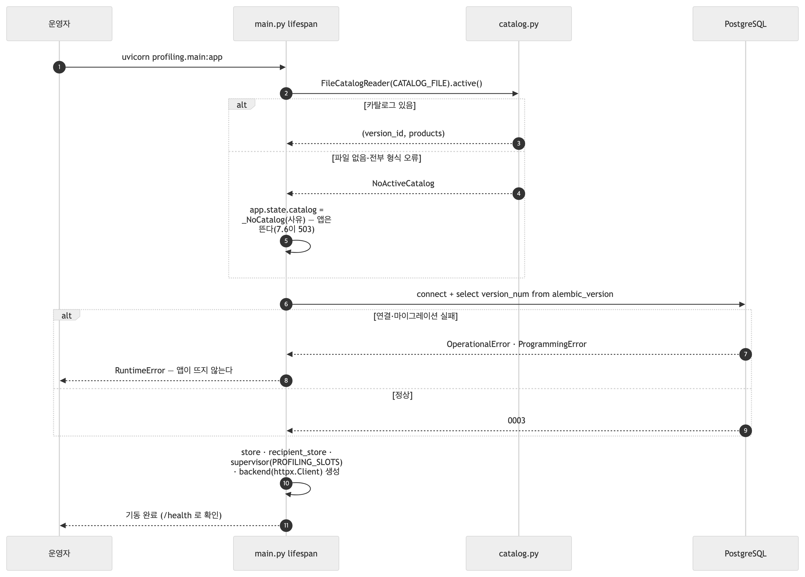

<!-- fig: 00-기동 -->
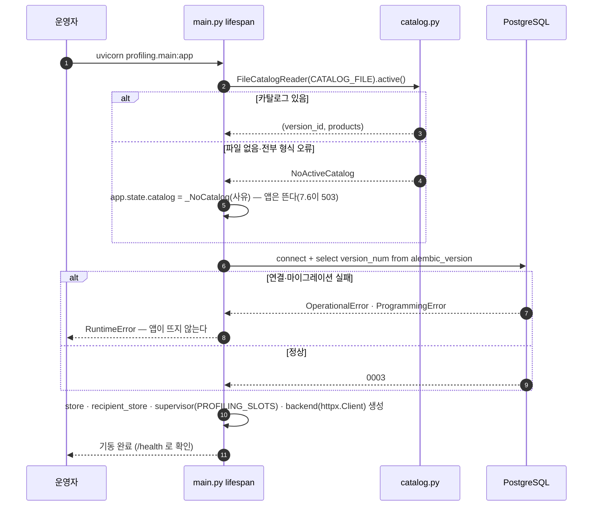

**규칙 두 개가 다르다.** 카탈로그가 없으면 앱은 뜨고 7.6이 503을 낸다(운영자가 적재하면 회복). DB가 없으면 **앱이 아예 뜨지 않는다** — 기록 없는 결과를 Backend에 보내지 않기 위해서다.

---

## 3. 성공 전체

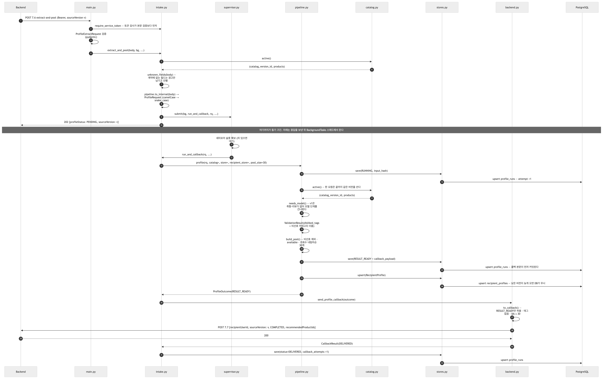

<!-- fig: 01-성공-전체 -->
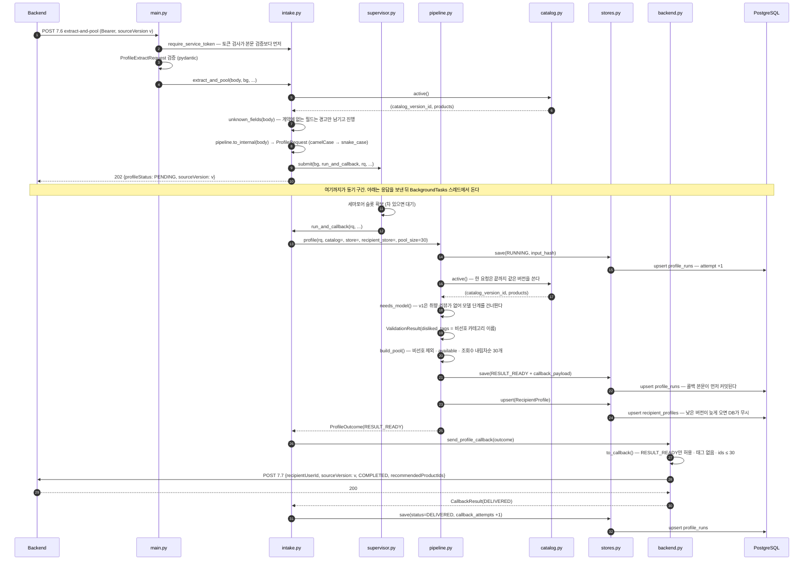

읽는 요령 셋.

1. **202는 카탈로그 확인까지만 보고 나간다.** 활성 카탈로그가 없다는 사실을 백그라운드에서 알게 되면 Backend는 영영 모르기 때문에, 그 검사만 접수 단계로 끌어올렸다.
2. **DB 쓰기가 콜백보다 먼저다.** `RESULT_READY + 콜백 본문`을 커밋한 다음에 7.7을 보낸다. 그래야 "보냈는데 우리 쪽에 기록이 없는" 상태가 생기지 않는다.
3. **같은 행을 세 번 쓴다.** `RUNNING → RESULT_READY → (콜백 결과)`. 키는 `(recipient_user_id, source_version)`이고, `RUNNING`으로 다시 들어올 때만 `attempt`가 올라간다.

---

## 4. 접수 단계에서 끝나는 경우

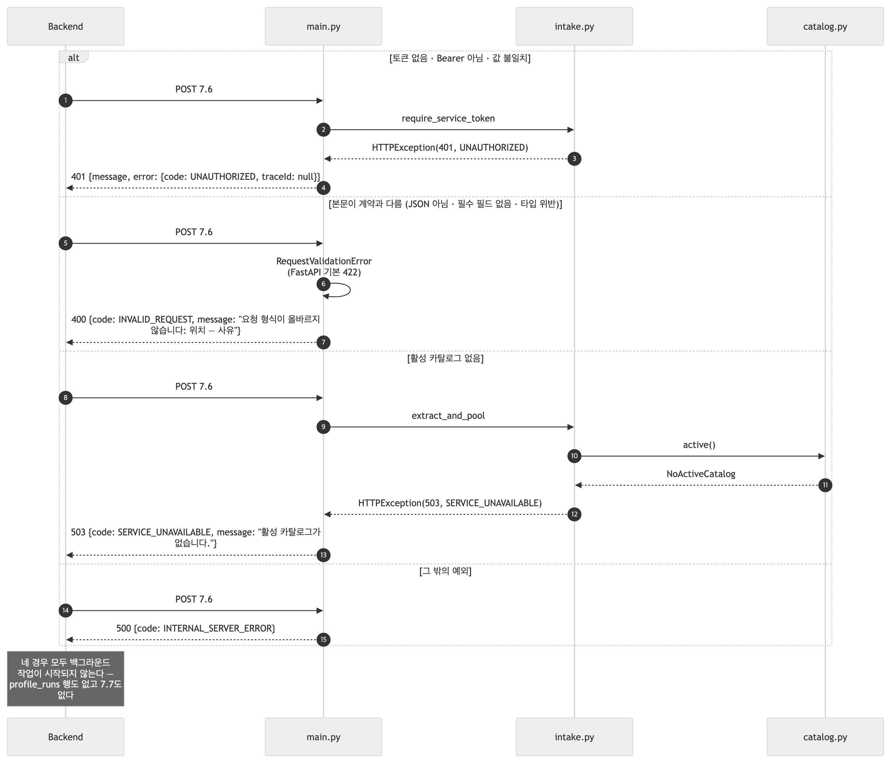

<!-- fig: 02-접수-거절 -->
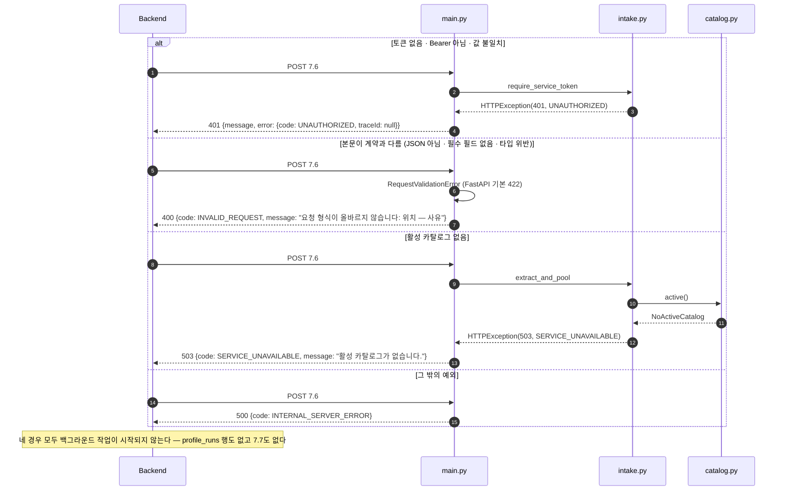

- **토큰과 본문이 둘 다 틀리면 401이 나온다.** FastAPI가 의존성을 본문보다 먼저 풀기 때문이고, 최소 앱으로 확인했다.
- 오류 응답은 전부 `main._error_response()` 하나를 지난다 — 봉투 모양이 어긋날 곳이 한 군데뿐이다.
- 403 FORBIDDEN은 지금 나오지 않는다(서비스 토큰이 하나뿐).

---

## 5. 분석 단계 실패 — 침묵

202를 이미 보낸 뒤라 Backend에 알릴 방법이 없다. **AI는 FAILED를 콜백하지 않는다.** Backend는 콜백이 오지 않으면 다음 디바운스 주기에 7.6을 다시 보낸다.

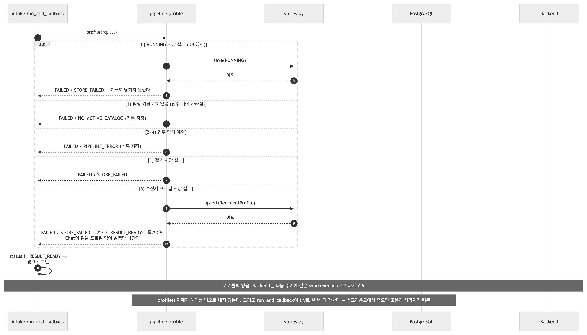

<!-- fig: 03-분석-실패 -->
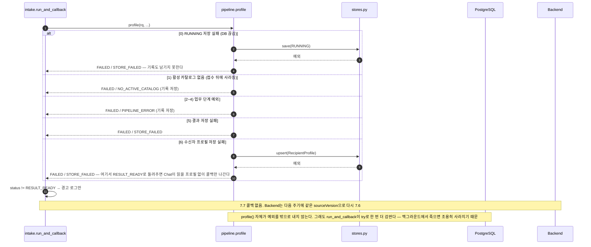

---

## 6. 콜백 결과 네 갈래

`backend._status_from_response()`가 HTTP 상태를 **실행 기록의 다음 상태**로 번역한다. 새 타입을 만들지 않고 `RunStatus` 하나로 돌려준다.

| 7.7 응답 | 다음 상태 | 오류 코드 | 뜻 |
|---|---|---|---|
| 200 | `DELIVERED` | — | 전달 완료 |
| 409 | `SUPERSEDED` | `CALLBACK_STALE` | 더 새 버전이 이미 저장됨 → 결과 폐기, 재시도 없음 (정상 경로) |
| 400 · 401 · 403 | `FAILED` | `CONTRACT_7_7_REJECTED` | 우리 쪽 버그나 토큰 → 재시도 없음 |
| 5xx · 타임아웃 · 연결 실패 | `RESULT_READY` | `CALLBACK_UNREACHABLE` | 아직 전달 못 함 → **재시도 대상**(오늘은 1회만 보내고 멈춘다) |

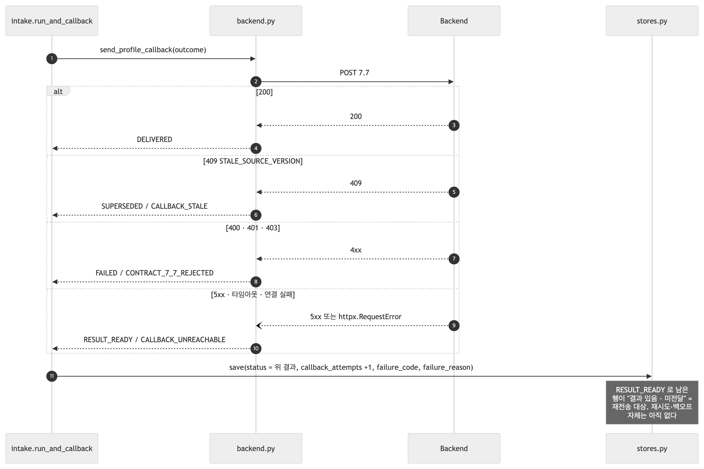

<!-- fig: 04-콜백-결과 -->
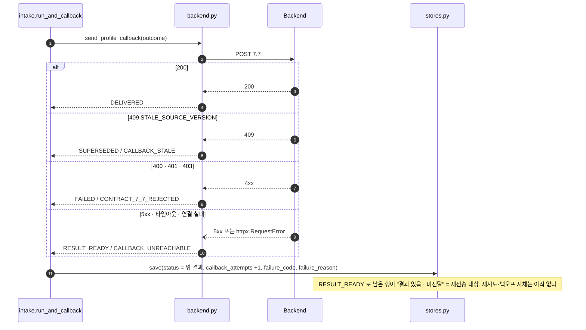

콜백 본문을 만들지 못하는 경우(`search`가 없음)도 한 갈래 더 있다 — `FAILED / PIPELINE_ERROR`로 돌려주고 HTTP는 나가지 않는다.

---

## 7. 동시 요청과 슬롯

`PROFILING_SLOTS`(기본 1)만큼만 동시에 분석한다. **접수는 막지 않는다** — 202는 바로 나가고, 분석만 줄을 선다. 거절하지 않는 이유는 Backend가 재시도하게 만드는 것보다 늦게라도 처리하는 편이 v1에 맞아서다.

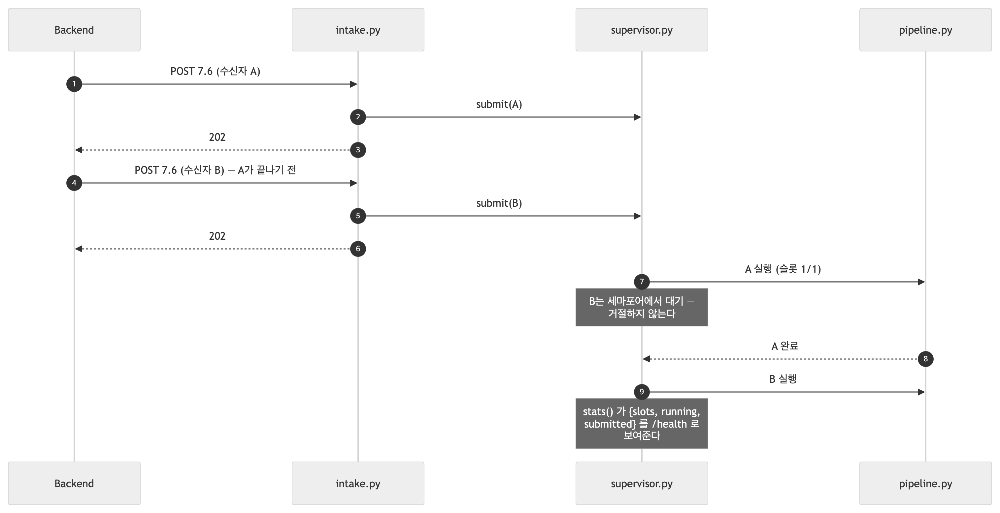

<!-- fig: 05-슬롯 -->
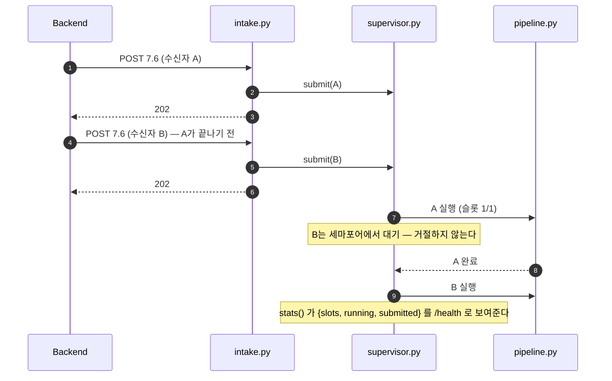

같은 수신자에게 두 요청이 연달아 오면 지금은 **둘 다 돌린다**. 뒤엣것이 `profile_runs`의 같은 행을 덮고 `attempt`가 올라간다. "RUNNING이면 새 분석 없음 · 결과가 있으면 재전송만"은 접수 단계에서 `store.get()`으로 판정해야 하는 다음 작업이다(8절).

---

## 8. 이 그림에 아직 없는 것

| 없는 것 | 지금 동작 | 들어갈 자리 |
|---|---|---|
| 접수 단계 중복 판정 | 같은 (수신자, 버전)도 다시 돌린다 | `intake.extract_and_pool` — `catalog.active()` 다음에 `store.get()` |
| 7.7 재시도 3회 + 재시작 복구 | 1회 보내고 멈춘다(`RESULT_READY`로 남음) | `intake.run_and_callback` · 기동 시 미전달 행 스캔 |
| 기한(timeout) · 취소 | 슬롯만 있다 | `supervisor.py` |
| 모델(LLM) 단계 · 검증기 · 팀원 Search | 취향·리뷰가 와도 경고만 남기고 v1 경로 | `pipeline.profile` 2~3단계 (v3) |
| DB 카탈로그 | 파일(`FileCatalogReader`) | `catalog.py`에 `DbCatalogReader` 추가 → `main.lifespan` 한 줄 교체. `backend_product_id`가 채워진 뒤 |

다음 할 일의 정본은 [파이프라인 지도](파이프라인_지도/)다 — 이 표는 그림과 코드 사이의 차이만 적는다.
