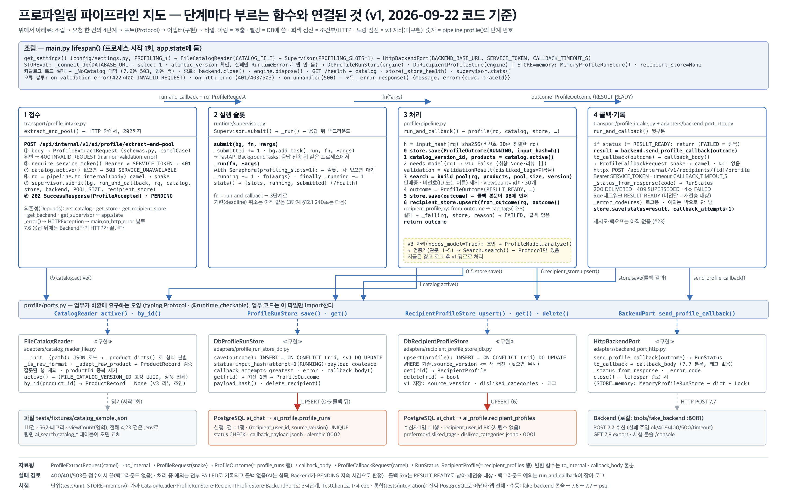

# 파이프라인 지도 — 2026-09-22 (첫 판: v1 완주 + 저장소 DB 전환)

| | |
|---|---|
| 기준 코드 | 브랜치 `feat/emet-profiler-init` · 커밋 `3daedc3` (+ 같은 날 오후 문서·테스트 갱신, 미커밋) |
| 범위 | **v1** — 비선호 카테고리만 반영. 취향 문장·리뷰를 읽는 모델·검증기는 v3 |
| 동작 | 7.6 접수 → 202 → 백그라운드 → 비선호 제외·조회수순 30개 → 7.7 콜백 → 결과를 DB에 기록, **끝까지 됨** |
| 저장소 | PostgreSQL(`docker compose`) — `ai_profile.profile_runs`(실행 기록) · `ai_profile.recipient_profiles`(수신자 프로필). 카탈로그는 아직 파일 |
| 테스트 | `uv run pytest -q` → **64 passed, 3 skipped**(v3 stub). DB 꺼져 있으면 통합 13개 skip |
| 지난 판 | 없음 (첫 판). 어제(09-21)까지는 파일 카탈로그 + 메모리 저장, 프로필 저장 없음 |



## 0. 30초 요약 (처음 보는 사람용)

Backend가 "이 수신자는 이 카테고리를 싫어한다"를 **7.6**으로 보내면, 우리는 바로 `202`를 돌려주고 뒤에서 상품 목록에서 그 카테고리를 뺀 뒤 조회수 높은 순으로 30개를 골라 **7.7**로 돌려준다. 그 사이 무슨 일이 있었는지는 DB 두 테이블에 남는다. 모델(LLM)은 아직 안 쓴다. 코드는 "업무(무엇을 어떤 순서로)"와 "바깥(파일·DB·HTTP)"이 분리돼 있어서, 바깥을 바꿔도 업무 코드는 그대로다 — 오늘 저장소를 메모리에서 DB로 바꿀 때 `pipeline.py`의 순서는 안 바뀌었다.

## 1. 단계별 — 지금 부르는 함수

| 단계 | 파일 | 함수 (하는 일) |
|---|---|---|
| 조립 (시작 1회) | `main.py` | `lifespan()` — 설정 읽고 어댑터 4개를 만들어 `app.state`에 둠. `_connect_db()` — DB 접속·마이그레이션 버전 확인, 실패면 앱이 **안 뜸**(조용히 메모리로 안 내려감). 오류 봉투 핸들러 3개(400/401·503/500). `GET /health` |
| ① 접수 | `transport/profile_intake.py` | `extract_and_pool()` — 본문 검증(틀리면 400) → `require_service_token()`(401) → 카탈로그 있나(없으면 503) → `pipeline.to_internal()`(camelCase→snake_case) → `supervisor.submit()` → **202 PENDING**. 여기서 Backend와의 HTTP는 끝 |
| ② 슬롯 | `runtime/supervisor.py` | `Supervisor.submit()` — 응답 뒤 실행할 작업 등록. `_run()` — 세마포어(동시 1)를 잡고 `run_and_callback` 실행. `stats()` — `/health`용 |
| ③ 처리 | `profile/pipeline.py` | `profile()` — **0** `store.save(RUNNING)` → **1** `catalog.active()` → **2** `needs_model()`(v1은 False) → `ValidationResult(비선호 이름)` → **3** `build_pool()`(판매중·비선호 제외·조회수↓·30) → **4** `ProfileOutcome(RESULT_READY)` → **5** `store.save()` → **6** `recipient_store.upsert(from_outcome())`. 어디서든 실패하면 `_fail()` → FAILED, 콜백 없음. `input_hash()` — 요청 본문 해시(같은 키·다른 입력 감지) |
| ④ 콜백·기록 | `transport/profile_intake.py` · `adapters/backend_port_http.py` | `run_and_callback()` — RESULT_READY면 `send_profile_callback()`: `callback_body()`(7.7 본문, 태그 없음) → POST → 응답 코드를 `RunStatus`로(200 DELIVERED · 409 SUPERSEDED · 4xx FAILED · 5xx RESULT_READY) → `store.save(그 상태, callback_attempts+1)` |
| 포트 | `profile/ports.py` | `CatalogReader` · `ProfileRunStore` · `RecipientProfileStore` · `BackendPort` (Protocol — 업무 코드가 바깥에 요구하는 모양). v3용 `ProfileModel` · `Embedder`는 선언만 |
| 어댑터 | `adapters/` | `FileCatalogReader`(파일→상품 목록) · `DbProfileRunStore`(profile_runs UPSERT 한 문장) · `DbRecipientProfileStore`(recipient_profiles UPSERT, 낮은 버전 무시) · `HttpBackendPort`(7.7 POST) · `MemoryProfileRunStore`(STORE=memory, 단위 테스트) |
| 바깥 | | `tests/fixtures/catalog_sample.json`(111건) · PostgreSQL `ai_chat`(alembic 0001·0002) · Backend — 로컬은 `tools/fake_backend`(:8081, 7.7 수신·7.9 export·시험 콘솔) |

자료형은 네 개만 기억하면 된다: `ProfileExtractRequest`(7.6 본문) → `ProfileRequest`(내부) → `ProfileOutcome`(= profile_runs 한 행) → `ProfileCallbackRequest`(7.7 본문). 변환 함수는 `to_internal`·`callback_body` 둘뿐.

## 2. 지난 판(09-21)에서 바뀐 것

| 무엇 | 왜 | 어디 |
|---|---|---|
| 실행 기록을 DB(`profile_runs`)에 | 재시작 후 재전송·중복 접수 판정·콜백 상태 갱신이 메모리로는 불가(설계 §10.2) | `adapters/profile_run_store_db.py`, 마이그레이션 `0002` |
| 수신자 프로필 저장(`recipient_profiles`) 연결 | Chat이 읽을 태그 저장소(DR-035). v1은 비선호 카테고리만 채움 | `adapters/recipient_profile_store_db.py`, `pipeline.profile()` 6단계, `recipient_profile.from_outcome()` |
| 접수 때 RUNNING 기록, 콜백 뒤 상태 기록 | 실행 1건의 처음과 끝이 DB에 남게 | `pipeline.profile()` 0단계, `run_and_callback()` 끝 |
| `ProfileOutcome`에 `input_hash`·`callback_attempts` | profile_runs 행과 1:1 | `profile/types.py` |
| `catalog_version_id` int → UUID | 팀원 `catalog_versions.id`와 같은 타입 | `types.py` · `catalog_reader_file.py`(고정 UUID `…0001`) |
| `STORE=db|memory` 설정 | 단위 테스트·DB 없는 로컬 | `config/settings.py`, `tests/unit/conftest.py` |
| DB 연결 실패 = 앱 시작 실패 | 콜백은 나가는데 기록이 없는 상태를 막기 위해 | `main._connect_db()` |
| 조회수순 30개(`viewCount`) | 09-22 Backend 합의: 초기엔 임의 조회수를 넣어 보냄 | `pipeline.build_pool()` |
| 콘솔에 30개 상품 표·sourceVersion 자동 증가 | 시험 편의 | `tools/fake_backend` |

자세한 설명·그림: [DB_전환_설명.md](../DB_전환_설명.md).

## 3. 돌려 보는 법과 확인 포인트

```bash
cd profiling && docker compose up -d && uv run alembic upgrade head
```

```bash
uv run uvicorn tools.fake_backend.app:app --port 8081
```

```bash
uv run uvicorn profiling.main:app --port 8000 --reload
```

브라우저 `http://localhost:8081/` → 7.6 보내기 탭에서 비선호 하나 고르고 전송.

확인 포인트:
- AI 시작 로그에 `DB 연결 localhost:5432/ai_chat migration=0002` — 없으면 DB가 안 떠 있거나 마이그레이션 전
- 콘솔 "7.7 받은 것" 탭에 30개 상품 표, 고른 비선호 카테고리가 없어야 함
- `curl -s localhost:8000/health` → `"store": {"backend": "db", "connected": true, "migration": "0002"}`
- DB: `docker compose exec ai-db psql -U ai_user -d ai_chat -c "select recipient_user_id, source_version, status, attempt, callback_attempts from ai_profile.profile_runs order by updated_at desc limit 5"` → 방금 보낸 수신자가 `DELIVERED`, `callback_attempts=1`
- 같은 수신자로 다시 보내면 `profile_runs`는 행이 늘고(버전마다 1행), `recipient_profiles`는 그 수신자 행이 갱신(수신자당 1행)
- 테스트: `uv run pytest -q` → 64 passed

DB를 켜고 끄는 법·상태 보는 법: [환경_설정.md](../환경_설정.md) · [DB_전환_설명.md §5](../DB_전환_설명.md).

## 4. 팀원이 알아야 할 결정·미결

| 항목 | 상태 | 내용 |
|---|---|---|
| v1 범위 | 결정 (PM, 09-15) | 비선호 카테고리 반영은 AI가 담당. 09/30 배포에 7.6·7.7 포함 |
| 풀 규칙 | 결정 (Backend, 09-22) | 비선호 제외 → 조회수 내림차순 → 30개. 동점은 productId 순. Backend가 초기엔 임의 조회수 |
| 7.7 태그 | **미결** | 작업본(v3.2.7)은 태그 없음(DR-035), 위키(v3.2.6)는 `preferredTags`·`dislikedTags` 필수. Backend가 위키대로 검증하면 우리 콜백은 400 |
| 7.9 조회수 필드 | **미결** | 위키 7.9에 조회수 없음. Backend 열은 `products.views`. 코드는 임시로 `viewCount` |
| 제외 vs 감점 | **미결** | 백로그 PB4·위키는 "우선순위 낮춤(감점)", 코드는 제외. 30개 안에서는 결과가 거의 같지만 화면에서 비선호 상품이 보이는지 여부는 Backend가 30개 뒤에 무엇을 붙이느냐에 달림 |
| 디바운스 | **미결** | 위키 7.6은 마지막 변경 1시간 뒤 호출. v1 시연에서 "저장 즉시 반영"을 기대하면 안 맞음 |
| 비선호 상한 5 | 결정 (Backend API) | Backend가 5개로 막음. 우리 스키마는 아직 잠그지 않음(잠가도 안전) |
| Backend 저장 테이블 | **미결** | Backend Table-Specification(09-22)에 sourceVersion·디바운스 시각·profileStatus·7.7 결과 저장 테이블이 없음 |
| JSONB 키 | 결정 | DB 안 JSON 키는 내부 이름(snake_case): `{"category_id", "category_name"}` |
| 실행 상태 열 | 결정 | `profile_runs.status`는 text + CHECK(PG enum 아님) — 상태 목록이 §10.5 합의로 바뀔 수 있어서 |
| 환경 | 보류 (09-21) | 지금은 `profiling/` 로컬 uv. 팀원 레이아웃(루트 `app/`, pip, 3.11)으로의 전환은 합칠 때 |

## 5. 다음 해야 할 일 (인수인계용)

우선순위 순. "끝났다고 보는 기준"이 통과하면 그 항목은 끝.

| # | 무엇 | 왜 | 어디 (파일 · 함수) | 끝났다고 보는 기준 | 크기 |
|---|---|---|---|---|---|
| 1 | **Backend 미팅 결과 반영** — 7.7 태그(`[]` 동봉 or 위키 갱신), 7.9 조회수 필드명(`views`?), 제외→감점이면 정렬키 `(비선호 여부, -조회수, id)`, 비선호 ≤5 잠금 | 위 미결 4개가 정해져야 실제 Backend와 붙음 | `transport/schemas.py`(`ProfileCallbackRequest`·`ProductRecord.viewCount`·`dislikedCategories max_length`) · `pipeline.build_pool()` · `tools/fake_backend`(같이 수정) | 콘솔 7.6 → 7.7 정상, `uv run pytest -q` 전부 통과, `이름_대조표.md` 갱신 | 각 한 줄 |
| 2 | **실제 Backend와 첫 연동** | 로컬 fake만 통과한 상태 | `.env`의 `PROFILING_BACKEND_BASE_URL`·`SERVICE_TOKEN` · Backend의 7.6 호출 시점(디바운스)·7.7 수신 확인 | Backend 서버로 7.7이 200 오고 `profile_runs.status=DELIVERED` | 반나절, Backend와 같이 |
| 3 | **접수 단계 중복 판정** | 설계 §10.2: 같은 (수신자, 버전)이 RUNNING이면 새 분석 없음, 결과 있으면 재전송만. 지금은 다시 돌림(`attempt+1`) | `transport/profile_intake.py` `extract_and_pool()` 앞부분 — `store.get()`으로 상태 보고 분기. 필요하면 `ProfileRunStore.get_run(rid, sv)` 추가 | 단위 테스트: 같은 요청 두 번 → `profile()` 한 번만 호출. 통합: `attempt`가 1 유지 | 반나절 |
| 4 | **배포 구성** — AI 앱 컨테이너를 compose에, 환경변수·서비스 토큰·이미지 빌드 | 09/30 배포 | `docker-compose.yml`에 `ai-app` 서비스 · `Dockerfile` 신설 · `alembic upgrade head`를 시작 명령에 | `docker compose up` 한 번으로 DB+앱이 뜨고 `/health`가 `connected: true` | 반나절 |
| 5 | `MemoryRecipientProfileStore` 채우기 | STORE=memory에서 프로필 저장을 건너뛰고 있음. 골격만 있고 ruff 지적 2건(I001·C408) | `adapters/recipient_profile_store_memory.py` — `upsert`(should_replace 규칙)·`get`·`delete` · `main.py` memory 분기 한 줄 | `tests/unit/test_recipient_profile.py::test_memory_store_upsert_get_delete` skip 해제 후 통과 | 1시간 |
| 6 | 콜백 재시도(5xx 최대 3회)·재시작 복구(RUNNING→FAILED 정리) | 설계 §10.2. 지금은 1회 전송, 5xx면 RESULT_READY로 남기만 함 | `adapters/backend_port_http.py` `send_profile_callback()` 안 재시도 · `main.lifespan` 시작 시 RUNNING 행 정리 | `test_backend_port_http.py`에 5xx 3회 후 종료 케이스 · 통합: 시작 시 RUNNING 행이 FAILED로 | 반나절 |
| 7 | 팀원 레이아웃으로 합치기 (uv 단일 pyproject, 루트 `app/`) | 09-21 보류 결정. 배포 전 필요 | `src/profiling/*` → `app/{profile,catalog,adapters,config}` · `settings.py` env 이름(`DATABASE_URL`·`INTERNAL_SERVICE_TOKEN`·`MAIN_BACKEND_URL`) · PR 초안은 브랜치 `chore/uv-environment` | 팀원 앱과 한 프로세스에서 `/health`·7.6 동작, 테스트 전부 통과 | 하루 |
| 8 | 팀원 카탈로그 DB로 교체 | 지금은 파일. 팀원 `ai_search.catalog_*`가 생기면 | `adapters/catalog_reader_db.py` 신설(`CatalogReader` 구현) · `main.lifespan` 한 줄 · 7.9 export → 적재 CLI | `catalog.active()`가 DB 활성 버전을 돌려주고 e2e 통과 | 반나절 |
| 9 | v3 — 마이그레이션 0003 · 검증기 이식(실험 `2_validate.py`) · `ProfileModel` 구현(규칙 추출기 1안, Ollama 2안) · Search 호출 | 취향·리뷰 반영 | `alembic/versions/0003_*.py`(README §5 5′행) · `pipeline.profile()` 2단계 · `adapters/model_*.py` · `recipient_profile.merge_explicit_dislikes`·`to_search_hint` | 실험 하네스와 같은 결과(Recall@30 71) · skip 3개 해제 | 여러 날 |

막히면 볼 것: [README.md](../../README.md)(구조·실행·테스트) · [코드_안내서.md](../코드_안내서.md)(파일·함수별 역할) · [DB_전환_설명.md](../DB_전환_설명.md)(테이블·저장 시점) · [이름_대조표.md](../../이름_대조표.md)(같은 뜻 다른 이름) · 설계 근거는 `KTB4_12team/AI/latest/01_모델_API_설계/담당파트_상세설계서_7.6_7.9.md`와 위키 `서비스-아키텍처-구현-상세` §10·§16.

연락 없이 이어받을 때의 첫 30분: 위 §3을 그대로 실행해 콘솔에서 30개가 오는지 확인 → `uv run pytest -q` → §5의 1번부터.
