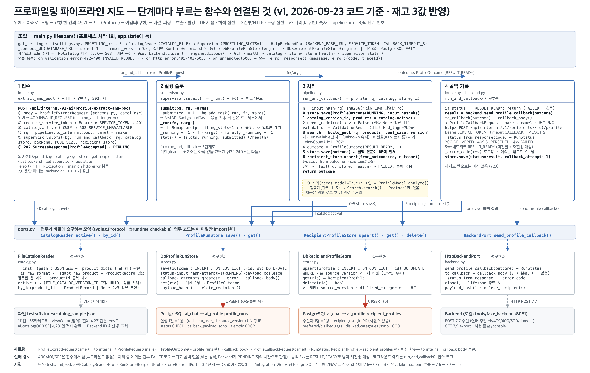

# 파이프라인 지도 — 2026-09-23 (구조 평탄화 + 저장소 DB 전용화)

| | |
|---|---|
| 기준 코드 | 브랜치 `integration/v1-profiling-search` · 커밋 `d2c3f41`(평탄화) + 저장소 DB 전용화 |
| 범위 | **v1** — 비선호 카테고리만 반영. 취향 문장·리뷰를 읽는 모델·검증기는 v3 |
| 동작 | 7.6 접수 → 202 → 백그라운드 → 비선호 제외·조회수순 30개 → 7.7 콜백 → 결과를 DB에 기록. **09-22와 같음 — 동작은 하나도 안 바뀌었다** |
| 저장소 | PostgreSQL **하나뿐** — `ai_profile.profile_runs` · `ai_profile.recipient_profiles`. 메모리 구현과 `PROFILING_STORE` 설정은 제거했다. 카탈로그는 아직 파일 |
| 테스트 | `uv run pytest -q` → **74 passed, 2 skipped**(v3 stub). 단위 58(DB 없이) · 통합 18(진짜 PostgreSQL, 없으면 skip) |
| 지난 판 | [2026-09-22.md](2026-09-22.md) |



## 0. 30초 요약 (이 판에서 달라진 것만)

**두 가지를 했다. ① 파일이 어디 있는지를 바꿨고(평탄화), ② 저장소를 PostgreSQL 하나로 좁혔다.**

①은 이렇다. 팀원의 검색기(`product-search/search/`)가 한 폴더 안에 모듈 네 개로 끝나는 데 비해 우리 쪽은 폴더 6개에 파일 13개였다. 폴더가 선언하던 계층을 코드가 이미 지키지 않고 있었으므로(`profile/ports.py`가 `transport/schemas`를, `adapters/profile_run_store_db.py`가 `adapters/backend_port_http`를 import했다) 폴더를 없애고 **`src/profiling/` 한 폴더에 모듈 11개**로 폈다. 경계를 지키는 것은 폴더가 아니라 `ports.py`(Protocol)이고, 그것은 그대로 남아 있다.

`from profiling.adapters.profile_run_store_db import DbProfileRunStore` → `from profiling.stores import DbProfileRunStore` 처럼 **import 경로만** 바뀐다.

②는 DB 없이 돌리려고 두었던 임시 구현(`MemoryProfileRunStore`·`MemoryRecipientProfileStore`)과 `PROFILING_STORE` 설정을 지운 것이다. 이제 앱은 PostgreSQL에 붙지 못하면 뜨지 않고, 저장을 건너뛰는 경로도 없다. 대신 **앱을 띄우는 시험은 전부 `tests/integration`으로** 옮겼다 — `tests/unit`은 가짜 구현만 쓰므로 여전히 DB 없이 돈다.

## 1. 단계별 — 지금 부르는 함수

| 단계 | 파일 | 함수 (하는 일) |
|---|---|---|
| 조립 (시작 1회) | `main.py` | `lifespan()` — 설정 읽고 구현 4개를 만들어 `app.state`에 둠. `_connect_db()` — DB 접속·마이그레이션 버전 확인, 실패면 앱이 **안 뜸**. 오류 봉투 핸들러 3개(400/401·503/500). `GET /health` |
| ① 접수 | `intake.py` | `extract_and_pool()` — 본문 검증(틀리면 400) → `require_service_token()`(401) → 카탈로그 있나(없으면 503) → `pipeline.to_internal()` → `supervisor.submit()` → **202 PENDING** |
| ② 슬롯 | `supervisor.py` | `Supervisor.submit()` → `_run()` — 세마포어(동시 1)를 잡고 `run_and_callback` 실행. `stats()` — `/health`용 |
| ③ 처리 | `pipeline.py` | `profile()` — **0** `store.save(RUNNING)` → **1** `catalog.active()` → **2** `needs_model()`(v1은 False) → **3** `build_pool()`(재고 `unavailable`만 제외·비선호 제외·조회수↓·30) → **4** `ProfileOutcome(RESULT_READY)` → **5** `store.save()` → **6** `recipient_store.upsert(from_outcome())`. 실패는 `_fail()` → FAILED, 콜백 없음 |
| ④ 콜백·기록 | `intake.py` · `backend.py` | `run_and_callback()` → `send_profile_callback()`: `callback_body()`(7.7 본문, 태그 없음) → POST → `CallbackResult`(200 DELIVERED · 409 SUPERSEDED · 4xx FAILED · 5xx RESULT_READY) → `store.save(그 상태, callback_attempts+1)` |
| 포트 | `ports.py` | `CatalogReader` · `ProfileRunStore` · `RecipientProfileStore` · `BackendPort` — Protocol 4개. **v3용 `ProfileModel`·`Embedder` 선언은 지웠다**(v3에 들어올 때 다시 추가, §5 9번) |
| 구현(어댑터) | `catalog.py` · `stores.py` · `backend.py` | `FileCatalogReader` / `DbProfileRunStore`·`DbRecipientProfileStore` / `HttpBackendPort` — 저장소는 PostgreSQL뿐 |
| 자료형 | `types.py` · `schemas.py` | `schemas.py` = 바깥 계약(camelCase, 7.6·7.7·7.9), `types.py` = 내부(snake_case) + `RecipientProfile` 행과 갱신 규칙(`from_outcome`·`should_replace`·`cap_tags`) |
| 공개 표면 | `__init__.py` | `profile` · `ProfileRequest` · `ProfileOutcome` · `RunStatus` · `ErrorCode` · `Settings` · `get_settings` — 다른 모듈은 이것만 쓰면 된다 |
| 바깥 | | `tests/fixtures/catalog_sample.json`(111건) · PostgreSQL `ai_chat`(alembic 0001·0002) · Backend — 로컬은 `tools/fake_backend`(:8081) |

## 2. 지난 판(09-22)에서 바뀐 것

| 무엇 | 왜 | 어디 |
|---|---|---|
| **패키지 평탄화** — 6폴더 13모듈 → 1폴더 11모듈 | 팀원 검색기와 같은 모양. 폴더가 선언한 계층을 코드가 지키지 않고 있었음 | `src/profiling/*` 전부 (아래 표) |
| `recipient_profile.py`를 `types.py`에 합침 | 프로필 행과 그 값의 규칙이 같은 곳에 | `types.py` 뒤쪽 "수신자 프로필" 절 |
| 저장소 4파일을 `stores.py` 하나로 | 같은 계약의 구현이 한곳에 보이게. 이름 충돌은 `RUNS_TABLE`/`PROFILES_TABLE`로 해소 | `stores.py` |
| **메모리 저장소 제거** — `MemoryProfileRunStore`·`MemoryRecipientProfileStore`·`PROFILING_STORE` 설정·`main.py`의 분기 | 이제 DB로만 시험한다. 두 갈래를 유지하면 "DB에서만 나는 문제"를 단위 테스트가 못 잡는다 | `stores.py` · `settings.py` · `main.py` |
| `recipient_store`가 `None`일 수 있던 경로 제거 | 메모리 모드 때문에 있던 분기. 프로필 저장을 조용히 건너뛸 수 있었다 | `pipeline.profile()` · `intake.get_recipient_store()` |
| 앱을 띄우는 시험을 통합으로 이동 | 앱 lifespan이 DB에 붙으므로 더는 단위가 아니다 | `tests/unit/test_e2e_transport.py` → `tests/integration/test_e2e_app.py`, `test_catalog_fixture.py`의 `/health` 시험도 같이 |
| **상품 카탈로그 DB 적재** — 마이그레이션 `0003`(`ai_catalog.categories`·`products`·`catalog_versions`) + `tools/catalog/load_catalog.py`. Backend 전달 패키지 `product-catalog-20260922-v1`의 상품 4,231건·대분류 10·소분류 57을 넣었다 | 파일 카탈로그를 DB로 옮기는 첫 단계. 그리고 Backend ID 회신을 받을 자리(`backend_product_id`·`backend_category_id`)가 필요했다 | `alembic/versions/0003_catalog.py` · `tools/catalog/load_catalog.py` · `tests/{unit/test_load_catalog,integration/test_db_catalog}.py` |
| 빈 `catalog/` 패키지 삭제 | `.gitkeep`과 빈 `__init__.py`뿐이었음 | — |
| v3 포트 선언 2개 제거 | v1에서 아무도 안 씀. v3에 들어올 때 추가 | `ports.py` |
| `__init__.py`를 공개 표면으로 | 팀원 `search/__init__.py`와 같은 방식 | `__init__.py` |
| 테스트 파일 2개 이름 변경 | 없어진 모듈 이름을 달고 있었음 | `test_adapters_file_memory.py`→`test_catalog_stores.py`, `test_backend_port_http.py`→`test_backend.py` |
| (09-22 밤) 통합 브랜치 생성 | 팀원 검색기와 한 트리에서 맞춰 보려고 | `integration/v1-profiling-search` = `main` + 프로파일링 + `product-search/`·`workbench/` |

### 옛 경로 → 새 경로

| 옛 | 새 |
|---|---|
| `transport/schemas.py` | `schemas.py` |
| `transport/profile_intake.py` | `intake.py` |
| `profile/types.py` · `profile/recipient_profile.py` | `types.py` |
| `profile/ports.py` | `ports.py` |
| `profile/pipeline.py` | `pipeline.py` |
| `runtime/supervisor.py` | `supervisor.py` |
| `config/settings.py` | `settings.py` |
| `adapters/catalog_reader_file.py` | `catalog.py` |
| `adapters/backend_port_http.py` | `backend.py` |
| `adapters/profile_run_store_{db,memory}.py` · `adapters/recipient_profile_store_{db,memory}.py` | `stores.py` |

숫자: 파일 20개(빈 `__init__.py` 7 포함)·폴더 6개 → 파일 12개·폴더 1개. 전체 1,943줄 → 1,860줄, **실제 코드는 921줄 → 923줄**(공개 표면 `__init__.py`만큼만 늘었다 = 로직은 안 건드렸다는 뜻).

## 3. 돌려 보는 법과 확인 포인트

```bash
cd profiling && docker compose up -d && uv run alembic upgrade head
```

```bash
uv run uvicorn tools.fake_backend.app:app --port 8081
```

```bash
uv run uvicorn profiling.main:app --port 8000 --reload
```

브라우저 `http://localhost:8081/` → 7.6 보내기 탭에서 비선호 하나 고르고 전송. 확인 포인트는 [09-22 §3](2026-09-22.md)과 **같다**. 이 판에서 더 볼 것:

- `uv run pytest -q` → **74 passed, 2 skipped**
- 단위가 정말 DB 없이 도는지: `PROFILING_DATABASE_URL="postgresql+psycopg://x:x@127.0.0.1:1/none" uv run pytest tests/unit -q` → 56 passed, 2 skipped
- 통합이 DB 없으면 건너뛰는지: 같은 환경변수로 `uv run pytest tests/integration -q` → 18 skipped
- `uv run python -c "import profiling; print(profiling.__all__)"` → 공개 표면 7개
- `uv run ruff check src tests tools alembic` → `All checks passed!` (C408 지적은 목 코드와 함께 사라졌다)

## 4. 팀원이 알아야 할 결정·미결

09-22의 미결(7.7 태그 · 7.9 조회수 필드명 · 제외 vs 감점 · 디바운스 · Backend 저장 테이블)은 **그대로**다 — [09-22 §4](2026-09-22.md) 참조. 이 판에서 더해진 것:

| 항목 | 상태 | 내용 |
|---|---|---|
| 패키지 모양 | 결정 (09-23) | 팀원 검색기와 같이 한 폴더 평면. 계층은 폴더가 아니라 `ports.py`가 지킨다 |
| 상품·카테고리 ID | **미결 (확인됨)** | 전달 패키지 `product-catalog-20260922-v1`을 확인한 결과 **Backend ID는 아직 발급 전**이다(`mapping-templates/*.jsonl` 전부 null, `summary.notProvided`에 "Backend database IDs"). 우리 `ai_catalog`는 수집처 ID를 PK로 두고 `backend_*_id` 열을 비워 두었다. Backend 회신 → `load_catalog --id-map` |
| 상품·카테고리 ID 회신 | 결정 (09-23) | Backend가 **DB 적재 시 자동 발급**하고, 적재가 끝나면 매핑 상태를 알려주기로 했다. 우리는 회신을 받아 `load_catalog --id-map`으로 채운다 — 설계 변경 없음 |
| 재고(availability) | 결정 (09-23) | 검색기와 같은 **3값**(`available` 재고 있음 · `unavailable` 재고 없음 · `unknown` 재고 정보 없음)으로 간다. 추천 풀은 **`unavailable`만 제외**하고 `unknown`은 넣어서 Backend에 보낸다 — 실제 재고를 아는 Backend가 최종 판단한다. 패키지 적재분 4,231건은 전건 `unknown`이라, 이 규칙이 아니면 풀이 0건이 된다 |
| 조회수(viewCount) | **논의 중** | 패키지에 조회수 필드가 없고 정렬 기준 자체가 아직 논의 중이다. 지금 코드는 `(-viewCount, productId)` 그대로 두었고, 전건 0이면 productId 오름차순으로 떨어져 결정적으로 동작한다 |
| DB 없이 앱 띄우기 | 결정 (09-23) | 수단이 없다. `docker compose up -d && uv run alembic upgrade head`가 전제. 연결 실패는 앱 시작 실패 |
| 독스트링 분량 | 미결 | 코드의 27%가 설계 설명. 내용을 `docs/`로 옮기고 코드에는 한 줄만 남기는 안이 있음(§5 10번) |

## 5. 다음 해야 할 일 (인수인계용)

우선순위 순. "끝났다고 보는 기준"이 통과하면 그 항목은 끝.

| # | 무엇 | 왜 | 어디 (파일 · 함수) | 끝났다고 보는 기준 | 크기 |
|---|---|---|---|---|---|
| 1 | **Backend 미팅 결과 반영** — 7.7 태그, 7.9 조회수 필드명, 제외→감점이면 정렬키 `(비선호 여부, -조회수, id)`, 비선호 ≤5 잠금 | 미결 4개가 정해져야 실제 Backend와 붙음 | `schemas.py`(`ProfileCallbackRequest`·`ProductRecord.viewCount`·`dislikedCategories max_length`) · `pipeline.build_pool()` · `tools/fake_backend` | 콘솔 7.6 → 7.7 정상, `uv run pytest -q` 전부 통과, `이름_대조표.md` 갱신 | 각 한 줄 |
| 2 | **상품 ID를 Backend 기준으로 재적재** | 7.7로 보내는 30개가 Backend에 없는 번호면 화면에 아무것도 안 뜬다. 지금은 우리도 팀원도 수집처 ID를 쓰는 중 | Backend 상품 목록(파일 또는 7.9) → `tools/catalog/fetch_export.py --compare-db` → `catalog.py` 재적재 · 팀원 쪽 `workbench/dylan/schema.sql`(TEXT→BIGINT)·`product-search/search/models.py`(`list[str]`→`list[int]`)·`tools/prepare_catalog.py` | `fetch_export.py --compare-db`가 "AI에만 있는 ID 0건" | 반나절 (Backend 목록 필요) |
| 3 | **실제 Backend와 첫 연동** | 로컬 fake만 통과한 상태 | `.env`의 `PROFILING_BACKEND_BASE_URL`·`SERVICE_TOKEN` · Backend의 7.6 호출 시점(디바운스)·7.7 수신 확인 | Backend 서버로 7.7이 200 오고 `profile_runs.status=DELIVERED` | 반나절, Backend와 같이 |
| 4 | **접수 단계 중복 판정** | 설계 §10.2: 같은 (수신자, 버전)이 RUNNING이면 새 분석 없음, 결과 있으면 재전송만. 지금은 다시 돌림(`attempt+1`) | `intake.extract_and_pool()` 앞부분 — `store.get()`으로 상태 보고 분기. 필요하면 `ProfileRunStore.get_run(rid, sv)` 추가 | 단위: 같은 요청 두 번 → `profile()` 한 번만. 통합: `attempt`가 1 유지 | 반나절 |
| 5 | **배포 구성** — AI 앱 컨테이너를 compose에, 환경변수·서비스 토큰·이미지 빌드 | 09/30 배포 | `docker-compose.yml`에 `ai-app` · `Dockerfile` 신설 · `alembic upgrade head`를 시작 명령에 | `docker compose up` 한 번으로 DB+앱이 뜨고 `/health`가 `connected: true` | 반나절 |
| 7 | 콜백 재시도(5xx 최대 3회)·재시작 복구(RUNNING→FAILED 정리) | 설계 §10.2. 지금은 1회 전송, 5xx면 RESULT_READY로 남기만 함 | `backend.send_profile_callback()` 안 재시도 · `main.lifespan` 시작 시 RUNNING 행 정리 | `test_backend.py`에 5xx 3회 후 종료 케이스 · 통합: 시작 시 RUNNING 행이 FAILED로 | 반나절 |
| 8 | 팀원 카탈로그 DB로 교체 | 지금은 파일. 팀원 `ai_search.*`가 생기면 | `catalog.py`에 DB 구현 추가(`CatalogReader`) · `main.lifespan` 한 줄 | `catalog.active()`가 DB 활성 버전을 돌려주고 e2e 통과 | 반나절 |
| 9 | v3 — 마이그레이션 0003 · 검증기 이식(실험 `2_validate.py`) · `ProfileModel` 구현(규칙 추출기 1안, Ollama 2안) · Search 호출 | 취향·리뷰 반영 | `alembic/versions/0003_*.py` · `pipeline.profile()` 2단계 · `model.py` 신설 · `ports.py`에 `ProfileModel`·`Embedder` 다시 추가 · `types.merge_explicit_dislikes`·`to_search_hint` | 실험 하네스와 같은 결과(Recall@30 71) · skip 3개 해제 | 여러 날 |
| 10 | 독스트링의 설계 근거를 `docs/`로 이관 | 코드의 27%가 설명문(팀원 코드는 1%). 읽는 사람은 `코드_안내서.md`를 보면 됨 | `ports.py`·`stores.py`·`pipeline.py`의 문단형 독스트링 → 한 줄로, 내용은 `docs/코드_안내서.md` | 코드 줄 수 대비 주석 비율 10% 이하, 문서에서 같은 내용이 검색됨 | 반나절 |
| 11 | 동시성 — Supervisor 세마포어가 anyio 스레드풀을 붙잡는 문제 | 동시 100건은 통과했으나(0.64초) 슬롯 대기 중 스레드를 점유. 전용 워커 스레드+큐 / 비동기 의존성 / 큐 상한+503 3안 | `supervisor.py` · `intake.py` | 동시 100건에서 `/health` p50이 부하 없을 때와 같음 | 반나절 |

막히면 볼 것: [README.md](../../README.md)(구조·실행·테스트) · [코드_안내서.md](../코드_안내서.md)(파일·함수별 역할) · [DB_전환_설명.md](../DB_전환_설명.md)(테이블·저장 시점) · [이름_대조표.md](../../이름_대조표.md)(같은 뜻 다른 이름) · [BE_연동_필드표.md](../BE_연동_필드표.md)(BE 전달본) · 설계 근거는 `KTB4_12team/AI/latest/01_모델_API_설계/담당파트_상세설계서_7.6_7.9.md`와 위키 `서비스-아키텍처-구현-상세` §10·§16.

연락 없이 이어받을 때의 첫 30분: 위 §3을 그대로 실행해 콘솔에서 30개가 오는지 확인 → `uv run pytest -q` → §5의 1번부터.
