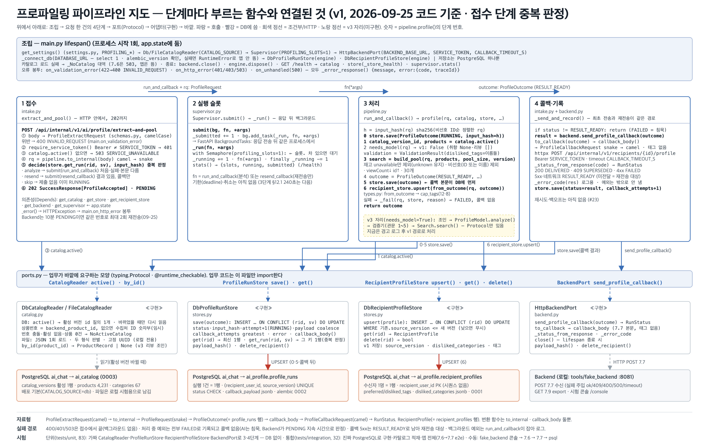

# 파이프라인 지도 — 2026-09-25 (접수 단계 중복 판정)

| | |
|---|---|
| 기준 코드 | 브랜치 `integration/v1-profiling-search` · 09-25 작업분(카탈로그 DB 읽기 → ERD 문서 → 중복 판정) |
| 범위 | **v1** — 비선호 카테고리만 반영. 취향 문장·리뷰를 읽는 모델·검증기는 v3 |
| 동작 | 7.6 접수 → **중복 판정** → 202 → 백그라운드 → 재고 없음·비선호 제외 → 조회수순 30개 → 7.7 콜백 → 결과를 DB에 기록 |
| 저장소 | PostgreSQL — `ai_profile`(실행 기록·수신자 프로필) · `ai_catalog`(카탈로그 4,231건). 표 구조는 [DB_ERD.md](../DB_ERD.md) |
| 테스트 | `uv run pytest -q` → **113 passed, 2 skipped**. 단위 83(DB 없이) · 통합 32(진짜 PostgreSQL) |
| 지난 판 | [2026-09-23.md](2026-09-23.md) |



## 0. 30초 요약

**Backend가 같은 `sourceVersion`으로 재전송하기로 했다(09-25).** AI 추천이 10분 동안 `PENDING`이면 최대 2회, 횟수는 Backend `profiles.retry_count`에 둔다. AI는 실패해도 콜백을 보내지 않으므로(침묵), 재전송이 없으면 사용자가 취향을 다시 고칠 때까지 그 수신자는 계속 실패 상태로 남는다 — 우리 필드표 §3.4 ⑤가 먼저 권고했던 구멍이다.

**AI 쪽 DB 변경은 없다.** `retry_count`는 Backend 표의 열이고, 우리는 이미 `profile_runs.attempt`(분석 재실행)·`callback_attempts`(콜백 시도)로 센다.

**대신 접수 단계 중복 판정을 구현했다.** 그전에는 같은 `(수신자, 번호)`가 다시 오면 전체 재분석을 또 돌리고 콜백을 또 보냈다. 이제 기존 실행 기록을 보고 셋 중 하나로 간다 — **analyze**(처음·실패·본문 다름·죽은 RUNNING) · **resend**(결과 있음 → 재분석 없이 저장된 본문 재전송) · **skip**(이미 분석 중). 어느 쪽이든 응답은 202 PENDING이다.

## 1. 단계별 — 지금 부르는 함수

| 단계 | 파일 | 함수 (하는 일) |
|---|---|---|
| 조립 (시작 1회) | `main.py` | `lifespan()` — `_connect_db()` → `DbCatalogReader`(`CATALOG_SOURCE=db`) 또는 `FileCatalogReader` → 저장소·Supervisor·Backend. 오류 봉투 핸들러 3개 · `GET /health`(카탈로그 활성·`provisional_ids`·저장소·슬롯) |
| ① 접수 | `intake.py` | `extract_and_pool()` — 본문 검증(400) → `require_service_token()`(401) → `catalog.active()`(503) → `to_internal()` → **`decide(store.get_run(rid, sv), input_hash)`** → analyze/resend/skip → **202 PENDING** |
| ② 슬롯 | `supervisor.py` | `Supervisor.submit()` → `_run()` — 세마포어(동시 1). 넘기는 함수가 `run_and_callback`(분석) 또는 `resend_callback`(재전송만) |
| ③ 처리 | `pipeline.py` | `profile()` — **0** `save(RUNNING)` → **1** `catalog.active()` → **2** `needs_model()` → **3** `build_pool()`(재고 `unavailable`만 제외·비선호 제외·조회수↓·30) → **4** `RESULT_READY` → **5** `save()` → **6** `recipient_store.upsert()` |
| ④ 콜백·기록 | `intake.py` · `backend.py` | `_send_and_record()` — 최초 전송과 재전송이 **같은 경로**. `send_profile_callback()` → `CallbackResult`(200 DELIVERED · 409 SUPERSEDED · 4xx FAILED · 5xx RESULT_READY) → `store.save(그 상태, callback_attempts+1)` |
| 포트 | `ports.py` | `CatalogReader` · `ProfileRunStore`(**`get_run()` 추가**) · `RecipientProfileStore` · `BackendPort` |
| 구현(어댑터) | `catalog.py` · `stores.py` · `backend.py` | `DbCatalogReader`·`FileCatalogReader` / `DbProfileRunStore`·`DbRecipientProfileStore` / `HttpBackendPort` |
| 바깥 | | PostgreSQL `ai_chat`(alembic 0001·0002 `ai_profile` · 0003 `ai_catalog` 4,231건) · Backend — 로컬은 `tools/fake_backend`(:8081) |

## 2. 지난 판(09-23)에서 바뀐 것

| 무엇 | 왜 | 어디 |
|---|---|---|
| **접수 단계 중복 판정** — `decide()`(순수 함수) + `resend_callback()` + `_send_and_record()` 분리 | Backend가 같은 번호로 최대 3회(최초+2) 보내게 되어, 분석이 겹쳐 돌거나 같은 결과를 다시 만드는 일을 막아야 했다 | `intake.py` · 단위 시험 18개 |
| `ProfileRunStore.get_run(rid, sv)` | `get()`은 "최신 한 건"이라 키를 지정해 찾을 수 없었다 | `ports.py` · `stores.py`(`_RUN_BY_KEY` · 행→`ProfileOutcome` 변환을 `_to_outcome()`으로 공용화) |
| `ProfileOutcome.updated_at` (읽을 때만) | RUNNING이 아직 살아 있는지 보려면 마지막 갱신 시각이 필요하다 | `types.py` |
| `RUNNING_STALE_S`(기본 300초) | 죽은 프로세스가 남긴 RUNNING 행에 막혀 재시도가 전부 무시되지 않게. Backend 타임아웃(10분)보다 짧아야 의미가 있다 | `settings.py` |
| 필드표 v1 §3.4 ①·⑤ 정정 + §4.6 시퀀스 + **§5 신설** | 우리 문서는 "재전송은 새 번호로"였는데 Backend 제안은 같은 번호다. 같은 번호가 AI에 유리해 문구를 고쳤다. §5는 목차에만 있고 본문이 없었다 | `docs/BE_연동_필드표_v1.md` |

마이그레이션은 추가하지 않았다(`0003`이 그대로 head).

## 3. 돌려 보는 법과 확인 포인트

```bash
cd profiling && docker compose up -d && uv run alembic upgrade head
```

- `uv run pytest -q` → **113 passed, 2 skipped**
- 단위가 DB 없이 도는지: `PROFILING_DATABASE_URL="postgresql+psycopg://x:x@127.0.0.1:1/none" uv run pytest tests/unit -q` → 81 passed, 2 skipped
- 통합이 DB 없으면 건너뛰는지: 같은 환경변수로 `uv run pytest tests/integration -q` → 32 skipped
- `uv run ruff check src tests tools alembic` → `All checks passed!`
- **중복 판정 눈으로 보기** — `tools/fake_backend`(:8081) 콘솔에서 같은 본문을 두 번 보낸다. 두 번째 로그에 `7.6 중복 판정 … → resend`와 `7.7 재전송 … 재분석 없음`이 찍히고 `profile …` 로그는 **없다**. `psql`로 `select attempt, callback_attempts from ai_profile.profile_runs …` → `1, 2`

## 4. 팀원이 알아야 할 결정·미결

| 항목 | 상태 | 내용 |
|---|---|---|
| 재전송 번호 | 결정 (09-25) | **같은 `sourceVersion`**으로 최대 2회. 새 번호는 7.6이 접수조차 안 됐을 때(503·무응답)만 |
| 재전송 본문 | **확인 요청** | 최초와 같아야 한다. 다르면 AI가 `input_hash`로 감지해 재분석한다 — 입력이 바뀐 것이면 새 번호로 보내야 한다 |
| 2회 소진 후 | **확인 요청** | `FAILED` 유지 + 사용자가 다시 고칠 때만 새 7.6인지 |
| 다중 인스턴스 | **확인 요청** | `retry_count` 증가를 조건부 원자 갱신(`… WHERE retry_count < 2`)으로 |
| 10분 타임아웃 | 제안 | v1 처리는 밀리초 단위라 3분이면 복구가 빠르다. 모델이 붙는 v3에서 재조정 |
| 상품·카테고리 ID | 대기 | Backend가 DB 적재 후 매핑 회신 → `load_catalog --id-map`. 그전까지는 임시 번호(`/health`의 `provisional_ids`) |

## 5. 다음 해야 할 일 (인수인계용)

| # | 무엇 | 왜 | 어디 | 끝났다고 보는 기준 | 크기 |
|---|---|---|---|---|---|
| 1 | **배포 구성** — `Dockerfile` · compose `ai-app` · `alembic upgrade head` 실행 위치 결정 | 09/30 배포. 클라우드 4단계 설계서가 AI 컨테이너를 범위 밖으로 두었으므로 우리가 이미지와 요청서를 먼저 준다 | `Dockerfile` 신설 · `docker-compose.yml` · `PROFILING_CATALOG_SOURCE=db` 고정 | `docker compose up` 한 번으로 DB+앱이 뜨고 `/health`가 `connected: true` | 반나절 |
| 2 | **Backend ID 회신 반영** | 7.7로 보내는 번호가 Backend에 없으면 화면에 아무것도 안 뜬다 | `load_catalog --id-map …` | 적재 CLI가 `Backend ID 상품 4231/4231` | 한 시간 (회신 필요) |
| 3 | **7.9 export로 재고·조회수 채우기** | 지금 `availability`는 전건 `unknown`, `view_count`는 NULL | `tools/catalog/fetch_export.py` → `ai_catalog.products` 갱신 경로 | 적재 CLI 보고에서 확인 건수 > 0 | 반나절 (export 필요) |
| 4 | 실제 Backend와 첫 연동 | 로컬 fake만 통과한 상태 | `.env`의 `PROFILING_BACKEND_BASE_URL`·`SERVICE_TOKEN` | 7.7이 200 오고 `profile_runs.status=DELIVERED` | 반나절, Backend와 같이 |
| 5 | 콜백 재시도(5xx 최대 3회) · 재시작 복구(RUNNING→FAILED 정리) | 지금은 1회 전송 후 `RESULT_READY`로 남긴다. 재시작 복구가 되면 `RUNNING_STALE_S` 규칙이 보조 장치로 내려간다 | `backend.send_profile_callback()` · `main.lifespan` | 5xx 3회 후 종료 시험 · 시작 시 RUNNING 행이 FAILED로 | 반나절 |
| 6 | 팀원 레이아웃으로 합치기 (uv 단일 pyproject, 루트 `app/`) | 09-21 보류 결정. 배포 전 필요 | `src/profiling/*` → `app/profiling/*` | 합친 트리에서 `uv run pytest -q` 그대로 통과 | 반나절 |
| 7 | 필드표 v1 §6(AI 오류 코드 부록) 작성 | 목차에 있는데 본문이 없다 | `docs/BE_연동_필드표_v1.md` · `types.ErrorCode` | 코드 값과 문서가 1:1 | 한 시간 |
| 8 | v3 — 마이그레이션 `0004` · 검증기 이식 · `ProfileModel` · Search 호출 | 취향·리뷰 반영 | `alembic/versions/0004_*.py` · `pipeline.profile()` 2단계 · `model.py` 신설 | 실험 하네스와 같은 결과 · skip 2개 해제 | 여러 날 |
| 9 | 독스트링의 설계 근거를 `docs/`로 이관 | 코드의 27%가 설명문 | `ports.py`·`stores.py`·`pipeline.py` | 주석 비율 10% 이하 | 반나절 |
| 10 | 동시성 — Supervisor 세마포어가 anyio 스레드풀을 붙잡는 문제 | 슬롯 대기 중 스레드 점유 | `supervisor.py` · `intake.py` | 동시 100건에서 `/health` p50 유지 | 반나절 |

막히면 볼 것: [README.md](../../README.md) · [코드_안내서.md](../코드_안내서.md) · [DB_ERD.md](../DB_ERD.md) · [시퀀스_전체.md](../시퀀스_전체.md) · [BE_연동_필드표.md](../BE_연동_필드표.md)

연락 없이 이어받을 때의 첫 30분: §3을 그대로 실행 → `uv run pytest -q` → §5의 1번부터.
