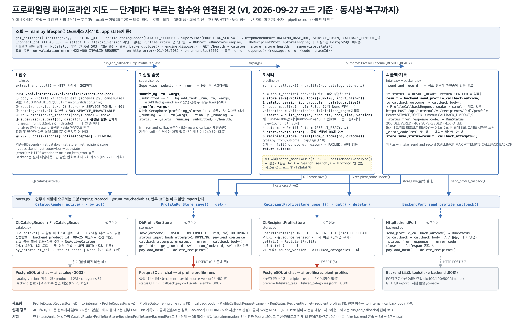

# 파이프라인 지도 — 2026-09-27 (BE 계획 대조 · 같은 번호 재시도 · 콜백 즉시 재시도)

| | |
|---|---|
| 기준 코드 | 브랜치 `integration/v1-profiling-search` · 09-27 작업분(run_lock 결함 3건 → 문서 트리 → ERD 점검·`0004` → BE 09-27 계획 대조 → 재시도 모델·콜백 재시도·빈 풀) |
| 범위 | **v1** — 비선호 카테고리만 반영. 취향 문장·리뷰를 읽는 모델·검증기는 v3 |
| 동작 | 7.6 접수 → 중복 판정 → 202 → 백그라운드 → 재고 없음·비선호 제외 → 조회수순 30개(0개면 빈 배열) → 7.7 콜백(**5xx면 0.5초·2초 뒤 최대 3회**) → 결과를 DB에 기록 |
| 저장소 | PostgreSQL — `ai_profile`(실행 기록·수신자 프로필) · `ai_catalog`(카탈로그 4,231건, Backend 번호·재고·조회수 전건 채움). alembic `0001`~`0004`. 표 구조는 [DB_ERD.md](../DB_ERD.md) |
| 테스트 | `uv run pytest -q` → **173 passed, 2 skipped**. 단위 131(DB 없이) · 통합 44(진짜 PostgreSQL) |
| 지난 판 | [2026-09-25.md](2026-09-25.md) |



## 0. 30초 요약

**BE 팀원의 09-27 노션 계획(PR 1 ~ 5-5)과 우리 구현을 줄 단위로 대조했다.** 경로·토큰·7.7 본문·409/200/500의 뜻·조건부 PENDING·트랜잭션 밖 HTTP·`Retry-After`·`last_changed_at` 분기·2회 소진 FAILED가 전부 우리 전달 문서와 같다. 다른 곳은 다섯이었고 오늘 전부 반영했다 — [BE_전달 §4·§7](../BE_전달_2026-09-27.md).

- **재시도는 같은 번호다.** BE는 접수 실패(500·503·타임아웃)도 결과 미도달도 같은 `sourceVersion`으로 최대 2회 재시도하고 `retry_count` 하나로 센다. 우리는 "접수 실패는 새 번호"라고 적어 두었었다 — 동작은 이미 안전했고(기록이 없으면 분석), 문서와 가짜 백엔드를 그 모델로 고쳤다.
- **7.7이 5xx·네트워크로 실패하면 AI가 즉시 3회** 보낸다(0.5초·2초 뒤). 그래도 안 되면 결과를 보관하고 BE 재시도 때 재전송한다. 전에는 1회 보내고 멈췄다.
- **풀이 0개면 빈 배열을 보낸다.** 실패가 아니다 — BE가 "저장된 추천 없음 → 인기순"으로 대체한다(BE 확인 요청).
- **BE에 새로 요청한 것 둘**: 콜백에 모르는·삭제된 상품 ID가 있으면 전체 400 대신 그 ID만 버리기(우리 카탈로그가 스냅샷이라 필요), 빈 배열 허용.
- 아침에는 `run_lock` 결함 3건(트랜잭션 열림·키 절단·실패 정책)을 고쳤고([이슈](../issues/2026-09-27_1633_advisory-lock/README.md)), ERD 점검으로 `0004`(열 주석 정정)를 추가했다.

## 1. 단계별 — 지금 부르는 함수

| 단계 | 파일 | 함수 (하는 일) |
|---|---|---|
| 조립 (시작 1회) | `main.py` | `lifespan()` — `_connect_db()` → `DbCatalogReader`(`CATALOG_SOURCE=db`) 또는 `FileCatalogReader` → 저장소 → `recover_stale_runs()`(끊긴 RUNNING 정리) → Supervisor·Backend. 오류 봉투 핸들러 3개(503에 `Retry-After`) · `GET /health`(카탈로그·`provisional_ids`·저장소·`undelivered`·슬롯) |
| ① 접수 | `intake.py` | `extract_and_pool()` — 본문 검증(400) → `require_service_token()`(401) → `catalog.active()`(503 + `Retry-After`) → `to_internal()` → `supervisor.submit(dispatch, …, CALLBACK_MAX_ATTEMPTS, CALLBACK_BACKOFF_S)` → **202 PENDING** |
| ② 슬롯·판정 | `supervisor.py` · `intake.py` | `Supervisor.submit()` → `_run()` — 세마포어(동시 1) → `dispatch()`: `store.run_lock(rid, sv)`(세션 advisory lock, 잠근 직후 커밋) → `decide()` → `run_and_callback`(분석) 또는 `resend_callback`(재전송만) 또는 아무것도 안 함 |
| ③ 처리 | `pipeline.py` | `profile()` — **0** `save(RUNNING)` → **1** `catalog.active()` → **2** `needs_model()` → **3** `build_pool()`(재고 `unavailable`만 제외·비선호 제외·조회수↓·30, **0개면 경고 로그 + 빈 배열**) → **4** `RESULT_READY` → **5** `save()` → **6** `recipient_store.upsert()` |
| ④ 콜백·기록 | `intake.py` · `backend.py` | `_send_and_record()` — 최초 전송과 재전송이 같은 경로. `send_profile_callback()` → `CallbackResult`(200 DELIVERED · 409 SUPERSEDED · 4xx FAILED · 5xx RESULT_READY). **RESULT_READY면 0.5초·2초 뒤 다시, 최대 3회** → `store.save(마지막 상태, callback_attempts + 시도 수)` |
| 포트 | `ports.py` | `CatalogReader` · `ProfileRunStore`(`get_run()`·`run_lock()`) · `RecipientProfileStore` · `BackendPort` |
| 구현(어댑터) | `catalog.py` · `stores.py` · `backend.py` | `DbCatalogReader`·`FileCatalogReader` / `DbProfileRunStore`·`DbRecipientProfileStore` / `HttpBackendPort` |
| 바깥 | | PostgreSQL `ai_chat`(alembic 0001·0002·**0004** `ai_profile` · 0003 `ai_catalog` 4,231건) · Backend — 로컬은 `tools/fake_backend`(:8081, **BE 계획 5-1·5-2 재시도 모델**) |

## 2. 지난 판(09-25)에서 바뀐 것

| 무엇 | 왜 | 어디 |
|---|---|---|
| **`run_lock` 결함 3건 수정** — 잠금 직후 커밋(idle in transaction 0) · 키를 sha256으로(수신자 ID 절단 제거) · 커넥션·질의 어느 쪽이 실패해도 진행, unlock 실패 시 커넥션 폐기 | 09-27 검토에서 실측. [이슈 폴더](../issues/2026-09-27_1633_advisory-lock/README.md)에 기록 | `stores.py` · 커밋 `d50b1b8` |
| **`0004` 마이그레이션** — `profile_runs` 열 주석 둘(`ai_search`→`ai_catalog` · `updated_at`의 역할). 동작 변경 없음 | ERD 점검 ①~⑤. v3 마이그레이션은 `0005` | `alembic/versions/0004_profile_runs_comments.py` · [DB_ERD.md](../DB_ERD.md) |
| **문서 트리·이슈 폴더 규칙** — `build_doc_tree.py`가 README에서 닿는 문서 트리를 만들고 못 가는 문서를 잡는다. 결함은 `docs/issues/<시각>_<슬러그>/`에 고정 머리말로 | 검토 때 문서를 트리 순서로 열기 위해 · 이슈를 복붙으로 올리기 위해 | `docs/문서_목록.md` §0 · `docs/issues/README.md` |
| **가짜 백엔드 재시도 모델** — 접수 실패도 같은 번호(`next_retry_at`, 503은 `Retry-After` 우선, 400/401은 재시도 없음, 2회 소진 FAILED). `start_new`가 대기 중 수정을 소비 | BE 09-27 계획 5-1·5-2 그대로. 전에는 접수 실패면 새 번호로 다시 보냈다 | `tools/fake_backend/lifecycle.py`·`app.py` · 단위 시험 25개 |
| **7.7 즉시 재시도** — 5xx·네트워크만, 0.5초·2초 뒤 최대 3회, 같은 슬롯 안. 200·409·4xx는 즉시 종료 | 1회 보내고 멈추면 결과 도달이 BE 타임아웃(10분) 뒤였다. 지도 09-25 §5 3번 | `intake._send_and_record` · `settings.CALLBACK_MAX_ATTEMPTS`·`CALLBACK_BACKOFF_S` · 단위 6 + e2e 1(진짜 포트) |
| **빈 풀 명시** — 0개면 경고 로그 + 빈 배열 콜백(동작은 전과 같음) | 실패로 오해되던 경로를 계약으로 못 박기 위해 | `pipeline.profile` · 단위 1 |
| **용어 통일** — "재시도(새 번호) vs 재전송(같은 번호)" 구분을 걷어내고 BE 모델(같은 번호, `retry_count` 합산)로 | 문서 여섯 곳이 접수 실패를 새 번호라고 적어 BE 계획과 어긋났다 | 전달 문서 §1·§2·§4 · 필드표 v1 §0·§1·§3.2·§3.4·§3.5·§3.6·§4.2 · 시퀀스 §6 · 안내서 · 대조표 · FE 시나리오 |
| **필드표 v1 §6 오류 코드 부록** — 7.6 응답 8종(BE 재시도 분류) · 7.7 처리 · 내부 코드 8종 | BE 5-1이 "오류 유형"으로 재시도를 가르므로 근거가 필요했다. 목차에만 있던 절 | `docs/BE_연동_필드표_v1.md` §6 |
| 그림 3장 다시 렌더 | 필드표 §4.2(같은 번호 v) · 시퀀스 fig 04(즉시 3회) · 지도 | `assets/be-seq/v1/02` · `assets/seq/04` · `assets/pipeline-map.png` |

## 3. 돌려 보는 법과 확인 포인트

```bash
cd profiling && docker compose up -d && uv run alembic upgrade head      # head = 0004
```

- `uv run pytest -q` → **173 passed, 2 skipped**
- 단위가 DB 없이 도는지: `PROFILING_DATABASE_URL="postgresql+psycopg://x:x@127.0.0.1:1/none" uv run pytest tests/unit -q` → 129 passed, 2 skipped
- 통합이 DB 없으면 건너뛰는지: 같은 환경변수로 `uv run pytest tests/integration -q` → 44 skipped
- `uv run ruff check src tests tools alembic` → `All checks passed!`
- **콜백 재시도 눈으로 보기** — fake `PUT /console/mode {"mode":"500"}` → 비선호 변경 → AI 로그에 `7.7 미전달 … 다시 보낸다 (2/3)`·`(3/3)` → `profile_runs.callback_attempts = 3`, `status = RESULT_READY`, `/health.store.undelivered = 1`. `mode=ok`로 돌리고 fake 타임아웃(10초) 뒤 `7.6 재시도1 → 202` → `재전송 … 재분석 없음` → DELIVERED
- **접수 실패 재시도 눈으로 보기** — `update ai_catalog.catalog_versions set is_active=false` → 비선호 변경 → BE 이벤트 `7.6 신규 → 503 (retryAfter 300)`. 로컬은 AI `.env`에 `PROFILING_RETRY_AFTER_S=5` → 5초 뒤 `7.6 재시도1`, **`sourceVersion` 그대로**

## 4. 팀원이 알아야 할 결정·미결

| 항목 | 상태 | 내용 |
|---|---|---|
| 재시도 번호 | **결정 (09-27, BE 계획 5-1)** | 접수 실패든 결과 미도달이든 **같은 `sourceVersion`**, `retry_count` 하나로 최대 2회, 다 쓰면 FAILED. 400/401은 재시도 없음. 503은 `Retry-After` 우선 |
| 재전송 본문 · `last_changed_at` 분기 · 2회 소진 · 다중 인스턴스 | **답됨 (BE 계획 5-2·5-3)** | 요청 스냅샷 · 새 수정이 있으면 새 번호 · FAILED 유지 · 원자적 선점(`dispatch_claim_token`) |
| 콜백 저장 실패(500) 뒤 | 결정 (09-27) | AI가 즉시 3회 → 보관 → BE 타임아웃 재시도 때 재전송. BE 계획 5-5의 "동일 콜백 재전송"은 이 두 경로 |
| 모르는·삭제된 상품 ID | **새 요청 (BE_전달 §7 7번)** | BE 계획 PR3은 하나라도 있으면 전체 400. export가 v1 범위 밖이라 우리 카탈로그는 09-25 스냅샷 — ID만 버리고 저장해 달라 |
| 빈 배열 | **새 요청 (§7 8번)** | 0개면 `[]` 전송. 200으로 받아 인기순 대체 |
| BE 주소·토큰·컨테이너 간 주소 | 반 | 토큰 이름 `PROFILING_SERVICE_TOKEN` 확정(BE `.env` 요청). 주소·포트·`host.docker.internal` 여부 대기 |
| BE 배치 100건/분 vs 슬롯 1 | **위험** | 대기 작업이 스레드풀(40)을 잡아 `/health`가 멈출 수 있다 → §5 3번 |
| 10분 타임아웃 · 재고 100 실값 · 스테이징 디바운스 단축 | 대기 | 09-25 이후 답 없음 |

## 5. 다음 해야 할 일 (인수인계용)

| # | 무엇 | 왜 | 어디 | 끝났다고 보는 기준 | 크기 |
|---|---|---|---|---|---|
| 1 | **배포 빌드 검증** — 파일은 다 썼다(`Dockerfile`·compose `ai-migrate`+`ai-app`). Docker Desktop 프록시 때문에 로컬 빌드 실패 | 09/30 배포 | — | `docker compose up -d --build`로 셋이 뜨고 `curl :8000/health`가 `catalog.active: true`·`products: 4231`·`migration: 0004` | 빌드 확인만 |
| 2 | **실제 Backend 첫 연동** + compose의 토큰 fallback(`dev-token`) 제거·빈 토큰이면 기동 거부 | 로컬 fake만 통과. fallback이 남으면 env 누락 시 조용히 401 폭풍 | `.env`·`docker-compose.yml`·`settings.py` | 7.7이 200 오고 `profile_runs.status=DELIVERED` · 토큰 없이 기동하면 즉시 실패 | 반나절, Backend와 같이 |
| 3 | **Supervisor 동시성** — 슬롯 대기가 anyio 스레드풀을 잡지 않게(자체 워커 스레드 + 큐) · `/health`를 async로 | BE 배치 100건/분이 확정돼 실제로 맞는다 | `supervisor.py` · `main.health` | 동시 100건에서 `/health` p50 유지 | 반나절 |
| 4 | FE 시나리오 S1~S7 재실행 + 결과 문서 | S4(같은 번호 재시도)·S5(즉시 3회 뒤 재전송)의 기대가 바뀌었다 | `docs/FE_연동_시험_시나리오.md` → `FE_연동_시험_결과_<날짜>.md` | 7/7 통과 기록 | 한 시간 (서버 실행 확인 필요) |
| 5 | BE 회신 반영 — 모르는 ID·빈 배열·같은 번호·주소 | §4의 새 요청 4건 | 답에 따라 `pipeline`(빈 풀 침묵 전환) 또는 문서만 | §7 표의 상태가 전부 답됨 | 답 오면 한 시간 |
| 6 | 팀원 레이아웃으로 합치기 (per-service 디렉터리는 이미 같음 — Python 3.12/uv 0.11 vs 3.13/0.12, 헬스 경로 `/health` vs `/readyz`) | 클라우드 CI 통일 | `pyproject.toml`·`Dockerfile` | 합친 CI에서 양쪽 시험 통과 | 반나절 |
| 7 | v3 — 마이그레이션 `0005` · 검증기 이식 · `ProfileModel` · Search 호출 — **먼저 "검색이 함수인가 서비스인가"를 팀에서 결정** | 동결 설계서는 내부 함수+pgvector, 팀원 구현은 HTTP 서비스 | `alembic/versions/0005_*.py` · `pipeline.profile()` 2단계 · `model.py` | 실험 하네스와 같은 결과 · skip 2개 해제 | 여러 날 |
| 8 | 독스트링의 설계 근거를 `docs/`로 이관 | 코드의 27%가 설명문 | `ports.py`·`stores.py`·`pipeline.py` | 주석 비율 10% 이하 | 반나절 |

막히면 볼 것: [README.md](../../README.md) · [문서_목록.md](../문서_목록.md)(트리) · [코드_안내서.md](../코드_안내서.md) · [DB_ERD.md](../DB_ERD.md) · [시퀀스_전체.md](../시퀀스_전체.md) · [BE_전달_2026-09-27.md](../BE_전달_2026-09-27.md)

연락 없이 이어받을 때의 첫 30분: §3을 그대로 실행 → `uv run pytest -q` → §5의 1번부터.
