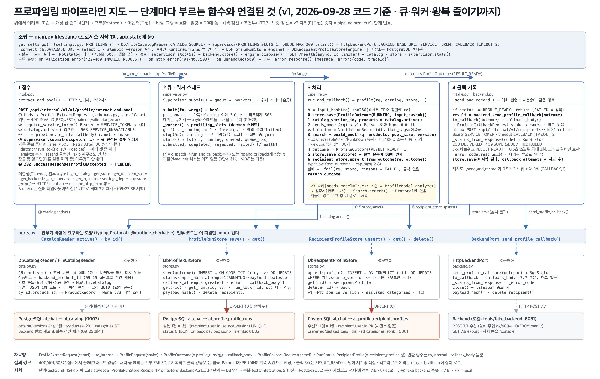

# 파이프라인 지도 — 2026-09-28 (부하 시험 · DB 왕복 34 → 8 · Supervisor 워커+큐)

| | |
|---|---|
| 기준 코드 | 브랜치 `integration/v1-profiling-search` · 09-28 작업분(부하 하네스 → 슬롯 env 결함 → 왕복 줄이기 1·2차 → Supervisor 재설계) · 커밋 `6f71546` |
| 범위 | **v1** — 비선호 카테고리만 반영. 취향 문장·리뷰를 읽는 모델·검증기는 v3. **MVP 단계에서는 AI 서버를 연결하지 않는다(MVP2 백로그, 09-28 보고)** |
| 동작 | 7.6 접수 → Supervisor 큐(가득이면 503 + `Retry-After: 30`) → 202 → 워커 스레드: 잠금·중복 판정 → 재고 없음 제외·비선호 대분류 하위 전체 제외 → 조회수순 30개 → 7.7 콜백(5xx면 즉시 3회) → 결과 기록 |
| 저장소 | PostgreSQL — `ai_profile`(실행 기록·수신자 프로필) · `ai_catalog`(4,231건). alembic `0001`~`0004`. 요청 한 건 DB 왕복 **8**(연속) / 10(단독). 표 구조는 [DB_ERD.md](../DB_ERD.md) |
| 테스트 | `uv run pytest -q` → **203 passed, 2 skipped**. 단위 154(DB 없이) · 통합 51(진짜 PostgreSQL) |
| 지난 판 | [2026-09-27.md](2026-09-27.md) |

> 정정 2026-09-29: 시험 수는 그 뒤 하네스 시험 +1(`a5d1929`, `--no-keepalive`)로 **204 passed · 단위 155** 가 됐다. 위 표와 §3 의 203/154 는 09-28 기록 그대로 둔다.



## 0. 30초 요약

**오늘은 코드보다 측정이 먼저였다.** 부하 시험 하네스(`tools/loadtest/`)를 만들어 동시 100·300건, 느린 콜백, BE 실물 200건을 재고([부하_시험_결과](../부하_시험_결과_2026-09-28.md)), 거기서 나온 셋을 고쳤다.

- **굶음(핵심 결함)**: 슬롯 대기가 anyio 스레드풀 토큰(40)을 쥐어, 슬롯이 2.5초만 돼도 `/health`가 150초 무응답, 굶는 동안 들어온 7.6은 34.5초(BE 10초 타임아웃 초과). → Supervisor를 **워커 스레드 + 상한 큐**로 바꿨다. after: `/health` 실패 0·최대 57ms, 추가 접수 13ms, 큐 깊이가 `/health`에 보임.
- **DB 왕복**: 7.6 한 건이 34번(SQL 9 + 핑·BEGIN·COMMIT 25). 카탈로그 폴링 1초 TTL, 잠금 커넥션 AUTOCOMMIT, 잠금 안 문장은 그 커넥션 재사용, 읽기 AUTOCOMMIT → **8번**. 슬롯 7.8 → 4.0ms, 처리량 84 → 185/s.
- **슬롯 env 이름 결함**: `PROFILING_SLOTS`가 안 읽히고 `PROFILING_PROFILING_SLOTS`라야 먹었다 → 별칭으로 둘 다 읽음([이슈](../issues/2026-09-28_1424_slots-env-name/README.md)).
- ERD 문서를 처음 보는 사람용으로 다시 썼고([DB_ERD.md](../DB_ERD.md)), BE 계약에 503의 두 번째 뜻(대기열 가득)이 생겼다([필드표 v1 §6.1](../BE_연동_필드표_v1.md)).

## 1. 단계별 — 지금 부르는 함수

| 단계 | 파일 | 함수 (하는 일) |
|---|---|---|
| 조립 (시작 1회) | `main.py` | `lifespan()` — `_connect_db()` → `DbCatalogReader(poll_ttl_s=1)` 또는 `FileCatalogReader` → 저장소 → `recover_stale_runs()` → `io_limiter`(별도 스레드 4) → **`Supervisor(PROFILING_SLOTS, QUEUE_MAX).start()`** → Backend. 종료: **`supervisor.stop(5s)`**(큐 버림·실행 중 대기) → `backend.close()` → `engine.dispose()`. `GET /health`는 **async**(큐·워커 상태 `queued`·`rejected` 포함) |
| ① 접수 | `intake.py` | `extract_and_pool()` — 본문 검증(400) → `require_service_token()`(401, **async**) → `catalog.active()`(io_limiter 스레드, 없으면 503 + `Retry-After: 300`) → `to_internal()` → **`supervisor.submit(dispatch, …) → bool`** — False면 **503 + `Retry-After: 30`**, True면 **202 PENDING** |
| ② 큐·워커 | `supervisor.py` · `intake.py` | `submit()` → `queue.put_nowait` (가득·종료 중이면 False, 기다리지 않음) → `_worker()`(슬롯 수만큼) → `dispatch()`: `store.run_lock(rid, sv)`(세션 advisory lock, **AUTOCOMMIT 커넥션 — 잠금 안 문장은 전부 여기서 왕복 1**) → `decide()` → `run_and_callback` / `resend_callback` / 없음 |
| ③ 처리 | `pipeline.py` | `profile()` — **0** `save(RUNNING)` → **1** `catalog.active()`(1초 TTL 안이면 캐시) → **2** `needs_model()` → **3** `build_pool()`(재고 `unavailable` 제외 · 비선호 대분류 → 하위 소분류 전체 제외 · 조회수↓ 30, 0개면 빈 배열) → **4** `RESULT_READY` → **5** `save()` → **6** `recipient_store.upsert()` |
| ④ 콜백·기록 | `intake.py` · `backend.py` | `_send_and_record()` — `send_profile_callback()` → 200 DELIVERED · 409 SUPERSEDED · 4xx FAILED · 5xx RESULT_READY(0.5초·2초 뒤 최대 3회) → `store.save(마지막 상태, callback_attempts)` |
| 포트 | `ports.py` | `CatalogReader` · `ProfileRunStore`(`get_run()`·`run_lock()`) · `RecipientProfileStore` · `BackendPort` — 서명 변화 없음 |
| 구현(어댑터) | `catalog.py` · `stores.py` · `backend.py` | `DbCatalogReader`(폴링 TTL·스냅샷 튜플) / `DbProfileRunStore`·`DbRecipientProfileStore`(`_one()`: 잠금 커넥션 재사용, 읽기 AUTOCOMMIT) / `HttpBackendPort` |
| 바깥 | | PostgreSQL `ai_chat`(alembic 0001~0004) · Backend — 로컬은 `tools/fake_backend`(:8081) · **부하 하네스 `tools/loadtest/run.py`** · BE 실물 드라이버 `tools/be_integration/drive.py` |

## 2. 지난 판(09-27)에서 바뀐 것

| 무엇 | 왜 | 어디 |
|---|---|---|
| **부하 시험 하네스** — 7.6 동시 N건 · `/health` 순차 프로브 · `pg_stat_activity` · `profile_runs` 시각으로 슬롯·접수→종료 · BE 구동 SQL 3종 | 지도 09-27 §5 3번이 추정이었다. 실측 없이는 고칠 수 없고, 고친 뒤 before/after가 필요 | `tools/loadtest/` · [부하_시험_결과](../부하_시험_결과_2026-09-28.md) §1~§6 |
| **슬롯 env 별칭** — `PROFILING_SLOTS`·`PROFILING_PROFILING_SLOTS` 둘 다 | 문서 이름이 안 읽혀 배포 env가 조용히 1로 돌 뻔했다 | `settings.py` · 커밋 `da0ccd7` · [이슈](../issues/2026-09-28_1424_slots-env-name/README.md) |
| **왕복 줄이기 1차** — 카탈로그 폴링 TTL(`CATALOG_POLL_TTL_S` 1초, 실패는 캐시 안 함) · 잠금 커넥션 AUTOCOMMIT | 한 건 34 왕복 중 폴링 8 + 잠금 BEGIN/COMMIT 4 | `catalog.py` · `stores.run_lock` · 커밋 `82df108` · 결과 §10 |
| **왕복 줄이기 2차** — 잠금 안 저장소 문장은 잠금 커넥션에서(thread-local `_lock_local`, `_one()`) · 읽기 AUTOCOMMIT | 나머지 핑·BEGIN·COMMIT. 34 → 10/8, `/health` 12 → 4 | `stores.py` · `main.py` · 커밋 `e998f43` · 결과 §11 |
| **Supervisor 재설계** — 워커 스레드 N + 상한 큐, `submit → bool`, 큐 가득·종료 중이면 503 + `Retry-After: 30`, `stop()`이 큐를 버리고 실행 중만 5초 대기, 의존성·`/health` async, `io_limiter` | 느린 슬롯에서 `/health` 150초 무응답·접수 34.5초(위키 §5.2·§10.5 규칙: 즉시 예약, 넘치면 503, 무제한 대기 금지) | `supervisor.py` · `intake.py` · `main.py` · `settings.QUEUE_MAX`·`QUEUE_FULL_RETRY_AFTER_S`·`IO_THREADS`·`SHUTDOWN_DRAIN_S` · 커밋 `6f71546` · 결과 §12 |
| ERD 문서 설명판 · 코드 ↔ 표 행렬 · 그림 03 | 처음 보는 사람이 "왜 생겼나·어느 코드가 쓰나"를 읽게 | [DB_ERD.md](../DB_ERD.md) |
| 시험 177 → **203** | 위 넷의 단위·통합 시험 | `tests/` |

## 3. 돌려 보는 법과 확인 포인트

```bash
cd profiling && docker compose up -d ai-db && uv run alembic upgrade head      # head = 0004
uv run pytest -q                                                                 # 203 passed, 2 skipped
uv run uvicorn tools.fake_backend.app:app --port 8081                            # 가짜 BE
PROFILING_CATALOG_SOURCE=db PROFILING_BACKEND_BASE_URL=http://localhost:8081 PROFILING_SLOTS=1 uv run uvicorn profiling.main:app --port 8000
uv run python -m tools.loadtest.run --n 100 --concurrency 100 --base 900001 --cleanup --yes --expect-slots 1 --label A1 --out tools/loadtest/results/A1.json
```

- `curl :8000/health` → `supervisor: {slots, running, queued, queue_max, submitted, completed, rejected, failed}` — 큐 깊이(`queued`)가 위키 KPI "접수 대기 건수"
- **굶음이 없는지**: `--fake-mode 500`(슬롯 2.5초)으로 100건 → `/health` 프로브 실패 0, 202 전부 1초 안
- **큐 상한**: `PROFILING_QUEUE_MAX=50`으로 띄우고 같은 시험 → 100건 중 49건이 503 + `Retry-After: 30`
- **종료**: 위 도중 SIGTERM → 로그 `Supervisor 종료: 큐에 남은 N건을 버린다` · 5초 안 종료
- **왕복 세기**: `ALTER SYSTEM SET log_statement='all'` 뒤 7.6 한 건 → 문장 로그 8~10줄(결과 §11)

## 4. 팀원이 알아야 할 결정·미결

| 항목 | 상태 | 내용 |
|---|---|---|
| 범위 | **변경 (09-28 보고)** | 프로파일링은 MVP2 백로그. MVP QA 단계에서는 AI 서버를 연결하지 않는다. 배포 검증·PR3 재시험은 MVP2 대비 |
| 접수 거절 | **결정 (09-28)** | 큐 상한 200(BE 배치 100 두 번), 넘치면 503 + `Retry-After: 30`. BE 5-1이 같은 번호로 재시도. 값은 스테이징 실측으로 조정. BE에 "503의 두 번째 뜻" 전달 필요 |
| 202의 뜻 | 결정 (09-28) | "상한 있는 수용량에 들어갔다". 위키 :574 "저장 확인 뒤 202"는 접수에서 잠금·커넥션을 잡아야 해 v1에서는 두지 않는다(판정은 슬롯 안, 09-25) |
| 종료 시 큐 | 결정 (09-28) | 버린다. BE가 PENDING 타임아웃 뒤 같은 번호로 다시 보내므로 잃는 것 없음. 실행 중은 5초까지 대기(compose 유예 10초 안) |
| 기한(240초)·취소 | 미결 | 큐 대기 시간은 `queued`·접수→종료 지표로 관찰만. 다음 항목 |
| 재시도 번호 · 비선호 대분류 · 빈 배열 · 모르는 ID | 09-27 그대로 | [09-27 §4](2026-09-27.md) |
| BE 주소·토큰 · 재고 실값 · 스테이징 디바운스 | 대기 | BE·클라우드 답 대기(MVP2 시점) |

## 5. 다음 해야 할 일 (인수인계용)

| # | 무엇 | 왜 | 어디 | 끝났다고 보는 기준 | 크기 |
|---|---|---|---|---|---|
| 1 | **BE PR3(7.7 수신) 병합 뒤 실물 재시험** → 5-1 뒤 T2 · 5-2 뒤 T3 · FE 시나리오 S1~S7 | 실물 시험이 가짜 백엔드 시나리오를 대체 | `tools/be_integration/drive.py` · [BE 시험 결과 §7](../BE_연동_시험_결과_2026-09-27.md) | T1이 200·COMPLETED로 끝남 | PR3 직후 한 시간 |
| 2 | **배포 빌드 검증**(Docker 프록시) + compose 토큰 fallback 제거·빈 토큰 기동 거부 + 클라우드와 토큰·주소 교환 | MVP2 배포 준비 | `Dockerfile` · `docker-compose.yml` · `settings.py` | `docker compose up -d --build` 셋 기동, `/health` `migration: 0004` | 반나절 |
| 3 | BE 회신 반영 — 빈 배열·모르는 ID·재고 실값·스테이징 값 + **503 두 번째 뜻 전달** | [BE 전달 §7](../BE_전달_2026-09-27.md) 미답 | `pipeline`(빈 풀 침묵 전환 가능성) · 문서 | §7 표 전부 답됨 | 답 오면 한 시간 |
| 4 | 기한(profile_deadline 240초)·취소 — 큐 대기 포함 기한 초과는 FAILED | 위키 §12.1 · v3 긴 모델 호출 대비 | `supervisor.py` · `intake.dispatch` | 기한 넘긴 실행이 FAILED로 마감되고 슬롯이 반환됨 | 반나절 |
| 5 | 우리 쪽 정리 — `types.py` `ai_search` 주석 · `fetch_export --compare-db` 옛 DDL · 503 e2e 시험의 활성 카탈로그 토글 · fake_backend `on_event` → lifespan · 루트 README `profiling/` 한 줄 | 낡은 이름·시험 부작용 | 각 파일 | ruff·pytest 통과 · `grep ai_search src tools tests` 0건 | 한 시간 |
| 6 | 팀원 레이아웃·CI 정렬(Python 3.12/3.13, `/health` vs `/readyz`, 루트 pyproject) | 클라우드 CI 통일 | `pyproject.toml` · `Dockerfile` | 합친 CI 통과 | 반나절 |
| 7 | v3 — "검색이 함수인가 서비스인가" 결정 뒤 `0005` · 검증기 · `ProfileModel` · Search 호출 | v1 다음 범위 | `alembic/versions/0005_*.py` · `pipeline.profile()` 2단계 | 실험 하네스와 같은 결과 · skip 2개 해제 | 여러 날 |
| 8 | 독스트링의 설계 근거를 `docs/`로 이관 | 코드의 27%가 설명문 | `ports.py` · `stores.py` · `pipeline.py` | 주석 비율 10% 이하 | 반나절 |

막히면 볼 것: [README.md](../../README.md) · [문서_목록.md](../문서_목록.md)(트리) · [코드_안내서.md](../코드_안내서.md) · [DB_ERD.md](../DB_ERD.md) · [시퀀스_전체.md](../시퀀스_전체.md) · [부하_시험_결과](../부하_시험_결과_2026-09-28.md) · [할_일_목록](../할_일_목록_2026-09-28.md)

연락 없이 이어받을 때의 첫 30분: §3을 그대로 실행 → `uv run pytest -q` → §5의 1번부터.
