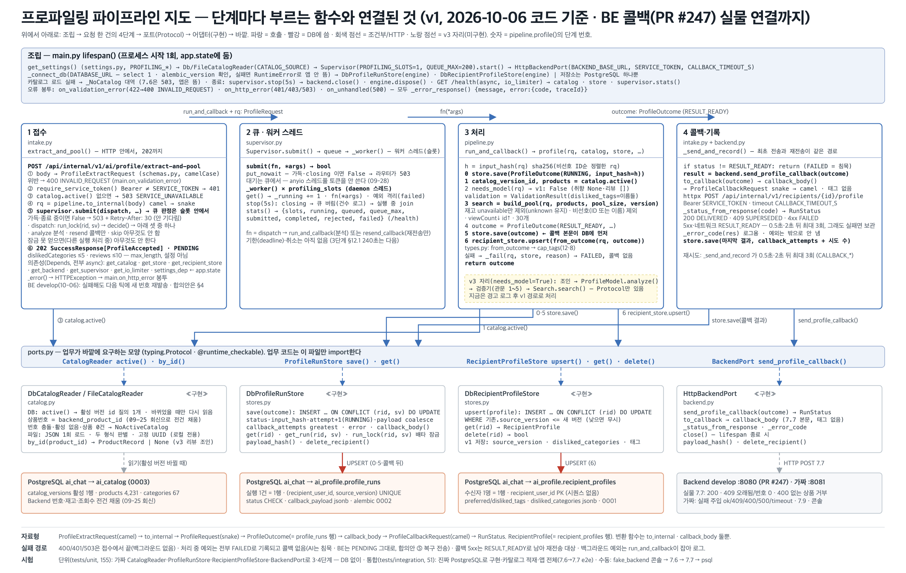

# 파이프라인 지도 — 2026-10-06 (BE 콜백 실물 연결 · 재시도 제거 결정 · 합의안 대기)

| | |
|---|---|
| 기준 코드 | 브랜치 `integration/v1-profiling-search` · 커밋 `4ee53d7` + **미커밋 작업 트리**(BE 연동 시험 가이드 · 09-30 이슈 · 가짜 BE 콘솔 `available` 수정 + 테스트) |
| 범위 | **v1** — 비선호 카테고리만 반영. 취향 문장·리뷰를 읽는 모델·검증기는 v3. **MVP 단계에서는 AI 서버를 연결하지 않는다(MVP2 백로그, 09-28 보고 그대로)** |
| 동작 | 7.6 접수 → Supervisor 큐(가득이면 503 + `Retry-After: 30`) → 202 → 워커 스레드: 잠금·중복 판정 → 재고 없음 제외·비선호 대분류 하위 전체 제외 → 조회수순 30개 → **실물 BE `develop`(PR #247) 7.7 → 200 → BE `COMPLETED`**. 10-06 로컬에서 처음 끝까지 확인 — 7.6 접수부터 7.7 전달까지 약 0.1초 |
| 저장소 | PostgreSQL — `ai_profile`(실행 기록·수신자 프로필) · `ai_catalog`(4,231건). alembic `0001`~`0004`. 요청 한 건 DB 왕복 8(연속). 표 구조는 [DB_ERD.md](../DB_ERD.md) |
| 테스트 | `uv run pytest -q` → **203 passed · 1 failed · 2 skipped**(10-06 21시, DB 켠 채). 실패 1은 코드가 아니라 **시험 자료 충돌** — 10-06 실물 시험이 `--keep`으로 남긴 수신자 1 행(번호 4)에 통합 시험 `test_upsert_keeps_newer_version`이 번호 3을 넣어 무시됐다(그게 정상 동작). 가이드 §3 초기화 SQL 뒤에는 204 passed. `ruff check` 통과. §5 11번 |
| 지난 판 | [2026-09-28.md](2026-09-28.md) |



## 0. 30초 요약

**오늘은 코드보다 연동이 바뀐 날이다.** BE에 7.7 수신(PR #247, `develop` `34e628e`)이 병합돼 **처음으로 실물 BE ↔ AI 왕복이 끝까지 돌았다**([시험 가이드](../BE_연동_시험_가이드.md)). 거기서 BE 쪽 결함 둘을 실측했고, 양쪽이 고칠 것을 "통합 수정점 v0.7"(수정점 8개)로 정리해 BE 합의를 기다린다. AI 코드는 09-28 뒤 거의 그대로다.

- **실물 왕복**: 비선호 저장 → 12초(디바운스 10초 + 틱 ≤10초) → 7.6 → 분석 ~20ms → 7.7 → BE 처리 48~81ms → `COMPLETED`. 추천 30개(`rank_order` 1~30), 비선호 대분류 0개. 오류 응답 8종도 계약대로(번호 0만 400 아닌 409).
- **BE 결함(10-06 실측)**: **D1** AI가 꺼져 있으면 BE가 틱(1분)마다 7.6을 실패하며 `source_version`만 올린다 — 재시도 없이 다음 틱에 새 번호. **D2** 7.7이 BE에 닿지 않으면 수신자가 PENDING에 고착되고 이후 변경도 7.6이 안 나간다(PENDING 차단). BE에 타임아웃·FAILED 전이가 없다.
- **결정(10-06)**: 9/22 필드표의 재시도 계열(즉시 2회·`Retry-After` 뒤 1회·FAILED 뒤 재전송 2회·BE 계획 5-1/5-2)을 **전부 제거**하고, 핑 · 디바운스 재시작 **1회** · `maximum-window`(6시간) 복구 전송 · PENDING 중 새 번호 · 없는 상품 관대 저장으로 바꾼다 — §4. BE 구현 전이라 **그림에는 넣지 않았다**.
- **AI 코드 변화**: 7.6 `dislikedCategories` 상한 5(`306afea`) · 가짜 BE 콘솔 `available` 수정(작업 트리). 단계 함수·포트·테이블은 09-28과 같다.

## 1. 단계별 — 지금 부르는 함수

| 단계 | 파일 | 함수 (하는 일) |
|---|---|---|
| 조립 (시작 1회) | `main.py` | `lifespan()` — `_connect_db()` → `DbCatalogReader(poll_ttl_s=1)` 또는 `FileCatalogReader` → 저장소 → `recover_stale_runs()` → `io_limiter`(별도 스레드 4) → `Supervisor(PROFILING_SLOTS, QUEUE_MAX).start()` → Backend. 종료: `supervisor.stop(5s)`(큐 버림·실행 중 대기) → `backend.close()` → `engine.dispose()`. `GET /health`는 **async**, 항상 200(큐·워커 상태 `queued`·`rejected`·`undelivered` 포함) — BE 핑이 읽을 세 필드 `status`·`catalog.active`·`store.connected`는 이름을 바꾸지 않는다 |
| ① 접수 | `intake.py` | `extract_and_pool()` — 본문 검증(400. **`dislikedCategories` ≤5 · `reviews` ≤10은 `schemas.py`의 `max_length` — 계약값이라 설정에 두지 않는다**) → `require_service_token()`(401, async) → `catalog.active()`(io_limiter 스레드, 없으면 503 + `Retry-After: 300`) → `to_internal()` → `supervisor.submit(dispatch, …) → bool` — False면 503 + `Retry-After: 30`, True면 **202 PENDING**. **BE는 `Retry-After`를 읽지 않는다**(헤더는 계약대로 유지, 참고용 — §4) |
| ② 큐·워커 | `supervisor.py` · `intake.py` | `submit()` → `queue.put_nowait`(가득·종료 중이면 False) → `_worker()`(슬롯 수만큼) → `dispatch()`: `store.run_lock(rid, sv)`(세션 advisory lock, AUTOCOMMIT 커넥션) → `decide()` → `run_and_callback`(분석) / `resend_callback`(저장된 결과 재전송 — **10-06 실물 BE에서 같은 번호 재전송이 200으로 멱등 저장되는 것 확인**) / 없음 |
| ③ 처리 | `pipeline.py` | `profile()` — **0** `save(RUNNING)` → **1** `catalog.active()`(1초 TTL 캐시) → **2** `needs_model()` → **3** `build_pool()`(재고 `unavailable` 제외 · 비선호 대분류 → 하위 소분류 전체 제외 · 조회수↓ 30, 0개면 빈 배열) → **4** `RESULT_READY` → **5** `save()` → **6** `recipient_store.upsert()` |
| ④ 콜백·기록 | `intake.py` · `backend.py` | `_send_and_record()` — `send_profile_callback()` → 200 DELIVERED · 409 SUPERSEDED · 4xx FAILED · 5xx RESULT_READY(0.5초·2초 뒤 최대 3회) → `store.save(마지막 상태, callback_attempts)`. **실물 BE 응답(10-06)**: 200 `data: {}` 저장(30행 교체) · 409 더 새 번호 있음 **또는 번호 0** · 400 없는 상품이 하나라도 있으면 **전체 거부**(합의안 ④로 바뀔 예정) · 401 토큰 |
| 포트 | `ports.py` | `CatalogReader` · `ProfileRunStore`(`get_run()`·`run_lock()`) · `RecipientProfileStore` · `BackendPort` — 서명 변화 없음 |
| 구현(어댑터) | `catalog.py` · `stores.py` · `backend.py` | `DbCatalogReader`(폴링 TTL·스냅샷 튜플) / `DbProfileRunStore`·`DbRecipientProfileStore`(`_one()`: 잠금 커넥션 재사용, 읽기 AUTOCOMMIT) / `HttpBackendPort` — 변화 없음 |
| 바깥 | | PostgreSQL `ai_chat`(alembic 0001~0004) · **Backend 실물 `develop` :8080**(PR #247 — `InternalRecipientProfileController` → `ProfileCallbackService.saveCallback`, 토큰 필터 `PROFILING_SERVICE_TOKEN`) · 로컬 가짜 `tools/fake_backend`(:8081, 09-27 모델 그대로 — §5 7번) · 부하 하네스 `tools/loadtest/run.py` · BE 실물 드라이버 `tools/be_integration/drive.py` · **실물 절차는 [BE_연동_시험_가이드.md](../BE_연동_시험_가이드.md)** |

## 2. 지난 판(09-28)에서 바뀐 것

| 무엇 | 왜 | 어디 |
|---|---|---|
| **BE 7.7 수신 생김** — PR #247 병합(`develop` `34e628e`, 10-06): 토큰 필터 · `/api/internal/v1/**` 보안 설정 · 본문 검증 · 비관적 잠금 · 상품 존재 검사 · 30행 삭제 후 삽입 | 09-27 실물 시험은 7.7이 401이었다. 이제 **실물 완주**가 된다 | BE 코드. **AI는 바뀐 것 없음**(`backend.py` 그대로). 결과·정상값은 [시험 가이드 §9](../BE_연동_시험_가이드.md) |
| **7.6 `dislikedCategories` 상한 5** — `max_length=5`, 6개 이상 400 `INVALID_REQUEST`. 죽은 설정 `MAX_DISLIKED`·`MAX_REVIEWS` 삭제 | BE `PreferencePolicy.MAX_SELECTABLE_COUNT`와 같은 값(09-27 결정). 상한은 계약값이라 설정으로 바꾸게 두지 않는다 | `schemas.py` · `settings.py` · 커밋 `306afea` · 필드표·전달본·이름 대조표 |
| 부하 하네스 `--no-keepalive` | keep-alive 풀 한계 때문에 동시 100 이상에서 50~80/s로 보이던 측정 오류 | `tools/loadtest/run.py` · 커밋 `a5d1929` · [부하 결과 09-29](../부하_시험_결과_2026-09-29.md) |
| **가짜 BE 콘솔 `available` 복구** — 재고 3값 `availability`를 화면용 불리언으로(`unknown`은 판매 가능, AI 규칙과 같음) + 테스트 단언 | 09-23 재고 3값 전환 뒤 콘솔 첫 API가 `KeyError` 500으로 멈췄다([이슈 2026-09-30 A](../issues/2026-09-30_1325_fake-console-catalog/README.md)). B(7.9 응답 모양)는 열려 있음 | `tools/fake_backend/app.py console_catalog` · `tests/unit/test_catalog_fixture.py` · **미커밋** |
| 문서 — [부하 시험 재측정 보고 09-29](../부하_시험_결과_2026-09-29.md) · [학습 가이드 12장](../학습_가이드/README.md) · 09-29 낡은 문장 정정 · **[BE 연동 시험 가이드](../BE_연동_시험_가이드.md)(10-06, 켜기 순서 → 초기화 → 드라이버 → 수동 → 오류 응답 → 장애 재현 → SQL)** | 팀 공유 · 혼자 재현 | `docs/` |
| 시험 203 → **204**(단위 155) | 하네스 시험 +1 | `tests/` |

## 3. 돌려 보는 법과 확인 포인트

**순서가 중요하다 — DB → AI → BE.** BE를 먼저 켜고 AI가 없으면, 대기 중인 변경이 있을 때 BE가 틱마다 7.6을 실패하며 번호만 올린다(D1). 전체 명령·초기화 SQL·오류 응답 표는 [시험 가이드](../BE_연동_시험_가이드.md), 여기는 뼈대다.

```bash
docker start seonjalal-mysql-local profiling-ai-db                     # DB 둘 — MySQL(BE) · PostgreSQL(AI)
cd profiling && uv run alembic upgrade head                             # head = 0004
PROFILING_SERVICE_TOKEN=local-profiling-token PROFILING_BACKEND_BASE_URL=http://localhost:8080 PROFILING_CATALOG_SOURCE=db \
  uv run uvicorn profiling.main:app --port 8000                         # AI — .env 대신 환경변수로 덮는다
# BE (다른 터미널, KTB4-12th-BE): .env 를 읽고 AI_PROFILE_SCHEDULING_ENABLED=true SCHEDULING_ENABLED=true 로 ./gradlew bootRun — 가이드 §2-3
uv run python tools/be_integration/drive.py --keep --out /tmp/drive_result.json    # T1(저장→7.6→7.7) · T3(곧바로 재변경)
```

- `AI_PROFILE_SCHEDULING_ENABLED=true`가 **꼭** 있어야 BE가 7.6을 보낸다(기본 꺼짐, `.env`에도 없음. 빼먹으면 오류 없이 영영 안 보냄).
- `curl :8000/health` → `catalog.products 4231` · `store.undelivered 0` · `supervisor.slots 1, queue_max 200`.
- **정상값(10-06)**: 7.6 접수 → 7.7 전달 약 0.1초 · BE 콜백 처리 48~81ms · 비선호 저장 → 7.6 발송 12초 · 추천 30개 `rank_order` 1~30 · 비선호 대분류 0개 · 드라이버 T1·T3 오류 0.
- **오류 응답 8종**(가이드 §6): 200 · 409 오래됨 · 409 번호 0 · 400 수신자 불일치 · 400 없는 상품 · 400 31개 · 401 토큰 · 400 수신자 행 없음.
- **장애 재현**(가이드 §7): D1 AI 끄고 변경 → 번호만 오름 / D2 콜백 주소 틀린 AI → PENDING 고착·이후 변경 차단. 둘 다 BE 수정 전까지 재현된다.
- 실물 시험 뒤 `uv run pytest -q`를 돌리려면 **가이드 §3 초기화 SQL을 먼저** — 아니면 통합 시험 1개가 잔여 행과 충돌한다(머리표 · §5 11번).

## 4. 팀원이 알아야 할 결정·미결

| 항목 | 상태 | 내용 |
|---|---|---|
| 범위 | 09-28 그대로 | 프로파일링은 MVP2 백로그. MVP QA 단계에서는 AI 서버를 연결하지 않는다 |
| 재시도 전반 | **결정 (10-06)** | 9/22 필드표의 **즉시 재시도 2회 · `Retry-After` 뒤 1회 · FAILED 뒤 재전송 2회 · BE 계획 5-1/5-2(같은 번호 재시도) 전부 제거.** 반복 전송이 번호를 올리고, 문제를 묻고, 복구 순간에 요청을 몰리게 해서다. **AI 쪽 7.7 즉시 3회(0.5초·2초)는 유지** — 순간 장애를 6시간 지연으로 키우지 않으려고. 같은 번호 200은 BE에서 멱등 |
| 7.6 실패 처리 (②) | **결정 (10-06 저녁)** | 틱마다 AI `/health` 핑(①) → 비정상이면 틱 건너뜀(번호 안 올림). 핑을 통과했는데 실패하면 **디바운스 재시작 1회**(변경 시각 둘을 지금으로 → 1시간 뒤 새 번호), 두 번째 실패면 접음(변경 시각 비움 + WARN). `retry_count`는 0/1 표시로만 재사용(열·CHECK·상수 그대로). **"2 → 1"이 아니다(BE 질문):** 2는 9/22의 즉시 재시도 횟수로 제거됐고, 1은 다른 장치인 재시작 횟수다. 0이면 순간 장애(핑 뒤 사망·큐 가득 503)의 변경이 유실되고, 2 이상이면 영영 실패하는 사용자가 시간마다 로그를 남기는데 지속 오류(400·401)는 어차피 재시도로 안 낫는다. AI 다운은 핑이, 결과 미수신은 복구 전송이 맡으니 틈새는 한 번이면 된다. 대가인 1시간 넘는 토큰 오류는 `/ready`로 핑에서 잡는다 |
| PENDING 고착 (⑤) | 결정 (10-06) | 10분 → FAILED 대신 **`maximum-window`(⚙6시간) 지나면 같은 번호로 복구 전송**(AI는 `decide → resend`로 저장된 결과를 다시 보냄). 실패하면 `pending_since` 재시작. **틱당 ⚙50**(일반 100 + 복구 50 ≤ AI 큐 200). FAILED는 당장 미사용 |
| PENDING 중 변경 (⑧) | 결정 (10-06) | 9/22대로 **새 번호로 보낸다**(BE의 PENDING 차단 4곳 제거). 늦게 온 옛 콜백은 409 |
| 없는 상품 (④) | 결정 (10-06) | BE가 없는·삭제된 ID만 빼고 저장, 200 본문 `data.droppedProductIds` → AI는 WARN + `/health` 수치(카탈로그 재적재 신호). 지금 BE는 전체 400 |
| 핑 (①) | 권장 | `/health`(항상 200 — `catalog.active`·`store.connected` 읽기)로 시작하되 **`/ready`**(토큰 필요, 200/503/401) 추가를 권한다. ②가 1회라 1시간 넘는 토큰 오류는 핑에서 잡아야 유실이 없다. AI ~15줄 |
| 번호 0 콜백 | 사소 | BE가 400 대신 409(검사 순서: 오래됨 → 0). AI 영향 없음, 순서만 바꾸면 됨 |
| 접수 거절 503 | **정정** | 09-28 "BE 5-1이 같은 번호로 재시도"는 틀렸다 — **BE는 `Retry-After`를 읽지 않는다.** 큐 상한 200·503·헤더는 계약대로 유지(참고용) |
| 합의 상태 | **BE 합의 대기** | 통합 수정점 v0.7 10절 — ③ 첫 실패 틱 중단 포함 여부 · 복구 N회 뒤 FAILED 표시 여부 · `droppedProductIds` · `/ready` 채택. **Dylan**: 위키 7.6 오류·재시도 문구 한 줄, §2.3 FAILED 예약 한 줄, 7.8 조회 API 때 번호 증가 시점. 원본은 팀 폴더 `AI/제안서/BE_AI_통합_수정점/`(저장소 밖) |
| 기한(240초)·취소 · 배포 주소·토큰 · 스테이징 값 | 09-28 그대로(미결) | [09-28 §4](2026-09-28.md) |

## 5. 다음 해야 할 일 (인수인계용)

| # | 무엇 | 왜 | 어디 | 끝났다고 보는 기준 | 크기 |
|---|---|---|---|---|---|
| 1 | **`/ready`** — 토큰 필요, 카탈로그 활성 + 저장소 연결이면 200, 아니면 503(`reason`), 토큰 틀리면 401. **BE가 채택을 확인한 뒤** | ②가 1회라 1시간 넘는 토큰 오류를 핑 단계에서 잡아야 유실이 없음 | `main.py` `/health` 옆 · 7.6의 토큰 의존성 재사용 · 단위 3 | `curl -H "Authorization: Bearer …" :8000/ready` 200/503/401, `/health`는 변함없이 200 | ~15줄, 반나절 |
| 2 | **필드표 v1 → v1.1** — 재시도 절 제거, 핑·`/ready`, 관대 저장, 200 본문 `data:{}`, `retry_count` 뜻 변경, 그림 02·04·06 | BE 수령본(9/22)을 대체하는 문서. BE가 구현 전에 읽어야 함 | `docs/BE_연동_필드표_v1.md` · `docs/assets/build_be_sequences.py` · 문서_목록 | `build_doc_tree.py` 종료 0 · "재시도"가 재시작·복구 설명 외에 남지 않음 | 문서 큼, 하루 |
| 3 | 옛 문서 대체 표시 — `docs/BE_전달_2026-09-27.md` 머리에 "통합 수정점으로 대체됨" 한 줄 | 문서가 셋이면 BE가 헷갈림 | 그 파일 | 머리말 1줄 | 10분 |
| 4 | 통합 수정점 v0.7 전달·30분 합의(0절 표 → 0-2 체크리스트 → 0-4 구현 안내) · Dylan 위키 두 줄 · `/ready` 채택 결정 | §4 "정할 것" 답을 받아야 BE PR-A가 시작됨 | — | 결정 6개 답 · `/ready` 가부 | 미팅 1회 |
| 5 | 7.7 200 본문 `data.droppedProductIds` 읽어 WARN + `/health catalog.dropped_ids_total` | ④의 "카탈로그 다시 적재하라" 신호 | `backend.py send_profile_callback` · MockTransport 테스트 2 | WARN 1줄 · 카운터 +1 · DELIVERED 판정은 그대로 | ~15줄 |
| 6 | 배포 설정 — `PROFILING_SLOTS` 1(또는 2) · `QUEUE_MAX` 200 · `CALLBACK_MAX_ATTEMPTS` 3 유지 | BE 틱당 일반 100 + 복구 50 ≤ 큐 200 | 배포 compose · `settings.py` 기본값 | compose에 값이 적힘 | 설정 |
| 7 | **가짜 BE를 새 BE 동작에 맞춤** — 핑 · 재시작 1회 · 복구 전송 · PENDING 중 새 번호 · 관대 저장 · 200 본문 `data:{}` + FE 시나리오 기대값 | FE 8종·부하 시험이 가짜 BE를 쓰는데 지금은 9/27 모델 | `tools/fake_backend/app.py` · `docs/FE_연동_시험_시나리오.md` | 8종 재통과 | ~80줄, 하루 |
| 8 | 드라이버 기대값 갱신 — T3 반대로(PENDING 중 재변경 → 새 7.6), `--with-ai-down`(번호 안 오름) + 복구·재시작·관대 저장 케이스. **BE PR 뒤** | 실물 검증 | `tools/be_integration/drive.py` | 새 기대값으로 통과 | ~40줄 |
| 9 | 시험 가이드 §7에 ②·③·④·⑤·⑧·G1 시험 6종, §2에 `/ready` 확인. **BE PR 뒤** | 통합 수정점 10절 검증 계획을 절차로 | `docs/BE_연동_시험_가이드.md` | 통합 수정점 10절 표와 같은 결과 | 문서 중 |
| 10 | 못 보낸 결과 추적 — BE `traceId`를 `error.reason`에 · 시도별 원인 · `undelivered` 지속 WARN · `tools/undelivered.py` | "왜 안 바뀌었나"를 5분 안에 찾게 | `backend.py _error_code` · `intake._send_and_record` · `main._store_health` | 가이드 §7 D2 재현에서 셋 다 보임 | ~40줄 |
| 11 | **통합 시험 자료 격리** — `test_db_recipient_profiles`의 고정 id 1이 실물 시험 잔여 행과 충돌 → 전용 id(예: 900001) 또는 시작 때 정리 | 오늘 1 failed의 원인. 실물 시험 뒤에도 `pytest`가 깨끗해야 함 | `tests/integration/test_db_recipient_profiles.py` · `conftest.py` | 가이드 §4 `--keep` 뒤 `uv run pytest -q` 전부 통과 | 30분 |
| 12 | 09-30 이슈 B — 가짜 BE 7.9 응답을 계약의 `available` 불리언으로(지금 `availability` 3값) · 이슈 A 커밋 | AI가 두 모양을 다 받아 드러나지 않을 뿐 계약 위반 | `tools/fake_backend/app.py _catalog_products` | 7.9 응답에 `available` | 1시간 |
| 13 | 지도 갱신 — BE가 합의안을 구현한 뒤 핑·재시작·복구 전송 흐름 그림 1장 + 학습 가이드 BE 연동 장에 한 단락 | 지도 규칙 · 주니어 인수인계 | `build_pipeline_map.py` · `docs/학습_가이드/04_통신.md` | 그림 + 글 | 반나절 |
| 14 | 09-28에서 이어지는 것 — 배포 빌드 검증(MVP2) · 기한(240초)·취소 · 정리(`ai_search` 주석 등) · CI 정렬 · v3 · 독스트링 이관 | [09-28 §5](2026-09-28.md) 2·4~8 | 09-28 §5 | 그대로 | — |

막히면 볼 것: [README.md](../../README.md) · [문서_목록.md](../문서_목록.md)(트리) · [코드_안내서.md](../코드_안내서.md) · [DB_ERD.md](../DB_ERD.md) · [시퀀스_전체.md](../시퀀스_전체.md) · **[BE_연동_시험_가이드.md](../BE_연동_시험_가이드.md)** · [부하 결과 09-29](../부하_시험_결과_2026-09-29.md) · [할_일_목록 09-28](../할_일_목록_2026-09-28.md)

연락 없이 이어받을 때의 첫 30분: §3을 그대로 실행(AI 먼저, BE 나중) → `uv run pytest -q` → §5의 1·2번부터. 통합 수정점 v0.7과 AI측 수정점 v0.1 원본은 팀 폴더 `AI/제안서/BE_AI_통합_수정점/`에 있다(저장소 밖).
