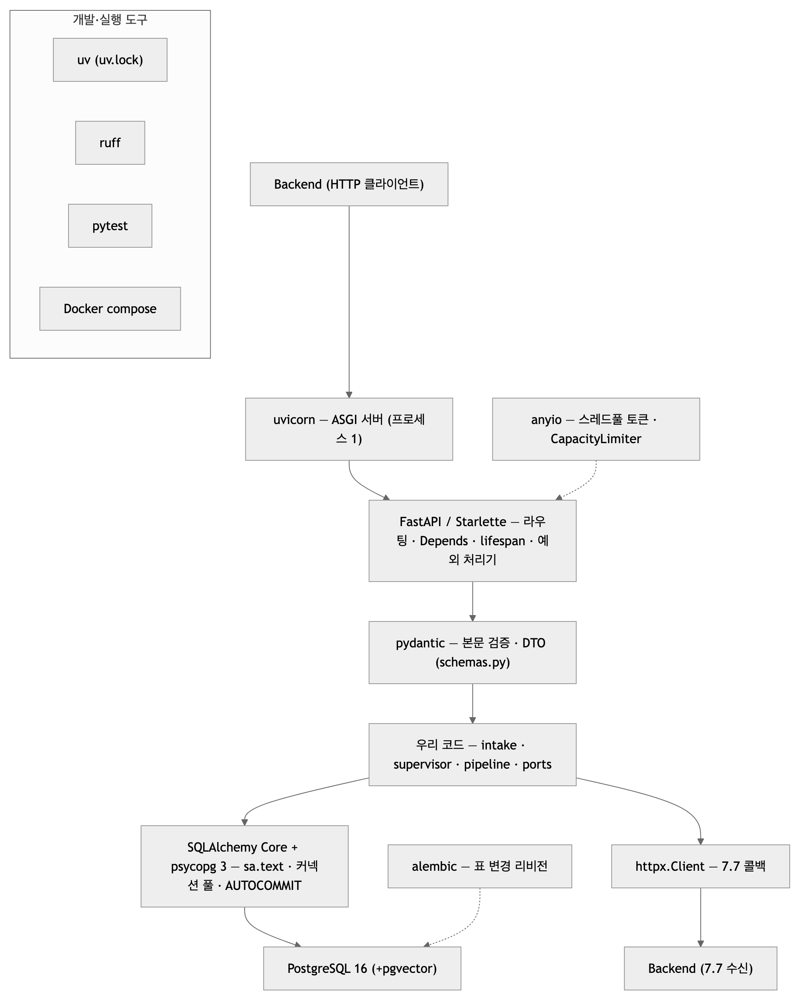
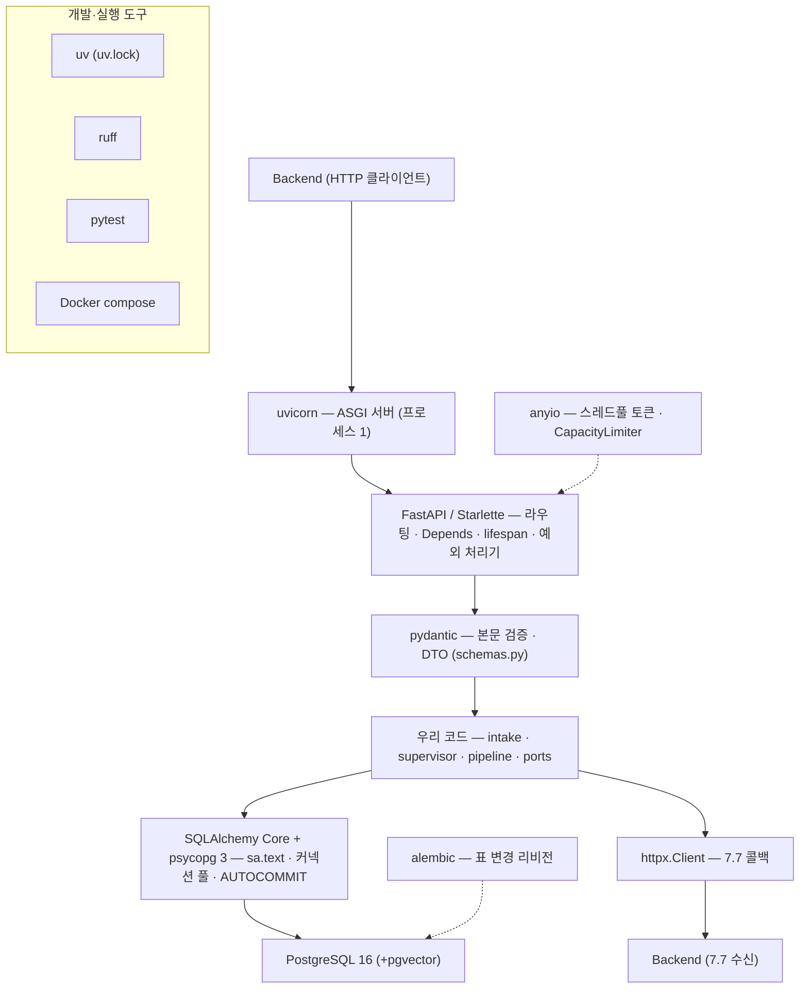

# 기술 스택 — 무엇을 왜 골랐고 어디서 쓰나

| | |
|---|---|
| 읽는 시간 | 35분 |
| 답하는 질문 | `pyproject.toml` 의 라이브러리 아홉 개가 각각 무엇이고 우리 코드 어디서 쓰이나 · 왜 그것을 골랐고 무엇을 안 골랐나 · 개발 도구(uv·ruff·pytest)와 실행 환경(Docker)은 어떤 역할인가 |
| 먼저 알아야 할 것 | 파이썬 패키지 설치 경험(pip 정도) |
| 기준 코드 | 커밋 `a5d1929` — [pyproject.toml](../../pyproject.toml), [uv.lock](../../uv.lock), [Dockerfile](../../Dockerfile) |
| 같이 볼 문서 | 판 고정·설치 순서·ruff 규칙의 이유는 [환경_설정](../환경_설정.md) |

## 1. 한눈에 — 요청이 지나는 층과 그 층의 라이브러리



<!-- fig: 01-스택-층 -->


| 층 | 라이브러리 (잠긴 판) | 한 줄 |
|---|---|---|
| 서버 | uvicorn 0.53 (`[standard]`) | HTTP 를 받아 앱에 넘기는 ASGI 서버 |
| 웹 프레임워크 | FastAPI 0.141 / Starlette 1.6 | 경로·의존성·검증·예외 처리·수명 |
| 동시성 유틸 | anyio 4.15 | 스레드풀 토큰, `CapacityLimiter`, `to_thread.run_sync` |
| 자료 | pydantic 2.13 / pydantic-settings 2.15 | DTO 검증, 환경변수 → 설정 객체 |
| DB | SQLAlchemy 2.0 Core / psycopg 3.3 / alembic 1.20 / PostgreSQL 16 + pgvector | SQL 실행·풀 / 드라이버 / 마이그레이션 / 저장소 |
| HTTP 클라이언트 | httpx 0.28 | 7.7 콜백(동기 `Client`), 하네스(`AsyncClient`) |
| 도구 | uv 0.11 / ruff 0.16 / pytest 9.1 / Python 3.12 | 의존성 잠금·실행 / 린트 / 시험 / 언어 |
| 실행 환경 | Docker + compose | DB·마이그레이션·앱 세 컨테이너 |

## 2. 웹 — uvicorn · FastAPI · Starlette · anyio

**uvicorn.** 파이썬 웹 앱과 네트워크 사이의 **ASGI 서버**다. TCP 연결을 받고 HTTP 를 파싱해 앱을 부르고, 응답을 돌려준다. `uvicorn[standard]` 는 빠른 이벤트 루프(uvloop)와 파서(httptools)를 함께 설치한다. 우리는 **프로세스 하나**로 띄운다([Dockerfile:40](../../Dockerfile)) — 이유는 [05 §1](05_동시성.md). SIGTERM 을 받으면 앱의 lifespan 종료를 돌려준다.

**FastAPI / Starlette.** FastAPI 는 Starlette(라우팅·요청/응답·예외·`TestClient`) 위에 "타입 힌트로 검증과 의존성 주입"을 얹은 프레임워크다. 우리가 쓰는 표면은 좁다:

| 기능 | 어디 | 무엇 |
|---|---|---|
| `FastAPI(lifespan=…)` · `include_router` | [main.py:136–137](../../src/profiling/main.py) | 앱 생성, 라우터 등록 |
| `APIRouter` · `@router.post(status_code=202, response_model=…, dependencies=[…])` | [intake.py:46, 276–282](../../src/profiling/intake.py) | 7.6 경로 |
| `Depends` + `Annotated` · `Header()` | [intake.py:98–100, 283–291](../../src/profiling/intake.py) | 의존성 주입, 헤더 읽기 |
| `@app.exception_handler(…)` | [main.py:154, 168, 177](../../src/profiling/main.py) | 422 → 400, `HTTPException` 봉투, 500 |
| `HTTPException(detail=dict)` · `JSONResponse` | [intake.py:95](../../src/profiling/intake.py), [main.py:151](../../src/profiling/main.py) | 오류 던지기·봉투 |
| `TestClient` | [tests/integration/test_e2e_app.py](../../tests/integration/test_e2e_app.py) | 서버 없이 앱 전체 시험 |

**왜 FastAPI 인가.** 계약(7.6/7.7/7.9)이 JSON 스키마로 정해져 있어 pydantic 모델 = 계약이 되고, `async def` 로 접수 경로를 이벤트 루프에서 가볍게 돌릴 수 있다([05 §2](05_동시성.md)). 팀 백엔드 골격도 FastAPI 다. 대안: Flask(동기, 검증 별도), Django(ORM·관리자 등 우리에게 없는 것이 많다).

**anyio.** Starlette 가 쓰는 동시성 추상층. 우리는 두 곳에서 직접 쓴다 — `anyio.CapacityLimiter(IO_THREADS)`([main.py:81](../../src/profiling/main.py))와 `anyio.to_thread.run_sync(fn, limiter=…)`([intake.py:306](../../src/profiling/intake.py), [main.py:191](../../src/profiling/main.py)). "기본 스레드풀 토큰 40" 도 anyio 의 것이다. `pyproject` 에 `anyio>=4` 를 명시한 이유는 이 직접 사용 때문.

## 3. 자료 — pydantic · pydantic-settings

**pydantic v2.** 클래스에 타입을 적으면 **검증·변환·직렬화**를 해 주는 라이브러리. 우리 코드에서 쓰는 기능:

| 기능 | 어디 | 무엇 |
|---|---|---|
| `BaseModel` + `Field(gt, ge, le, max_length, default_factory, description)` | [schemas.py:84–110](../../src/profiling/schemas.py) | 7.6 본문 규칙 |
| `ConfigDict(extra="allow" \| "forbid" \| "ignore")` | [schemas.py:80, 143, 167](../../src/profiling/schemas.py) | 모르는 필드 정책([03 §7](03_디자인_패턴.md)) |
| `validation_alias=AliasChoices(...)` | [schemas.py:182, 187](../../src/profiling/schemas.py), [settings.py:77](../../src/profiling/settings.py) | 같은 뜻의 다른 이름 받기 |
| `@field_validator(mode="before")` | [schemas.py:191–197](../../src/profiling/schemas.py) | boolean → 3값 |
| `model_copy(update=…)` · `model_dump_json()` · `model_validate(_json)` | [intake.py:184](../../src/profiling/intake.py), [pipeline.py:74–75](../../src/profiling/pipeline.py), [backend.py:81, 117](../../src/profiling/backend.py) | 상태 바꾼 사본, 해시·전송용 JSON, 응답 파싱 |
| PEP 695 제네릭 `SuccessResponse[T]`(BaseModel 상속) | [schemas.py:53](../../src/profiling/schemas.py) | `{message, data}` 봉투(Python 3.12+) |
| `StrEnum` 과 `Literal` | [types.py:179–203](../../src/profiling/types.py), [schemas.py:21–45](../../src/profiling/schemas.py) | 상태·오류 코드·허용값 |

**pydantic-settings.** `BaseSettings` 로 환경변수·`.env` 를 같은 검증 규칙으로 읽는다([settings.py:21–29](../../src/profiling/settings.py)). 접두사 함정([이슈 2026-09-28_1424](../issues/2026-09-28_1424_slots-env-name/README.md))이 이 라이브러리의 `env_prefix` 동작에서 나왔다.

**왜.** 계약 문서의 JSON 을 그대로 클래스로 옮기면 검증 코드를 따로 쓰지 않는다. 대안: dataclass + 손 검증(길다), marshmallow(별도 스키마 클래스).

## 4. DB — SQLAlchemy Core · psycopg 3 · alembic · PostgreSQL 16 + pgvector

**SQLAlchemy 2.0, Core 만.** ORM 없이 **엔진·커넥션 풀·`sa.text` 실행**만 쓴다. 쓰는 표면:

| 기능 | 어디 |
|---|---|
| `sa.create_engine(url, pool_pre_ping=True)` — 풀(기본 5+10) | [main.py:103](../../src/profiling/main.py) |
| `engine.connect()` · `engine.begin()` · `conn.execution_options(isolation_level="AUTOCOMMIT")` | [stores.py:50–71, 210–211](../../src/profiling/stores.py) |
| `sa.text("… :param …")` + 딕셔너리 인자(SQL 인젝션 방지) | [stores.py:80–108](../../src/profiling/stores.py), [catalog.py:178–194](../../src/profiling/catalog.py) |
| 결과: `.one()` · `.scalar_one()` · `.mappings().first()/all()` · `.rowcount` | [stores.py:176, 181, 212, 313](../../src/profiling/stores.py) |
| `conn.invalidate()` | [stores.py:233](../../src/profiling/stores.py) |
| 시험: `sa.event.listen(engine, "checkout", …)` | [tests/integration/test_db_stores.py:315–331](../../tests/integration/test_db_stores.py) |

**psycopg 3.** PostgreSQL 드라이버. URL 이 `postgresql+psycopg://` 이고 `[binary]` 는 컴파일된 휠을 받는다. 동기 모드로 쓴다(스레드에서 기다리는 동안 GIL 을 놓는다).

**alembic.** 마이그레이션 도구([07 §8](07_데이터와_DB.md)). `env.py` 가 우리 설정에서 URL 을 읽고, 리비전은 손으로 쓴다(`target_metadata=None`).

**PostgreSQL 16 + pgvector.** 이미지 `pgvector/pgvector:pg16`. `vector` 확장은 [0001:30](../../alembic/versions/0001_recipient_profiles.py)에서 켜 두었지만 **v1 은 안 쓴다** — v3 임베딩용. 우리가 기대는 PostgreSQL 기능: `INSERT … ON CONFLICT`, JSONB, 부분 유니크 인덱스, advisory lock, `make_interval`, `gen_random_uuid()`([07](07_데이터와_DB.md)).

**왜 Core 만인가.** 문장이 열 개 남짓이고 upsert 병합 규칙을 SQL 로 그대로 보고 싶었다. ORM 은 표가 늘고 관계가 복잡해지면 다시 본다. 왜 PostgreSQL 인가: 팀 백엔드 골격이 같은 DB(`ai_chat`)를 쓰고, advisory lock 과 JSONB 가 설계의 핵심이다.

## 5. HTTP 클라이언트 — httpx

동기 `httpx.Client` 하나를 만들어 재사용한다(keep-alive, 스레드 안전) — [backend.py:102](../../src/profiling/backend.py). `base_url`·헤더·`timeout` 을 생성자에서 고정하고, `transport=` 이음매로 시험이 `MockTransport` 를 끼운다([08 §4](08_테스트.md)). 하네스는 `AsyncClient` 와 `Limits` 를 쓴다([tools/loadtest/run.py:404–411](../../tools/loadtest/run.py)) — keep-alive 연결 100개 근처에서 배정이 느려지는 한계가 있어 `--no-keepalive` 옵션을 뒀다([06 §4](06_병목과_성능.md)).

**왜 httpx.** 동기·비동기 API 가 같고 `MockTransport` 가 표준으로 있다. `requests` 는 비동기가 없고 시험용 전송층 교체가 없다.

## 6. 개발 도구 — uv · ruff · pytest · Python 3.12

- **uv.** 의존성 해석·잠금(`uv.lock`)·가상환경·실행을 하나로. `uv sync --frozen` 은 잠금 파일 그대로 설치(빌드 재현), `uv run <명령>` 은 가상환경 안에서 실행. `pyproject.toml` 의 `[dependency-groups] dev`(PEP 735)에 pytest·ruff 가 있고, 빌드 백엔드는 hatchling. 상한 없는 판 지정(`>=`)과 잠금 파일 커밋의 이유는 [환경_설정](../환경_설정.md).
- **ruff.** 린터. 설정 파일이 없어 **기본 규칙**으로 `uv run ruff check src tests tools alembic`.
- **pytest.** [pyproject.toml:28–30](../../pyproject.toml) `testpaths`·`pythonpath=["src"]`. 플러그인 없음([08 §2](08_테스트.md)).
- **Python 3.12.** PEP 695 제네릭, `StrEnum`(3.11+), `datetime.UTC`(3.11+)를 쓴다. 3.12 로 고정한 이유(torch 휠)는 [환경_설정 §2](../환경_설정.md).

## 7. 실행 환경 — Docker · compose

[Dockerfile](../../Dockerfile): `python:3.12-slim-bookworm` 위에 uv 를 **판 고정**으로 복사(`ghcr.io/astral-sh/uv:0.11.15`) → 의존성 층 먼저(캐시) → 코드 → 비루트 사용자. compose 는 `ai-db → ai-migrate → ai-app` 순서로 띄운다([09 §3](09_운영과_도구.md)). 카탈로그 파일은 이미지에 없으므로 컨테이너는 `CATALOG_SOURCE=db` 다.

**왜.** 팀원 노트북·스테이징이 같은 이미지·같은 잠금 파일로 돈다. 마이그레이션을 별도 서비스로 둔 이유는 앱이 여러 개여도 한 번만 돌게.

## 8. 고르지 않은 것과 이유

| 후보 | 안 고른 이유 | 다시 볼 때 |
|---|---|---|
| ORM (SQLAlchemy ORM · SQLModel) | 문장 열 개, SQL 병합 규칙이 그대로 보이는 편이 낫다 | 표·관계가 늘 때 |
| Celery / RQ + Redis (영속 큐) | 인프라 추가, 위키가 v1 범위 밖으로 둠. Backend 재전송이 복구 경로 | 큐를 잃으면 안 되는 요구가 생길 때 |
| 비동기 DB 드라이버 (asyncpg·psycopg async) | 전부 `async def` 로 재작성 필요. 워커 스레드 모델이 더 읽기 쉽다 | 스레드가 병목이 될 때 |
| `uvicorn --workers N` | 큐·통계가 프로세스마다 갈린다. 지금은 슬롯 1로 충분(BE 배치 100/분) | CPU 가 병목일 때([06 §6](06_병목과_성능.md)) |
| 목(mock) 라이브러리 | Protocol 가짜가 결과를 보는 시험을 만든다 | — |
| DI 컨테이너 | 어댑터 다섯, `lifespan` 한 곳이면 된다 | — |
| CI (GitHub Actions) | 아직 없다 — 시험·ruff 를 손으로 돌린다 | 팀 CI 통합 때([지도 09-28 §5 6번](../파이프라인_지도/2026-09-28.md)) |

**확인해 보기.**
```bash
uv pip list | grep -iE "^(fastapi|starlette|uvicorn|anyio|pydantic|sqlalchemy|psycopg|alembic|httpx) "   # 잠긴 판
grep -n "^import\|^from" src/profiling/*.py | grep -v "profiling\." | awk -F: '{print $3}' | sort | uniq -c | sort -rn   # 어떤 라이브러리를 어디서
```

---

다음 장: [02 아키텍처](02_아키텍처.md). 막히면 [용어집](10_용어집.md).
