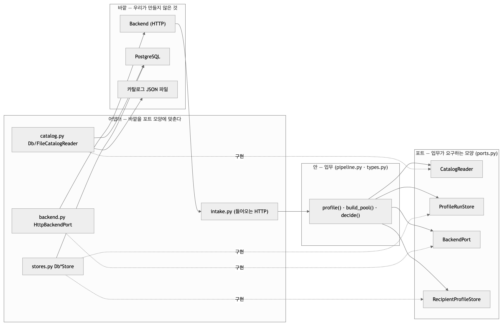
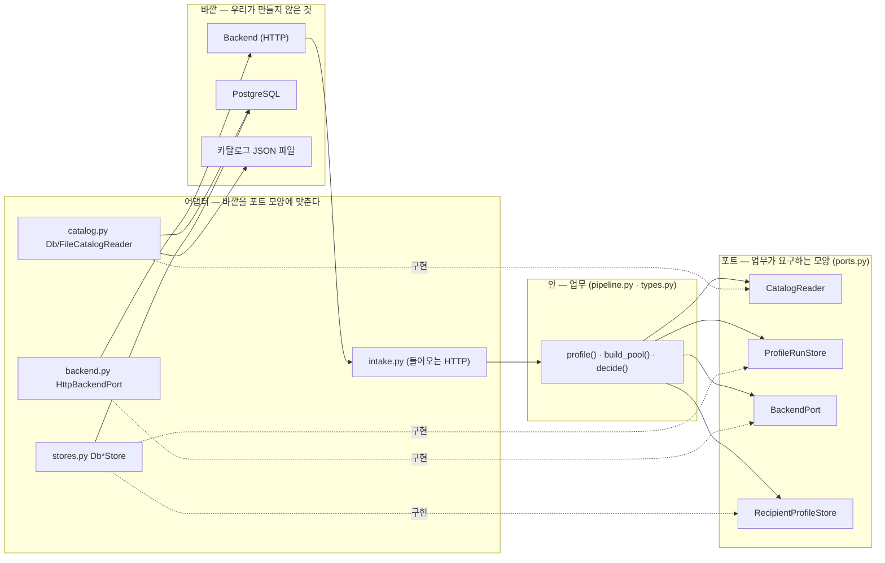
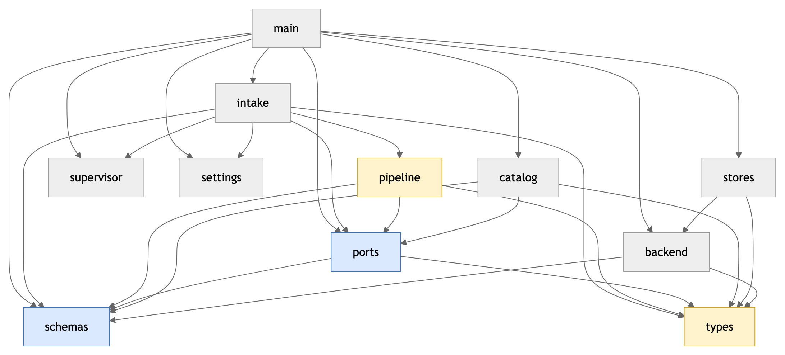
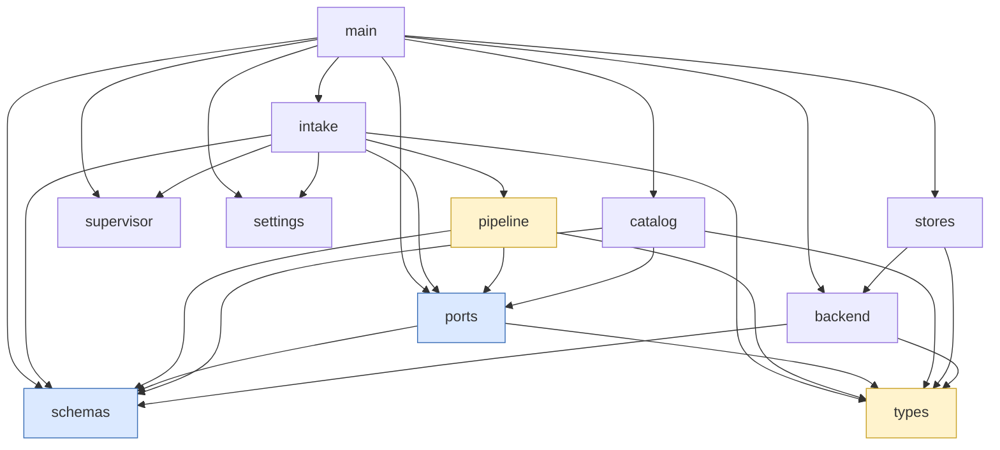
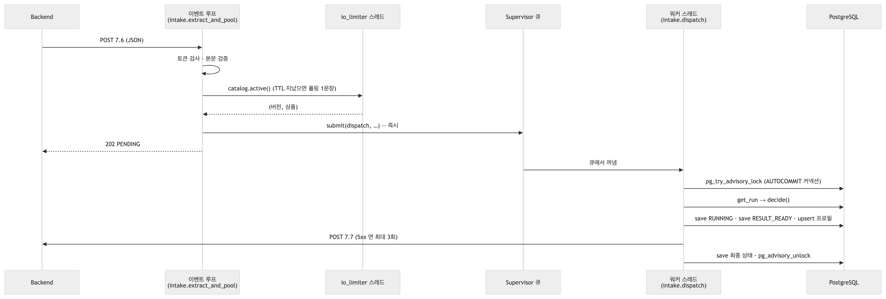
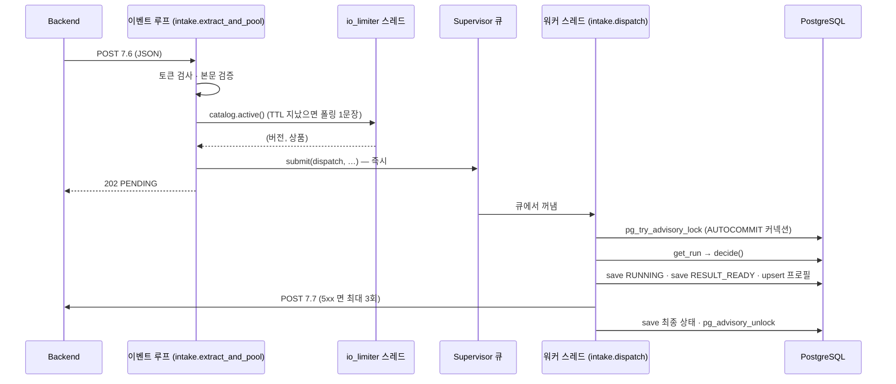

# 아키텍처 — Ports & Adapters 를 처음부터

| | |
|---|---|
| 읽는 시간 | 40분 |
| 답하는 질문 | 파일 11개가 왜 이렇게 나뉘어 있나 · 어느 파일이 어느 파일을 알아도 되나 · 요청 한 건이 어느 파일과 어느 스레드를 거치나 |
| 먼저 알아야 할 것 | 파이썬 `import`, 클래스, HTTP 요청/응답 (동시성·DB 는 몰라도 된다 — [05](05_동시성.md)·[07](07_데이터와_DB.md)에서) |
| 기준 코드 | 커밋 `a5d1929`, `src/profiling/` 11개 모듈(+`__init__.py`) 2,532줄 |
| 같이 볼 문서 | 함수 하나하나의 설명은 [코드_안내서](../코드_안내서.md), 호출 순서 그림은 [시퀀스_전체](../시퀀스_전체.md) |

이 장은 "왜 이런 모양인가"만 다룬다. 각 함수가 무엇을 하는지는 코드_안내서가, 언제 불리는지는 시퀀스_전체가 이미 적어 두었다.

## 1. 계층형 앱과 무엇이 다른가 (Ports & Adapters, 헥사고날)

**개념.** 웹 서비스를 처음 만들면 보통 세 층으로 쌓는다: 요청을 받는 컨트롤러 → 일을 하는 서비스 → DB 를 만지는 리포지토리. 이 구조의 약점은 **서비스가 리포지토리의 구현을 직접 부른다**는 점이다. 서비스 코드 안에 `SQLAlchemy 세션`·`requests.post` 가 보이면, 서비스를 시험하려면 진짜 DB 와 진짜 서버가 있어야 하고, DB 를 바꾸면 서비스도 고쳐야 한다.

Ports & Adapters(헥사고날 아키텍처)는 방향을 뒤집는다. **업무 코드가 "나는 이런 모양의 도우미가 필요하다"를 먼저 선언**하고(포트, port), 바깥 세계(DB·HTTP·파일)는 **그 모양에 맞춘 껍데기**(어댑터, adapter)로 들어온다. 업무 코드는 어댑터가 무엇인지 모른다 — 파일이든 PostgreSQL 이든 시험용 가짜든 모양만 맞으면 같다. 화살표(import)가 항상 **안쪽(업무)을 향한다**는 것이 핵심 규칙이다. "육각형"이라는 이름은 모양과 상관없고, 면이 여럿 = 포트가 여럿이라는 뜻일 뿐이다.



<!-- fig: 02-헥사고날-개념 -->


**우리 코드.** [pipeline.py:27–44](../../src/profiling/pipeline.py) `import` 목록을 보면 `ports`·`schemas`·`types` 세 모듈뿐이다. DB 모듈(`stores`)도 HTTP 모듈(`backend`)도 없다.

```python
# pipeline.py:27-44 (발췌)
from profiling.ports import (
    CatalogReader,
    NoActiveCatalog,
    ProfileRunStore,
    RecipientProfileStore,
)
from profiling.schemas import ProductRecord, ProfileExtractRequest
from profiling.types import (... ProfileOutcome, ProfileRequest, ... )
```

그리고 [pipeline.py:138–141](../../src/profiling/pipeline.py) `profile()` 은 도우미를 **인자로 받는다**. 누가 만들었는지 묻지 않는다.

```python
# pipeline.py:138-141
def profile(
    rq: ProfileRequest, *, catalog: CatalogReader, store: ProfileRunStore,
    recipient_store: RecipientProfileStore, pool_size: int = 30,
) -> ProfileOutcome:
```

**왜 이렇게 했나.** 셋 때문이다. ① 업무 규칙(비선호 대분류 제외, 조회수 정렬, 실패 시 침묵)을 **DB 없이** 1초 안에 시험하려고 — [tests/unit/test_pipeline.py:25–64](../../tests/unit/test_pipeline.py) 의 가짜 셋(`FakeCatalog`·`FakeStore`·`FakeRecipientStore`)이 그 증거다. ② 카탈로그를 파일에서 DB 로 바꿀 때(09-23) `pipeline.py` 를 한 줄도 안 고쳤다 — [DB_전환_설명](../DB_전환_설명.md). ③ v3 에서 팀원의 검색기가 `build_pool` 자리에 들어올 때 같은 방식으로 꽂힌다.

**대안과 트레이드오프.** 3층 구조 + 추상 기반 클래스(ABC)로도 같은 효과를 낼 수 있지만 상속 강제가 생긴다(§4). DI 프레임워크(예: `dependency-injector`)는 조립을 자동화해 주지만 파일이 11개뿐인 서비스엔 과하고, 지금은 `main.lifespan` 한 곳이 그 역할을 한다(§5). 비용은 파일 수와 "한 번 더 감싸는" 코드다 — `ports.py` 112줄은 71% 가 설명문이다.

**확인해 보기.**
```bash
grep -n "^from\|^import" src/profiling/pipeline.py      # stores·backend·sqlalchemy·httpx 가 없어야 한다
grep -n "^from\|^import" src/profiling/main.py          # 반대로 여기엔 구체 클래스가 전부 있다
```

## 2. 우리 지도 — 모듈 11개와 import 방향



<!-- fig: 02-모듈-의존 -->


화살표는 "왼쪽이 오른쪽을 import 한다". 노란 칸(`pipeline`·`types`)이 안쪽, 파란 칸(`ports`·`schemas`)이 경계다. 아무도 `main` 을 import 하지 않고, `pipeline` 은 어댑터를 import 하지 않는다. 예외 하나: `stores → backend` 는 순수 함수 `callback_body` 하나를 빌려 쓰는 것이다(저장하는 본문과 보내는 본문을 같은 함수로 만들려고, [stores.py:30](../../src/profiling/stores.py)) — HTTP 를 부르는 것이 아니다.

| 층 | 모듈 | 한 줄 |
|---|---|---|
| 조립 (Composition Root) | `main.py` | 구체 클래스를 아는 유일한 곳. 앱 시작·종료·오류 봉투·`/health` |
| 들어오는 어댑터 (Transport) | `intake.py` | 7.6 HTTP 를 받아 큐에 넣는다. 워커에서 도는 `dispatch`·`decide` 도 여기 |
| 실행 관리 | `supervisor.py` | 워커 스레드 + 상한 큐. 표준 라이브러리만 쓴다 |
| 업무 (Application Service) | `pipeline.py` | 한 건을 끝까지: 기록 → 카탈로그 → 풀 → 결과 → 저장 |
| 포트 | `ports.py` | 업무가 요구하는 네 가지 모양 + `NoActiveCatalog` |
| 나가는 어댑터 | `catalog.py` · `stores.py` · `backend.py` | 파일/DB 카탈로그 · PostgreSQL 표 두 개 · 7.7 HTTP |
| 자료형 | `schemas.py`(바깥, camelCase) · `types.py`(안, snake_case) | 두 세계의 이름 규칙이 다르다 — [이름_대조표](../../이름_대조표.md) |
| 설정 | `settings.py` | 환경변수 → 객체 하나 |
| 파사드 | `__init__.py` | 바깥에 보여 줄 이름 일곱 개만 다시 내보낸다. 패키지를 import 해도 아무것도 만들지 않는다 |

## 3. 모듈별 책임과 "몰라야 하는 것"

"몰라야 하는 것"이 있어야 경계가 산다. 어느 모듈이 그 목록을 어기기 시작하면 아키텍처가 무너지는 신호다.

| 모듈 (줄) | 하는 일 | **몰라야 하는 것** | 근거 줄 |
|---|---|---|---|
| `main.py` (217) | 어댑터 생성·`app.state` 등록·기동 확인·종료 순서·오류 봉투·`/health` | 업무 규칙, SQL 문장, 7.7 본문 형식 | [main.py:6](../../src/profiling/main.py) "여기서만 구체 클래스를 import" |
| `intake.py` (330) | 7.6 검증→큐→202; 워커 쪽 `dispatch`(잠금→판정→실행), 콜백 재시도 | 어떤 구현인지(`app.state` 에서 포트 모양으로만 꺼냄), 풀 만드는 규칙, SQL | [intake.py:52–56](../../src/profiling/intake.py) |
| `supervisor.py` (172) | 큐에 넣고, 워커가 꺼내 실행, 종료 정리 | 프로파일링·DB·HTTP 전부 (아무 `(fn, args)` 나 실행) | [supervisor.py:22–27](../../src/profiling/supervisor.py) 표준 라이브러리만 |
| `pipeline.py` (223) | 한 건의 순서, 풀 규칙, 실패를 FAILED 로 | 어댑터 구현, 콜백 보내기(호출자 몫) | [pipeline.py:3–4](../../src/profiling/pipeline.py) |
| `ports.py` (112) | 네 Protocol 과 예외 하나 | 모든 구현 (SQLAlchemy·httpx import 없음) | [ports.py:1–5](../../src/profiling/ports.py) |
| `catalog.py` (329) | 파일/DB 에서 활성 카탈로그 한 벌 | 풀 규칙, 누가 자기를 골랐는지 | [catalog.py:7](../../src/profiling/catalog.py) |
| `stores.py` (333) | 표 두 개 읽고 쓰기, advisory lock, 기동 정리 | HTTP, 판정 규칙 | [stores.py:1–14](../../src/profiling/stores.py) |
| `backend.py` (146) | 7.7 한 번 보내고 결과를 상태로 | DB, 재시도 정책(호출자 몫) | [backend.py:12–13](../../src/profiling/backend.py) |
| `schemas.py` (210) | 계약 그대로의 DTO | 내부 자료형 | [schemas.py:1–4](../../src/profiling/schemas.py) |
| `types.py` (317) | 내부 자료형·상태·규칙 함수 | HTTP 이름 | [types.py:3–4](../../src/profiling/types.py) |
| `settings.py` (120) | `PROFILING_*` → `Settings` | 값이 어디서 쓰이는지 | [settings.py:1–5](../../src/profiling/settings.py) |

주석 비율이 높은 것(전체 32%, `ports.py` 71%)은 설계 근거를 코드 옆에 적어 둔 결과다. 이 가이드가 생기면 그 근거를 문서로 옮기는 정리가 다음 순서다([파이프라인_지도 09-28 §5 8번](../파이프라인_지도/2026-09-28.md)).

## 4. 포트와 어댑터 — 상속 없는 계약 (`typing.Protocol`)

**개념.** 자바의 `interface` 나 파이썬의 추상 기반 클래스(ABC)는 "이 메서드를 구현하라"를 **상속으로** 강제한다. `typing.Protocol` 은 다르다 — **메서드 이름·인자·반환이 같으면** 상속하지 않아도 그 자리에 들어갈 수 있다(구조적 타이핑, "오리처럼 걸으면 오리"). 시험용 가짜 클래스가 진짜 클래스를 상속할 필요가 없어진다.

**우리 코드.** [ports.py:36–49](../../src/profiling/ports.py) `CatalogReader`:

```python
# ports.py:36-49 (발췌)
@runtime_checkable
class CatalogReader(Protocol):
    def active(self) -> tuple[int, list[ProductRecord]]:
        """(catalog_version_id, 활성 버전의 상품 전체). 활성 버전이 없으면 NoActiveCatalog. ..."""
        ...

    def by_id(self, product_id: int) -> ProductRecord | None:
        ...
```

이 모양에 맞는 클래스가 넷이다: [catalog.py:112](../../src/profiling/catalog.py) `FileCatalogReader`, [catalog.py:218](../../src/profiling/catalog.py) `DbCatalogReader`, [main.py:121–129](../../src/profiling/main.py) `_NoCatalog`(카탈로그를 못 읽었을 때 자리를 채우는 대역 — `active()` 가 항상 `NoActiveCatalog` 를 던진다), 그리고 시험의 `FakeCatalog`. 넷 다 `class X:` 로 시작하지 `class X(CatalogReader):` 가 아니다. 나머지 포트도 같다: `ProfileRunStore`(52–86) ← `stores.DbProfileRunStore`, `BackendPort`(89–100) ← `backend.HttpBackendPort`, `RecipientProfileStore`(103–112) ← `stores.DbRecipientProfileStore`.

`@runtime_checkable` 을 붙여 두면 `isinstance(obj, CatalogReader)` 가 **메서드 존재만** 검사한다(인자 형은 안 본다, [ports.py:10–11](../../src/profiling/ports.py)). 시험이 "모양이 맞나"를 한 줄로 확인하는 데 쓴다([tests/unit/test_backend.py](../../tests/unit/test_backend.py) 의 `isinstance(b, BackendPort)`).

**왜 이렇게 했나.** 가짜를 만들 때 진짜의 생성자(엔진·URL)를 끌고 오지 않으려고. 그리고 팀원의 검색기가 붙을 때 그쪽 클래스가 우리 것을 상속하지 않아도 되게.

**대안과 트레이드오프.** ABC 는 "구현을 빠뜨리면 인스턴스를 못 만든다"는 조기 실패를 준다. Protocol 은 빠뜨린 메서드를 호출하는 순간에야 `AttributeError` 가 난다 — 그래서 시험에서 `isinstance` 검사를 넣는다. 형 검사기(mypy·pyright)를 돌리면 Protocol 도 정적으로 잡힌다(지금은 안 돌린다).

**확인해 보기.** 파이썬 REPL 에서:
```python
from profiling.ports import CatalogReader
class Nothing: pass
class Looks:
    def active(self): return (1, [])
    def by_id(self, product_id): return None
isinstance(Nothing(), CatalogReader), isinstance(Looks(), CatalogReader)   # (False, True) — 상속 없이도 True
```

## 5. 조립 뿌리 — `main.lifespan` 과 `app.state`

**개념.** 어댑터를 **누가, 언제, 한 번** 만드는가. Ports & Adapters 에서 그 자리를 조립 뿌리(Composition Root)라 부른다. 여기서만 구체 클래스 이름이 나오고, 만든 객체를 한 곳(등록부)에 두면 나머지 코드는 등록부에서 포트 모양으로 꺼내 쓴다. FastAPI 에서는 앱이 켜질 때 한 번 도는 `lifespan` 이 그 자리이고, `app.state` 가 등록부다.

**우리 코드.** [main.py:57–84](../../src/profiling/main.py):

```python
# main.py:57-84 (발췌)
app.state.engine = _connect_db(settings)
app.state.catalog = (DbCatalogReader(app.state.engine, poll_ttl_s=settings.CATALOG_POLL_TTL_S) if settings.CATALOG_SOURCE == "db"
                     else FileCatalogReader(Path(settings.CATALOG_FILE)))
...
app.state.store = DbProfileRunStore(app.state.engine)
app.state.recipient_store = DbRecipientProfileStore(app.state.engine)
...
app.state.io_limiter = anyio.CapacityLimiter(settings.IO_THREADS)
app.state.supervisor = Supervisor(profiling_slots=settings.PROFILING_SLOTS, queue_max=settings.QUEUE_MAX)
app.state.supervisor.start()
app.state.backend = HttpBackendPort(settings.BACKEND_BASE_URL, settings.SERVICE_TOKEN, settings.CALLBACK_TIMEOUT_S)
```

꺼내는 쪽은 [intake.py:59–81](../../src/profiling/intake.py) — 한 줄짜리 함수 여섯 개가 `request.app.state.xxx` 를 돌려주고, 라우터는 `Depends(get_catalog)` 로 받는다(의존성 주입, [03 §1](03_디자인_패턴.md)). 라우터의 타입 힌트는 `CatalogReader` 지 `DbCatalogReader` 가 아니다.

시작 순서에는 뜻이 있다([main.py:52–86](../../src/profiling/main.py)): DB 연결 확인(실패면 앱이 **안 뜬다** — 기록 없이 콜백만 나가는 상태를 막으려고) → 카탈로그(실패해도 뜬다 — 7.6 이 503, `/health` 가 `active:false`) → 저장소 → 끊긴 RUNNING 정리 → 리미터·Supervisor·Backend. 종료는 역순의 일부다([main.py:89–95](../../src/profiling/main.py)): Supervisor 를 멈추고(큐 버림·실행 중 5초 대기) → 콜백 클라이언트 닫기 → DB 풀 정리.

**왜 이렇게 했나.** 요청마다 어댑터를 만들면 DB 풀·HTTP 연결이 매번 새로 생긴다. 한 번 만들어 공유하면 커넥션 풀과 keep-alive 가 산다. 그리고 시험은 `app.state.backend = RecordingBackend()` 처럼 **등록부의 한 칸만 바꿔** 앱 전체를 진짜로 돌린다([tests/integration/test_e2e_app.py:75](../../tests/integration/test_e2e_app.py)).

**대안과 트레이드오프.** 모듈 전역 싱글턴(`engine = create_engine(...)` 을 모듈 최상단에)은 import 만 해도 DB 에 붙어 시험이 무거워진다. FastAPI 의 `dependency_overrides` 로 바꾸는 방법도 있으나 `app.state` 교체가 더 단순해 그쪽을 쓴다.

**확인해 보기.**
```bash
grep -n "app.state\." src/profiling/main.py src/profiling/intake.py   # 쓰는 곳은 이 두 파일뿐
grep -rn "DbCatalogReader\|HttpBackendPort" src/profiling/*.py | grep -v "^src/profiling/main.py\|catalog.py\|backend.py"   # 아무것도 안 나와야 한다
```

## 6. 요청 한 건이 지나는 길 — 계층과 스레드 경계



<!-- fig: 02-요청-한-건 -->


| # | 어디서(스레드) | 무엇을 | 코드 |
|---|---|---|---|
| 1 | 이벤트 루프 | JSON 파싱 → 토큰 확인 → 본문 검증 (순서가 이렇다 — [04 §4](04_통신.md)) | [intake.py:98–112, 276–292](../../src/profiling/intake.py) |
| 2 | io_limiter 스레드 | `catalog.active()` — 1초 안이면 캐시, 아니면 폴링 한 문장 | [intake.py:306](../../src/profiling/intake.py), [catalog.py:243–261](../../src/profiling/catalog.py) |
| 3 | 이벤트 루프 | 모르는 필드 경고 → `to_internal` → `supervisor.submit()` → **202** (여기서 HTTP 끝) | [intake.py:310–330](../../src/profiling/intake.py) |
| 4 | 워커 스레드 | `run_lock`: 풀에서 커넥션 하나 → AUTOCOMMIT → `pg_try_advisory_lock`. 못 얻으면 조용히 끝 | [stores.py:188–234](../../src/profiling/stores.py) |
| 5 | 워커 스레드 | `get_run` → `decide()` — analyze / resend / skip | [intake.py:264–273](../../src/profiling/intake.py) |
| 6 | 워커 스레드 | `pipeline.profile`: RUNNING 저장 → 카탈로그 → `build_pool` → RESULT_READY 저장 → 프로필 upsert (전부 잠금 커넥션) | [pipeline.py:138–210](../../src/profiling/pipeline.py) |
| 7 | 워커 스레드 | 7.7 POST, 5xx·네트워크면 0.5초·2초 뒤 재시도 → 최종 상태 저장 | [intake.py:160–187](../../src/profiling/intake.py), [backend.py:106–141](../../src/profiling/backend.py) |
| 8 | 워커 스레드 | `pg_advisory_unlock`, thread-local 비움, 커넥션 반납 | [stores.py:226–234](../../src/profiling/stores.py) |

계층으로 다시 읽으면: 1·3 은 들어오는 어댑터, 2 는 나가는 어댑터(카탈로그), 4·5·7·8 은 들어오는 어댑터의 워커 쪽 절반이 나가는 어댑터(저장소·Backend)를 부르는 것, 6 만이 업무다. 업무(6)가 전체의 한 조각이라는 점이 이 서비스의 실제 모습이다 — 나머지는 "안전하게 받고, 겹치지 않게 돌리고, 확실히 기록하고, 확실히 보내는" 일이다.

**확인해 보기.** 서버와 가짜 Backend 를 띄우고([09 §2](09_운영과_도구.md)) 7.6 을 한 건 보내면 로그가 이 순서로 찍힌다: `7.6 접수` → `7.6 중복 판정 … → analyze` → `profile … → RESULT_READY` → `7.7 콜백 결과 … → DELIVERED`. 어느 줄이 어느 스레드인지는 로그 형식에 없다 — `%(threadName)s` 를 넣어 보면 `MainThread`(이벤트 루프)와 `profiling-worker-1` 로 갈린다.

## 7. 이 구조의 값과 값어치

| 얻은 것 | 근거 |
|---|---|
| 업무 시험이 DB 없이 돈다 | 단위 시험 155개가 0.3초 안에 끝난다 ([08](08_테스트.md)) |
| 어댑터 교체가 조립 한 줄 | 파일 → DB 카탈로그 전환에 `pipeline.py` 무변경 ([DB_전환_설명](../DB_전환_설명.md)) |
| 실행 방식 교체가 업무와 무관 | Supervisor 를 세마포어에서 워커+큐로 바꿀 때(09-28) `pipeline.py` 무변경 ([06 §2](06_병목과_성능.md)) |
| 팀원 코드가 꽂힐 자리가 정해져 있다 | v3 검색기는 `build_pool` 자리, 모델은 `needs_model` 분기 ([pipeline.py:7](../../src/profiling/pipeline.py)) |

| 치른 것 | 어디에 보이나 |
|---|---|
| 파일과 감싸는 코드가 는다 | `ports.py` 한 파일, 의존성 함수 여섯 개 |
| "어디서 만들었지"를 찾아야 한다 | 항상 `main.lifespan` 한 곳 — 그래서 §5 를 먼저 읽는다 |
| 경계를 어기는 import 를 막는 장치가 없다 | 규칙은 문서와 리뷰로만 지킨다. §1 의 `grep` 이 유일한 검사 |

**확인해 보기 (생각).** `pipeline.py` 에 `from profiling.stores import DbProfileRunStore` 를 넣고 `profile()` 안에서 직접 만들면 무엇이 깨질까? — 단위 시험 22개가 DB 를 찾기 시작하고, `FakeStore` 는 쓸모가 없어진다. 코드는 돌지만 §7 의 "얻은 것" 첫 줄이 사라진다.

---

다음 장: [03 디자인 패턴](03_디자인_패턴.md) — 이 장에서 이름만 부른 DI·Protocol·대역·조립 뿌리를 포함해 18가지를 하나씩. 막히면 [용어집](10_용어집.md).
