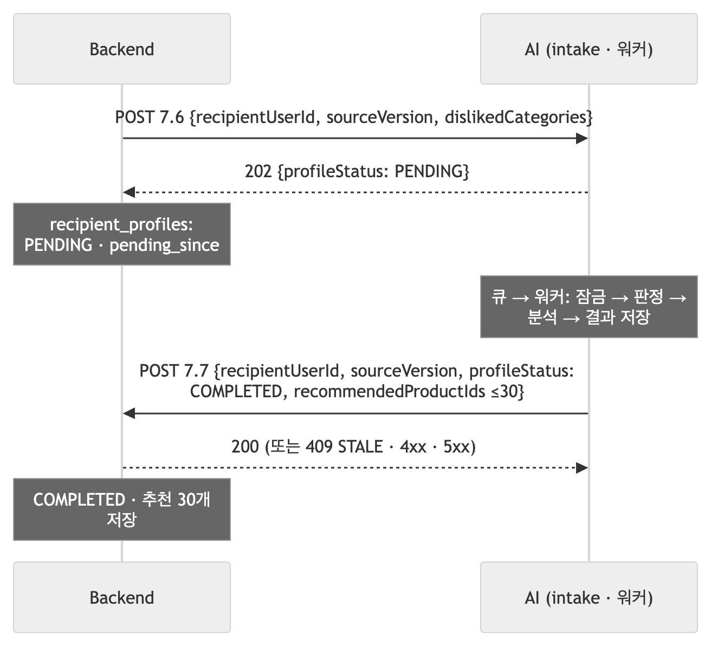
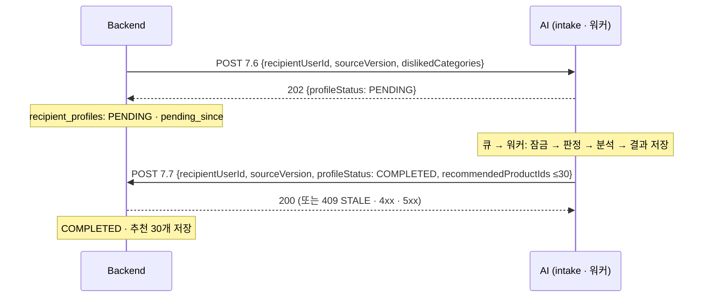
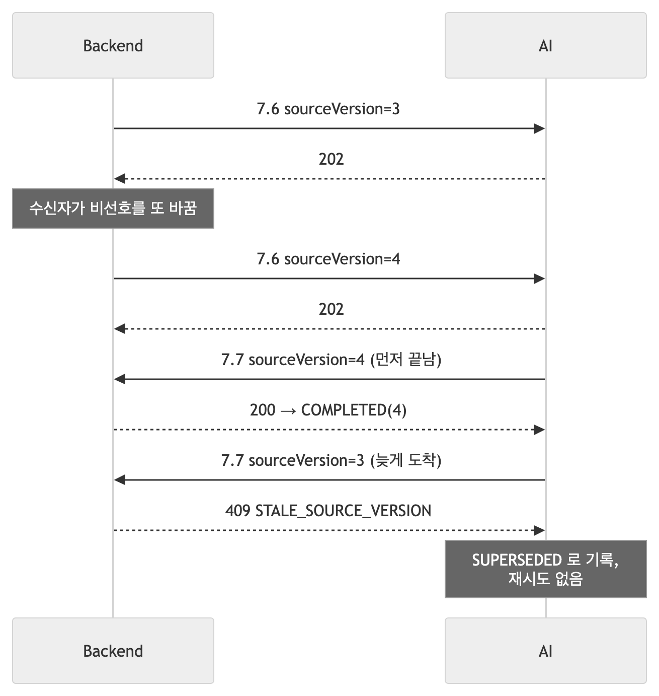
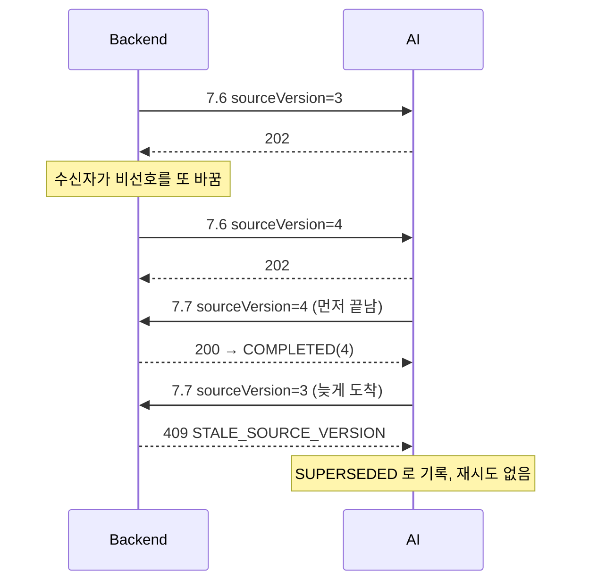

# 통신 — Backend 와 AI 가 어떻게 말을 주고받나

| | |
|---|---|
| 읽는 시간 | 45분 |
| 답하는 질문 | 7.6 이 202 를 돌려주고 결과는 왜 따로 오나 · 401·400·503 이 언제 어떤 순서로 나오나 · `Retry-After` 는 누가 읽나 · 같은 요청이 두 번 오면 어떻게 되나 · 가짜 Backend 는 실물과 무엇이 다른가 |
| 먼저 알아야 할 것 | HTTP 요청/응답의 모양(메서드·경로·헤더·본문·상태 코드) |
| 기준 코드 | 커밋 `a5d1929` — `intake.py` · `backend.py` · `schemas.py` · `main.py` · `tools/fake_backend/app.py` |
| 같이 볼 문서 | 필드 하나하나의 계약은 [BE_연동_필드표_v1](../BE_연동_필드표_v1.md), BE 팀에 준 설명은 [BE_전달_2026-09-27](../BE_전달_2026-09-27.md). 여기서는 **왜 그런 계약인가**만 |

용어 둘: **7.6** 은 Backend → AI "이 수신자를 프로파일링해 달라"(POST), **7.7** 은 AI → Backend "결과 상품 30개"(POST 콜백). 번호는 팀 API 설계서의 절 번호다.

## 1. HTTP 에서 우리가 기대는 것 세 가지

**상태 코드.** 2xx 성공 · 4xx "요청이 잘못됐다"(다시 보내도 같다) · 5xx "서버가 지금 못 한다"(다시 보내면 될 수 있다). 이 구분이 재시도 규칙의 뿌리다: 우리는 7.7 이 **5xx 일 때만** 다시 보내고 4xx 는 포기한다(§7).

**헤더.** `Authorization: Bearer <토큰>`(누구인가), `Retry-After: 30`(언제 다시 오라), `Content-Type: application/json`(본문 형식). 헤더는 본문과 달리 계약 밖 정보를 싣는 자리다.

**타임아웃과 keep-alive.** 클라이언트는 "연결까지 n초, 응답까지 m초"를 정해 두고 넘기면 포기한다. Backend 의 7.6 read timeout 은 **10초** — 우리가 202 를 10초 안에 못 주면 Backend 는 실패로 본다. 우리의 7.7 timeout 은 **5초**([settings.py:34](../../src/profiling/settings.py)). keep-alive 는 한 번 맺은 TCP 연결을 다음 요청에도 쓰는 것 — [backend.py:102](../../src/profiling/backend.py) 가 `httpx.Client` 하나를 만들어 재사용하는 이유다.

## 2. 7.6 → 202 → 7.7 — "비동기 요청/응답"

**개념.** 프로파일링은 수 초에서 수 분(v3 모델)이 걸릴 수 있다. HTTP 연결을 그 시간 동안 붙들면 타임아웃과 스레드 낭비가 생긴다. 그래서 **접수만 하고 202 Accepted 를 돌려준 뒤, 결과는 우리가 Backend 의 주소로 밀어 준다**(콜백, webhook). 요청과 응답이 서로 다른 HTTP 호출에 실리는 이 모양을 비동기 요청/응답이라 한다. Backend 쪽에서는 그 사이를 `PENDING`, 콜백을 받으면 `COMPLETED` 로 기록한다.



<!-- fig: 04-202-콜백 -->


**우리 코드.** 받는 쪽 [intake.py:276–330](../../src/profiling/intake.py) `extract_and_pool` — 검증 → 카탈로그 확인 → `supervisor.submit` → 202. 보내는 쪽 [backend.py:106–141](../../src/profiling/backend.py) `send_profile_callback` — `POST {base_url}/api/internal/v1/recipients/{id}/profile`. 본문 모양은 [schemas.py:103–110](../../src/profiling/schemas.py) `ProfileExtractRequest` 와 [schemas.py:142–148](../../src/profiling/schemas.py) `ProfileCallbackRequest`.

```python
# intake.py:327-330 — 202 는 "큐에 들어갔다"는 뜻. 요청 값을 그대로 돌려주고 상태는 항상 PENDING
return SuccessResponse(
    message="프로파일 분석이 시작되었습니다.",
    data=ProfileAccepted(recipientUserId=body.recipientUserId, sourceVersion=body.sourceVersion),
)
```

**202 의 정확한 뜻.** "상한 있는 큐에 들어갔다"이지 "저장됐다"가 아니다. 중복 제출도 202 다 — 판정은 워커에서 한다([intake.py:301–303](../../src/profiling/intake.py)). 분석이 실패하면 **7.7 을 보내지 않는다**(침묵) — Backend 는 PENDING 타임아웃(10분) 뒤 같은 번호로 다시 보낸다.

**왜 이렇게 했나.** Backend 의 10초 타임아웃 안에 분석을 끝낼 보장이 없고(v3 는 더), 실패를 7.6 응답에 실을 수도 없다(응답은 이미 나갔다). 콜백 방식이면 Backend 가 상태를 계속 묻지 않아도 된다.

**대안과 트레이드오프.** ① 동기 응답(결과를 7.6 응답에) — v1 은 6ms 라 가능해 보이지만 v3 에서 깨진다. ② 폴링(Backend 가 `GET /status` 를 반복) — 트래픽이 늘고 지연이 생긴다. ③ 메시지 큐(Kafka 등) — 인프라. 콜백의 비용은 "Backend 가 받을 준비가 돼 있어야 한다"는 것 — 지금 BE 에는 7.7 수신(PR3)이 아직 없어 로컬 시험은 가짜 싱크로 한다(§11).

**확인해 보기.** 가짜 Backend 콘솔 `http://localhost:8081/console` 의 "7.6 보내기" 탭에서 한 건 보내면 202 가 즉시 오고, "7.7 받은 것" 탭에 1~2초 안에 콜백이 찍힌다.

## 3. 인증 — 서비스 토큰 하나를 양방향으로

**개념.** 두 서버 사이의 인증은 사람 로그인과 달리 **미리 나눠 가진 비밀 문자열**(서비스 토큰)로 한다. 요청마다 `Authorization: Bearer <토큰>` 을 싣고, 받는 쪽은 자기가 아는 값과 비교한다. 401 은 "누군지 모르겠다", 403 은 "알지만 권한 없음".

**우리 코드.** 받을 때 [intake.py:98–112](../../src/profiling/intake.py) `require_service_token`:

```python
# intake.py:106-112
expected = settings.SERVICE_TOKEN
if not expected:  # 토큰을 설정하지 않은 로컬 개발 환경에서는 검사하지 않는다
    return
if not authorization or not authorization.startswith("Bearer "):
    raise _error(401, "UNAUTHORIZED", "서비스 토큰이 없습니다.")
if authorization.removeprefix("Bearer ").strip() != expected:
    raise _error(401, "UNAUTHORIZED", "서비스 토큰이 올바르지 않습니다.")
```

보낼 때 [backend.py:99–101](../../src/profiling/backend.py) 이 **같은 토큰**을 7.7 헤더에 싣는다(`main.py:84` 가 `settings.SERVICE_TOKEN` 을 둘 다에 준다). 403 은 정의만 있고 발생하지 않는다 — 토큰이 하나뿐이라 "권한"이 없다.

**왜 이렇게 했나.** 내부망의 서버 둘 사이라 OAuth 같은 흐름은 과하다. 토큰이 비어 있으면 검사를 건너뛰는 것은 로컬 편의이고, 배포에서는 반드시 값을 넣어야 한다 — compose 는 `${PROFILING_SERVICE_TOKEN:-dev-token}` 으로 기본값을 두고 있어 이 기본값 제거가 다음 할 일에 있다([지도 09-28 §5 2번](../파이프라인_지도/2026-09-28.md)).

**대안과 트레이드오프.** mTLS, 서명된 요청(HMAC) — 더 안전하지만 양쪽 구현이 무겁다. 단순 비교의 비용: 토큰이 새면 끝이라 환경변수로만 다루고 로그에 찍지 않는다.

**확인해 보기.** §12 의 curl 첫 줄.

## 4. 검증 순서의 함정 — 401 이 400 보다 먼저

**개념.** 프레임워크가 요청을 처리하는 **순서**는 우리가 쓴 코드 순서와 다를 수 있다. FastAPI 는 ① 본문을 JSON 으로 **파싱**하고(실패면 여기서 끝) ② 의존성(`dependencies=[Depends(require_service_token)]`)을 풀고 ③ 그다음에야 본문을 pydantic 으로 **검증**한다.

**우리 코드.** 그래서 실제 순서는: JSON 이 아니면 **400**(파싱 실패, [main.py:159–160](../../src/profiling/main.py)) → 토큰이 틀리면 **401** → 필드가 틀리면 **400**. 토큰도 틀리고 필드도 틀리면 **401** 이 온다. [intake.py:295–297](../../src/profiling/intake.py) 의 docstring 은 "본문 검증 → 토큰" 순으로 적혀 있어 실제와 다르다 — 알려진 주석 드리프트다([09 §12](09_운영과_도구.md)).

**왜 알아야 하나.** Backend 개발자가 "필드를 일부러 틀리게 보냈는데 401 이 온다"고 하면 토큰부터 보라고 답할 수 있어야 한다. FastAPI 의 422 를 400 으로 바꾸는 것도 이 순서의 일부다([main.py:154–165](../../src/profiling/main.py)): 계약이 400 INVALID_REQUEST 라서.

**확인해 보기.** §12.

## 5. 오류 봉투 — 모든 오류는 한 함수를 지난다

**개념.** 오류 응답의 모양을 하나로 고정하면(봉투, envelope) 받는 쪽이 어떤 오류든 같은 코드로 읽는다. `{message, error: {code, traceId}}` 가 우리 봉투이고, 성공은 `{message, data}` 다([schemas.py:53–69](../../src/profiling/schemas.py)).

**우리 코드.** [main.py:140–151](../../src/profiling/main.py) `_error_response` 하나가 봉투를 만들고 503 이면 `Retry-After` 를 붙인다. 예외 처리기 셋이 전부 여기로 모인다: pydantic 검증 실패(422 → 400, [154–165](../../src/profiling/main.py)), 라우터가 던진 `HTTPException`(401·503, [168–174](../../src/profiling/main.py)), 그 밖의 모든 예외(500, [177–181](../../src/profiling/main.py)).

```python
# main.py:140-151 (발췌)
def _error_response(status, code, message, trace_id=None, *, retry_after=None) -> JSONResponse:
    body = ErrorResponse(message=message, error=ErrorBody(code=code, traceId=trace_id))
    headers = None
    if status == 503:
        headers = {"Retry-After": str(retry_after if retry_after is not None else get_settings().RETRY_AFTER_S)}
    return JSONResponse(status_code=status, content=body.model_dump(), headers=headers)
```

라우터는 `_error(401, "UNAUTHORIZED", …)` 처럼 `HTTPException.detail` 에 `{code, message[, retryAfter]}` 를 실어 던지고([intake.py:89–95](../../src/profiling/intake.py)), 처리기가 봉투로 바꾼다. `traceId` 는 항상 `null` 이다 — 아직 아무도 채우지 않는다.

**왜 이렇게 했나.** 팀 API 설계서 §3 이 봉투를 정했고, 한 곳에서 만들면 "어떤 오류는 봉투가 아니었다" 같은 사고가 없다.

**대안과 트레이드오프.** FastAPI 기본(422 + `detail` 배열) 그대로 쓰면 코드가 줄지만 계약과 어긋난다. 봉투의 비용: 처리기 세 개를 등록하고 유지해야 한다.

**확인해 보기.** `curl -s -X POST localhost:8000/api/internal/v1/ai/profile/extract-and-pool -H 'content-type: application/json' -d 'not json'` → `{"message":"요청 본문이 JSON이 아닙니다.","error":{"code":"INVALID_REQUEST","traceId":null}}`.

## 6. 503 두 가지와 `Retry-After`

**개념.** 503 은 "지금은 못 받는다, 나중에 다시"다. `Retry-After` 헤더(초)는 "언제"를 알려 준다. 없으면 클라이언트가 곧바로 다시 보내 의미 없는 요청만 쌓인다.

**우리 코드.** 503 이 나오는 자리가 둘이다.

| 원인 | 어디 | `Retry-After` | 왜 그 값 |
|---|---|---|---|
| 활성 카탈로그 없음 | [intake.py:305–308](../../src/profiling/intake.py) | `RETRY_AFTER_S` = **300** | 사람이 카탈로그를 적재해야 돌아온다 — 곧 다시 보내도 소용없다 |
| 접수 대기열 가득 · 종료 중 | [intake.py:320–325](../../src/profiling/intake.py) | `QUEUE_FULL_RETRY_AFTER_S` = **30** | 큐는 곧 빠진다 |

```python
# intake.py:320-325
accepted = supervisor.submit(dispatch, rq, catalog, store, backend, settings.POOL_SIZE, recipient_store, settings.RUNNING_STALE_S,
                             settings.CALLBACK_MAX_ATTEMPTS, settings.CALLBACK_BACKOFF_S)
if not accepted:   # 큐 가득·종료 중 — 기다리지 않고 거절. Backend 는 Retry-After 뒤 같은 번호로 다시 보낸다(BE 계획 5-1)
    raise _error(503, "SERVICE_UNAVAILABLE", "접수 대기열이 가득 찼습니다.", retry_after=settings.QUEUE_FULL_RETRY_AFTER_S)
```

두 503 은 `message` 로 구분된다(`활성 카탈로그가 없습니다.` · `접수 대기열이 가득 찼습니다.`). Backend 는 둘 다 **같은 번호**로 재시도한다(BE 계획 5-1). 둘째 뜻은 09-28 에 생겨 BE 팀에 전달할 항목이다([필드표 v1 §6.1](../BE_연동_필드표_v1.md)).

**왜 이렇게 했나.** 큐 상한을 두면서 "기다리게 하지 말고 거절하라"가 위키 규칙이었고(7.6 에는 429 가 없어 503), 거절에는 반드시 "언제 다시"가 붙어야 한다.

**대안과 트레이드오프.** 큐가 찼을 때 기다렸다 받기 — 09-28 이전 구조이고 굶음의 원인([05 §2](05_동시성.md)). 429 Too Many Requests — 의미상 더 맞지만 계약에 없다.

**확인해 보기.** [05 §11](05_동시성.md) 의 큐 상한 50 실험에서 `curl -i` 로 헤더 `Retry-After: 30` 을 본다.

## 7. 콜백 결과 → 실행 기록 상태, 그리고 즉시 재시도

**개념.** 7.7 을 보낸 뒤 Backend 의 답에 따라 우리 기록의 상태가 갈린다. 재시도는 **5xx 와 네트워크 오류에만** 의미가 있다 — 4xx 는 다시 보내도 같고, 409 는 "더 새 버전이 있다"는 정상 신호다.

**우리 코드.** [backend.py:67–75](../../src/profiling/backend.py) 가 HTTP 상태를 다음 상태로 바꾼다.

| Backend 응답 | 다음 상태 | 오류 코드 | 같은 슬롯에서 재시도? |
|---|---|---|---|
| 200 | DELIVERED | — | 아니오 |
| 409 STALE_SOURCE_VERSION | SUPERSEDED | `CALLBACK_STALE` | 아니오 — 정상 경로 |
| 그 밖의 4xx (400·401·403) | FAILED | `CONTRACT_7_7_REJECTED` | 아니오 — 우리 버그·토큰 |
| 5xx · 타임아웃 · 연결 실패 | RESULT_READY (미전달) | `CALLBACK_UNREACHABLE` | **예** |

재시도는 [intake.py:160–187](../../src/profiling/intake.py) `_send_and_record` 에 있다 — 어댑터는 한 번만 보내고([backend.py:12](../../src/profiling/backend.py)), 정책은 호출자가 갖는다.

```python
# intake.py:172-182 (발췌) — 0.5초, 2초 뒤 최대 3회. 대기는 슬롯을 잡은 채(최악 ≈ 17.5초)
attempts = 0
while True:
    attempts += 1
    res = backend.send_profile_callback(outcome)
    if res.status is not RunStatus.RESULT_READY or attempts >= max_attempts:
        break
    wait = backoff_s * (4 ** (attempts - 1))
    sleep(wait)
```

세 번 다 실패하면 RESULT_READY 로 남고 `/health` 의 `store.undelivered` 에 세어진다. 다시 보내는 때는 **Backend 가 같은 번호로 재요청할 때**(§8 RESEND) — 우리 쪽에 재전송 폴러는 없다.

**왜 이렇게 했나.** 5xx 는 Backend 의 순간 장애일 때가 많아 0.5초·2초 뒤 두 번 더 보내면 대부분 붙는다([tests/integration/test_e2e_app.py:210–238](../../tests/integration/test_e2e_app.py) 가 500 → 200 을 재현). 슬롯을 잡은 채 기다리는 대가는 크지 않다(17.5초 상한). 재전송 폴러를 두지 않은 것은 위키의 "DB 를 큐로 쓰지 않는다" 규칙 때문이다.

**대안과 트레이드오프.** 지수 백오프를 더 길게(분 단위) — 슬롯을 그만큼 잡는다. 재전송 폴러 — 규칙 위반이자 두 경로가 생겨 중복 위험. 지금 방식의 비용: 장애가 길면 미전달 행이 쌓이고 Backend 재요청까지 결과가 늦는다.

**확인해 보기.** 가짜 Backend 모드를 500 으로 하고 한 건 보내면 로그에 `7.7 미전달 … 0.5초 뒤 다시 보낸다 (2/3)` · `… 2.0초 뒤 … (3/3)` 이 찍히고 `/health` 의 `undelivered` 가 1 이 된다. 모드를 ok 로 돌리고 같은 번호를 다시 보내면 재분석 없이 전달된다(§8).

## 8. 멱등 · 재시도 vs 재전송 · 같은 번호

**개념.** 네트워크에서는 "보냈는데 답을 못 받음"이 흔하다. 그럴 때 다시 보내도 결과가 한 번 보낸 것과 같아야 한다 — 이것이 **멱등**이다. 멱등을 만드는 재료는 "이 요청이 저 요청과 같은 것인지"를 알 열쇠다. 우리 열쇠는 **(recipientUserId, sourceVersion)** 이고, sourceVersion 은 Backend 가 수신자의 입력(비선호 등)이 바뀔 때마다 올리는 번호다.

두 낱말을 구분한다: **재시도**(retry) 는 같은 번호를 다시 보내는 것(Backend 가 PENDING 타임아웃 뒤 최대 2회), **재전송**(resend) 은 우리가 저장해 둔 결과를 재분석 없이 다시 7.7 로 보내는 것.

**우리 코드.** 판정은 순수 함수 [intake.py:198–221](../../src/profiling/intake.py) `decide` 다.

```python
# intake.py:208-221
if existing is None:                                   return ANALYZE, "첫 접수"
if existing.input_hash and existing.input_hash != input_hash:
                                                       return ANALYZE, "같은 sourceVersion인데 본문이 다름 — 재분석"
if existing.status is RunStatus.RUNNING:
    age = _age_s(existing.updated_at, now)
    if age is not None and age > stale_after_s:        return ANALYZE, "... 죽은 실행으로 보고 재분석"
    return SKIP, "이미 분석 중"
if existing.status is RunStatus.FAILED:                return ANALYZE, "지난 실행이 실패 — 재분석"
if existing.search is None:                            return ANALYZE, "...저장된 결과가 없음 — 재분석"
return RESEND, f"{existing.status} — 저장된 결과 재전송"
```

`input_hash`([pipeline.py:69–75](../../src/profiling/pipeline.py))는 본문을 정규화(비선호를 ID 순 정렬)해 sha256 한 값 — 같은 번호에 다른 본문이 오면 옛 결과를 재전송하지 않고 다시 분석한다. RESEND 는 저장해 둔 `callback_payload` 에서 `search` 를 되살려([stores.py:126–145](../../src/profiling/stores.py) `_to_outcome`) 같은 본문을 만든다 — 그래서 그 사이 카탈로그가 바뀌어도 답이 흔들리지 않는다.

**왜 이렇게 했나.** Backend 는 답을 못 받으면 같은 번호로 다시 보낸다. 그때마다 새로 분석하면 결과가 달라질 수 있고(카탈로그 교체), 이미 도는 분석과 겹친다. 판정 규칙을 순수 함수로 두어 DB 없이 10줄짜리 표로 시험한다([tests/unit/test_intake_dedupe.py:54–68](../../tests/unit/test_intake_dedupe.py)).

**대안과 트레이드오프.** 매번 재분석 — 단순하지만 결과가 흔들리고 슬롯을 낭비. 요청 ID(UUID)로 멱등 — Backend 가 ID 를 만들어 보관해야 하고 지금 계약에 없다.

**확인해 보기.** §7 의 "확인해 보기" 두 번째 문장이 바로 RESEND 다. 로그에 `7.6 중복 판정 … → resend (RESULT_READY — 저장된 결과 재전송)` 와 `7.7 재전송 … (재분석 없음)` 이 찍힌다.

## 9. 경쟁 상황 세 가지

**개념.** 두 서버가 각자 시계를 갖고 움직이면 "순서가 뒤집히는" 순간이 생긴다. 계약은 그 순간들을 미리 정해 둬야 한다. 상세는 [필드표 v1 §3.7](../BE_연동_필드표_v1.md)에 있고 여기서는 셋의 이름만 익힌다.

| 상황 | 무엇이 뒤집히나 | 정한 규칙 |
|---|---|---|
| 빠른 콜백 | Backend 가 PENDING 을 저장하기 **전에** 7.7 이 도착 | Backend 는 트랜잭션을 **커밋한 뒤** 7.6 을 부른다([BE_전달 §6](../BE_전달_2026-09-27.md)) |
| 분석 중 편집 | 분석하는 동안 수신자가 비선호를 또 바꿈 → 새 sourceVersion | 옛 번호의 7.7 은 Backend 가 **409** 로 거절, 우리는 SUPERSEDED 로 기록하고 끝 |
| 늦은 옛 콜백 | 재시도 중이던 옛 번호의 콜백이 새 번호 뒤에 도착 | 위와 같다 — 번호가 작으면 409 |



<!-- fig: 04-경쟁-늦은-콜백 -->


**우리 코드.** 409 → SUPERSEDED 는 [backend.py:71–72, 130–132](../../src/profiling/backend.py). 우리 쪽 프로필 표도 같은 규칙을 SQL 로 건다 — 낮은 버전이 늦게 오면 무시([stores.py:291](../../src/profiling/stores.py) `where source_version <= excluded.source_version`).

**확인해 보기.** 가짜 Backend 콘솔의 "Backend 흉내" 탭(`/console/be/change`)이 디바운스 → 7.6 → 202 → 타임아웃 재시도 → FAILED 를 초 단위로 재현한다([FE_연동_시험_시나리오](../FE_연동_시험_시나리오.md) S1~S7).

## 10. 7.9 — 상품 전체 export (Backend → AI, 사람이 돌리는 CLI)

**개념.** 7.6/7.7 은 서비스끼리 자동으로 오가지만, 7.9 는 **사람이 CLI 로 가끔 부르는 GET** 이다 — Backend 의 상품 전체를 받아 우리 카탈로그 표(`ai_catalog`)에 적재한다. 여기서 중요한 계약 태도가 "관대한 읽기"다: 모르는 필드는 버리고, 같은 뜻의 다른 이름은 받아 주고, 모르는 값은 모른다고 둔다.

**우리 코드.** [schemas.py:166–197](../../src/profiling/schemas.py) `ProductRecord`:

```python
# schemas.py:166-197 (발췌)
class ProductRecord(BaseModel):
    model_config = ConfigDict(extra="ignore")                     # 모르는 필드는 무시 — 상품이 버려지지 않게
    ...
    availability: Availability = Field(default="unknown", validation_alias=AliasChoices("availability", "available"), ...)
    viewCount: int = Field(default=0, ge=0, validation_alias=AliasChoices("viewCount", "views", "view_count"), ...)

    @field_validator("availability", mode="before")
    @classmethod
    def _from_7_9_boolean(cls, v):
        if isinstance(v, bool):
            return "available" if v else "unavailable"
        return "unknown" if v is None else v                     # 명시적 null 도 unknown
```

가짜 Backend 는 같은 경로를 토큰 검사와 함께 제공하고([app.py:190–200](../../tools/fake_backend/app.py)), 가져오기 CLI `tools/catalog/fetch_export.py` 는 계약 위반·ID 차이를 종료 코드로 알린다(0 차이 없음 · 1 계약 위반 · 2 차이 있음 · 3 연결 오류).

**왜 이렇게 했나.** Backend 가 필드를 하나 더 보냈다고 4,231건이 전부 버려지면 안 되고, 재고를 모르는 상품을 "판매 중"으로 추정해서도 안 된다(unknown 은 unknown, [07 §10](07_데이터와_DB.md)).

**확인해 보기.** `uv run python -m tools.catalog.fetch_export --from-file tests/fixtures/catalog_sample.json` — 계약 점검 결과와 종료 코드(`echo $?`)를 본다.

## 11. 가짜 Backend 와 실물 Backend

| | 가짜 (`tools/fake_backend`) | 실물 (`KTB4-12th-BE` develop) |
|---|---|---|
| 7.7 수신 | 있다 — [app.py:115–160](../../tools/fake_backend/app.py). 검증(`extra="forbid"`)·경로/본문 ID 대조·실패 주입 모드(ok/409/400/500/timeout)·`/received` 기록 | **아직 없다**(PR3 미착수). 그래서 실물 시험은 7.7 을 가짜 싱크로 보낸다 |
| 7.6 발송 | 콘솔에서 수동, 또는 lifecycle 틱([app.py:302–319](../../tools/fake_backend/app.py))이 디바운스·재시도를 초 단위로 | 스케줄러가 **틱당 100건 직렬**, read timeout 10초, PENDING 타임아웃 뒤 재시도(5-1 은 계획) |
| 토큰 | `AI_SERVICE_TOKEN`(기본 `dev-token`) | `.env` 의 `PROFILING_SERVICE_TOKEN` 과 같은 값 |
| 쓰임 | 단위·통합·e2e·부하 시험, FE 시나리오 | 실물 연동 시험(S-C), [BE_연동_시험_결과_2026-09-27](../BE_연동_시험_결과_2026-09-27.md) |

가짜는 "우리가 계약을 어떻게 이해했는지"의 실행 가능한 문서다. 실물과 어긋나면 계약 문서와 가짜를 같이 고친다.

## 12. 확인해 보기 — curl 로 순서 보기 (10분)

서버를 `PROFILING_SERVICE_TOKEN=dev-token` 으로 띄운 뒤([09 §2](09_운영과_도구.md)):

```bash
U=localhost:8000/api/internal/v1/ai/profile/extract-and-pool
# ① 토큰 없음 → 401 (본문이 멀쩡해도)
curl -s -i -X POST $U -H 'content-type: application/json' -d '{"recipientUserId":1,"sourceVersion":1,"dislikedCategories":[]}' | head -1
# ② 토큰 틀림 + 필드 틀림 → 401 (400 이 아니다 — §4)
curl -s -i -X POST $U -H 'authorization: Bearer nope' -H 'content-type: application/json' -d '{"recipientUserId":"x"}' | head -1
# ③ 토큰 맞음 + 필드 틀림 → 400 INVALID_REQUEST
curl -s -X POST $U -H 'authorization: Bearer dev-token' -H 'content-type: application/json' -d '{"recipientUserId":"x"}'
# ④ 정상 → 202 PENDING
curl -s -X POST $U -H 'authorization: Bearer dev-token' -H 'content-type: application/json' -d '{"recipientUserId":1,"sourceVersion":1,"dislikedCategories":[{"categoryId":3,"categoryName":"뷰티"}]}'
# ⑤ 같은 번호 한 번 더 → 202 (판정은 워커에서: 로그에 resend)
```

질문: ②에서 본문이 JSON 자체가 아니면(`-d 'abc'`) 어떤 코드가 올까? <details><summary>답</summary>400. JSON 파싱은 의존성보다 먼저라, 토큰을 보기도 전에 끝난다(§4).</details>

---

다음 장: [05 동시성](05_동시성.md) — 202 뒤에 실제로 무슨 일이 어느 스레드에서 일어나는지. 막히면 [용어집](10_용어집.md).
