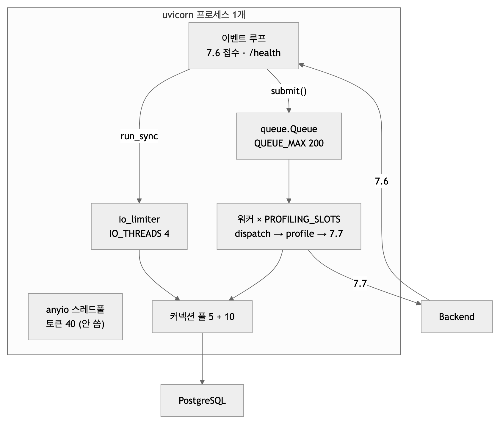
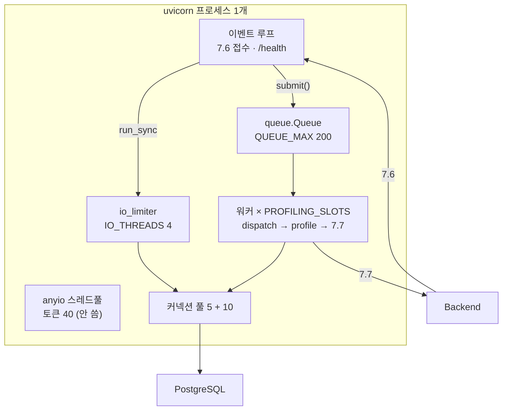
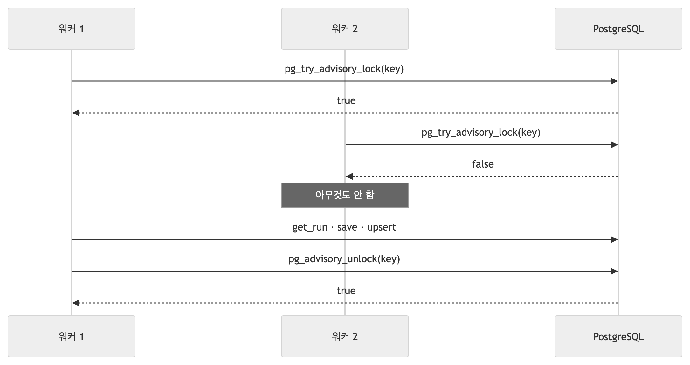
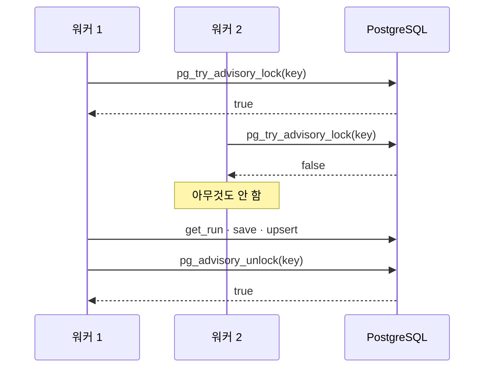

# 동시성 — 한 프로세스가 여러 요청을 어떻게 처리하나

| | |
|---|---|
| 읽는 시간 | 60분 |
| 답하는 질문 | 요청 100건이 한꺼번에 오면 무슨 일이 일어나나 · `async def` 와 `def` 는 왜 다른가 · 워커 스레드·큐·잠금·커넥션 풀이 각각 무엇을 지키나 · 09-28 에 `/health` 가 150초 멈춘 이유와 고친 방법 |
| 먼저 알아야 할 것 | 파이썬 함수·클래스·`with`. 스레드·이벤트 루프·GIL 은 여기서 처음부터 설명한다 |
| 기준 코드 | 커밋 `a5d1929` — `supervisor.py` · `intake.py` · `main.py` · `stores.py` · `catalog.py` |
| 같이 볼 문서 | 측정 수치는 [부하_시험_결과_2026-09-29](../부하_시험_결과_2026-09-29.md), 잠금 결함 기록은 [이슈 2026-09-27_1633](../issues/2026-09-27_1633_advisory-lock/README.md) |

이 장은 "굶음 사건"(09-28) 하나를 실로 삼아 읽는다 — 느린 콜백 100건이 들어오자 `/health` 가 150초 응답하지 않았고, 그 사이 들어온 새 요청은 202 를 받기까지 34.5초가 걸렸다. 왜 그랬는지를 이해하면 이 장의 개념이 전부 필요한 이유가 보인다.

## 1. 프로세스 · 스레드 · 이벤트 루프 — 우리 서비스의 배치

**개념.** 컴퓨터가 "동시에" 여러 일을 하는 방법은 셋이다.
- **프로세스**: 메모리를 따로 갖는 프로그램 한 벌. 서로 변수를 공유하지 않아 안전하지만, 데이터를 주고받으려면 DB·파일·소켓 같은 바깥 통로가 필요하다.
- **스레드**: 한 프로세스 안에서 메모리를 **공유**하며 번갈아 도는 실행 흐름. 운영체제가 아무 때나 스레드를 바꿔 끼우므로, 같은 변수를 두 스레드가 만지면 사고가 난다(§6).
- **이벤트 루프**: 스레드 **하나**가 "기다리는 동안"(네트워크 응답, DB 응답) 다른 일을 처리하는 방식. `async def` 함수는 `await` 지점에서 잠깐 물러나고, 루프가 다음 일을 돌린다. 기다림이 많은 일(I/O)에는 스레드 수백 개보다 싸고, 계산이 많은 일에는 효과가 없다 — 계산하는 동안은 아무도 물러나지 않으니까.

**우리 코드.** uvicorn 프로세스 **하나**([Dockerfile:40](../../Dockerfile), `--workers` 없음) 안에 이런 실행 문맥이 있다.



<!-- fig: 05-실행-문맥 -->


| 문맥 | 개수 | 하는 일 | 만드는 곳 |
|---|---|---|---|
| 이벤트 루프 | 1 | 요청 파싱·토큰·본문 검증·`submit`·202·오류 봉투·`/health` 진입·기동/종료 | uvicorn |
| io_limiter | 토큰 4 | 접수의 카탈로그 확인, `/health` 의 DB 문장. 토큰 묶음이지 별도 스레드 묶음이 아니다 — anyio 는 유휴 워커 스레드를 리미터끼리 공유한다 | [main.py:81](../../src/profiling/main.py) `anyio.CapacityLimiter(settings.IO_THREADS)` |
| anyio 기본 스레드풀 | 토큰 40 | 동기 `def` 의존성·경로 함수가 있으면 여기서 돈다 — **09-28 이후 우리 코드는 하나도 안 쓴다** | anyio 가 자동으로 |
| Supervisor 워커 | `PROFILING_SLOTS` (1) | 큐에서 꺼내 한 건을 끝까지 | [main.py:82–83](../../src/profiling/main.py), [supervisor.py:60–68](../../src/profiling/supervisor.py) |
| DB 커넥션 풀 | 5 + 10 | 스레드마다 꺼내 쓰고 돌려준다 | [main.py:103](../../src/profiling/main.py) |

**왜 이렇게 했나.** 우리 일은 대부분 **기다림**이다 — DB 응답, Backend 의 7.7 응답. 계산은 상품 4,231건을 거르고 정렬하는 4ms 정도. 그래서 스레드 몇 개로 충분하고, 프로세스를 늘려야 할 때는 큐만 프로세스마다 따로일 뿐 advisory lock(§7)이 DB 에 있어 그대로 동작한다.

**대안과 트레이드오프.** ① `uvicorn --workers 4` 로 프로세스를 늘리면 GIL(§3)을 피하지만 큐·`/health` 통계가 프로세스마다 따로 생긴다. ② 전부 async(비동기 SQLAlchemy + `httpx.AsyncClient`)로 가면 스레드가 필요 없지만 재작성이 크고, 동기 드라이버(psycopg 3 동기 모드)가 주는 단순함을 잃는다. 지금은 "루프 1 + 워커 스레드 N" 이 가장 읽기 쉬운 모양이다.

**확인해 보기.** 서버를 띄우고([09 §2](09_운영과_도구.md)) 스레드 목록을 본다.
```bash
ps -M $(pgrep -f "uvicorn profiling.main:app" | head -1) | wc -l      # macOS: 스레드 수 (루프 + 워커 + 스레드풀 유휴 스레드)
curl -s localhost:8000/health | python3 -m json.tool | grep -A8 supervisor   # slots·running·queued
```

## 2. `async def` 와 `def` — 스레드풀 토큰 40개의 뜻

**개념.** FastAPI 에서 경로 함수나 의존성을 **`def`(동기)** 로 쓰면, FastAPI 는 그 함수가 이벤트 루프를 막을까 봐 **스레드풀에서** 돌린다. 그 스레드풀(anyio)에는 **토큰이 40개** 있다 — 동시에 40개의 동기 함수만 돌 수 있고, 41번째는 토큰이 돌아올 때까지 **기다린다**. `async def` 로 쓰면 루프에서 바로 돌고 토큰을 쓰지 않는다. 대신 `async def` 안에서 시간이 걸리는 동기 호출(DB 질의)을 그냥 부르면 루프 전체가 그 시간만큼 멈춘다 — 그래서 그런 호출은 `anyio.to_thread.run_sync` 로 스레드에 넘긴다.

정리하면: `def` = 편하지만 토큰을 쓴다 · `async def` = 토큰을 안 쓰지만 안에서 막히면 안 된다.

**우리 코드.** 접수의 의존성 여덟 개가 **전부 `async def`** 다([intake.py:59–86](../../src/profiling/intake.py)). 이유가 주석에 있다.

```python
# intake.py:55 (주석)  전부 async — 동기 의존성은 anyio 기본 스레드풀(토큰 40)을 거치는데, 그 토큰을 실행 대기가 잡으면 접수가 굶는다(09-28 부하 시험).

# intake.py:84-86
async def settings_dep() -> Settings:
    """Depends(get_settings) 는 동기라 스레드풀을 탄다 — async 로 감싼다."""
    return get_settings()
```

시간이 걸릴 수 있는 한 줄(카탈로그 확인, TTL 이 지났으면 DB 한 문장)만 **별도 리미터**의 스레드로 보낸다([intake.py:306](../../src/profiling/intake.py)).

```python
# intake.py:306
await anyio.to_thread.run_sync(catalog.active, limiter=io_limiter)   # TTL 밖이면 DB 1문장 — 기본 스레드풀·이벤트 루프 둘 다 안 잡는다
```

`/health` 도 같다([main.py:184–191](../../src/profiling/main.py)): `async def health` 가 `_health_sync` 를 `io_limiter` 로 돌린다.

**왜 이렇게 했나 — 굶음의 기전.** 09-28 이전에는 접수 뒤 실행을 FastAPI `BackgroundTasks` 에 넘겼고, 그 작업은 **토큰을 쥔 채** 세마포어(슬롯)가 비기를 기다렸다. 콜백이 느려 슬롯이 2.5초씩 걸리자 대기 작업이 40개를 넘었고, 토큰이 0이 됐다. 그 순간부터 같은 풀을 거치는 `/health`(그때는 `def`)와 7.6 의 동기 의존성 7개가 **그 줄 뒤에** 섰다. 굶는 시간이 "(대기 − 40) × 건당 처리 시간(슬롯 시간) ÷ 슬롯 수" 로 정확히 맞았다: 60 × 2.5초 ÷ 1 = 150초([부하 09-28 §6](../부하_시험_결과_2026-09-28.md)).

고친 방법은 넷이었다 — 대기를 **큐**로 옮겨 토큰을 안 쓰게(§4), 의존성·`/health` 를 async 로, 꼭 스레드가 필요한 DB 문장은 별도 리미터로(§5), 큐가 가득이면 503. 결과는 `/health` 실패 15회 → 0회, 굶는 동안의 접수 34.5초 → 6.5ms([부하 09-29 §4.4](../부하_시험_결과_2026-09-29.md)).

**대안과 트레이드오프.** ① 기본 리미터의 토큰을 400개로 올리기 — 굶는 시점을 늦출 뿐 사라지지 않고, 스레드 400개가 메모리를 먹는다. ② 모든 I/O 를 async 로 — 근본 해결이지만 재작성(§1 대안 ②). ③ 지금 방식 — 접수·`/health` 는 토큰과 무관, 실행은 전용 스레드. 비용은 "어느 함수가 어느 스레드에서 도는지"를 개발자가 알고 있어야 한다는 점이다.

**확인해 보기.** 토큰 수가 정말 40인지:
```bash
uv run python -c "
import anyio
async def main(): print(anyio.to_thread.current_default_thread_limiter().total_tokens)
anyio.run(main)"          # 40
grep -n "^async def\|^def " src/profiling/intake.py | head -12    # 의존성은 async, 워커에서 도는 함수는 def
```

## 3. GIL — 스레드가 넷이어도 계산은 하나씩

**개념.** CPython 에는 전역 인터프리터 잠금(GIL)이 있어 **한 시점에 한 스레드만** 파이썬 코드를 실행한다. 스레드는 5ms 마다 번갈아 GIL 을 넘겨받는다. 다만 **기다리는 동안은 GIL 을 놓는다** — 소켓 응답 대기, `time.sleep`, DB 드라이버가 응답을 기다리는 동안. 그래서 I/O 가 많은 일은 스레드로 잘 겹쳐지고, 계산이 많은 일은 스레드를 늘려도 빨라지지 않는다.

**우리 코드.** 한 건에서 GIL 을 쥐는 계산은 [pipeline.py:123–129](../../src/profiling/pipeline.py) `build_pool` — 상품 4,231건을 거르고 정렬하는 4ms 정도, 그리고 pydantic 검증·JSON 직렬화. 나머지(잠금·저장·7.7 전송·백오프 sleep)는 전부 GIL 을 놓는 기다림이다.

**왜 알아야 하나.** 슬롯을 1 → 4 로 올렸을 때 처리량이 4배가 아니라 **1.6배**(09-29: 125/s → 200/s)였고, 건당 처리 시간은 5.5ms → 12.6ms 로 늘었다. 네 워커가 GIL 과 DB 를 나눠 쓰기 때문이다([부하 09-29 §4.2](../부하_시험_결과_2026-09-29.md)). 더 필요하면 스레드가 아니라 **프로세스**(컨테이너)를 늘리는 쪽이 맞다.

**대안과 트레이드오프.** 계산 부분을 줄이는 길도 있다 — 카테고리별 상품 목록을 미리 만들어 두면 `build_pool` 이 4,231건을 매번 훑지 않는다. 다음 병목 후보로만 적어 둔다([06 §6](06_병목과_성능.md)).

**확인해 보기.** `uv run python -c "import sys; print(sys.getswitchinterval())"` → `0.005`(5ms). 그리고 [부하 09-29 §7.2](../부하_시험_결과_2026-09-29.md) 표에서 슬롯 1 과 4 의 "건당 ms" 를 비교한다.

## 4. Supervisor — 워커 스레드 + 상한 있는 큐

**개념.** 생산자–소비자(producer–consumer) 패턴: 접수(생산자)는 일감을 **큐**에 넣고 바로 돌아가고, 워커(소비자)는 큐에서 하나씩 꺼내 처리한다. 큐에 **상한**을 두면 넘칠 때 곧바로 거절할 수 있다(뒤로 밀어내기, backpressure). 워커를 멈출 때는 큐에 "끝" 표시(poison pill)를 넣는다. 워커를 **데몬 스레드**로 만들면 프로세스가 끝날 때 같이 사라져 종료가 막히지 않는다.

**우리 코드.** [supervisor.py](../../src/profiling/supervisor.py) 전체가 이 패턴이고 표준 라이브러리만 쓴다.

```python
# supervisor.py:41-48 (발췌) — 상한 큐
def __init__(self, profiling_slots: int = 1, queue_max: int = 200) -> None:
    ...
    self._q: queue.Queue[_Item | None] = queue.Queue(maxsize=queue_max)

# supervisor.py:104-117 — 접수: 넣거나(True) 즉시 거절(False). 기다리지 않는다
def submit(self, fn, *args, **kwargs) -> bool:
    with self._lock:
        if self._closing:
            self._rejected += 1
            return False
        try:
            self._q.put_nowait((fn, args, kwargs))
        except queue.Full:
            self._rejected += 1
            return False
        self._submitted += 1
        return True

# supervisor.py:121-140 — 워커: 꺼내서 실행, 예외는 건마다 격리
def _worker(self) -> None:
    while True:
        item = self._q.get()
        if item is None:                                   # 종료 신호
            return
        fn, args, kwargs = item
        try:
            fn(*args, **kwargs)
        except Exception:
            log.exception("Supervisor: 작업 예외 — 다음 작업으로")
        finally:
            ... running -= 1, completed += 1
```

라우터는 `submit` 이 False 면 503 + `Retry-After: 30` 을 돌려준다([intake.py:320–325](../../src/profiling/intake.py)). 워커 스레드는 [supervisor.py:65](../../src/profiling/supervisor.py) 에서 `daemon=True` 로 만든다.

**왜 이렇게 했나.** §2 의 굶음 — 대기가 큐에서 일어나면 스레드풀 토큰을 하나도 쓰지 않는다. 상한(200 = BE 배치 100 두 번)과 즉시 거절은 팀 위키의 규칙(무제한 대기 금지 · 접수는 즉시 수용량을 예약하고 넘치면 503)이다. 예외 격리는 "한 건이 죽어도 워커는 산다"를 위해서다([tests/unit/test_supervisor.py:54–68](../../tests/unit/test_supervisor.py)).

**대안과 트레이드오프.** ① Celery·RQ 같은 작업 큐 + Redis — 프로세스가 죽어도 일감이 남지만 인프라가 하나 늘고, 위키가 영속 큐를 v1 범위 밖으로 뒀다. ② `asyncio.Queue` + 코루틴 워커 — DB 드라이버가 동기라 결국 스레드로 보내야 한다. ③ `concurrent.futures.ThreadPoolExecutor` — 상한·즉시 거절·통계가 없어 결국 같은 것을 감싸 만들게 된다. 지금 구조의 비용: 프로세스가 죽으면 큐가 사라진다 — Backend 가 PENDING 타임아웃 뒤 같은 번호로 다시 보내는 것이 복구 경로다([04 §8](04_통신.md)).

**확인해 보기.** 큐 상한을 50 으로 낮추고 느린 콜백으로 100건을 보내면 49건이 503 이다([09 §9](09_운영과_도구.md) 하네스 명령). `/health` 의 `supervisor.rejected` 가 49 로 오른다.

## 5. 격벽 — `CapacityLimiter` 를 따로 두는 이유

**개념.** 배의 격벽(bulkhead)처럼 자원을 용도별로 나눠 두면 한 칸이 물에 잠겨도 배가 뜬다. 스레드풀을 "실행용"과 "짧은 DB 문장용"으로 나누는 것이 그 예다.

**우리 코드.** [main.py:81](../../src/profiling/main.py) 이 `anyio.CapacityLimiter(settings.IO_THREADS)`(4) 를 만들어 `app.state.io_limiter` 에 두고, 접수의 카탈로그 확인([intake.py:306](../../src/profiling/intake.py))과 `/health` 의 DB 문장 셋([main.py:191](../../src/profiling/main.py))만 이 리미터로 돈다. 실행 대기는 큐(§4)에 있으므로 이 4개와 줄을 공유하지 않는다.

리미터는 **토큰 묶음**이다. 스레드 자체는 anyio 가 유휴 워커를 재사용하므로 "스레드 4개"가 아니라 "동시에 4개까지"라고 읽는다.

**왜 이렇게 했나.** `/health` 는 배포 환경의 헬스체크가 부른다 — 답이 없으면 컨테이너가 재시작된다. 실행이 아무리 밀려도 `/health` 와 접수는 답해야 한다. 4개면 충분한 이유: 문장이 짧고(각 1~4 왕복) 프로브는 순차이기 때문이다.

**대안과 트레이드오프.** 기본 스레드풀 하나를 같이 쓰는 것이 옛 방식이었고, 그 결과가 굶음이다. 리미터를 더 잘게 나눌 이유는 아직 없다.

**확인해 보기.** 느린 콜백 시나리오(S-B1)에서 `/health` 프로브 987개 실패 0, 최대 95ms — [부하 09-29 §4.4](../부하_시험_결과_2026-09-29.md).

## 6. 공유 상태 보호 — `Lock` · thread-local · 이중 검사 · 참조 교체

**개념.** 두 스레드가 같은 변수를 읽고 쓰면 **경쟁 조건**이 생긴다. `n += 1` 조차 "읽기 → 더하기 → 쓰기" 세 단계라 중간에 끼어들면 하나가 사라진다. 막는 도구가 넷이다.
- **`threading.Lock`**: 한 번에 한 스레드만 들어가는 문. 짧은 구간에만.
- **thread-local**: 스레드마다 다른 값을 갖는 변수. 공유하지 않으니 잠글 필요가 없다.
- **이중 검사 잠금**: 비싼 초기화를 두 번 하지 않으려고 "잠그기 전에 한 번, 잠근 뒤 한 번" 검사한다.
- **참조 교체**: 새 값을 다 만든 뒤 변수에 **한 번에** 대입한다. CPython 에서 대입은 GIL 덕에 원자적이라, 읽는 쪽은 옛 한 벌이나 새 한 벌 중 하나만 본다 — 반쯤 바뀐 것은 못 본다.

**우리 코드.**

| 상태 | 도구 | 어디 | 왜 |
|---|---|---|---|
| Supervisor 카운터(`_running`·`_submitted`…) | `threading.Lock` | [supervisor.py:50, 106–117, 128–139, 169](../../src/profiling/supervisor.py) | `+=` 는 원자적이지 않다. `/health` 가 읽는 값이 정확해야 큐 깊이를 믿는다 |
| 잠금 커넥션 | `threading.local` | [stores.py:42–47, 222, 227](../../src/profiling/stores.py) | 워커마다 자기 커넥션을 쓴다. 다른 스레드에 새면 안 되니 스레드 전용 변수에 |
| 카탈로그 다시 읽기 | 이중 검사 잠금 | [catalog.py:232, 253–256](../../src/profiling/catalog.py) | 버전이 바뀐 순간 여러 스레드가 동시에 4,231건을 읽지 않게 |
| 카탈로그 한 벌 `_snapshot` | 참조 교체 | [catalog.py:236, 315](../../src/profiling/catalog.py) | 읽는 쪽이 잠금 없이 `(버전, 상품)` 튜플을 통째로 받는다 |
| `_polled_at` | 일부러 안 잠금 | [catalog.py:257](../../src/profiling/catalog.py) | 최악이 "폴링 한 번 더" — 잠금 비용보다 싸다 |

```python
# catalog.py:253-257 — 이중 검사 잠금
if polled != self._version:
    with self._lock:
        if polled != self._version:           # 락을 기다리는 동안 다른 스레드가 이미 읽었을 수 있다
            self._load()
self._polled_at = self._clock()                   # 성공한 폴링만 기록 (락 없이 — 최악이 폴링 한 번 더)
```

**왜 이렇게 했나.** 잠금은 필요한 곳에만, 되도록 짧게. 잠금 없이 안전한 방법(thread-local, 참조 교체)이 있으면 그쪽을 쓴다. "어디를 왜 잠갔나"가 표로 정리돼 있어야 다음 사람이 잠금을 빼거나 더할 때 근거를 안다.

**대안과 트레이드오프.** 전부 하나의 큰 잠금으로 감싸면 안전하지만 워커들이 서로를 기다린다. 반대로 잠금을 아예 안 쓰면 카운터가 어긋나고 카탈로그를 여러 번 읽는다.

**확인해 보기.** [tests/unit/test_supervisor.py:18–39](../../tests/unit/test_supervisor.py) — 워커를 진짜 스레드로 돌리고 `stats()` 딕셔너리가 정확히 일치하는지 본다. [tests/unit/test_stores_lock_key.py](../../tests/unit/test_stores_lock_key.py) — 잠금 커넥션 재사용과 예외 뒤 thread-local 이 비워지는지.

## 7. PostgreSQL advisory lock — 프로세스 밖에서도 통하는 잠금

**개념.** 같은 (수신자, 버전)의 요청 둘이 동시에 워커에 오르면 분석이 두 벌 돈다. 프로세스 안 `threading.Lock` 으로 막을 수 있지만 앱을 두 개 띄우면 소용없다. PostgreSQL 은 **이름 붙인 잠금**(advisory lock)을 제공한다 — 64비트 정수 키 하나를 주고 `pg_try_advisory_lock(키)` 를 부르면, 아무도 안 잡고 있으면 `true`, 누가 잡고 있으면 **기다리지 않고** `false`. 잠금은 DB 안에 있으니 프로세스·컨테이너가 몇 개든 하나만 잡는다. **세션 잠금**이라 그 커넥션(세션)이 풀릴 때까지 유지되고, `pg_advisory_unlock` 이나 커넥션 종료로 풀린다. 트랜잭션과는 무관하다.

**우리 코드.** [stores.py:188–234](../../src/profiling/stores.py) `run_lock` — 컨텍스트 매니저(`with … as got:`)로 쓴다.

```python
# stores.py:207-234 (발췌)
key = _lock_key(recipient_user_id, source_version)
conn = None
try:
    conn = self._engine.connect()                                     # pre-ping 은 여기서 끝난다
    conn.execution_options(isolation_level="AUTOCOMMIT")              # 트랜잭션을 열지 않으니 BEGIN/COMMIT 왕복이 없다
    got = bool(conn.execute(sa.text("select pg_try_advisory_lock(:k)"), {"k": key}).scalar_one())
except Exception:      # 못 걸면 진행 — 잠금은 중복을 줄이는 장치이지 접수를 막는 장치가 아니다
    ...
    yield True
    return
try:
    if got:
        _lock_local.conn = conn                # 같은 스레드의 저장소 호출이 이 커넥션을 쓴다
    yield got
finally:
    _lock_local.conn = None
    if got:
        try:
            conn.execute(sa.text("select pg_advisory_unlock(:k)"), {"k": key})
        except sa.exc.SQLAlchemyError:
            conn.invalidate()                   # 해제 실패한 커넥션을 풀에 돌려보내면 그 키가 영영 막힌다
    conn.close()
```

키는 두 정수를 이어 sha256 한 앞 8바이트다([stores.py:111–118](../../src/profiling/stores.py)) — 32비트씩 나눠 담던 옛 방식은 수신자 ID 가 2³² 을 넘으면 충돌했다(이슈 B). 쓰는 곳은 [intake.py:261–263](../../src/profiling/intake.py): `with store.run_lock(rid, sv) as got: if not got: return` — 못 얻으면 **조용히 끝난다**. 다른 실행이 그 키를 처리 중이라는 뜻이니 할 일이 없다.

세 규칙([stores.py:196–205](../../src/profiling/stores.py)):
1. **AUTOCOMMIT** 으로 쓴다 — 트랜잭션을 열지 않아 작업 내내 `idle in transaction` 이 안 생기고(이슈 A), 잠금·해제가 각각 문장 하나다.
2. **못 걸면 진행한다**(fail-open) — DB 가 잠깐 이상해도 접수를 막지 않는다. 최악이 분석 한 번 더.
3. **해제에 실패한 커넥션은 버린다**(`invalidate`) — 세션 잠금이 살아 있는 커넥션을 풀에 돌려주면 그 키가 영영 막힌다.



<!-- fig: 05-advisory-lock -->


**왜 이렇게 했나.** Backend 는 PENDING 타임아웃 뒤 **같은 번호**로 최대 2회 재전송하므로 같은 키가 실제로 겹쳐 온다. 판정(`decide`)과 실행을 **같은 잠금 안**에 넣어야 "둘 다 기록 없음을 보고 둘 다 분석"하는 틈이 없다([intake.py:253–258](../../src/profiling/intake.py)).

**대안과 트레이드오프.** ① `SELECT … FOR UPDATE` 행 잠금 — 행이 아직 없을 때(첫 접수) 잠글 것이 없고, 트랜잭션을 열어 둬야 한다. ② Redis 잠금 — 인프라 추가. ③ 유니크 인덱스만 믿기 — 두 분석이 동시에 도는 것은 못 막고 결과만 한 행이 된다. advisory lock 의 비용: 잠금이 살아 있는 동안 커넥션 하나를 붙들고, 키 충돌을 스스로 관리해야 한다(해시로 해결).

**확인해 보기.** psql 두 창에서:
```sql
-- 창 1
select pg_try_advisory_lock(42);   -- t
-- 창 2
select pg_try_advisory_lock(42);   -- f  (기다리지 않는다)
-- 창 1
select pg_advisory_unlock(42);     -- t → 이제 창 2 가 잡을 수 있다
```
`docker exec -it profiling-ai-db psql -U ai_user -d ai_chat` 으로 들어간다. [tests/integration/test_db_stores.py](../../tests/integration/test_db_stores.py) 의 잠금 배타 시험이 같은 것을 두 커넥션으로 확인한다.

## 8. 커넥션 풀 — 연결을 빌려 쓰고 돌려준다

**개념.** DB 연결을 새로 여는 데는 TCP 접속·인증·세션 준비가 들어 수 ms 가 걸린다. **풀**은 연 연결을 모아 두고 빌려 쓰게 한다(체크아웃 → 반납). SQLAlchemy 기본은 5개를 유지하고 바쁠 때 10개까지 더 연다(합계 15). 커넥션은 스레드 사이에 **공유하지 않는다** — 빌린 스레드가 쓰고 돌려준다. `pool_pre_ping` 은 빌려줄 때 `;` 한 번 보내 죽은 연결(DB 재시작 뒤)을 거른다.

**우리 코드.** [main.py:103](../../src/profiling/main.py) `sa.create_engine(url, pool_pre_ping=True)`. 워커는 `run_lock` 이 빌린 커넥션 **하나**를 그 건이 끝날 때까지 들고 있고, 잠금 안의 모든 저장소 문장이 그 커넥션을 재사용한다([stores.py:61–71](../../src/profiling/stores.py) `_one`). 잠금 밖의 문장은 풀에서 잠깐 빌린다 — 쓰기는 `engine.begin()` 트랜잭션 하나, 읽기는 AUTOCOMMIT.

```python
# stores.py:61-71
def _one(engine, stmt, params, fetch, *, write):
    conn = _lock_conn()                 # 이 스레드가 run_lock 안이면 그 커넥션(왕복 1)
    if conn is not None:
        return fetch(conn.execute(stmt, params))
    if write:
        with engine.begin() as c:       # 쓰기: 트랜잭션 하나
            return fetch(c.execute(stmt, params))
    with _autocommit(engine) as c:      # 읽기: BEGIN/ROLLBACK 없이
        return fetch(c.execute(stmt, params))
```

**왜 이렇게 했나.** 09-28 이전에는 문장마다 풀에서 빌려 핑·BEGIN·COMMIT 이 붙어 한 건에 왕복 34번이었다. 잠금 커넥션을 재사용하니 문장 하나 = 왕복 하나, 한 건 8번([06 §3](06_병목과_성능.md)). 실행당 커넥션도 2 → 1 이라 풀 15 안에서 슬롯 10까지 들어간다.

**대안과 트레이드오프.** 문장마다 새 연결(느리다), 전역 커넥션 하나(스레드 간 공유가 안 된다). 풀의 비용: 유휴 커넥션이 DB 쪽 자원을 조금 잡고(§ 09-29 의 "커넥션 5" 는 그것), `pg_stat_activity` 를 읽을 때 풀의 유휴분도 센다.

**확인해 보기.** 부하 중에:
```sql
select coalesce(nullif(application_name,''),'(none)') app, state, count(*)
from pg_stat_activity where datname='ai_chat' group by 1,2;
```
`idle` 이 풀의 유휴 커넥션, `idle in transaction` 은 0 이어야 한다(잠금 커넥션이 AUTOCOMMIT 이므로).

## 9. 정상 종료 — SIGTERM 뒤 5초

**개념.** 컨테이너를 내리면 프로세스는 SIGTERM 을 받고, 유예(compose 기본 10초) 뒤에도 안 죽으면 SIGKILL 로 강제 종료된다. 그 안에 "받던 것을 마무리하고, 안 받을 것을 정리"해야 한다. 데몬 스레드는 프로세스 종료를 막지 않는다.

**우리 코드.** uvicorn 이 SIGTERM 을 받으면 `lifespan` 의 `yield` 뒤가 돈다([main.py:89–95](../../src/profiling/main.py)): `supervisor.stop(SHUTDOWN_DRAIN_S=5)` → `backend.close()` → `engine.dispose()`. `stop` 은([supervisor.py:70–100](../../src/profiling/supervisor.py)) 신규 접수를 막고(그 뒤 7.6 은 503), **큐에 남은 것을 버리고** 건수를 로그에 남기고, 워커마다 종료 신호(`None`)를 넣고, 5초까지 join 한다. 5초 안에 못 끝난 실행은 프로세스와 함께 끊기고 그 RUNNING 행은 다음 기동 때 `recover_stale_runs` 가 FAILED 로 정리한다([main.py:73–79](../../src/profiling/main.py)).

**왜 이렇게 했나.** 큐를 다 처리하고 종료하면(수십 초) 유예를 넘겨 SIGKILL 을 맞는다. 버려도 잃는 것이 없다 — Backend 가 PENDING 타임아웃 뒤 같은 번호로 다시 보낸다.

**대안과 트레이드오프.** 영속 큐(§4 대안 ①)면 버리지 않아도 되지만 v1 범위 밖. 5초는 compose 유예 10초 안에서 잡은 값이고, 슬롯이 길어지는 v3(모델 호출)에서는 다시 정할 값이다.

**확인해 보기.** [부하 09-29 §4.8](../부하_시험_결과_2026-09-29.md): 느린 콜백 도중 SIGTERM → 2.6초에 종료, 로그 `Supervisor 종료: 큐에 남은 56건을 버린다`. 직접 해 보려면 [09 §7](09_운영과_도구.md).

## 10. 굶음 사건의 전말 — 한 페이지로

| 시각 | 무엇 | 어디에 적혀 있나 |
|---|---|---|
| 09-27 | 파이프라인 지도 §5 에 "Supervisor 동시성이 BE 배치 100/분을 감당하는지"가 **추정**으로 적힘 | [지도 09-27](../파이프라인_지도/2026-09-27.md) |
| 09-28 오전 | 부하 하네스를 만들어 재기 시작. 정상 콜백 100건은 문제 없음(84/s) | [부하 09-28 §4](../부하_시험_결과_2026-09-28.md) |
| 09-28 낮 | 콜백을 500 으로 바꾸자(슬롯 2.5초) `/health` 가 t=0.4초부터 154초까지 무응답, 새 7.6 은 34.5초 | 같은 문서 §4 S-B1·S-B3 |
| 09-28 낮 | 원인: BackgroundTasks 가 토큰을 쥔 채 세마포어 대기 → 토큰 40 소진 → `/health`·의존성이 줄 뒤에 | 같은 문서 §6 |
| 09-28 오후 | DB 왕복 34 → 8 먼저(굶음과 별개의 병목) | 같은 문서 §10·§11 |
| 09-28 저녁 | Supervisor 를 워커+상한 큐로, 의존성·`/health` async, 격벽 리미터, 큐 가득 503 | 커밋 `6f71546`, [부하 09-28 §12](../부하_시험_결과_2026-09-28.md) |
| 09-29 | 전 시나리오 재측정: `/health` 실패 0, 추가 접수 6.5ms, 300건은 큐 200 에서 503 | [부하 09-29](../부하_시험_결과_2026-09-29.md) |

전/후 그림: [수정 전](../assets/loadtest/02-굶음-전.png) · [수정 후](../assets/loadtest/03-굶음-후.png).

## 11. 확인해 보기 — 큐 상한 실험 (20분)

1. 터미널 1: 가짜 Backend `uv run uvicorn tools.fake_backend.app:app --port 8081`
2. 터미널 2: AI 를 큐 상한 50 으로 `PROFILING_CATALOG_SOURCE=db PROFILING_QUEUE_MAX=50 PROFILING_SLOTS=1 uv run uvicorn profiling.main:app --port 8000`
3. 터미널 3: 콜백을 500 으로 하고 100건 `uv run python -m tools.loadtest.run --n 100 --concurrency 100 --base 900001 --cleanup --yes --expect-slots 1 --fake-mode 500 --post-timeout 60 --wait 200 --label q50 --out tools/loadtest/results/q50.json`
4. 보는 것: 요약 표의 `7.6 응답 {'503': 49, '202': 51}`, `/health` 실패 0, `queued 최대 50 · 거절 Δ 49`. 그동안 `curl localhost:8000/health` 가 10ms 안에 답한다.
5. 질문: 왜 51건이 202 인가? <details><summary>답</summary>워커가 첫 건을 잡고(실행 중 1), 큐가 50 까지 차면(51번째까지 접수) 그다음부터 `put_nowait` 가 `queue.Full` 을 내 False → 503. 09-28 이전 구조였다면 100건 전부 202 였고, 그 대신 `/health` 가 멈췄을 것이다.</details>

---

다음 장: [06 병목과 성능](06_병목과_성능.md) — 이 장의 사건을 숫자로 다시 보고, DB 왕복 34→8 과 하네스의 함정을 읽는다. 막히면 [용어집](10_용어집.md).
