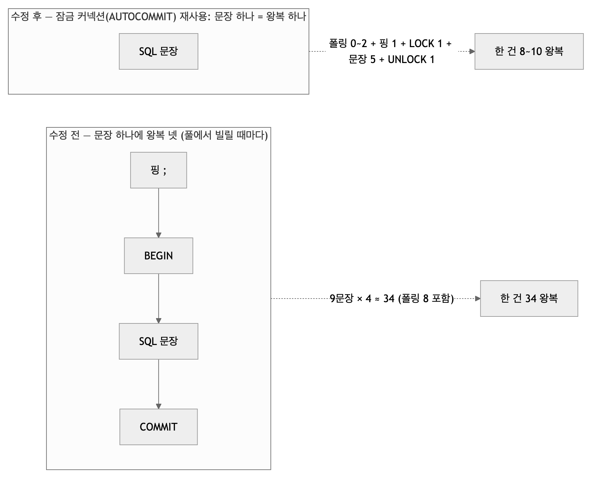
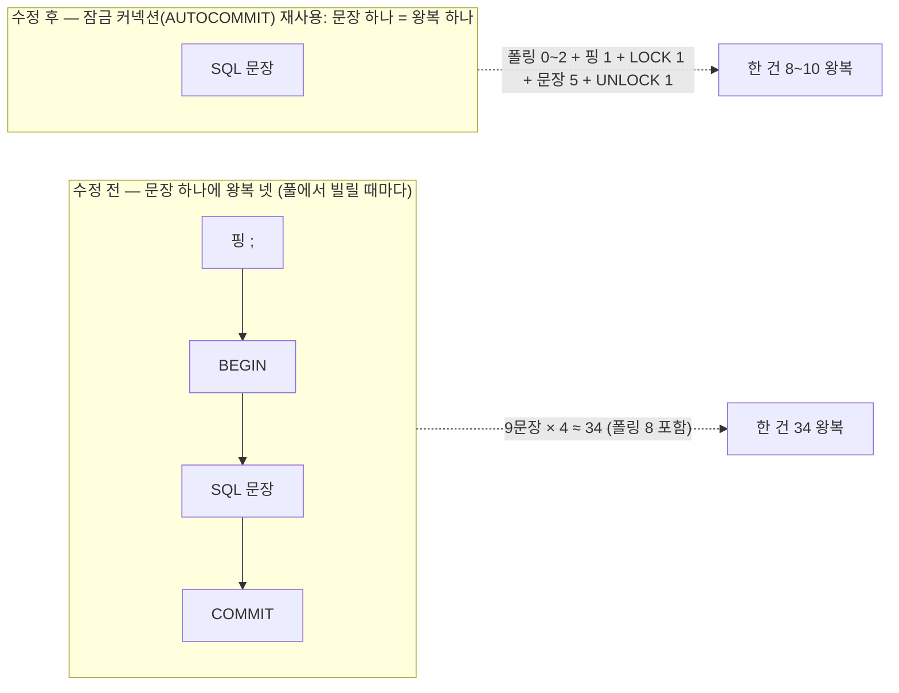

# 병목과 성능 — 재고, 고치고, 다시 잰다

| | |
|---|---|
| 읽는 시간 | 40분 |
| 답하는 질문 | 병목을 어떻게 찾았나 · p50/p95·처리량·슬롯 시간이 무엇이고 어떻게 재나 · 세 번의 고침(굶음·DB 왕복·하네스 함정)이 각각 무엇을 얼마나 바꿨나 · 숫자를 어디까지 믿나 · 다음 병목은 무엇일까 |
| 먼저 알아야 할 것 | [05 동시성](05_동시성.md) §2·§4·§8 |
| 기준 코드 | 커밋 `a5d1929` — `tools/loadtest/run.py`, `catalog.py`, `stores.py` |
| 같이 볼 문서 | 숫자 전부와 시나리오 정의는 [부하_시험_결과_2026-09-29](../부하_시험_결과_2026-09-29.md)(팀 공유용)와 [2026-09-28](../부하_시험_결과_2026-09-28.md)(기준선). 하네스 사용법은 [tools/loadtest/README](../../tools/loadtest/README.md) |

한 줄 요약: **09-27 까지 "감당할 것이다"는 추정이었다. 09-28 에 재 보니 정상 상황은 괜찮았고, 콜백이 느려지는 순간 서비스가 굶었다. 고친 뒤 다시 쟀다.** 이 장은 그 과정을 "어떻게 재는가"부터 설명한다.

## 1. 재기 전에는 고치지 않는다 — 하네스와 지표

**개념.** 성능 문제는 추측으로 고치면 대개 엉뚱한 곳을 고친다. 순서는 ① 재현 가능한 부하를 만들고 ② 몇 개의 지표를 정해 ③ 고치기 **전**에 재고 ④ 고친 **뒤** 같은 조건으로 다시 잰다. 지표는 평균보다 **백분위**로 본다 — p50(중앙값)은 "보통 경험", p95 는 "운 나쁜 5%". 평균은 극단값 하나에 끌려간다.

| 지표 | 뜻 | 우리가 재는 법 |
|---|---|---|
| 202 p50/p95 | 7.6 을 보내고 202 를 받기까지 | 하네스 시계 |
| `/health` 실패·최대 | 0.25초마다 순차로 찔러 답이 없거나 늦으면 | 하네스 시계 (순차라 멈춘 시간이 그대로 표본) |
| 슬롯 시간 | 한 건이 워커를 쥔 시간(분석+콜백+저장) | DB `updated_at − created_at` |
| 처리량 | 초당 끝낸 건수 | DB 행의 종료 시각 |
| 큐 최대·거절 | Supervisor 큐 깊이의 최대, 503 으로 돌려보낸 수 | `/health supervisor.queued`·`rejected` |
| 커넥션 최대 | AI 가 연 PostgreSQL 접속 수 | `pg_stat_activity` |

**우리 코드.** 하네스 [tools/loadtest/run.py](../../tools/loadtest/run.py)(543줄)는 그 자체가 작은 비동기 프로그램이다. 배울 기법 넷:

| 기법 | 어디 | 무엇 |
|---|---|---|
| `asyncio.Semaphore` + `gather` 로 동시 N건 | [run.py:151–164](../../tools/loadtest/run.py) | 세마포어가 동시성 상한, `gather` 가 전부 기다림. 응답 오류는 예외로 던지지 않고 기록(완료는 DB 로 센다) |
| 순차 `/health` 프로브 | [run.py:167–180](../../tools/loadtest/run.py) | 한 번에 하나만 보내니 "멈춘 시간"이 표본에 그대로 남는다 |
| `application_name=loadtest` 로 자기 커넥션 제외 | [run.py:99–100, 122–129](../../tools/loadtest/run.py) | `pg_stat_activity` 에서 하네스 자신을 빼고 AI 의 커넥션만 센다 |
| 집계는 순수 함수로 | [run.py:208–330](../../tools/loadtest/run.py) ↔ [tests/unit/test_loadtest_summary.py](../../tests/unit/test_loadtest_summary.py) | 백분위·요약·로그 파싱을 네트워크 없이 시험한다 |

```python
# run.py:151-164 (발췌) — 동시 N건
async def burst(client, url, headers, rids, sv, cats_of, concurrency, timeout, t0):
    sem = asyncio.Semaphore(concurrency)
    async def one(rid):
        async with sem:
            t = time.perf_counter()
            try:
                r = await client.post(url, json=payload(rid, sv, cats_of(rid)), headers=headers, timeout=timeout)
                return Post(rid, t - t0, (time.perf_counter() - t) * 1000, r.status_code)
            except httpx.HTTPError as e:            # 타임아웃·연결 실패 — 서버는 계속 처리할 수 있으므로 완료는 DB 로 센다
                return Post(rid, t - t0, (time.perf_counter() - t) * 1000, None, type(e).__name__)
    return list(await asyncio.gather(*(one(r) for r in rids)))
```

시나리오는 "정상 콜백 100건", "300건", "콜백 500(슬롯 2.5초)", "콜백 timeout(17.5초)", "큐 상한 50", "BE 실물 200건", "SIGTERM" — 표는 [09-29 §2.2](../부하_시험_결과_2026-09-29.md). 구성 그림: 

**왜 이렇게 했나.** 가짜 Backend 의 실패 주입(500·timeout)이 없었다면 "콜백이 느릴 때"를 재현할 수 없었고, 그 상황에서만 굶음이 드러났다. 정상 상황만 재면 문제가 없다고 결론 났을 것이다.

**대안과 트레이드오프.** k6·locust 같은 부하 도구 — 7.6 만 때리기엔 좋지만 `/health`·`pg_stat_activity`·`profile_runs` 시각을 한 화면에 모으려면 결국 우리 코드가 필요했다. 하네스의 비용: 543줄을 유지해야 하고, 도구 자체의 한계(§4)를 알아야 한다.

**확인해 보기.** [09 §9](09_운영과_도구.md)의 명령으로 S-A1 을 한 번 돌리고 요약 표의 여섯 줄을 위 표와 맞춰 읽는다.

## 2. 고침 ① — 굶음 (Supervisor)

기전은 [05 §2](05_동시성.md)에 다 있다. 여기서는 숫자만.

| 시나리오 | 지표 | 수정 전 (09-28) | 수정 후 (09-29) |
|---|---|---|---|
| 콜백 500 · 100건 · 슬롯 1 | `/health` 실패 / 최대 | 15 / 10,012 ms (154초 무응답) | 0 / 95 ms |
| 같은 조건 · 슬롯 4 · 6초 뒤 7.6 한 건 더 | 202 까지 | 34.5 초 | 6.5 ms |
| 콜백 timeout · 120초 관찰 | `/health` 실패 | 13개 중 12 | 485개 중 0 |
| 300건 · 슬롯 1 | 응답 | 전부 202 | 217 202 + 83 **503** (큐 200 가득) |

바뀐 것은 "기다리는 동안 다른 요청과 `/health` 가 답하느냐"다. **전부 끝나는 시간은 그대로**(슬롯 1 × 2.5초 × 100 = 254초) — 슬롯 시간과 슬롯 수를 건드리지 않았기 때문이고, 그것은 목표가 아니었다. 503 이 새로 생긴 것은 상한 있는 큐의 설계다([04 §6](04_통신.md)).

## 3. 고침 ② — DB 왕복 34 → 10(단독) / 8(연속)

**개념.** DB 와 앱은 네트워크로 말한다. 문장 하나를 보내고 답을 받는 것이 **왕복**(round trip) 하나이고, 로컬은 0.1~0.2ms, 클라우드 DB(RDS)는 0.5~1ms 다. 그래서 "SQL 이 몇 문장인가"보다 "**왕복이 몇 번인가**"가 시간을 정한다. 눈에 안 보이는 왕복이 셋 있다: 풀에서 커넥션을 빌릴 때의 확인 핑(`;`), SQLAlchemy 가 자동으로 여는 `BEGIN`, 끝의 `COMMIT`/`ROLLBACK`. 문장 하나에 넷이 붙는다.



<!-- fig: 06-왕복-전후 -->


**어떻게 세었나.** PostgreSQL 에 `log_statement = 'all'` 을 켜고 7.6 을 한 건 보낸 뒤 로그 줄을 셌다([09-28 §9·§10](../부하_시험_결과_2026-09-28.md)). 앱 코드 밖에서 사실을 재는 방법이라, 추측이 끼어들 틈이 없다.

**실제 로그로 보면.** 위 개념도는 문장 하나 기준이고, 아래는 7.6 **한 건 전체**를 로그에서 옮긴 것이다 — 칩 하나가 왕복 하나, 행은 9단계. 초록(실제 SQL)은 양쪽이 같고 회색(핑 `;`)·주황(BEGIN·COMMIT·ROLLBACK)만 사라진다. 문장은 그대로고 **"어느 커넥션에서 트랜잭션을 여느냐"만 바뀌었다**는 뜻이다. 점선 두 칸(①·⑤)은 카탈로그 폴링이 1초 TTL 캐시로 없어진 자리다.


| 수정 | 그림에서 사라진 칩 |
|---|---|
| 카탈로그 폴링 1초 TTL | ⑤ 전부. 앞 요청 뒤 1초 안이면 ① 도 |
| 잠금 커넥션 AUTOCOMMIT | ②·⑨ 의 BEGIN/COMMIT |
| 잠금 쥔 동안 같은 커넥션 재사용 | ③④⑥⑦⑧ 의 핑·BEGIN·COMMIT |
| 잠금 밖 읽기 AUTOCOMMIT | 단독 요청 ① 의 BEGIN/ROLLBACK, `/health` 12 → 4 |

<details>
<summary>로그 원문 — 수정 전 34줄 · 수정 후 8줄 (`tools/loadtest/results/pg-statements.txt` · `pg-statements-after2.txt`, 긴 upsert 본문은 … 로 줄임)</summary>

```sql
-- 수정 전 (34) — 수신자 900600
-- ① 접수: 활성 카탈로그 폴링
 1  ;                                                      -- 핑 (풀에서 꺼낼 때)
 2  BEGIN
 3  select id, package_id from ai_catalog.catalog_versions where is_active
 4  ROLLBACK
-- ② 잠금
 5  ;
 6  BEGIN
 7  select pg_try_advisory_lock($1)
 8  COMMIT
-- ③ 중복 판정 (다른 커넥션 — 새로 만든 커넥션이라 핑이 없다)
 9  BEGIN
10  select recipient_user_id, source_version, input_hash, status, catalog_version_id,
           callback_payload, callback_attempts, error, updated_at
      from ai_profile.profile_runs where recipient_user_id = $1 and source_version = $2
11  COMMIT
-- ④ 실행 기록 RUNNING
12  ;
13  BEGIN
14  insert into ai_profile.profile_runs (…) values (…) on conflict … do update set … returning id, attempt   -- 'RUNNING'
15  COMMIT
-- ⑤ 슬롯 안: 활성 카탈로그 폴링 (접수 때와 같은 문장을 또)
16  ;
17  BEGIN
18  select id, package_id from ai_catalog.catalog_versions where is_active
19  ROLLBACK
-- ⑥ 실행 기록 RESULT_READY (콜백 본문 저장)
20  ;
21  BEGIN
22  insert into ai_profile.profile_runs (…) … returning id, attempt                                            -- 'RESULT_READY'
23  COMMIT
-- ⑦ 수신자 프로필
24  ;
25  BEGIN
26  insert into ai_profile.recipient_profiles (…) values (…) on conflict (recipient_user_id) do update set … where … source_version <= excluded.source_version
27  COMMIT
-- ⑧ 콜백 뒤 DELIVERED
28  ;
29  BEGIN
30  insert into ai_profile.profile_runs (…) … returning id, attempt                                            -- 'DELIVERED'
31  COMMIT
-- ⑨ 잠금 해제
32  BEGIN
33  select pg_advisory_unlock($1)
34  COMMIT

-- 수정 후 (8) — 수신자 900997, 앞 요청 뒤 1초 안. 2~8 은 전부 같은 AUTOCOMMIT 잠금 커넥션
 1  ;                                        -- 잠금 커넥션 꺼낼 때 핑 한 번
 2  select pg_try_advisory_lock($1)
 3  select recipient_user_id, … from ai_profile.profile_runs where recipient_user_id = $1 and source_version = $2
 4  insert into ai_profile.profile_runs (…) … returning id, attempt      -- 'RUNNING'
 5  insert into ai_profile.profile_runs (…) … returning id, attempt      -- 'RESULT_READY'
 6  insert into ai_profile.recipient_profiles (…) … where … source_version <= excluded.source_version
 7  insert into ai_profile.profile_runs (…) … returning id, attempt      -- 'DELIVERED'
 8  select pg_advisory_unlock($1)

-- 단독 요청(마지막 폴링 뒤 1초 넘음, 수신자 900999)은 맨 앞에 둘이 붙어 10
 0a ;
 0b select id, package_id from ai_catalog.catalog_versions where is_active
```

</details>

**우리 코드 — 네 가지 수정과 각각 줄어든 왕복.**

| 수정 | 어디 | 줄어든 것 |
|---|---|---|
| 카탈로그 활성 버전 폴링에 1초 TTL | [catalog.py:243–261](../../src/profiling/catalog.py) | 접수·슬롯에서 매번 하던 폴링 8 → 0~2 |
| advisory lock 커넥션을 AUTOCOMMIT 으로 | [stores.py:211](../../src/profiling/stores.py) | 잠금·해제의 BEGIN/COMMIT 4 |
| 잠금 안 저장소 문장은 잠금 커넥션 재사용(thread-local) | [stores.py:42–71, 222](../../src/profiling/stores.py) | 문장마다 붙던 핑·BEGIN·COMMIT 15 |
| 잠금 밖 읽기는 AUTOCOMMIT | [stores.py:50–58](../../src/profiling/stores.py), [main.py:106, 211](../../src/profiling/main.py) | `/health` 12 → 4 |

| 단계 | 한 건 왕복 | S-A1 슬롯 ms | 처리량 /s | 커밋 |
|---|---|---|---|---|
| 수정 전 | 34 | 7.8 | 84 | — |
| 1차 (TTL + 잠금 AUTOCOMMIT) | 27 / 23 | 7.3 | 89 | `82df108` |
| 2차 (재사용 + 읽기 AUTOCOMMIT) | **10 / 8** | **4.0** | **165** | `e998f43` |

(같은 날 저녁 측정. 다음 날 아침엔 같은 코드로 5.5ms·125/s — §5.)

**왜 효과가 컸나.** 슬롯 1의 처리량은 슬롯 시간의 역수다. 슬롯 시간 7.8 → 4.0ms 이면 처리량은 두 배. 로컬에서 왕복 하나가 0.15ms 라 26번 줄이면 4ms — 정확히 슬롯 시간이 준 만큼이다. RDS 에서는 같은 26번이 13~26ms 가 되므로 효과가 더 크다.

**대안과 트레이드오프.** ① 결과 저장과 프로필 upsert 를 한 트랜잭션으로 — 왕복은 줄지만 잠금 커넥션에 트랜잭션이 생겨 이슈 A(`idle in transaction`)로 돌아간다([07 §6](07_데이터와_DB.md)). ② 폴링 TTL 을 길게 — 새 적재가 보이기까지 그만큼 늦는다(1초는 타협점). ③ 아예 비동기 드라이버 — 왕복 수는 같다(왕복은 드라이버가 아니라 문장 수의 문제). 비용: `_one` 이 "어느 커넥션에서 도나"를 판단하는 규칙을 이해해야 한다.

**확인해 보기.** §7.

## 4. 고침 ③ — 측정 도구 자체의 함정 (keep-alive)

**개념.** 측정값이 이상하면 **도구부터 의심**한다. 같은 조건에서 "아무 일도 안 하는 경로"를 재 보면 도구의 한계가 드러난다.

**무슨 일이 있었나.** 300건을 동시성 100으로 보내자 202 p50 이 0.7초로 나왔다. 서버 문제로 보였지만, 같은 동시성으로 `/openapi.json`(계산도 DB 도 없는 경로)을 때려도 초당 83건이었다. 하네스의 HTTP 클라이언트(httpx/httpcore 1.0.9)가 keep-alive 연결을 100개쯤 쥐면 요청 배정이 느려지는 것이 원인이었다 — 원시 소켓 클라이언트는 초당 8,000건, `Connection: close` 는 900건([09-29 §2.4](../부하_시험_결과_2026-09-29.md)).

**우리 코드.** 하네스에 `--no-keepalive` 옵션을 넣었다([run.py:404–411](../../tools/loadtest/run.py), README 주의 절). `--n` 이 `--concurrency` 보다 크면 이 옵션으로 잰다.

**교훈.** ① 09-28 문서의 "300건 p50 1.0초" 는 클라이언트 값이 섞인 것이었다 — 문서에 정정 주를 달았다. ② "서버 vs 클라이언트" 를 가르는 가장 싼 방법은 **서버 로그의 도착 시각**이었다(초당 도착 건수를 세니 첫 1초 108건, 이후 초당 50건 — 서버가 아니라 보내는 쪽이 느렸다).

**확인해 보기.** `uv run python -m tools.loadtest.run --n 300 --concurrency 100 ... --no-keepalive` 와 없이 한 번씩 돌려 202 p50 을 비교한다(있으면 ≈100ms, 없으면 ≈700ms).

## 5. 숫자 읽는 법

- **절대값은 날마다 다르다.** 같은 코드(`6f71546`)로 09-28 저녁 185/s, 09-29 아침 125/s. 재부팅 직후 Spotlight 색인이 CPU 를 쓰고 있었다. 비교는 **같은 날, 같은 조건** 안에서만.
- **관계를 본다.** "굶는가/안 굶는가", "503 이 나오는가", "커넥션이 몇 개인가", "슬롯 4 가 1 의 몇 배인가(1.6)" 는 날이 바뀌어도 같다.
- **로컬은 상대 기준선이다.** 하네스·uvicorn·Docker DB 가 한 노트북의 코어를 나눠 쓴다. AWS t 계열이면 절대값이 2~3배 느려도 관계는 같다.
- **실제 부하는 시험보다 훨씬 작다.** BE 는 틱당 100건을 직렬로 보낸다(초당 84건 이하) — 워커 배출(125~185/s)보다 느려 큐가 0 이다([09-29 §4.7](../부하_시험_결과_2026-09-29.md)). 300건 버스트의 503 은 안전장치이지 일상이 아니다.

## 6. 다음 병목 후보

| 후보 | 근거 | 무엇을 하면 |
|---|---|---|
| CPU: `build_pool` 이 매번 4,231건을 거르고 정렬 | 슬롯 4 가 1.6배뿐(GIL 경합) | 카테고리별 목록·정렬을 미리 만들어 둔다. 또는 프로세스(컨테이너) 수를 늘린다 |
| 기한 없음 | 콜백 장애가 길면 큐가 차서 503 만 남는다 | 위키 §12.1 `profile_deadline` 240초·취소 — [지도 09-28 §5 4번](../파이프라인_지도/2026-09-28.md) |
| `/health` 의 `undelivered` 가 `count(*)` 전체 스캔 | 행이 늘면 느려진다 | 부분 인덱스(`status = 'RESULT_READY'`)나 카운터 열 |
| 큐 상한 200·`Retry-After` 30 은 시작값 | 스테이징 RDS 의 슬롯 시간을 모른다 | 스테이징에서 S-A1·S-B1 을 다시 재고 조정 |
| 10분 이상 지속 부하는 안 쟀다 | 메모리·카운터 증가 미확인 | 스테이징에서 |

## 7. 확인해 보기 — 한 건의 왕복을 직접 세기 (15분)

```bash
# 1) 문장 로그 켜기 (별도 -c 로: ALTER SYSTEM 은 트랜잭션 안에서 못 돈다)
docker exec profiling-ai-db psql -U ai_user -d ai_chat -c "ALTER SYSTEM SET log_statement='all'" -c "SELECT pg_reload_conf()"
# 2) 서버·가짜 BE 를 띄우고 7.6 을 한 건 보낸다 (04 §12 의 ④)
# 3) 로그에서 그 건의 문장을 센다
docker logs profiling-ai-db --since 1m 2>&1 | grep -c "statement:"
docker logs profiling-ai-db --since 1m 2>&1 | grep -o "statement: [A-Za-z;]*" | sort | uniq -c
# 4) 끄기
docker exec profiling-ai-db psql -U ai_user -d ai_chat -c "ALTER SYSTEM RESET log_statement" -c "SELECT pg_reload_conf()"
```

질문: 1초 안에 두 건을 연달아 보내면 둘째 건의 왕복은 왜 8이고 첫째는 10인가? <details><summary>답</summary>첫째는 TTL 이 지나 있어 카탈로그 폴링(핑 + SELECT) 2 왕복이 들어간다. 둘째는 1초 안이라 캐시를 쓴다([catalog.py:249–251](../../src/profiling/catalog.py)).</details>

---

다음 장: [07 데이터와 DB](07_데이터와_DB.md) — 이 장의 "핑·BEGIN·COMMIT" 이 무엇인지 트랜잭션부터. 막히면 [용어집](10_용어집.md).
