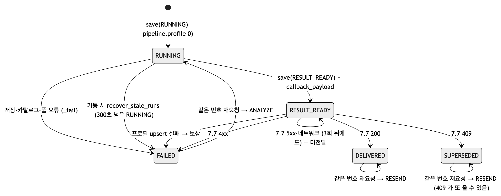
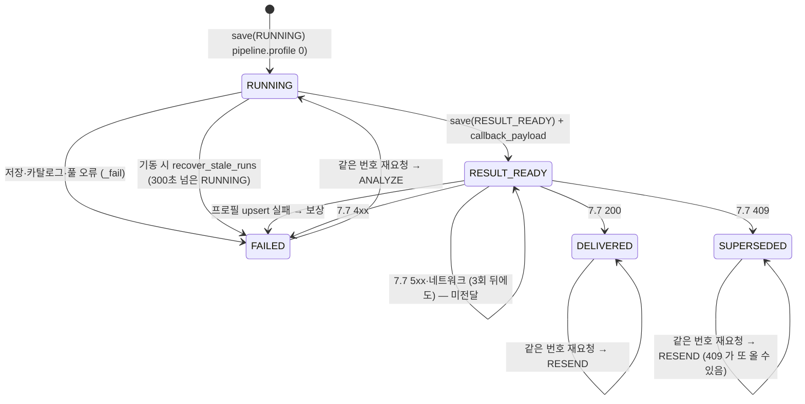

# 데이터와 DB — 표·제약·트랜잭션·마이그레이션

| | |
|---|---|
| 읽는 시간 | 50분 |
| 답하는 질문 | 표가 왜 이렇게 다섯 개인가 · 상태를 왜 enum 이 아니라 text+CHECK 로 두나 · upsert 가 무엇이고 `coalesce`·`greatest` 가 왜 붙나 · 트랜잭션·AUTOCOMMIT·`idle in transaction` 이 무엇이고 우리가 어디서 어떻게 쓰나 · 마이그레이션은 어떻게 도나 |
| 먼저 알아야 할 것 | SELECT/INSERT/UPDATE, 기본 키·외래 키 정도. 트랜잭션·격리 수준·인덱스 종류는 여기서 처음부터 |
| 기준 코드 | 커밋 `a5d1929` — `alembic/versions/0001~0004`, `stores.py`, `catalog.py`, `main.py` |
| 같이 볼 문서 | 표 하나하나의 열과 FAQ 는 [DB_ERD](../DB_ERD.md)(가장 친절한 문서). 메모리에서 DB 로 옮긴 이유는 [DB_전환_설명](../DB_전환_설명.md) |

## 1. 표가 왜 셋 + 둘인가

**개념.** PostgreSQL 은 표를 **스키마**(폴더 같은 것)로 묶는다. 우리는 두 스키마를 쓴다 — `ai_profile`(우리가 만든 결과)과 `ai_catalog`(Backend 가 준 상품). 표는 "무엇을 잃으면 안 되는가"마다 하나다.

| 표 | 만든 리비전 | 잃으면 안 되는 것 | 한 행 = |
|---|---|---|---|
| `ai_profile.recipient_profiles` | [0001](../../alembic/versions/0001_recipient_profiles.py) | 수신자의 태그(v1 은 비선호 카테고리 이름) — 채팅이 나중에 읽는다 | 수신자 한 명 (최신 분석이 덮어씀) |
| `ai_profile.profile_runs` | [0002](../../alembic/versions/0002_profile_runs.py) | 실행이 어디까지 갔는지, 보낸 본문이 무엇이었는지 — 재시작·재전송·감사 | (수신자, sourceVersion) 한 쌍 |
| `ai_catalog.catalog_versions` | [0003](../../alembic/versions/0003_catalog.py) | 어느 패키지를 언제 적재했고 지금 무엇이 활성인지 | 적재 1회 |
| `ai_catalog.categories` | 0003 | 대분류 10 + 소분류 57 과 부모 관계 | 카테고리 하나 |
| `ai_catalog.products` | 0003 | 상품 4,231건 | 상품 하나 |

`profile_runs` 는 **작업 큐가 아니다** — 아무도 이 표를 폴링하지 않는다([0002:8, 57](../../alembic/versions/0002_profile_runs.py)). 큐는 메모리에 있고([05 §4](05_동시성.md)), 이 표는 "무슨 일이 있었나"의 기록이다. 전체 그림은 [DB_ERD §1](../DB_ERD.md)의 ERD 를 본다.

**확인해 보기.**
```bash
docker exec -it profiling-ai-db psql -U ai_user -d ai_chat -c "\dt ai_profile.*" -c "\dt ai_catalog.*"
```

## 2. 상태를 `text` + `CHECK` 로 — enum 을 쓰지 않은 이유

**개념.** 값의 종류가 정해진 열(상태)은 PostgreSQL `ENUM` 타입으로도, `text` 열에 `CHECK (status IN (...))` 제약으로도 만들 수 있다. ENUM 은 값을 추가하려면 `ALTER TYPE` 이 필요하고 삭제는 더 까다롭다. CHECK 는 제약을 지우고 다시 만들면 끝이다.

**우리 코드.** [0002:33, 48](../../alembic/versions/0002_profile_runs.py):

```python
# 0002_profile_runs.py:33, 38, 48 (발췌)
# PG enum 타입 대신 text + CHECK — 상태를 추가·삭제할 때 ALTER TYPE 없이 제약만 바꾸면 된다
sa.Column("status", sa.Text, nullable=False, comment="RUNNING → RESULT_READY → DELIVERED | SUPERSEDED · 실패는 FAILED"),
sa.CheckConstraint("status IN (" + ", ".join(f"'{s}'" for s in STATUSES) + ")", name="ck_profile_runs_status"),
```

같은 방식이 [0003:77–78, 113–117](../../alembic/versions/0003_catalog.py) 에도 있다(`level IN (1, 2)`, `availability IN (...)`, 부모 규칙 `(level = 1) = (parent IS NULL)`). 파이썬 쪽 값은 [types.py:179–186](../../src/profiling/types.py) `RunStatus` — 두 목록이 같아야 하며, 0002 의 주석이 그것을 상기시킨다.

**왜 이렇게 했나.** 상태는 바뀐다(v3 에서 늘 수 있다). CHECK 는 DB 가 "이상한 값"을 막아 주면서도 바꾸기 쉽다.

**대안과 트레이드오프.** ENUM 은 저장 공간이 작고 값 오타를 타입 수준에서 막는다. 앱에서 검증(파이썬 `StrEnum`)만 하고 DB 제약을 안 두는 방법도 있지만, 다른 프로세스·수동 SQL 이 잘못 넣는 것을 못 막는다.

**확인해 보기.** §11.

## 3. upsert — `INSERT … ON CONFLICT DO UPDATE`

**개념.** "있으면 갱신, 없으면 삽입"을 한 문장으로 하는 것이 upsert 다. PostgreSQL 은 `INSERT … ON CONFLICT (키) DO UPDATE SET …` 으로 쓰고, 새로 넣으려던 값은 `excluded.열` 로 가리킨다. 두 문장(SELECT 뒤 INSERT/UPDATE)으로 나누면 그 사이에 다른 프로세스가 끼어들 수 있지만, 한 문장이면 DB 가 원자적으로 처리한다.

**우리 코드.** 실행 기록 [stores.py:80–95](../../src/profiling/stores.py):

```sql
-- stores.py:80-95 (_RUN_UPSERT)
insert into ai_profile.profile_runs (recipient_user_id, source_version, input_hash, status, catalog_version_id, callback_payload, callback_hash, callback_attempts, error)
values (:rid, :sv, :input_hash, :status, :catalog_version_id, cast(:callback_payload as jsonb), :callback_hash, :callback_attempts, cast(:error as jsonb))
on conflict (recipient_user_id, source_version) do update set
    status             = excluded.status,
    input_hash         = excluded.input_hash,
    attempt            = profile_runs.attempt + (case when excluded.status = 'RUNNING' then 1 else 0 end),
    catalog_version_id = coalesce(excluded.catalog_version_id, profile_runs.catalog_version_id),
    callback_payload   = coalesce(excluded.callback_payload, profile_runs.callback_payload),
    callback_hash      = coalesce(excluded.callback_hash, profile_runs.callback_hash),
    callback_attempts  = greatest(excluded.callback_attempts, profile_runs.callback_attempts),
    error              = excluded.error,
    updated_at         = now()
returning id, attempt
```

열마다 **병합 규칙**이 다르다는 것이 요점이다.

| 열 | 규칙 | 뜻 |
|---|---|---|
| `status`·`input_hash`·`error` | 덮어쓴다 | 지금 상태가 정답 |
| `attempt` | RUNNING 으로 다시 저장될 때만 +1 | 분석을 몇 번 시작했나 |
| `callback_payload`·`callback_hash`·`catalog_version_id` | `coalesce(새, 옛)` — 새 값이 NULL 이면 옛 값 유지 | 콜백 뒤 상태만 바뀔 때 본문을 잃지 않게 |
| `callback_attempts` | `greatest(새, 옛)` — 줄어들지 않는다 | 시도 횟수는 누적 |

수신자 프로필 [stores.py:282–291](../../src/profiling/stores.py)은 **조건부** upsert 다 — `where profile.source_version <= excluded.source_version`. 낮은 버전이 늦게 오면 DB 가 무시하고, 파이썬은 `rowcount == 0` 으로 그것을 안다([stores.py:313–315](../../src/profiling/stores.py)). 같은 규칙이 [types.py:289–295](../../src/profiling/types.py) `should_replace` 에도 적혀 있지만 **서비스 코드는 부르지 않는다** — 살아 있는 심판은 SQL 쪽이다(시험 가짜 저장소용 참고 구현).

**왜 이렇게 했나.** 같은 행을 세 번 쓴다(RUNNING → RESULT_READY → DELIVERED). 문장 하나로 "있으면 갱신"을 하면 첫 저장과 나중 저장의 코드가 같아지고, 두 프로세스가 동시에 써도 DB 가 순서를 정한다.

**대안과 트레이드오프.** SELECT 뒤 분기 — 코드가 늘고 경쟁 조건이 생긴다. ORM 의 `merge()` — 우리는 ORM 을 안 쓴다(§8). upsert 의 비용: 병합 규칙이 SQL 안에 있어 파이썬만 읽어서는 안 보인다 — 그래서 이 표가 필요하다.

**확인해 보기.** 한 건을 보낸 뒤 `select status, attempt, callback_attempts, callback_hash is not null from ai_profile.profile_runs order by updated_at desc limit 3;` — 같은 행이 DELIVERED 이고 `attempt=1`, 본문 해시가 남아 있다.

## 4. JSONB — 구조가 정해지지 않은 값

**개념.** JSONB 는 JSON 을 파싱해 저장하는 열 타입이다. 배열·객체를 그대로 넣고 꺼낼 수 있고, 키로 검색할 수도 있다(GIN 인덱스, §5). 열을 미리 다 정하기 어려운 값(태그 목록, 콜백 본문, 오류 상세)에 쓴다.

**우리 코드.** 태그 셋([0001:37–42](../../alembic/versions/0001_recipient_profiles.py)), 콜백 본문과 오류([0002:42, 45](../../alembic/versions/0002_profile_runs.py)). 파이썬에서 넣을 때는 문자열로 만들어 `cast(:x as jsonb)` 로 넘기고([stores.py:84, 251, 284](../../src/profiling/stores.py)), 읽을 때는 psycopg 가 파이썬 list/dict 로 돌려준다([stores.py:136, 326–327](../../src/profiling/stores.py)).

**왜 이렇게 했나.** 콜백 본문을 통째로 보관해야 재전송 때 **같은 본문**을 보낼 수 있다([04 §8](04_통신.md)). 키 이름은 snake_case 로 통일했다([DB_전환_설명](../DB_전환_설명.md)).

**대안과 트레이드오프.** 태그를 별도 표(`recipient_tags` 행마다 하나)로 정규화하면 SQL 로 다루기 좋지만 v1 에서 태그를 SQL 로 검색할 일이 없다. JSONB 의 비용: 안의 구조를 DB 가 검증하지 않는다 — 검증은 pydantic 이 한다.

## 5. 인덱스 — 유니크 · 부분 유니크 · GIN

**개념.** 인덱스는 "찾기"를 빠르게 하는 별도 자료구조다. **유니크 인덱스**는 같은 값이 두 번 들어오는 것을 막는 제약이기도 하다. **부분 인덱스**는 `WHERE` 조건에 맞는 행만 인덱스에 넣는다 — 부분 **유니크** 인덱스면 "조건에 맞는 행은 하나뿐"이 된다. **GIN** 은 JSONB·배열 안의 값을 찾는 인덱스다.

**우리 코드.**

| 인덱스 | 어디 | 역할 |
|---|---|---|
| `unique_profile_source (recipient_user_id, source_version)` | [0002:60](../../alembic/versions/0002_profile_runs.py) | 같은 (수신자, 버전)은 한 행 — §3 의 `on conflict` 키가 이것 |
| `one_active_catalog_version (is_active) WHERE is_active` | [0003:60–61](../../alembic/versions/0003_catalog.py) | **활성 카탈로그는 항상 하나**. 읽는 쪽이 이것을 믿는다([catalog.py:279](../../src/profiling/catalog.py)) |
| `uq_categories_backend_id` · `uq_products_backend_id` | [0003:79, 118](../../alembic/versions/0003_catalog.py) | Backend 번호가 겹치지 않게(NULL 은 허용) |
| `ix_categories_parent` · `ix_products_category` | [0003:82, 121](../../alembic/versions/0003_catalog.py) | 조인용 |
| `ix_products_view_count` | [0003:122](../../alembic/versions/0003_catalog.py) | **지금은 안 쓴다** — 앱은 활성 카탈로그 전체를 읽어 파이썬에서 정렬한다([pipeline.py:128](../../src/profiling/pipeline.py)) |
| GIN on `preferred_tags`·`disliked_tags` | [0001:49–50](../../alembic/versions/0001_recipient_profiles.py) | **지금은 안 쓴다** — "태그로 수신자를 찾을 일"을 위해 미리 |

**왜 이렇게 했나.** 부분 유니크 인덱스 하나가 "활성은 하나"라는 규칙을 코드가 아니라 DB 에 두게 한다 — 적재 CLI 가 실수해도 두 개가 활성이 될 수 없다.

**대안과 트레이드오프.** 안 쓰는 인덱스 둘은 쓰기마다 비용을 조금 더한다. 4,231건·수신자 수천 명 규모에서는 무시할 만하고, 필요해질 때 있는 편이 낫다고 봤다 — 규모가 커지면 다시 본다.

**확인해 보기.**
```sql
select indexname, indexdef from pg_indexes where schemaname in ('ai_profile','ai_catalog') order by 1;
insert into ai_catalog.catalog_versions (package_id, taxonomy_version, product_count, category_count, is_active)
values ('dup', 'x', 0, 0, true);   -- 활성이 이미 있으면 유니크 위반으로 실패한다 (그 뒤 지울 필요 없음)
```

## 6. 트랜잭션 · autobegin · AUTOCOMMIT · `idle in transaction`

**개념.** **트랜잭션**은 여러 문장을 한 묶음으로 — 다 성공하면 COMMIT, 아니면 ROLLBACK. 커넥션이 `BEGIN` 을 보내면 트랜잭션이 열리고 COMMIT/ROLLBACK 까지 유지된다. 열어 놓고 아무것도 안 하는 상태가 **`idle in transaction`** 인데, 오래 두면 VACUUM 을 막고 세션 타임아웃에 걸린다. **AUTOCOMMIT** 은 문장마다 자동으로 커밋되는 모드 — 트랜잭션을 아예 열지 않아 BEGIN/COMMIT 왕복도 없다. SQLAlchemy 2.0 은 **autobegin** 이라, 커넥션에서 첫 문장을 실행하면 자동으로 `BEGIN` 을 보낸다 — 잊고 커밋 안 하면 `idle in transaction` 이 된다.

**우리 코드.** 규칙이 [stores.py:9–14](../../src/profiling/stores.py) 에 있고, 구현은 셋이다.

| 상황 | 방식 | 코드 |
|---|---|---|
| 잠금을 쥔 워커의 모든 문장 | 잠금 커넥션(AUTOCOMMIT)에서 문장 하나 = 왕복 하나 | [stores.py:61–66, 211, 222](../../src/profiling/stores.py) |
| 잠금 밖 쓰기 | `engine.begin()` — 문장 하나짜리 트랜잭션, 나가면서 COMMIT | [stores.py:67–69, 247, 273, 332](../../src/profiling/stores.py) |
| 잠금 밖 읽기 | `_autocommit(engine)` — BEGIN/ROLLBACK 없이 한 문장 | [stores.py:50–58, 70–71](../../src/profiling/stores.py), [main.py:106, 211](../../src/profiling/main.py), [catalog.py:273, 284](../../src/profiling/catalog.py) |

```python
# stores.py:50-58
@contextmanager
def _autocommit(engine):
    """읽기 한 문장용 커넥션 — 트랜잭션을 열지 않아 BEGIN/ROLLBACK 왕복이 없다."""
    conn = engine.connect()
    try:
        conn.execution_options(isolation_level="AUTOCOMMIT")
        yield conn
    finally:
        conn.close()
```

**왜 이렇게 했나.** 두 사건 때문이다. ① 09-27 이슈 A: 잠금 커넥션이 autobegin 으로 트랜잭션을 연 채 콜백까지 기다려 `idle in transaction` 이 수 초씩 생겼다 → AUTOCOMMIT 으로 바꿔 0 이 됐다([이슈 2026-09-27_1633 A](../issues/2026-09-27_1633_advisory-lock/README.md)). ② 09-28 왕복 세기: 문장마다 풀에서 빌리며 핑·BEGIN·COMMIT 이 붙어 한 건에 34 왕복 → 잠금 커넥션 재사용 + 읽기 AUTOCOMMIT 으로 10(단독)/8(1초 안 연속)([06 §3](06_병목과_성능.md)).

**원자성은 어디까지?** 문장 단위다. "결과 저장(RESULT_READY)"과 "프로필 upsert" 는 한 트랜잭션이 **아니다**. 둘째가 실패하면 `pipeline.profile` 이 실행 기록을 FAILED 로 되돌리는 **보상**이 그 역할을 한다([pipeline.py:200–206](../../src/profiling/pipeline.py), [03 §13](03_디자인_패턴.md)). 한 트랜잭션으로 묶으면 원자적이지만 잠금 커넥션에 트랜잭션이 생겨 ①로 돌아간다.

**대안과 트레이드오프.** 문장마다 트랜잭션(옛 방식) — 안전해 보이지만 왕복이 3~4배. ORM 세션 — 우리는 안 쓴다. 지금 방식의 비용: "이 문장은 어느 커넥션에서 도나"를 `_one` 이 판단하므로 그 함수를 이해해야 한다.

**확인해 보기.** 느린 콜백으로 부하를 주는 동안:
```sql
select state, count(*) from pg_stat_activity where datname='ai_chat' and application_name <> 'psql' group by 1;
-- 'idle in transaction' 이 0 이어야 한다. 통합 시험 test_db_stores.py 가 같은 것을 확인한다.
```

## 7. READ COMMITTED 와 "한 문장 스냅샷"

**개념.** PostgreSQL 기본 격리 수준 READ COMMITTED 에서는 **문장마다** 새 스냅샷을 본다. 같은 트랜잭션 안이라도 첫 문장과 둘째 문장 사이에 다른 프로세스가 커밋한 변경은 둘째 문장에 보인다. 그래서 "활성 버전을 읽고(문장 1) 그 버전의 상품을 읽는다(문장 2)" 는 사이에 카탈로그가 교체되면 "버전은 옛것, 상품은 새것"이 된다.

**우리 코드.** 한 문장으로 버전과 상품을 같이 읽는다([catalog.py:180–194](../../src/profiling/catalog.py)):

```sql
-- catalog.py:184-194 (_ACTIVE_PRODUCTS, 발췌)
select v.id as version_id, v.package_id, p.source_product_id, p.backend_product_id, ...
from ai_catalog.catalog_versions v
join ai_catalog.products p on p.package_id = v.package_id
join ai_catalog.categories c on c.source_category_id = p.source_category_id
left join ai_catalog.categories cp on cp.source_category_id = c.parent_source_category_id
where v.is_active
```

전제가 하나 더 있다 — 적재 CLI 가 "옛 버전 비활성 + 새 버전 활성"을 **한 트랜잭션**으로 커밋한다([tools/catalog/load_catalog.py:149–159](../../tools/catalog/load_catalog.py)). 그래야 어느 순간에도 활성이 0개나 2개인 스냅샷이 없다.

**왜 이렇게 했나.** 문장 하나면 정의상 한 스냅샷이다. `REPEATABLE READ` 로 올리는 방법도 있지만 읽기 하나를 위해 트랜잭션을 열어야 한다.

**확인해 보기.** `catalog.py:180–183` 의 주석을 읽고, 두 문장으로 나누면 무엇이 깨질지 [tests/integration/test_db_catalog_reader.py](../../tests/integration/test_db_catalog_reader.py) 의 "한 벌" 시험이 어떻게 잡는지 본다.

## 8. alembic — 표 변경을 코드로

**개념.** 마이그레이션은 DB 구조 변경(표 추가, 열 추가)을 **순서 있는 코드 파일**로 남기는 것이다. 각 파일(리비전)은 `upgrade()`(적용)와 `downgrade()`(되돌림)를 갖고, DB 의 `alembic_version` 표가 "지금 어디까지 적용됐나"를 기억한다. 새 환경에서 `alembic upgrade head` 한 번이면 같은 구조가 만들어진다.

**우리 코드.**
- 리비전 넷: `0001`(스키마·`vector` 확장·프로필 표) → `0002`(실행 기록) → `0003`(카탈로그 표 셋) → `0004`(열 주석만 정정, 동작 변경 없음 — [0004:1–11](../../alembic/versions/0004_profile_runs_comments.py)). 전부 되돌릴 수 있다.
- URL 의 단일 출처: [alembic/env.py:8, 18](../../alembic/env.py) 이 `profiling.settings.get_settings().DATABASE_URL` 을 읽어 앱과 같은 `.env` 를 쓴다. `alembic.ini` 의 URL 은 자리표시자.
- ORM 이 없으므로 `target_metadata = None` — **autogenerate 를 쓰지 않고** 리비전을 손으로 쓴다([env.py:24](../../alembic/env.py)).
- 앱은 기동 때 `alembic_version` 을 읽어 없으면 **뜨지 않는다**([main.py:98–118](../../src/profiling/main.py)). `/health` 의 `store.migration` 이 현재 리비전(`0004`)이다.
- compose 에서는 앱과 같은 이미지의 `ai-migrate` 서비스가 **앱보다 먼저, 한 번만** `alembic upgrade head` 를 돌린다([docker-compose.yml:31–41](../../docker-compose.yml)).

**왜 이렇게 했나.** "누가 언제 표를 바꿨나"가 git 에 남고, 팀원 DB·스테이징·운영이 같은 절차로 같은 구조가 된다. 앱 시작과 마이그레이션을 섞지 않는 이유는 앱이 여러 개로 늘어도 마이그레이션은 한 번만 돌아야 하기 때문이다.

**대안과 트레이드오프.** ORM 모델 + autogenerate — 편하지만 우리는 SQL 을 그대로 쓰는 편을 택했다(`sa.text`). 손으로 쓰는 비용: 열 하나 바꿔도 리비전 파일을 쓴다 — 대신 무엇이 바뀌는지 리뷰가 쉽다.

**확인해 보기.**
```bash
uv run alembic current            # 0004 (head)
uv run alembic history --verbose | head -20
```

## 9. 실행 상태 기계 — `profile_runs.status`

**개념.** 상태 기계는 "지금 상태"와 "허용된 전이"를 정해 둔 것이다. 전이가 코드 여기저기에 흩어져 있어도, 표 하나로 모으면 "이 상태에서 저 상태로 갈 수 있나"를 바로 답할 수 있다.



<!-- fig: 07-상태-기계 -->


| 전이 | 코드 |
|---|---|
| → RUNNING (attempt +1 이면 재실행) | [pipeline.py:150–156](../../src/profiling/pipeline.py), [stores.py:88](../../src/profiling/stores.py) |
| RUNNING → RESULT_READY (본문·해시 필수, DB 가 강제) | [pipeline.py:184–198](../../src/profiling/pipeline.py), [0002:52–55](../../alembic/versions/0002_profile_runs.py) |
| RESULT_READY → FAILED (보상) | [pipeline.py:200–206](../../src/profiling/pipeline.py) |
| RESULT_READY → DELIVERED / SUPERSEDED / FAILED / 그대로 | [intake.py:183–185](../../src/profiling/intake.py), [backend.py:67–75](../../src/profiling/backend.py) |
| RUNNING → FAILED (기동 정리) | [stores.py:238–258](../../src/profiling/stores.py), [main.py:73–79](../../src/profiling/main.py) |
| 재진입(ANALYZE / RESEND / SKIP) | [intake.py:198–221](../../src/profiling/intake.py) `decide` |

이 상태들은 **우리 내부용**이다. Backend 가 보는 `profileStatus` 는 NONE/PENDING/COMPLETED/FAILED 네 값이고([schemas.py:20–21](../../src/profiling/schemas.py)), 우리는 그중 PENDING(7.6 응답)과 COMPLETED(7.7)만 보낸다 — [이름_대조표 §5](../../이름_대조표.md).

**DB 가 지키는 불변식.** `ck_profile_runs_result_has_payload`([0002:52–55](../../alembic/versions/0002_profile_runs.py)): RESULT_READY·DELIVERED·SUPERSEDED 행은 반드시 본문과 해시를 가진다. "결과 없이 결과 상태"가 되는 행을 코드가 아니라 DB 가 막는다 — 재전송이 언제나 가능하다는 보장이다.

**확인해 보기.** §11.

## 10. ID 규칙 — 수집처 ID 가 정본, Backend 번호는 나중에

**개념.** 두 시스템이 같은 물건을 다른 번호로 부를 때는 "정본이 무엇인가"와 "번호가 아직 없을 때 어떻게 하나"를 정해야 한다.

**우리 코드.** 카탈로그 표의 기본 키는 수집처 문자열 ID(`KAKAO_GIFT:10002797` · `CAT-01-02`)이고, Backend 가 발급하는 정수 번호(`backend_product_id`·`backend_category_id`)는 **NULL 허용 + 유니크**다([0003:10–14, 71–72, 88–89, 117–118](../../alembic/versions/0003_catalog.py)). 7.6 의 `categoryId` 와 7.7 의 `recommendedProductIds` 는 이 정수 번호로 말한다. 번호가 아직 없는 동안 읽기 어댑터는 수집처 ID 의 숫자부를 **임시 번호**로 쓰고 `/health` 에 `provisional_ids: true` 를 띄운다([catalog.py:9–12, 202–215, 293–300](../../src/profiling/catalog.py), [main.py:198–200](../../src/profiling/main.py)) — 임시 번호로 7.7 을 보내면 Backend 화면에 상품이 안 뜬다는 경고다. `products` 에는 `catalog_versions` 로 가는 FK 가 없고 `package_id` 로 잇는다([catalog.py:183, 191](../../src/profiling/catalog.py)); `profile_runs.catalog_version_id` 도 감사용이라 FK 가 없다([0002:40–41](../../alembic/versions/0002_profile_runs.py)).

**왜 이렇게 했나.** 상품 4,231건은 Backend 번호 회신 전에 받았고, 회신을 기다리느라 적재를 미룰 수 없었다. 회신이 오면 `load_catalog.py --id-map` 으로 채우고 같은 코드가 진짜 번호를 쓰기 시작한다. 재고도 같은 태도다 — 모르면 `unknown` 으로 두고 추정하지 않는다([0003:16–22](../../alembic/versions/0003_catalog.py)).

**확인해 보기.** `curl -s localhost:8000/health | python3 -m json.tool | grep provisional` — 회신이 다 적용된 DB 라면 아무것도 안 나온다.

## 11. 확인해 보기 — DB 가 막는 것을 직접 보기 (10분)

```bash
docker exec -it profiling-ai-db psql -U ai_user -d ai_chat
```
```sql
-- ① CHECK: 없는 상태
insert into ai_profile.profile_runs (recipient_user_id, source_version, input_hash, status) values (1, 1, 'h', 'DONE');
-- ERROR: ck_profile_runs_status
-- ② 불변식: 결과 상태인데 본문이 없다
insert into ai_profile.profile_runs (recipient_user_id, source_version, input_hash, status) values (1, 1, 'h', 'RESULT_READY');
-- ERROR: ck_profile_runs_result_has_payload
-- ③ 유니크: 같은 (수신자, 버전) 두 번 — 첫 줄은 성공, 둘째는 실패
insert into ai_profile.profile_runs (recipient_user_id, source_version, input_hash, status) values (990999, 1, 'h', 'RUNNING');
insert into ai_profile.profile_runs (recipient_user_id, source_version, input_hash, status) values (990999, 1, 'h', 'RUNNING');
-- ERROR: unique_profile_source
delete from ai_profile.profile_runs where recipient_user_id = 990999;   -- 정리
```

질문: ③ 대신 §3 의 upsert 문장을 두 번 실행하면? <details><summary>답</summary>둘째는 `on conflict … do update` 로 들어가 실패하지 않고 `attempt` 가 2 가 된다(둘 다 RUNNING 이므로). 이것이 "재실행"의 기록 방식이다.</details>

---

다음 장: [03 디자인 패턴](03_디자인_패턴.md). 막히면 [용어집](10_용어집.md).
