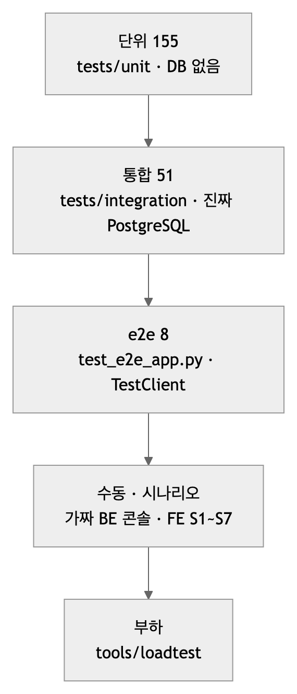
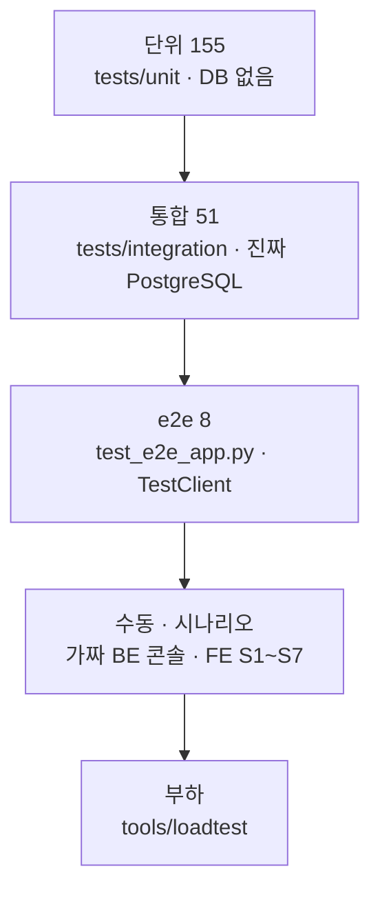

# 테스트 — 대역으로 업무를, 진짜로 어댑터를

| | |
|---|---|
| 읽는 시간 | 45분 |
| 답하는 질문 | 시험 206개가 어떻게 나뉘나 · 목(mock) 라이브러리 없이 어떻게 가짜를 만드나 · DB 가 필요한 시험은 어떻게 격리하나 · 시간·네트워크·잠자기를 어떻게 없애나 · 시험 하나를 어떻게 추가하나 |
| 먼저 알아야 할 것 | pytest 기본(`def test_…`, `assert`, fixture). [02 §4](02_아키텍처.md) Protocol |
| 기준 코드 | 커밋 `a5d1929` — `tests/unit` 17파일 155개, `tests/integration` 6파일 51개(+skip 2) |
| 같이 볼 문서 | 파일별 목록은 [README §4](../../README.md) |

## 1. 원칙 — 세 문장

README 가 정한 원칙([README.md](../../README.md) §4): **업무 코드는 가짜 구현으로, 어댑터는 가짜 바깥으로, 계약은 스키마로.** 풀어 쓰면:
- `pipeline`·`intake.decide` 같은 업무는 포트 모양의 **가짜 클래스**를 넣어 DB·HTTP 없이 시험한다.
- `stores`·`backend`·`catalog` 어댑터는 **진짜 코드**를 돌리되 바깥(DB·네트워크)을 가짜(진짜 PostgreSQL 은 예외, `MockTransport`)로 바꾼다.
- 7.6/7.7/7.9 계약은 `schemas.py` 의 pydantic 모델을 시험한다.

목(mock) 라이브러리는 쓰지 않는다. 가짜는 손으로 쓴 작은 클래스이고, 시험은 "무엇을 불렀는가"가 아니라 **"무엇이 남았는가"**(저장된 상태, 보낸 본문)를 본다 — 그래야 구현을 바꿔도 시험이 안 깨진다.



<!-- fig: 08-시험-계층 -->


## 2. 단위 155 와 통합 51 — 무엇이 어디에

**개념.** 단위 시험은 바깥이 없어 빠르고 결정적이다. 통합 시험은 진짜 DB 를 써서 SQL·제약·잠금이 실제로 맞는지 본다. 둘을 폴더로 나누면 "DB 없이 무엇까지 돌 수 있나"가 명확하다.

**우리 코드.**
- 설정: [pyproject.toml:28–30](../../pyproject.toml) `testpaths = ["tests"]`, `pythonpath = ["src"]`. 플러그인 없음(pytest-asyncio 도 없다 — §7).
- 통합 시험은 파일마다 같은 fixture 로 DB 를 확인하고 없으면 **skip** 한다:

```python
# tests/integration/test_db_stores.py:36-45
@pytest.fixture(scope="module")
def engine():
    eng = sa.create_engine(get_settings().DATABASE_URL, future=True)
    try:
        with eng.connect() as c:
            c.execute(sa.text("select 1"))
    except sa.exc.OperationalError as e:
        pytest.skip(f"PostgreSQL에 연결할 수 없음: {type(e).__name__}")
    yield eng
    eng.dispose()
```
- 명령: `uv run pytest -q` → `204 passed, 2 skipped`(DB 켜짐) · `uv run pytest tests/unit -q` → 155(DB 없이). skip 2개는 v3 자리표시([tests/unit/test_recipient_profile.py](../../tests/unit/test_recipient_profile.py)).

**왜.** 단위 155개가 0.3초에 끝나야 고칠 때마다 돌린다. 통합은 DB 를 켠 사람만 돌리되, 켜지 않았다고 실패로 보이면 안 된다(skip).

**확인해 보기.** `PROFILING_DATABASE_URL=postgresql+psycopg://x:x@127.0.0.1:1/none uv run pytest -q` — 통합 51개가 전부 skip 되고 단위만 돈다.

## 3. Protocol 모양의 가짜 — 상속 없이, 필요한 메서드만

**개념.** 포트가 `Protocol` 이라 가짜는 **메서드 이름만 맞추면** 된다. 가짜는 보통 "무엇이 들어왔는지 기록"하고 "정해진 답을 돌려준다".

**우리 코드.** [tests/unit/test_pipeline.py:25–64](../../tests/unit/test_pipeline.py):

```python
class FakeCatalog:
    def __init__(self, products, version_id=CV, fail=False): ...
    def active(self):
        if self.fail:
            raise NoActiveCatalog("없음")
        return self.version_id, self.products

class FakeStore:
    def __init__(self):
        self.saved = {}
        self.history = []                      # save() 순서 — RUNNING → RESULT_READY 를 확인하기 위해
    def save(self, outcome):
        self.saved[outcome.recipient_user_id] = outcome
        self.history.append(outcome.status)

class FakeRecipientStore:
    def __init__(self, fail=False): ...
    def upsert(self, profile):
        if self.fail:
            raise RuntimeError("profiles down")
        self.rows[profile.recipient_user_id] = profile
```

`fail=True` 스위치 하나로 실패 경로(§13 보상)를 시험한다. 접수 쪽 가짜([tests/unit/test_intake_dedupe.py:83–133](../../tests/unit/test_intake_dedupe.py))는 `run_lock` 을 `@contextmanager` 로 흉내 내고(`lock_free=False` 면 "다른 실행이 처리 중"), `FakeSupervisor` 는 제출된 `(fn, args)` 를 기록만 했다가 `run()` 으로 돌린다 — 그래서 "접수는 판정하지 않고 큐에만 넣는다"를 확인할 수 있다.

**왜.** 목 라이브러리의 `assert_called_with` 는 구현(어떤 순서로 무엇을 불렀나)에 묶인다. 가짜는 결과(`history == [RUNNING, RESULT_READY]`)를 보므로 안쪽을 고쳐도 시험이 산다.

**대안.** `unittest.mock.MagicMock` — 무엇이든 받아 주기 때문에 오타(`store.svae`)도 통과한다. Protocol 가짜는 `AttributeError` 로 잡는다. **확인해 보기.** `FakeStore` 에서 `save` 를 지우고 `test_pipeline.py` 를 돌려 어떤 에러가 나는지 본다.

## 4. `httpx.MockTransport` — 진짜 어댑터, 가짜 네트워크

**개념.** HTTP 클라이언트는 "전송층"만 갈아 끼우면 네트워크 없이 요청을 함수로 받을 수 있다. 어댑터 코드(URL 만들기, 헤더, 상태 코드 해석)는 **전부 진짜**로 돈다.

**우리 코드.** [tests/unit/test_backend.py:60–89](../../tests/unit/test_backend.py):

```python
def _backend(handler) -> HttpBackendPort:
    return HttpBackendPort("http://backend.test", "tok", 1.0, transport=httpx.MockTransport(handler))

@pytest.mark.parametrize("status_code,expected,code", [
    (200, RunStatus.DELIVERED, None),
    (409, RunStatus.SUPERSEDED, ErrorCode.CALLBACK_STALE),
    (400, RunStatus.FAILED, ErrorCode.CONTRACT_7_7_REJECTED),
    (500, RunStatus.RESULT_READY, ErrorCode.CALLBACK_UNREACHABLE), ...
])
def test_status_mapping(status_code, expected, code):
    def handler(req):                      # 요청을 받아 기록하고 원하는 응답을 돌려준다
        seen["url"] = str(req.url); seen["auth"] = req.headers.get("authorization"); ...
        return httpx.Response(status_code, json=...)
    b = _backend(handler)
    assert isinstance(b, BackendPort)
    res = b.send_profile_callback(_outcome())
    assert res.status is expected and res.http_status == status_code and res.code is code
    assert seen["url"] == "http://backend.test/api/internal/v1/recipients/9073/profile"
    assert seen["auth"] == "Bearer tok"
```

이음매는 [backend.py:97, 102](../../src/profiling/backend.py) `transport=`. 같은 파일 [53–54](../../tests/unit/test_backend.py) 는 우리 경로 상수와 가짜 Backend 의 경로 상수가 **같은 문자열**인지도 대조한다 — 계약이 두 곳에서 어긋나는 사고를 막는다.

**왜.** 상태 코드 여섯 가지의 해석을 가짜 포트로는 시험할 수 없다(가짜는 해석을 건너뛴다). e2e 에서도 같은 방식으로 "500 뒤 200" 을 재현한다(§7).

**확인해 보기.** `handler` 가 `httpx.Response(200)` 만 돌려주면 어떤 단언이 깨지나? 답: 6줄 중 5줄.

## 5. 시간을 없애기 — `sleep`·`clock`·`now` 주입

**개념.** 시험이 실제로 기다리면 느리고, 실제 시계를 읽으면 결과가 흔들린다. 시간을 **인자**로 받게 해 두면 시험이 "기록만 하는 함수"나 "내가 정한 시각"을 넣는다([03 §18](03_디자인_패턴.md)).

**우리 코드.**

| 무엇 | 시험 | 어떻게 |
|---|---|---|
| 콜백 백오프 `sleep` | [tests/unit/test_callback_retry.py:33–60](../../tests/unit/test_callback_retry.py) | `sleep=waits.append` — 기다린 초를 리스트에 모아 `[0.5, 2.0]` 확인. 응답은 `ScriptedBackend` 가 순서대로 |
| 카탈로그 TTL `clock` | [tests/integration/test_db_catalog_reader.py:218–240](../../tests/integration/test_db_catalog_reader.py) | `clock=lambda: now[0]` — `now[0] = 0.999` 면 캐시, `1.0` 이면 폴링 |
| 판정의 `now` | [tests/unit/test_intake_dedupe.py:71–77](../../tests/unit/test_intake_dedupe.py) | RUNNING 300초/301초 경계 |

```python
# tests/unit/test_callback_retry.py:52-60 (발췌)
def _run(*results, max_attempts=3):
    backend, store, waits = ScriptedBackend(*results), Store(), []
    intake._send_and_record(_outcome(attempts=1), backend, store, max_attempts=max_attempts, backoff_s=0.5, sleep=waits.append)
    assert len(store.saved) == 1                                            # 저장은 마지막에 한 번
    return backend, store.saved[0], waits
```

**왜.** 백오프 시험 6개가 실제로 기다렸다면 15초다. 지금은 0.01초.

**확인해 보기.** `sleep=waits.append` 를 `sleep=time.sleep` 으로 바꾸고 그 파일을 돌려 시간을 비교한다.

## 6. DB 시험의 격리 — 세 가지 전략과 설정 위생

**개념.** 진짜 DB 를 쓰면 시험이 남긴 행이 다음 시험을 오염시킨다. 격리 방법은 상황마다 다르다.

| 전략 | 언제 | 우리 코드 |
|---|---|---|
| **트랜잭션 롤백** — 시험을 한 트랜잭션 안에서 돌리고 끝에 되돌린다 | 시험이 커넥션을 직접 쥘 수 있을 때 | [tests/integration/test_db_recipient_profiles.py:22–26](../../tests/integration/test_db_recipient_profiles.py) `conn` fixture. 제약 위반이 예상되는 문장은 `begin_nested()`(세이브포인트)로 감싼다([79–95](../../tests/integration/test_db_recipient_profiles.py)) |
| **예약 ID 범위 + 명시적 정리** | 어댑터가 자기 트랜잭션을 열어 롤백으로 못 감쌀 때 | `RID = 990_001` 과 fixture 의 `delete_recipient` — [test_db_stores.py:32, 48–54](../../tests/integration/test_db_stores.py); e2e 의 `cleanup` — [test_e2e_app.py:52–58](../../tests/integration/test_e2e_app.py); 카탈로그는 `TEST-` 접두사·`FAKE_BE = 9_000_000_000` |
| **바꾸고 `try/finally` 로 복원** | 이미 적재된 진짜 카탈로그를 잠깐 바꿔야 할 때 | [test_db_catalog_reader.py](../../tests/integration/test_db_catalog_reader.py) 의 `is_active` 토글 |

부하 하네스의 정리 규칙(수신자 900000 이상만)도 같은 발상이다.

**설정 위생.** `get_settings` 는 `lru_cache` 라 시험이 환경변수를 바꾸면 **캐시를 비워야** 한다: `get_settings.cache_clear()` + `monkeypatch.setenv` + `finally` 에서 `undo()`·다시 `cache_clear()`([test_e2e_app.py:136–167](../../tests/integration/test_e2e_app.py)). 단위 설정 시험은 개발자의 `.env` 가 새어 들지 않게 `Settings(_env_file=None)` 과 autouse `delenv` 를 쓴다([tests/unit/test_settings_slots_env.py:12–20](../../tests/unit/test_settings_slots_env.py)).

**왜.** 세 전략이 다 필요한 이유는 어댑터가 트랜잭션 경계를 스스로 갖기 때문이다(§ [07 §6](07_데이터와_DB.md)) — 그것이 운영에서는 맞는 설계이고, 시험은 그 대가로 정리 코드를 쓴다.

**확인해 보기.** `test_db_stores.py` 의 `stores` fixture 에서 정리 줄을 지우고 두 번 돌리면 둘째에 무엇이 깨지나 본다(유니크 위반 또는 상태 불일치).

## 7. 앱 전체를 돌리는 e2e — `TestClient` 와 `app.state` 교체

**개념.** `TestClient(app)` 은 서버를 띄우지 않고도 `lifespan`·라우터·예외 처리기를 **진짜로** 돌린다. 워커 스레드도 뜬다. 바깥 중 Backend 만 `app.state.backend` 를 바꿔 가짜로 둔다([02 §5](02_아키텍처.md)).

**우리 코드.** [tests/integration/test_e2e_app.py:210–238](../../tests/integration/test_e2e_app.py):

```python
def test_callback_5xx_is_retried_immediately_with_real_port(engine, cleanup):
    answers = [500, 200]; sent = []
    def handler(request):
        sent.append(json.loads(request.content))
        return httpx.Response(500, ...) if answers.pop(0) == 500 else httpx.Response(200, ...)
    with TestClient(app) as client:
        app.state.backend = HttpBackendPort("http://backend.test", "t", 5.0, transport=httpx.MockTransport(handler))
        assert client.post("/api/internal/v1/ai/profile/extract-and-pool", json=body).status_code == 202
        assert _until(lambda: len(sent) == 2)                                 # 0.5초 백오프 뒤 재시도까지 기다린다
    assert len(sent) == 2 and sent[0] == sent[1]                              # 500 뒤 같은 본문을 다시 보냈다
    ... DB 행: callback_attempts == 2, status == 'DELIVERED'
```

세 가지 기법이 같이 쓰였다.
- **`_until(cond, timeout)`** 폴링([test_e2e_app.py:25–32](../../tests/integration/test_e2e_app.py)) — 202 뒤의 일은 워커 스레드에서 돌므로 "끝날 때까지" 기다려야 한다. 고정 `sleep(1)` 은 느리거나 부족하다.
- **`app.state` 한 칸 교체** — 의존성 주입의 결실.
- **`asyncio.run`** 으로 async 라우터를 단위 시험에서 직접 부르기([test_intake_dedupe.py:146–149](../../tests/unit/test_intake_dedupe.py)) — pytest-asyncio 없이도 된다.
- **`monkeypatch.setattr`** 로 모듈 함수를 기록기로 바꾸기([test_intake_dedupe.py:143–144](../../tests/unit/test_intake_dedupe.py))와 `app.state.supervisor.submit` 을 "항상 False" 로 바꿔 큐 가득을 재현하기([test_e2e_app.py:279](../../tests/integration/test_e2e_app.py)).

**왜.** 가짜 포트로는 못 보는 경로가 있다 — `to_callback()` 의 본문 생성, 재시도의 실제 반복. 그 시험이 없어서 실제로 버그를 놓친 적이 있다([test_e2e_app.py:170–207](../../tests/integration/test_e2e_app.py) docstring).

**확인해 보기.** `uv run pytest tests/integration/test_e2e_app.py -q -k retried` — 1초 안팎(0.5초 백오프 포함).

## 8. 판정표 시험 — `parametrize` 로 규칙을 표로

**개념.** 입력·기대값 쌍을 표로 나열하면 규칙이 문서가 되고, 행 하나를 추가하는 것이 시험 추가다.

**우리 코드.** [tests/unit/test_intake_dedupe.py:54–68](../../tests/unit/test_intake_dedupe.py):

```python
@pytest.mark.parametrize(("existing", "expected"), [
    (None, ANALYZE),                                                    # 첫 접수
    (_outcome(RunStatus.RUNNING), SKIP),                                # 이미 돌고 있다
    (_outcome(RunStatus.RUNNING, age_s=9999), ANALYZE),                 # 죽은 실행이 남긴 행
    (_outcome(RunStatus.RESULT_READY), RESEND),                         # 결과 있음 — 재분석 없이 다시 보낸다
    (_outcome(RunStatus.FAILED, search=False), ANALYZE),                # 지난 실행 실패 → 다시
    (_outcome(RunStatus.RESULT_READY, input_hash="b" * 64), ANALYZE),   # 같은 번호·다른 본문
    ...
])
def test_decide(existing, expected) -> None:
    action, why = decide(existing, HASH, stale_after_s=300)
    assert action == expected and why
```

`_outcome(...)` 같은 **작은 빌더 함수**(키워드로 필드 덮어쓰기)가 표를 짧게 만든다. 같은 방식이 [test_backend.py](../../tests/unit/test_backend.py)(상태 6가지)·[test_schemas.py](../../tests/unit/test_schemas.py)에 있다.

**확인해 보기.** §9 에서 직접 행을 추가한다.

## 9. 시험 하나 추가하는 절차 (15분 실습)

1. **어느 층인가** 정한다. 순수 함수·업무 → `tests/unit`. SQL·잠금·제약 → `tests/integration`. 앱 전체 → `test_e2e_app.py`.
2. **가짜가 이미 있나** 본다. 같은 파일의 `Fake*` 를 재사용한다(파일마다 자기 가짜를 둔다 — 공용 가짜 모듈은 없다).
3. **이름은 문장으로**: `test_running_is_not_analyzed_again` 처럼 영어 snake_case 로 "무엇이 어떻게 된다". 파일 첫 줄의 한글 docstring 에 "무엇을 시험하고 무엇을 일부러 안 쓰는지"를 적는다(예: "DB도 앱도 띄우지 않는다").
4. **돌린다**: `uv run pytest tests/unit/<파일> -q`, 그다음 `uv run ruff check src tests tools alembic`.
5. **README §4 표의 개수**를 고친다(관습).

예: `decide` 표에 "SUPERSEDED 인데 본문이 없으면 ANALYZE" 행을 추가해 본다.
```python
    (_outcome(RunStatus.SUPERSEDED, search=False), ANALYZE),           # 결과 상태인데 본문이 없다 — 방어
```
<details><summary>답 확인</summary>[intake.py:219–220](../../src/profiling/intake.py) — `existing.search is None` 이면 상태와 무관하게 ANALYZE. 통과해야 한다. (이미 있는 `RESULT_READY, search=False` 행과 같은 분기다.)</details>

## 10. 알아 두면 좋은 기법 다섯

| 기법 | 어디 | 무엇을 잡나 |
|---|---|---|
| 풀 `"checkout"` 이벤트로 커넥션 대여 횟수 세기 | [test_db_stores.py:315–331](../../tests/integration/test_db_stores.py) | 잠금 안 문장이 풀에서 새로 빌리지 않는지(재사용) |
| `pg_stat_activity` 에서 `idle in transaction` 이 0 인지 | [test_db_stores.py:280–292](../../tests/integration/test_db_stores.py) | 이슈 A 재발 |
| `begin()` 이 없는 가짜 엔진 | [tests/unit/test_stores_lock_key.py:130–137](../../tests/unit/test_stores_lock_key.py) | 잠금 커넥션이 실수로 트랜잭션을 열면 `AttributeError` 로 드러난다 |
| `alembic_head` 를 파일 이름에서 계산 | [tests/integration/conftest.py:10–13](../../tests/integration/conftest.py) | DB 의 `alembic_version`·`/health` 의 `migration` 이 최신 리비전인지 |
| 비공개 메서드를 세는 래퍼 `_count_polls` | [test_db_catalog_reader.py:190–199](../../tests/integration/test_db_catalog_reader.py) | 폴링이 정확히 몇 번 나갔는지 |

---

다음 장: [09 운영과 도구](09_운영과_도구.md). 막히면 [용어집](10_용어집.md).
