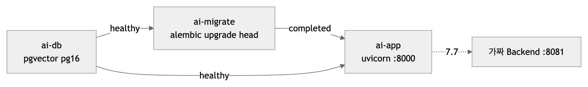
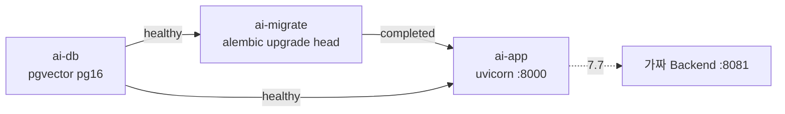

# 운영과 도구 — 띄우고, 보고, 재는 것들

| | |
|---|---|
| 읽는 시간 | 40분 (§1·§5·§6 은 참조표 — 필요할 때 찾아본다) |
| 답하는 질문 | 설정값이 무엇이고 어디서 쓰이나 · 로컬·부하·컨테이너에서 어떻게 띄우나 · 기동 때 무슨 순서로 무엇을 확인하나 · `/health` 와 로그를 어떻게 읽나 · 시험 도구 넷(가짜 BE·하네스·카탈로그 CLI·BE 드라이버)이 각각 무엇을 하나 |
| 먼저 알아야 할 것 | 터미널·환경변수·Docker 의 `up/down` 정도 |
| 기준 코드 | 커밋 `a5d1929` — `settings.py` · `main.py` · `docker-compose.yml` · `Dockerfile` · `tools/` |
| 같이 볼 문서 | 하네스 상세는 [tools/loadtest/README](../../tools/loadtest/README.md), BE 실물 절차는 [BE_연동_시험_결과_2026-09-27 §7](../BE_연동_시험_결과_2026-09-27.md), 환경 고정 이유는 [환경_설정](../환경_설정.md) |

## 1. 설정 — `PROFILING_*` 18개

**읽는 순서**: 환경변수 > `.env` 파일(실행 위치 `profiling/` 기준) > 코드 기본값([settings.py:3, 24–29](../../src/profiling/settings.py)). 접두사 `PROFILING_` 이 붙은 이름만 읽고, 모르는 변수는 무시한다. `get_settings()` 는 프로세스당 한 번만 읽는다(`lru_cache`, [116–120](../../src/profiling/settings.py)).

| 환경변수 | 기본값 | 제약 | 쓰는 곳 | 뜻 |
|---|---|---|---|---|
| `PROFILING_BACKEND_BASE_URL` | `http://localhost:8081` | | [main.py:84](../../src/profiling/main.py) | 7.7 콜백 대상. 로컬은 가짜 BE |
| `PROFILING_SERVICE_TOKEN` | `""` | | [intake.py:106](../../src/profiling/intake.py), [main.py:84](../../src/profiling/main.py) | Bearer 토큰(양방향). 비면 7.6 검사 생략 — **로컬 전용** |
| `PROFILING_CALLBACK_TIMEOUT_S` | 5.0 | >0 | [main.py:84](../../src/profiling/main.py) | 7.7 POST 한 번의 타임아웃 |
| `PROFILING_CALLBACK_MAX_ATTEMPTS` | 3 | ≥1 | [intake.py:321](../../src/profiling/intake.py) | 5xx·네트워크 재시도 상한(최초 포함) |
| `PROFILING_CALLBACK_BACKOFF_S` | 0.5 | >0 | [intake.py:321](../../src/profiling/intake.py) | 첫 대기, 다음은 ×4 (0.5·2초) |
| `PROFILING_DATABASE_URL` | `postgresql+psycopg://…@localhost:5432/ai_chat` | | [main.py:103](../../src/profiling/main.py), [alembic/env.py:18](../../alembic/env.py) | SQLAlchemy URL. alembic 도 같은 값 |
| `PROFILING_CATALOG_SOURCE` | `file` (compose 는 `db`) | `file`·`db` | [main.py:62](../../src/profiling/main.py) | 카탈로그를 어디서 읽나 |
| `PROFILING_CATALOG_FILE` | `tests/fixtures/catalog_sample.json` | | [main.py:63](../../src/profiling/main.py) | `file` 일 때만 |
| `PROFILING_CATALOG_POLL_TTL_S` | 1.0 | ≥0 | [main.py:62](../../src/profiling/main.py) | 활성 버전 폴링 최소 간격. 0 = 호출마다 |
| `PROFILING_POOL_SIZE` | 30 | 1..30 | [intake.py:320](../../src/profiling/intake.py) | 7.7 상품 수 상한 |
| `PROFILING_SLOTS` (옛 이름 `PROFILING_PROFILING_SLOTS` 도 허용) | 1 | ≥1 | [main.py:82](../../src/profiling/main.py) | 워커 스레드 수 |
| `PROFILING_RUNNING_STALE_S` | 300 | ≥1 | [main.py:76](../../src/profiling/main.py), [intake.py:320](../../src/profiling/intake.py) | 이보다 오래된 RUNNING 은 죽은 실행. BE 의 10분보다 짧아야 |
| `PROFILING_RETRY_AFTER_S` | 300 | ≥1 | [main.py:150](../../src/profiling/main.py) | 카탈로그 없음 503 의 `Retry-After` |
| `PROFILING_QUEUE_MAX` | 200 | ≥1 | [main.py:82](../../src/profiling/main.py) | 접수 대기열 상한 |
| `PROFILING_QUEUE_FULL_RETRY_AFTER_S` | 30 | ≥1 | [intake.py:325](../../src/profiling/intake.py) | 대기열 가득 503 의 `Retry-After` |
| `PROFILING_IO_THREADS` | 4 | ≥1 | [main.py:81](../../src/profiling/main.py) | 접수 폴링·`/health` 용 리미터 토큰 |
| `PROFILING_SHUTDOWN_DRAIN_S` | 5.0 | ≥0 | [main.py:90](../../src/profiling/main.py) | 종료 시 실행 중 작업을 기다리는 최대 초 |
| `PROFILING_LOG_LEVEL` | `INFO` | | [main.py:54](../../src/profiling/main.py) | 로그 레벨 |

`.env.example`(저장소에 없다 — 담당자 보관, 10-07) 에는 이 중 14개가 있다. 없는 넷(`RUNNING_STALE_S`·`RETRY_AFTER_S`·`IO_THREADS`·`SHUTDOWN_DRAIN_S`)은 기본값으로 쓴다. 각 값의 "왜"는 [settings.py](../../src/profiling/settings.py) 의 `Field(description=…)` 이 곧 문서다.

**확인해 보기.** `uv run python -c "from profiling.settings import Settings; print(Settings(_env_file=None).model_dump())"` — 기본값 전부.

## 2. 실행 세 가지

| 어디서 | 명령 | 비고 |
|---|---|---|
| 개발 | `uv run uvicorn profiling.main:app --port 8000 --reload` | `--reload` 는 코드 저장 시 재시작. 부하 시험엔 쓰지 않는다 |
| 부하 시험 | `PROFILING_CATALOG_SOURCE=db PROFILING_BACKEND_BASE_URL=http://localhost:8081 PROFILING_SLOTS=1 uv run uvicorn profiling.main:app --port 8000 --timeout-graceful-shutdown 5` | 환경변수로 `.env` 를 덮는다 |
| 컨테이너 | `docker compose up -d --build` | [Dockerfile:40](../../Dockerfile) `uvicorn profiling.main:app --host 0.0.0.0 --port 8000` — 프로세스 1, `--workers` 없음 |

전제: `docker compose up -d ai-db && uv run alembic upgrade head`, 카탈로그는 `file`(기본, 111건) 또는 `db`(적재 필요: `uv run python -m tools.catalog.load_catalog --package <패키지 폴더>`). 항상 `profiling/` 에서 실행한다(`.env` 와 `tools` 네임스페이스 패키지 때문).

## 3. compose 세 서비스와 뜨는 순서



<!-- fig: 09-compose -->


[docker-compose.yml](../../docker-compose.yml):
- **`ai-db`**(10–28): PostgreSQL 16 + pgvector, DB `ai_chat`/사용자 `ai_user`, `TZ=UTC`, 볼륨 `ai_pgdata`, 5초마다 `pg_isready`.
- **`ai-migrate`**(31–41): 앱과 같은 이미지로 `alembic upgrade head` 를 **앱보다 먼저, 한 번만**. 앱이 여러 개로 늘어도 마이그레이션은 한 번이어야 하므로 앱 시작과 섞지 않는다([Dockerfile:5–6](../../Dockerfile)).
- **`ai-app`**(43–68): `CATALOG_SOURCE=db`(컨테이너엔 파일이 없다), Backend 주소·토큰·로그 레벨은 `${…:-기본값}` 로 덮어쓴다. healthcheck 는 파이썬 한 줄로 `/health` 가 200 인지만 본다. `stop_grace_period` 를 지정하지 않아 Docker 기본 10초 — `SHUTDOWN_DRAIN_S`(5) 가 그 안에 있어야 한다.

이미지([Dockerfile](../../Dockerfile)): `python:3.12-slim-bookworm` 에 uv 를 고정 판(`0.11.15`)으로 복사 → **의존성 층을 먼저**(`uv sync --frozen --no-dev --no-install-project`, 코드가 바뀌어도 캐시) → 코드 복사(`src`·`alembic`·`tools`) → 비루트 사용자 `app`(uid 10001). `.dockerignore` 는 `tests`·`docs`·`.env`·`tools/fake_backend`·`tools/catalog/returned` 를 뺀다 — 즉 `tools/loadtest`·`tools/be_integration` 은 이미지에 들어간다(§12).

**확인해 보기.**
```bash
docker compose up -d --build && docker compose ps      # ai-migrate 는 Exited (0), 나머지 둘은 healthy
curl -s localhost:8000/health | python3 -m json.tool   # store.migration: "0004"
```

## 4. 기동 순서 8단계 — 무엇을 확인하고 실패하면 어떻게

[main.py:52–86](../../src/profiling/main.py) `lifespan`:

| # | 단계 | 실패하면 | 정책 |
|---|---|---|---|
| 1 | `logging.basicConfig(LOG_LEVEL)` | — | |
| 2 | `_connect_db`: 연결 확인 + `alembic_version` 읽기 | `RuntimeError` → **앱 안 뜸**. 메시지에 해결 명령 | fail-fast |
| 3 | 카탈로그(`Db`/`FileCatalogReader`) → `active()` | `_NoCatalog` 대역 → 앱은 뜨고 7.6 은 503, `/health` `active:false` | degrade |
| 4 | 저장소 두 개 | — | |
| 5 | `recover_stale_runs(300)`: 300초 넘은 RUNNING → FAILED | 로그 경고 | 이전 프로세스가 죽으며 남긴 행 정리 |
| 6 | `io_limiter = CapacityLimiter(IO_THREADS)` | — | |
| 7 | `Supervisor(...).start()` — 워커 스레드 | — | |
| 8 | `HttpBackendPort` | — | 연결은 첫 7.7 때 |

기동 로그 세 줄로 상태를 읽는다: `DB 연결 localhost:5432/ai_chat migration=0004` · `카탈로그 로드 source=db version=… products=4231 (ai_catalog poll_ttl_s=1.0)` · `Supervisor 시작 slots=1 queue_max=200` · `profiling 시작 backend=… pool_size=30`.

## 5. `/health` 읽기

항상 **200** 이다 — 프로세스가 살아 있다는 뜻이고, 카탈로그가 없거나 DB 가 끊겨도 200 이다(그 사실은 본문에 있다). [main.py:184–217](../../src/profiling/main.py). 인증은 없다.

| 필드 | 뜻 | 정상값 |
|---|---|---|
| `status` | 살아 있음 | `"ok"` |
| `catalog.active` · `version` · `products` | 활성 카탈로그 여부·버전 UUID·상품 수 | `true` · 4231 |
| `catalog.provisional_ids` | 있으면 `true` — Backend 번호가 없어 임시 번호 사용 중. **조건부 키**: 09-25 회신 뒤 전건 채워져 지금은 뜨지 않는다 | 없음 |
| `catalog.reason` | `active:false` 일 때 이유 | 없음 |
| `store.connected` · `migration` · `undelivered` | DB 연결·리비전·미전달(RESULT_READY) 행 수 | `true` · `"0004"` · 0 |
| `supervisor.slots` · `queue_max` | 설정값 | 1 · 200 |
| `supervisor.running` · `queued` | 실행 중·대기 중 | 0 · 0 (유휴) |
| `supervisor.submitted` · `completed` · `failed` · `rejected` | 누적: 접수·완료(예외 포함)·예외·거절(503) | `failed`·`rejected` 가 늘면 원인을 본다 |

`undelivered` 가 0 이 아니면 7.7 경로(Backend 5xx·네트워크)에 문제가 있었다는 뜻이다. `count(*)` 라 행이 늘면 느려진다([06 §6](06_병목과_성능.md)).

## 6. 로그 줄 사전

형식: `%(asctime)s %(levelname)s %(name)s: %(message)s`([main.py:54](../../src/profiling/main.py)). 이름이 모듈이다(`profiling.intake` 등).

| 줄 | 뜻 | 어디 |
|---|---|---|
| `7.6 접수 recipient=… source_version=… disliked=… reviews=… pref=…` | 접수됨(202 직전). 하네스가 이 줄로 도착 시각을 센다 | [intake.py:316](../../src/profiling/intake.py) |
| `7.6 거절 … 접수 대기열 가득(200) … → 503 Retry-After 30s` | 큐 가득·종료 중 | [intake.py:323](../../src/profiling/intake.py) |
| `CONTRACT_7_6_UNKNOWN_FIELD … unknown=…` | 계약에 없는 필드가 왔다(무시하고 진행) | [intake.py:312](../../src/profiling/intake.py) |
| `7.6 중복 판정 … → analyze \| resend \| skip (이유)` | 잠금 안 판정 | [intake.py:266](../../src/profiling/intake.py) |
| `이미 처리 중 … 이번 접수는 건너뛴다` | advisory lock 을 못 얻음 | [stores.py:224](../../src/profiling/stores.py) |
| `profile … → RESULT_READY pool=30/30 …` / `→ FAILED <code>: <reason>` | 분석 결과 | [pipeline.py:208, 222](../../src/profiling/pipeline.py) |
| `7.7 콜백 결과 … 시도 n/3 → DELIVERED` | 콜백 한 번의 결과 | [intake.py:176](../../src/profiling/intake.py) |
| `7.7 미전달 … 0.5초 뒤 다시 보낸다 (2/3)` | 5xx·네트워크 재시도 대기 | [intake.py:181](../../src/profiling/intake.py) |
| `7.7 재전송 … (재분석 없음)` | RESEND | [intake.py:155](../../src/profiling/intake.py) |
| `Supervisor 시작 slots=… queue_max=…` / `Supervisor 종료: 큐에 남은 N건을 버린다` | 기동·종료 | [supervisor.py:68, 88](../../src/profiling/supervisor.py) |
| `끊긴 실행 N건을 FAILED 로 정리했습니다` | 기동 정리 | [main.py:78](../../src/profiling/main.py) |
| `profiling 종료 dropped=N` | lifespan 종료 | [main.py:91](../../src/profiling/main.py) |

## 7. 정상 종료

SIGTERM → uvicorn 이 lifespan 종료를 돌린다 → `supervisor.stop(5)`(큐 버림, 실행 중 5초 대기) → `backend.close()` → `engine.dispose()`([main.py:89–95](../../src/profiling/main.py), [05 §9](05_동시성.md)). 컨테이너 유예 10초 안. `Dockerfile` 의 CMD 에는 `--timeout-graceful-shutdown` 이 없다(uvicorn 기본은 무제한 대기지만 SIGKILL 이 10초에 온다) — 부하 시험 명령에만 5 를 준다.

**확인해 보기.** 느린 콜백으로 부하를 주는 도중 `kill -TERM $(pgrep -f "uvicorn profiling.main:app")` → 로그 `큐에 남은 N건을 버린다`, 3초 안 종료([09-29 §4.8](../부하_시험_결과_2026-09-29.md)).

## 8. 가짜 Backend — `tools/fake_backend`

Backend 의 역할 전부를 흉내 내는 시험용 앱. 운영 이미지엔 안 들어간다.

- **실행**: `uv run uvicorn tools.fake_backend.app:app --port 8081`. 콘솔 `http://localhost:8081/console`.
- **환경변수**([app.py:59–88](../../tools/fake_backend/app.py)): `AI_BASE_URL`(8000) · `AI_SERVICE_TOKEN`(`dev-token`, AI 의 토큰과 같아야) · `FAKE_BACKEND_MODE`(`ok|409|400|500|timeout`) · 생애주기 시간(초 단위로 줄인 디바운스 5·창 30·PENDING 타임아웃 10·재시도 2·백오프 2·틱 1).
- **엔드포인트**:

| 경로 | 역할 |
|---|---|
| `POST /api/internal/v1/recipients/{id}/profile` | **7.7 싱크**([app.py:115–160](../../tools/fake_backend/app.py)). `ProfileCallbackRequest`(`extra="forbid"`)로 검증, 경로·본문 ID 대조(400 `RECIPIENT_ID_MISMATCH`), 모드에 따라 실패 주입, `/received` 에 기록 |
| `GET`/`DELETE /received` | 받은 콜백 목록·초기화 |
| `GET /internal/v1/ai/products/export` | **7.9 export** — 토큰 검사, 예시 111건 |
| `POST /console/send-7.6` | 콘솔이 AI 로 7.6 을 대신 보낸다(검증 없이 — 깨진 본문도 시험 가능) |
| `/console/be/*` | Backend 생애주기 흉내: 비선호 변경 → 디바운스 → 7.6 → 202 → 타임아웃 → 같은 번호 재시도 2회 → FAILED. 판단은 [lifecycle.py](../../tools/fake_backend/lifecycle.py)(순수 상태 기계, `now` 주입) |
| `GET`/`PUT /console/mode` | 실패 주입 모드 조회·변경 (하네스가 쓴다) |
| `GET`/`DELETE /console/db` | AI DB 의 두 표를 직접 보고 지운다 |

- 콘솔 탭 넷: 7.6 보내기 · 7.7 받은 것 · DB · 7.9·상태. 스케줄러 틱은 `@app.on_event("startup")`([app.py:317](../../tools/fake_backend/app.py)) — FastAPI 가 권장을 `lifespan` 으로 바꿨으니 언젠가 옮길 항목.

## 9. 부하 하네스 — `tools/loadtest`

```bash
uv run python -m tools.loadtest.run --n 100 --concurrency 100 --base 900001 --cleanup --yes --expect-slots 1 --label S-A1 --out tools/loadtest/results/S-A1.json
```
- `-m` 이 필수다(`tools/` 는 `__init__.py` 없는 네임스페이스 패키지).
- 주요 옵션: `--fake-mode 500|timeout`(실패 주입), `--mode be`(BE 실물이 보내는 동안 관찰), `--no-keepalive`(동시성 100 이상에서 서버를 잴 때), `--cleanup --yes`(수신자 900000 이상만 정리), `--expect-slots k`(슬롯 설정 대조). 전체 표는 [README](../../tools/loadtest/README.md).
- 결과: 요약 표(터미널) + JSON(`results/`, gitignore). 지표 뜻은 [06 §1](06_병목과_성능.md).
- BE 실물용 SQL: `be_seed.sql`(200명 삽입) · `be_reset.sql` · `be_cleanup.sql` — 로컬 MySQL 에만.

## 10. 카탈로그 도구 — `tools/catalog`

| 도구 | 하는 일 | 종료 코드 |
|---|---|---|
| `fetch_export.py` | 7.9 export 를 받아(또는 `--from-file`) 계약 점검 · 현 카탈로그와 ID 대조(`--compare`, `--compare-db`) · 저장 | 0 차이 없음 · 1 계약 위반(저장 안 함) · 2 차이 있음(저장함) · 3 연결·파일 오류 |
| `load_catalog.py` | Backend 패키지를 `ai_catalog` 에 적재. **한 트랜잭션**으로 넣고 활성 전환([149–159](../../tools/catalog/load_catalog.py)). `--id-map`·`--category-id-map`(Backend 번호 회신) · `--metrics`(재고·조회수) · `--dry-run` · `--no-activate` | 0 · 1 패키지 형식 · 2 DB · 3 dry-run |
| `import_be_ids.py` | Backend 회신 xlsx → jsonl 셋(이름 매칭). DB 는 안 건드린다 | 0 · 1 파일/매칭 · 2 DB · 3 dry-run |
| `make_sample.py` | 예시 111건 재생성(결정적) | |

컨테이너에서는 `docker compose run --rm ai-migrate python -m tools.catalog.load_catalog --package …`.

## 11. BE 실물 드라이버 — `tools/be_integration/drive.py`

BE(Spring, 로컬 MySQL)와 AI 를 실제로 붙여 T1(정상)·T3(PENDING 중 편집)·T2(`--with-ai-down`: AI 를 `pkill` 로 죽였다 되살려 BE 재시도 관찰)를 돌린다. 인자·환경변수(`BE_MYSQL_*`)와 절차는 [BE_연동_시험_결과_2026-09-27 §7](../BE_연동_시험_결과_2026-09-27.md). BE 저장소는 **읽기와 로컬 실행만** 한다(커밋·푸시 금지).

## 12. 알아 둘 사실 (고칠지는 별개)

| 사실 | 어디 |
|---|---|
| `/health` 는 인증이 없고 리비전·카운터를 노출한다 | [main.py:184](../../src/profiling/main.py) |
| compose healthcheck 는 200 만 본다 — 카탈로그 없음·DB 끊김도 200 | [docker-compose.yml:62–68](../../docker-compose.yml) |
| 이미지에 시험 도구(`loadtest`·`be_integration`)가 들어간다 | `.dockerignore` |
| 가짜 BE 는 deprecated `@app.on_event` 를 쓴다 | [app.py:317](../../tools/fake_backend/app.py) |
| `traceId` 는 항상 `null`, 403 은 정의만 있다 | [main.py:147](../../src/profiling/main.py), [intake.py:104](../../src/profiling/intake.py) |
| CI 가 없다(`.github` 없음) — 시험·ruff 는 손으로 | 저장소 루트 |

**알려진 주석 드리프트** (코드 주석이 실제와 다른 곳 — 다음 코드 정리 커밋의 입력):

| 파일:줄 | 주석 | 실제 |
|---|---|---|
| `ports.py:56–61` | `save` 가 프로필도 upsert | `profile_runs` 만; 프로필은 `RecipientProfileStore` |
| `ports.py:96–98` · `intake.py:130` | 재시도는 어댑터 안 · "#23" | `intake._send_and_record`; 어댑터는 한 번 |
| `ports.py:38` | DB 어댑터는 내일 | `DbCatalogReader` 가 배포 기본 |
| `ports.py:40` · `catalog.py:159` | `tuple[int, …]` | 버전 id 는 UUID |
| `ports.py:23` · `pipeline.py:10, 12, 18, 144` · `types.py:21` | `api/`·`api.run_and_callback` | 모듈은 `intake.py` |
| `intake.py:3` | "Transport 역할만" | 워커 쪽 `dispatch`·`decide` 도 여기 |
| `intake.py:54` | 시험은 `dependency_overrides` | 시험은 `app.state` 를 바꾼다 |
| `intake.py:295–297` | 본문 검증 → 토큰 순 | JSON 파싱 → 토큰 → 본문 검증([04 §4](04_통신.md)) |
| `settings.py:118` | `Depends(get_settings)` 권장 | async 로 감싼 `settings_dep` |
| `types.py:230` | `callback_attempts` "+1" | 시도한 횟수만큼 더한다 |
| `0002:45` | `error` 는 FAILED 만 | RESULT_READY·SUPERSEDED 도 |
| `.env.example:14` | 슬롯당 커넥션 2 | 실행당 1 (09-28 재사용 뒤) |

## 13. 확인해 보기 — 처음부터 끝까지 한 바퀴 (20분)

```bash
cd profiling
docker compose up -d ai-db && uv run alembic upgrade head          # DB
uv run uvicorn tools.fake_backend.app:app --port 8081              # 터미널 1: 가짜 BE
uv run uvicorn profiling.main:app --port 8000 --reload             # 터미널 2: AI (file 카탈로그 111건)
curl -s localhost:8000/health | python3 -m json.tool               # migration 0004 · products 111 · slots 1
```
브라우저 `http://localhost:8081/console` → "7.6 보내기" 로 한 건 → 터미널 2 로그 다섯 줄(접수·판정·RESULT_READY·콜백 결과) → "7.7 받은 것" 탭에 30개 → "DB" 탭에서 `profile_runs` 한 행(DELIVERED)·`recipient_profiles` 한 행. 끝났으면 "DB" 탭에서 지운다.

---

다음 장: [10 용어집](10_용어집.md).
